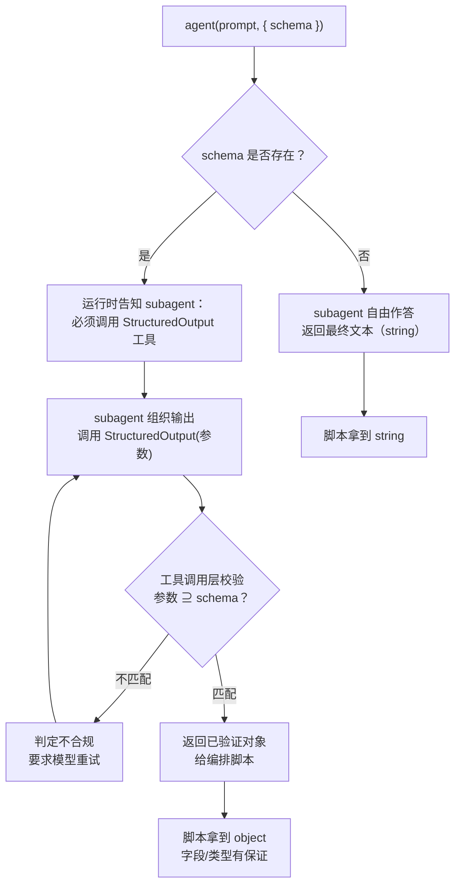
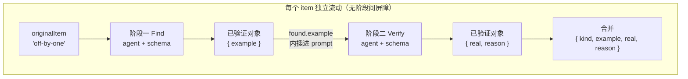

# 第 07 章 · 结构化输出与 Schema

> 一句话：**给 `agent()` 传一个 `schema`，运行时就会强制这个 subagent 调用内部的 `StructuredOutput` 工具、在工具调用层校验返回值、不合规就让模型重试——最终交还给你一个保证结构正确的对象。**
>
> 这就是 Workflow 跟「让模型自由发挥、再拿正则去抠数据」的根本区别。这一章把这条线讲透：它到底解决了什么真问题、运行时具体在做什么、schema 怎么设计、schema 化的数据怎样在流水线的各个阶段之间流动，以及哪些坑会把你的「校验」变成「反复重试、白烧 token」。

---

## 7.1 没有 schema 的世界：解析地狱

先说一个痛点，凡是拿 LLM 干过自动化的人都熟。

假设你想让一个 subagent「找出这段代码里的所有 bug，每个给出文件、行号、严重程度和说明」。不带 schema，你就只能在 prompt 里**用大白话求**它按某种格式回话：

```javascript
// （示意，未实跑）—— 这是「没有 schema」的典型写法
const text = await agent(
  '审查这段代码，列出所有 bug。请严格按如下格式输出，每行一个：\n' +
  'FILE | LINE | SEVERITY | DESCRIPTION\n' +
  '不要有任何额外解释。'
)
// 现在 text 是一个字符串，你必须自己解析它……
const findings = text
  .split('\n')
  .filter((line) => line.includes('|'))
  .map((line) => {
    const [file, line_, severity, desc] = line.split('|').map((s) => s.trim())
    return { file, line: Number(line_), severity, desc }
  })
```

这段代码看着能跑，可它**脆得离谱**。真跑过的人都知道接下来会怎样：

- 模型在前面加了一句「好的，以下是我找到的问题：」——你的 `filter` 把它漏掉了，但万一这句话里也带个 `|` 呢？
- 模型把 `LINE` 写成了 `第 42 行` 或 `42-45`，`Number('第 42 行')` 就成了 `NaN`。
- 模型自作主张把 `SEVERITY` 翻成了中文「高」，你下游的 `if (severity === 'high')` 判断全废了。
- 模型觉得某个 bug「得详细说说」，于是往 `DESCRIPTION` 里塞了一个带换行的 Markdown 列表——你的 `split('\n')` 当场就崩。
- 十次里九次完美，第十次它把一段 JSON 包在 ```` ```json ```` 代码块里返回来，因为它「觉得这样更专业」。

于是你开始写防御性代码：trim、正则、try/catch、兜底默认值、字段别名映射……**你写的解析和容错逻辑，很快就会比业务逻辑本身还长。** 而且每加一个字段、每换一个模型，你都得回来重新调教这套解析器。

<div class="callout warn">

**这就是「自由文本 + 事后解析」这套路子的根本毛病**：你把「保证数据结构正确」这件事，放到了**模型输出之后**才做。可模型输出是不受你控制的——你永远在给「模型这回又怎么不听话」打补丁。结构化输出把这件事**往前挪**到了模型生成的那一刻，由运行时强制保证。

</div>

---

## 7.2 一行 `schema` 改变一切：从真实冒烟测试说起

想搞懂结构化输出，最快的办法是看它**真跑起来**长什么样。本书第一个真实运行的 Workflow —— `hello-workflow` 冒烟测试 —— 恰好就是冲着验证这件事来的。

它让一个 subagent 返回三样东西：一句确认消息（字符串）、`2+2` 的整数值（数字）、还有一个确认自己在工作流里跑过的布尔值。脚本核心如下：

```javascript
phase('Greet')
const r = await agent(
  'You are a smoke test for the Claude Code Workflow runtime. Return a one-sentence ' +
  'confirmation message, the integer value of 2+2, and a boolean confirming you ran ' +
  'as a workflow subagent.',
  {
    label: 'smoke',
    schema: {
      type: 'object',
      properties: {
        message: { type: 'string' },
        sum: { type: 'number' },
        runtimeConfirmed: { type: 'boolean' },
      },
      required: ['message', 'sum', 'runtimeConfirmed'],
    },
  }
)
```

把它交给 Workflow 工具跑，**真实**返回值是（来源：`assets/transcripts/primitives.md`，Run ID `wf_dacbd480-d5d`）：

```json
{
  "message": "The Claude Code Workflow runtime smoke test executed successfully as a workflow subagent.",
  "sum": 4,
  "runtimeConfirmed": true
}
```

把目光盯住 `"sum": 4`。

它是**数字 `4`**，不是字符串 `"4"`。这不是碰巧，也不是「模型这回刚好乖」。`schema` 里声明了 `sum: { type: 'number' }`，运行时的校验层得**类型正确**才放行。你拿到 `r` 就能直接 `r.sum + 1`，得到 `5`，不用先 `Number(r.sum)` 再祈祷它别是 `NaN`。

跟上一节的解析地狱比，这里的差别是**质变**：

| 维度 | 自由文本 + 事后解析 | `agent({ schema })` |
|---|---|---|
| 谁保证结构正确 | 你写的解析器（在模型之后） | 运行时校验层（在模型生成时） |
| 类型 | 全是字符串，需手动转换 | 按 schema 保证（number 就是 number） |
| 缺字段 | 解析器拿到 `undefined`，可能静默出错 | required 缺失 → 校验失败 → 模型重试 |
| 模型「话痨」/加前缀 | 污染解析，需 trim/正则 | 不影响——返回的是工具调用的结构化参数 |
| 换模型/加字段 | 重新调教解析器 | 改 schema 即可 |
| 你要写的容错代码 | 大量 | **零** |

最后一行是重点：**编排者（你的脚本）拿到的是一个保证结构的对象，不用写任何解析或容错代码。** 这正是 Workflow 能做到「确定性编排」的前提——下游阶段可以放心地 `r.findings.length`、`r.verdict === 'confirmed'`，因为这些字段存不存在、是什么类型，运行时已经替你担保了。

---

## 7.3 运行时到底做了什么：StructuredOutput 与重试

「校验」这两个字背后，运行时到底做了什么？这套机制有**官方工具定义**和**本书实测**双重背书（见 `_grounding.md`），流程是这样的：

1. 当 `agent()` 带着 `schema`，运行时**强制**这个 subagent 去调一个内部工具 —— `StructuredOutput`。subagent 不再「写一段文本当最终答案」，而是必须把答案作为参数**调用这个工具**（官方）。
2. 工具的参数 schema 就是你传进去的那个 JSON Schema。所以校验发生在**工具调用层**：模型填的参数必须匹配 schema，否则这次工具调用就被判定为不合规（官方）。
3. 不匹配怎么办？**模型被要求重试**——重新组织输出，再调一次 `StructuredOutput`，直到参数合规（官方描述「不匹配则模型重试」；**确切的重试次数本书未实测**，见下方说明）。
4. 合规之后，运行时把这次工具调用的参数**作为已验证的对象**交还给你的脚本。也就是说，`agent()` 直接给你一个**已验证对象**——你拿到手就能 `r.field`，**无需 `JSON.parse`**，也不用写任何容错。



**「返回已验证对象」不光是官方说法，本书每一次带 schema 的运行都验证了它。** hello 冒烟测试（`wf_dacbd480-d5d`）、parallel-demo（`wf_52957913-6d2`）、pipeline-demo（`wf_bf086b98-6ec`）——每一次带 `schema` 的 `agent()` 都成功拿回了字段齐全、类型正确的对象（本章后面会把真实返回值一个个摆出来）。换句话说，「有 schema → 拿到已验证对象」这条，是**官方 + 实测**双重坐实的。

<div class="callout info">

**说到「重试」的边界，得把「官方行为」和「第三方声称」分开看。** 官方只讲了**行为**：不匹配则模型重试，直到合规。至于**实现细节和确切次数**——社区第三方资料（某 YouTuber 仓库，非官方）声称：运行时用 **AJV** 编译你的 schema、`StructuredOutput` 的入参 schema 就是这个 schema、而且当 subagent **始终不调用**该工具时「最多再催两次后失败」。**这几点（AJV、催两次）本书未独立实测，只记录它的说法，不作为事实采信。** 所以本书**不**断言任何确切的重试次数；唯一能放心依赖的硬边界，是官方的**预算上限**（`spent()` 达 `total` 后再调 `agent()` 抛错，见第 09 章）——重试再多，也越不过这道预算闸门。

</div>

这里有两个设计细节值得单独拎出来说，它们解释了「为什么 Workflow 的 subagent 输出跟你平时聊天看到的不一样」：

**其一：subagent 被明确告知「最终产物是返回值，不是给人看的话」。** 据 `_grounding.md`「subagent 行为」一节，subagent 知道自己的输出会被**程序消费**，所以它返回的是原始数据，而不是「好的，我帮你分析了一下……」这种寒暄。哪怕不带 schema，纯文本返回也是「干货」而非客套。

**其二：校验在工具调用层，所以模型「想话痨也话痨不起来」。** 普通对话里，模型可以先铺垫一大堆再给答案；可 `StructuredOutput` 是一次结构化的工具调用，参数就是参数，没有夹带自然语言旁白的余地。这从机制上把 7.1 节里「模型加前缀污染解析」那一整类问题给消灭了。

<div class="callout info">

**一个常被忽略的推论：schema 把「格式遵从」从概率问题变成了确定性问题。** 不带 schema 时，「模型会不会按格式回话」是个概率事件——99% 也不是 100%。带 schema 时，运行时用「不合规就重试」这个循环，把这个概率**逼向 100%**：要么最终返回一个合规对象，要么（极端情况下）把本回合预算耗光而失败，但你**绝不会**拿到一个「看着像、实际上字段缺失/类型错误」的对象。确定性编排要的正是这种「拿到手就一定能用」的保证。

</div>

---

## 7.4 Schema 设计模式：从最小到生产级

JSON Schema 本身是一套成熟的规范，但在 Workflow 里你只用掌握高频的那几种构造。下面从最小例子一步步加码，每个都给出能直接用的范例。**带 Run ID 标注的来自真实运行，其余标注「（示意，未实跑）」。**

<div class="callout tip">

**先记一条放置规则：schema 写在脚本体里、作为 `agent()` 的 `opts.schema` 传进去，而不是写进 `meta`。** `meta` 必须是**纯字面量**（运行前被静态读取，禁止变量/函数调用，见 `_grounding.md`），它管的是工作流的名称、描述、阶段；schema 则是每次 `agent()` 调用各自的「输出契约」，因调用而异、可以用常量复用（比如下面把 schema 抽成 `const` 在好几处引用）。把这两件事分清楚，能省掉「为什么 meta 里塞 schema 会报错」这类困惑。

</div>

### 模式一：扁平对象 + required（最常用的基石）

最基础的形态：一个对象，几个标量字段，用 `required` 声明哪些必须出现。`hello-workflow` 就是这种（Run ID `wf_dacbd480-d5d`）：

```javascript
schema: {
  type: 'object',
  properties: {
    message: { type: 'string' },
    sum: { type: 'number' },
    runtimeConfirmed: { type: 'boolean' },
  },
  required: ['message', 'sum', 'runtimeConfirmed'],
}
```

<div class="callout tip">

**`required` 是你最重要的杠杆。** 没列进 `required` 的字段，模型可以不给——于是你下游又得写 `if (r.foo !== undefined)`。把所有你下游会无条件读取的字段都列进 `required`，让「缺字段」直接触发重试，而不是把 `undefined` 漏进你的脚本。这是从「校验」拿到「担保」的关键一步。

</div>

### 模式二：单字段对象（流水线里的轻量产物）

有时候一个阶段只需要产出一样东西。真实的 `parallel-demo` 里，每个 agent 只返回一句 code smell（Run ID `wf_52957913-6d2`）：

```javascript
schema: {
  type: 'object',
  properties: { smell: { type: 'string' } },
  required: ['smell'],
}
```

注意：**哪怕只有一个字段，也建议包成对象，而不是裸 string。** 一来方便以后扩展（加字段不会破坏调用方），二来对象形态让 `StructuredOutput` 的语义更清晰。当然，如果你确实只要一段文本，不带 schema 直接拿 string 也完全可以——怎么取舍见 7.7 节。

### 模式三：枚举 enum（把「判决」收敛到有限取值）

这是结构化输出最值钱的场景之一。当你要一个 subagent 做「判定」时，**绝不要**让它自由发挥措辞，而要用 `enum` 把答案钉死在有限集合里:

```javascript
// （示意，未实跑）—— 对抗验证里典型的「判决」schema
schema: {
  type: 'object',
  properties: {
    verdict: { type: 'string', enum: ['confirmed', 'refuted', 'uncertain'] },
    confidence: { type: 'number' },
    reasoning: { type: 'string' },
  },
  required: ['verdict', 'confidence', 'reasoning'],
}
```

有了 `enum`，你下游就能放心写 `if (r.verdict === 'confirmed')`，不用担心模型这回返回的是 `'Confirmed'`、`'CONFIRMED'`、`'已确认'` 还是 `'I confirm this'`。**枚举把分支逻辑变成了可靠的状态机迁移**——这在第四部「对抗验证」里是核心武器。

### 模式四：布尔门控字段（让脚本据此分流）

布尔字段是流水线里最廉价的「闸门」。真实的 `pipeline-demo` 第二阶段就用 `real: boolean` 来表达「这个 bug 是不是真的」（Run ID `wf_bf086b98-6ec`）：

```javascript
schema: {
  type: 'object',
  properties: {
    real: { type: 'boolean' },
    reason: { type: 'string' },
  },
  required: ['real', 'reason'],
}
```

拿到结果后，编排脚本就能据此分流：`results.filter((r) => r.real)` 只留下被确认的项。**布尔门控 + 数组过滤**是 Workflow 里最常见的「收口」搭配。

### 模式五：数组（findings 列表这类「多条产物」）

当一个 subagent 要返回**一组**东西（多个 bug、多条引用、多个建议），就用 `array`，再用 `items` 描述每个元素的结构：

```javascript
// （示意，未实跑）—— 一个分片审查 agent 返回一组发现
schema: {
  type: 'object',
  properties: {
    findings: {
      type: 'array',
      items: {
        type: 'object',
        properties: {
          file: { type: 'string' },
          line: { type: 'number' },
          severity: { type: 'string', enum: ['low', 'medium', 'high', 'critical'] },
          description: { type: 'string' },
        },
        required: ['file', 'line', 'severity', 'description'],
      },
    },
  },
  required: ['findings'],
}
```

回头看 7.1 节那段「解析地狱」——它想干的就是这件事。可在这里，**每个 finding 的 `line` 保证是数字、`severity` 保证是那四个枚举值之一、四个字段一个都不会少**。你拿到 `r.findings` 就能直接 `.filter()`、`.sort((a, b) => severityRank[b.severity] - severityRank[a.severity])`、`.length`。7.1 节那几十行防御代码，在这里**一行都不用写**。

### 模式六：嵌套对象（带元数据的复合产物）

生产级的产物往往得分层——比如一份审查报告，既有概要又有明细：

```javascript
// （示意，未实跑）—— 嵌套：summary 元数据 + findings 明细
schema: {
  type: 'object',
  properties: {
    summary: {
      type: 'object',
      properties: {
        totalIssues: { type: 'number' },
        highestSeverity: { type: 'string', enum: ['low', 'medium', 'high', 'critical'] },
        reviewedFiles: { type: 'number' },
      },
      required: ['totalIssues', 'highestSeverity', 'reviewedFiles'],
    },
    findings: {
      type: 'array',
      items: {
        type: 'object',
        properties: {
          file: { type: 'string' },
          severity: { type: 'string', enum: ['low', 'medium', 'high', 'critical'] },
          description: { type: 'string' },
        },
        required: ['file', 'severity', 'description'],
      },
    },
  },
  required: ['summary', 'findings'],
}
```

嵌套对象让你在**一次** agent 调用里就拿到结构化的「报告 + 明细」，下游既能 `r.summary.highestSeverity` 做快速分流，又能遍历 `r.findings` 做细处理。

下面把六种模式汇总成一张速查表：

| 模式 | 关键构造 | 典型用途 | 真实佐证 |
|---|---|---|---|
| 扁平对象 + required | `type:'object'` + `required` | 一切的基石 | hello `wf_dacbd480-d5d` |
| 单字段对象 | 一个 property | 流水线轻量产物 | parallel `wf_52957913-6d2` |
| 枚举 enum | `enum:[...]` | 判决/分类，钉死取值 | （示意，未实跑） |
| 布尔门控 | `type:'boolean'` | 闸门 + 数组过滤 | pipeline `wf_bf086b98-6ec` |
| 数组 | `type:'array'` + `items` | findings 多条产物 | （示意，未实跑） |
| 嵌套对象 | object 套 object/array | 报告 + 明细 | （示意，未实跑） |

---

## 7.5 schema 化的数据如何在流水线里流动

结构化输出真正的威力，不在单个 agent，而在**它让数据能在阶段之间安全流动**。这正是 `pipeline()` 的设计前提。

回顾真实的 `pipeline-demo`（Run ID `wf_bf086b98-6ec`，`agent_count=6`）：3 个 bug 类型，每个独立流过两阶段——Find（产出一个候选 bug 示例）→ Verify（对抗性地核验它是不是真的 bug）。

```javascript
const items = ['off-by-one', 'null-dereference', 'race-condition']
const out = await pipeline(
  items,
  // 阶段一 Find：产出 { example }
  (kind) =>
    agent(`Give a one-line code example of a ${kind} bug.`, {
      label: `find:${kind}`, phase: 'Find',
      schema: {
        type: 'object',
        properties: { example: { type: 'string' } },
        required: ['example'],
      },
    }),
  // 阶段二 Verify：消费上一阶段的 example，产出 { real, reason }
  (found, kind) =>
    agent(
      `Is this genuinely a ${kind} bug? Example: "${found.example}". Reply boolean + short reason.`,
      {
        label: `verify:${kind}`, phase: 'Verify',
        schema: {
          type: 'object',
          properties: { real: { type: 'boolean' }, reason: { type: 'string' } },
          required: ['real', 'reason'],
        },
      }
    ).then((v) => ({ kind, ...found, ...v }))
)
return out.filter(Boolean)
```

看阶段二回调的第一行 —— `found.example`。这里发生的事，就是本节的全部要点：

**阶段一的 schema 化产物（保证有 `example` 字段的对象）被直接喂给了阶段二。** 阶段二的回调签名是 `(found, kind)`——`found` 就是阶段一返回的那个已验证对象，`kind` 是 `originalItem`（原始输入项）。因为阶段一的 schema 担保了 `example` 字段的存在和类型，阶段二就能**毫无顾虑**地把 `found.example` 内插进自己的 prompt 里，当作「待核验的证据」。

设想一下，要是阶段一返回的是自由文本会怎样？阶段二就得先解析那段文本、抠出代码示例、处理各种格式异常——而这恰恰是在**每一对相邻阶段之间**都要重来一遍的解析地狱。schema 把它彻底干掉了：**每个阶段的输出，都是下一个阶段能直接当对象用的输入。**

真实返回值印证了这条数据链是完整的（节选）：

```json
[
  {
    "kind": "off-by-one",
    "example": "for i in range(len(arr)): print(arr[i+1])  # ...out of bounds",
    "real": true,
    "reason": "Genuine off-by-one bug... raising IndexError..."
  }
]
```

注意最终对象同时带着 `kind`（来自 originalItem）、`example`（阶段一产物）、`real`/`reason`（阶段二产物）——这是靠 `.then((v) => ({ kind, ...found, ...v }))` 在阶段内把三者合并出来的。**这就是「用 schema 把发现结构化、好让后续做对抗验证」的最小完整范例**：Find 阶段产出结构化的「发现」，Verify 阶段消费它、再产出结构化的「判决」。第四部会把这个两阶段骨架扩展成完整的对抗验证流水线。



<div class="callout tip">

**记住这条心法：在 Workflow 里，schema 不只是「校验输出」，更是「定义阶段之间的契约」。** 上游 agent 的 schema 就是下游 agent 能依赖的接口。设计一条多阶段流水线时，先把每个阶段的 schema（也就是「契约」）想清楚，阶段之间的衔接就会变得像调用普通函数一样自然——前一个函数的返回类型，就是后一个函数的参数类型。

</div>

<div class="callout tip">

**一条衔接技巧：把上游对象 `JSON.stringify` 进下游 prompt。** 上例只内插了单个标量 `found.example`；当你要把**整个已验证对象**（多字段、嵌套）传给下一阶段时，最稳妥的写法是把 `JSON.stringify(found)` 拼进下个 `agent()` 的 prompt 字符串里——下游模型按 JSON 来读，不容易因为换行/引号闹歧义。这跟 7.6 的 `JSON.stringify(report)` 是同一招：**编排脚本负责把结构化数据序列化进提示词，下游 agent 再把它当输入消费。**

</div>

---

## 7.6 陷阱与最佳实践

结构化输出很强，但用不好会从「帮手」变成「绊脚石」。下面这几条纪律务必牢记，多数都是从「schema 是在工具调用层校验 + 不合规就重试」这个机制直接推出来的。

### 陷阱一：schema 过严 → 反复重试，烧 token 又变慢

校验失败的代价是**重试**。如果你的 schema 给模型设了一道它很难一次过的关，模型就会反复重试，直到合规或者耗尽预算。

「过严」常见的几种样子：

- 用 `enum` 限定了一组取值，但提示词里没说清这些取值各自是什么意思，模型猜不中。
- 字段语义模糊（比如要个 `score: number`，却没说范围是 0–1 还是 0–100），模型给出的值你下游又判定为不合理。
- 要一个嵌套极深、字段极多的巨型对象，模型一次生成很难面面俱到。

<div class="callout warn">

**重试不是免费的。** 回顾真实用量：单个 agent 一次往返约 2.6 万 token、5.5 秒（hello，`wf_dacbd480-d5d`）。每多一次重试，就差不多多付一次这样的成本。一个本该一次成功的 agent 要是反复重试三四次，token 和墙钟都得翻几倍。schema 的「严」要用在**下游真正依赖**的约束上，而不是拿来给模型找麻烦。

</div>

### 最佳实践一：字段语义在 prompt 里讲清，别指望模型猜

schema 定义的是**结构**（有哪些字段、什么类型），但**语义**（这个字段到底要填什么）必须在 prompt 里讲明白。schema 和 prompt 是一对搭档：

```javascript
// （示意，未实跑）—— prompt 与 schema 协同：schema 管结构，prompt 管语义
await agent(
  '评估下面这条 bug 报告的可信度。\n' +
  '- verdict: 你的判决，只能是 confirmed（确属 bug）/ refuted（误报）/ uncertain（证据不足）之一。\n' +
  '- confidence: 0 到 1 之间的小数，表示你对判决的把握。\n' +
  '- reasoning: 一句话给出关键理由。\n\n' +
  `待评估报告：${JSON.stringify(report)}`,
  {
    schema: {
      type: 'object',
      properties: {
        verdict: { type: 'string', enum: ['confirmed', 'refuted', 'uncertain'] },
        confidence: { type: 'number' },
        reasoning: { type: 'string' },
      },
      required: ['verdict', 'confidence', 'reasoning'],
    },
  }
)
```

prompt 把每个字段「该填什么、取值范围是多少」逐条说清——这样模型一次就能命中，几乎不会触发重试。

<div class="callout tip">

**字段名本身也是给模型的提示——用你接下来要分支判断的那个命题去命名它。** 含糊的字段名（比如 `ok`）会逼模型自己猜：`ok` 到底是「草稿合格」还是「这一步执行成功」？一旦你代码里的 `if (result.ok)` 跟模型理解的 `ok` 不是同一件事，分支就走反了。曾有第三方报告：在「生成—批评—修复」循环里把评审字段命名为 `ok`，结果跟冒烟测试的「ok＝成功」语义撞了车，导致误判。我们做过对照实测（同一条**明确写错**的草稿，分别用字段 `ok` 和 `draftIsFactuallyCorrect`），**两者都正确返回了 `false`、并未复现那次崩溃**（`wf_e8cb23ff-829`）——所以这不是一个硬性 bug，而是一种**清晰度风险**：草稿越含糊，字段名取得就越关键。把 `ok` 换成 `draftIsFactuallyCorrect`、`shouldRetry`、`hasBlockingIssue` 这种「光看名字就知道 `true` 代表什么」的写法，几乎零成本就把隐患消掉了。

</div>

### 最佳实践二：善用 `description` 字段引导模型

JSON Schema 的每个字段都可以带一个 `description`，运行时会把它一并交给模型，当作填写指引。**对于语义不那么显然的字段，在 schema 里就近写 `description`，比全靠 prompt 描述更不容易漏**，还能让 schema 自带文档：

```javascript
// （示意，未实跑）—— 用 description 把语义写进 schema 本身
schema: {
  type: 'object',
  properties: {
    severity: {
      type: 'string',
      enum: ['low', 'medium', 'high', 'critical'],
      description: '按可被利用性与影响面评级：critical=可远程利用且影响核心数据，low=仅代码异味',
    },
    line: {
      type: 'number',
      description: '问题所在的起始行号（1-based）；若跨多行，填第一行',
    },
  },
  required: ['severity', 'line'],
}
```

`description` 和 prompt 引导可以一起用：prompt 讲整体任务和产物的「为什么」，`description` 就在字段旁边讲「这一格具体怎么填」。两者叠加，重试率最低。

### 最佳实践三：大产物用句柄，不要内联进 schema

这一条呼应贯穿全书的「控制面 / 数据面分离」思想（见 `_grounding.md` D 节对 OMC 的精华提炼，以及第四部相关章节）。

设想一个 subagent 生成了一份 5000 行的报告，或者一大段重构后的代码。如果你把整段内容塞进 schema 的某个 string 字段返回，那么：

- 这一大坨数据会进到**编排脚本的上下文**里，挤占你主循环的 token；
- 如果它还要喂给下游好几个 agent，就等于反复搬运一大块数据，成本随阶段数放大。

更好的做法是**让 agent 把大产物写到磁盘/某个存储，schema 只返回一个「句柄」**（路径、ID、引用），下游 agent 凭句柄按需取用：

```javascript
// （示意，未实跑）—— schema 返回句柄而非内联大产物
schema: {
  type: 'object',
  properties: {
    artifactPath: { type: 'string', description: '生成报告写入的文件路径' },
    lineCount: { type: 'number', description: '报告行数，供编排层快速判断规模' },
    headline: { type: 'string', description: '一句话摘要，编排层据此分流，无需读全文' },
  },
  required: ['artifactPath', 'lineCount', 'headline'],
}
```

这样一来，**控制面**（编排脚本看到的 `headline` / `lineCount` / `artifactPath`，轻量、可路由）就跟**数据面**（5000 行报告本体，留在数据面，按需取用）分开了。编排层光靠 `headline` 就能决策，不必把全文吞进上下文。

<div class="callout info">

**注意一个环境约束**：据 `_grounding.md`「硬约束」一节，Workflow 脚本本身**没有文件系统 / Node API**，而且 `ctx_execute` / Bash 子进程的写入不持久化到宿主文件系统——文件写入要用原生 Write/Edit 工具。所以「写到磁盘」这一步通常由 **subagent 自身**（它有工具权限）来做，编排脚本只负责把返回的句柄在阶段间传来传去。这才是「句柄模式」在 Workflow 里的正确落地方式。

</div>

### 最佳实践四：用 `null` 语义处理「被跳过的 agent」

最后一条跟 schema 间接相关，但极常见。据 `_grounding.md`，当用户中途**跳过**某个 agent，这次 `agent()` 调用返回的是 `null`（而不是一个 schema 对象）。所以**凡是消费 schema 产物的地方，都要先 `.filter(Boolean)` 把 `null` 滤掉**，不然你对 `null` 取字段会抛错：

```javascript
const results = await parallel(/* ... */)
// 先滤掉被跳过的 null，再安全地读 schema 字段
return results.filter(Boolean).map((r) => r.smell)
```

真实的 `parallel-demo` 和 `pipeline-demo` 末尾都有这一句 `.filter(Boolean)`，就是这个原因。

---

## 7.7 何时**不**用 schema

结构化输出是默认推荐，但不是无脑全用。有一种情况，不带 schema 反而更合适：**当 agent 的产物是「最终给人读的散文」，又没有下游程序去消费它的结构时。**

比如，一条流水线的**最后一步**是「把前面所有结构化发现汇总成一段人类可读的报告」——这段报告本身就是终点，不会再被解析。这时候硬加 schema 反倒是给模型套上没必要的枷锁，让它没法自由地组织叙述。直接不带 schema，把那段文本拿回来就行：

```javascript
// （示意，未实跑）—— 终点是给人读的散文，不带 schema 更自然
const report = await agent(
  '把下面这些已验证的发现，汇总成一段面向工程团队的简明报告：\n' +
  JSON.stringify(verifiedFindings, null, 2)
)
// report 是 string，直接展示给用户
log(report)
```

判断的准则很简单：

| 问自己 | 用 schema？ |
|---|---|
| 下游还有 agent / 脚本要**读取它的字段**吗？ | 是 → 用 schema |
| 我需要据某个字段**做分支 / 过滤 / 排序**吗？ | 是 → 用 schema（尤其 enum / boolean） |
| 它是流水线**终点**、产物就是给人看的散文吗？ | 否 → 不带 schema，拿 string |
| 我只要一段自由文本、不关心结构吗？ | 否 → 不带 schema |

<div class="callout tip">

**一条朴素的经验**：**中间阶段几乎总要 schema**（因为要喂给下游），**终点阶段看情况**（给人读的散文可以不要）。拿不准的时候，问一句「拿到这个返回值的下一行代码，会去读它的字段吗？」——会，就上 schema。

</div>

---

## 7.8 本章小结

- **结构化输出把「保证数据结构正确」从模型输出之后（解析地狱）往前挪到了模型生成之时（运行时强制）。** 给 `agent()` 传 `schema`，运行时强制 subagent 调用 `StructuredOutput` 工具，在**工具调用层校验**，不合规则**重试**，最终返回**已验证对象**。
- 真实佐证：hello 冒烟测试要 `sum`（2+2），schema 声明 `type:'number'`，真实返回数字 `4` 而不是字符串 `"4"`（Run ID `wf_dacbd480-d5d`）。
- **编排者拿到保证结构的对象，不用写任何解析/容错代码**——这是 Workflow 跟「自由发挥 + 正则抠数据」的本质区别，也是确定性编排能成立的前提。
- 六种 schema 设计模式：扁平对象 + `required`（基石）、单字段对象、`enum`（钉死判决取值）、布尔门控（闸门 + 过滤）、数组（findings 多条产物）、嵌套对象（报告 + 明细）。
- **schema 是阶段之间的契约**：上游的 schema 化产物（比如 `found.example`）被下游 agent 直接当对象消费（pipeline `wf_bf086b98-6ec` 印证），消除了相邻阶段之间的解析地狱。
- 四条纪律：schema 别过严（重试烧 token，单 agent 一次约 2.6 万 token）、字段语义在 prompt 里讲清、用 `description` 就近引导、大产物用**句柄**而不是内联（控制面/数据面分离）；消费产物前先 `.filter(Boolean)` 滤掉被跳过的 `null`。
- 中间阶段几乎总要 schema；终点要是给人读的散文，那不带 schema 拿 string 更自然。

下一章，我们把目光从「单个 agent 的产物」抬高到「一组 agent 的编排结构」——`parallel` 的屏障和 `pipeline` 的流水线，到底差在哪里，又该怎么选。

> 继续阅读：[第 08 章 · parallel 屏障 vs pipeline 流水线](#/zh/p2-08)

> 📌 中文 README 主版本已移至根目录 [README.md](../../README.md)。

---

[← 返回主 README](../../README.md)
