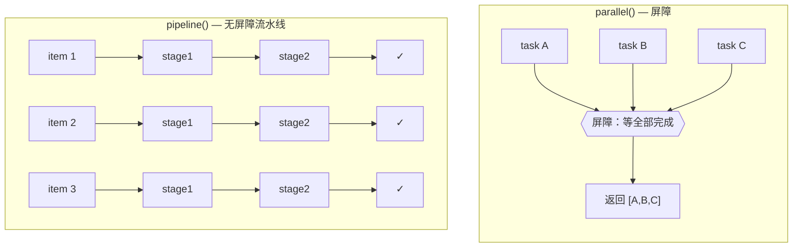
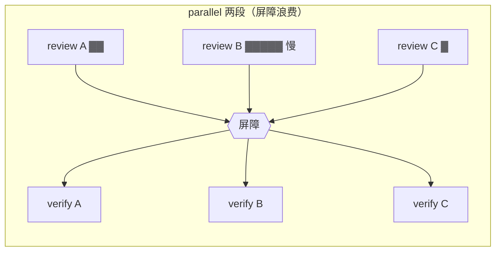

# 第 08 章 · parallel 屏障 vs pipeline 流水线

> 这是整个基础篇**最容易用错**的一章。`parallel()` 和 `pipeline()` 看起来都能「让多个 agent 并发」，但它们的并发模型截然不同——选错，轻则浪费成倍的墙钟时间，重则让本可流动的流水线卡成串行。
>
> 本章用两段**真实运行**的对照，把这件事一次讲透。

---

## 8.1 一句话区分

- **`parallel(thunks)`** 是**屏障（barrier）**：并发跑一组任务，**等全部完成**才返回结果数组。
- **`pipeline(items, ...stages)`** 是**流水线**：每个 item **独立地**流过全部阶段，**阶段之间没有屏障**——A 项可能已经在第 3 阶段，而 B 项还在第 1 阶段。

记住这张图，本章其余内容都是它的展开：



---

## 8.2 `parallel()`：屏障，要么全有要么等

`parallel()` 接收一个**thunk 数组**（每个 thunk 是 `() => Promise`），并发执行它们，等全部 settle 后返回一个**与输入顺序一致**的结果数组。

### 真实运行：3 个 agent 并发

```javascript
export const meta = {
  name: 'parallel-demo',
  description: 'parallel() barrier: 3 agents run concurrently, all results awaited together',
  phases: [{ title: 'Fan-out', detail: 'Three concurrent agents' }],
}

phase('Fan-out')
const dims = ['naming', 'error-handling', 'comments']
const results = await parallel(
  dims.map((d, i) => () =>
    agent(`Name one common ${d} code smell in exactly one sentence.`, {
      label: `smell:${d}`,
      schema: { type: 'object', properties: { smell: { type: 'string' } }, required: ['smell'] },
    })
  )
)
log(`barrier released with ${results.filter(Boolean).length}/${dims.length} results`)
return results.filter(Boolean)
```

**真实返回值**（Run ID `wf_52957913-6d2`）：

```json
[
  {"smell":"...vague, non-descriptive identifiers like `data`, `temp`, `obj`..."},
  {"smell":"...the \"empty catch block,\" where an exception is caught but silently swallowed..."},
  {"smell":"Redundant comments that merely restate what the code already clearly expresses..."}
]
```

**真实用量**：`agent_count=3` ｜ `total_tokens=78844` ｜ `duration_ms=8395`

### 三个要点

**① 真并发，不是串行。** 单个 agent 基线约 5.5 秒（见第 04 章 hello 测试），3 个 agent 这里只花了 **8.4 秒**——远小于 3 × 5.5 = 16.5 秒。并发是真实的。

**② 结果顺序 = 输入顺序。** 即便 `error-handling` 那条最先返回，结果数组里它依然排在 `naming` 之后——`parallel()` 保证结果顺序对应 thunk 顺序，你可以放心用下标对位。

**③ 注意那个 `() =>`。** 传给 `parallel()` 的是**函数数组**，不是 Promise 数组。

<div class="callout warn">

**最常见的错误：传 Promise 而不是 thunk。**

```javascript
// ✗ 错：map 出 agent() 调用会立刻执行——它们在到达 parallel 之前就已经在跑了
await parallel(dims.map(d => agent(...)))

// ✓ 对：map 出 thunk（() => ...），由 parallel 控制何时启动
await parallel(dims.map(d => () => agent(...)))
```

第一种写法传的是**已经创建的 Promise**，而不是 `() => ...` thunk，于是有两个后果：（a）这些 Promise 会**立即、急切地开始执行**——在到达 `parallel` 之前就跑了，`parallel` 根本来不及控制它们何时启动；（b）你失去了 `parallel()` 的**异步失败归集语义**——async reject / agent 出错本应在结果数组对应位置变成 `null`，但你绕过 `parallel` 直接 `await` 时，一个 reject 可能让整个 `await` 直接 reject。所以务必传 thunk。

</div>

### 错误处理：区分「同步 throw」与「异步 reject」

`parallel()` 的错误语义**取决于失败发生在哪条路径**，不能一概而论为「抛错 → `null`」：

- **thunk 函数体内的同步 `throw`**（`() => { throw ... }`）会让整个 `parallel()` 调用 **reject**，不 `try/catch` 就让 **workflow 直接崩溃**（实测 Run `wf_ed5e87f3-435`：status failed、`total_tokens=0`、`duration_ms=26`）。
- 只有**异步失败**——返回一个随后 reject 的 promise（`() => Promise.reject(...)`）或内部 `agent()` 出错——才会在结果数组对应位置变成 `null`，其余照常返回、**workflow 正常完成**（实测 Run `wf_74ebe5ac-2db`）。

所以只要你的 thunk 体内可能有同步逻辑（解析、断言、`JSON.parse`、下标越界），就**绝不能**裸放在 thunk 里——把它移进被 `await` 的 `agent()` 调用，或自己 `try/catch`。无论哪种，**用结果前都先 `.filter(Boolean)`** 滤掉异步路径产生的 `null`：

```javascript
const results = (await parallel(thunks)).filter(Boolean)
```

这是一种「尽力而为」的语义：一个 reviewer 异步挂了，不该让整批 review 一起失败。§8.8 用三段实测把同步/异步这条 corner case 钉死。

---

## 8.3 `pipeline()`：流水线，让每个 item 自己往前流

`pipeline(items, stage1, stage2, …)` 让**每个 item 独立地**依次流过所有 stage。关键词是**独立**：阶段之间**没有屏障**。

### 真实运行：3 项 × 2 阶段（Find → Verify）

```javascript
export const meta = {
  name: 'pipeline-demo',
  description: 'pipeline(): each item flows Find -> Verify independently, no barrier between stages',
  phases: [{ title: 'Find', detail: 'Produce a candidate' }, { title: 'Verify', detail: 'Adversarially check it' }],
}

const items = ['off-by-one', 'null-dereference', 'race-condition']
const out = await pipeline(
  items,
  (kind) =>
    agent(`Give a one-line code example of a ${kind} bug.`, {
      label: `find:${kind}`, phase: 'Find',
      schema: { type: 'object', properties: { example: { type: 'string' } }, required: ['example'] },
    }),
  (found, kind) =>
    agent(`Is this genuinely a ${kind} bug? Example: "${found.example}". Reply boolean + short reason.`, {
      label: `verify:${kind}`, phase: 'Verify',
      schema: { type: 'object', properties: { real: { type: 'boolean' }, reason: { type: 'string' } }, required: ['real', 'reason'] },
    }).then((v) => ({ kind, ...found, ...v }))
)
return out.filter(Boolean)
```

**真实用量**（Run ID `wf_bf086b98-6ec`）：`agent_count=6` ｜ `total_tokens=158982` ｜ `duration_ms=26743`

3 项 × 2 阶段 = **6 个 agent**，`agent_count=6` 精确印证。

### 阶段回调签名：`(prevResult, originalItem, index)`

这是 `pipeline()` 最实用、也最容易忽略的设计：**每个 stage 回调都收到三个参数**。

- 第一阶段：`(item, item, index)`——`prevResult` 就是 item 本身。
- 后续阶段：`(上一阶段的返回值, 原始 item, 下标)`。

看真实脚本里的第二阶段：

```javascript
(found, kind) => agent(`Is this genuinely a ${kind} bug? Example: "${found.example}" ...`)
```

`found` 是第一阶段返回的 `{ example }`，`kind` 是**原始 item**（`'off-by-one'` 等）。这意味着：**你不必把原始输入硬塞进上一阶段的返回值里穿线**——后续阶段随时能拿到 `originalItem` 和 `index`。这是个极大的便利，第三部的配方会反复用到。

<div class="callout tip">

**`.then()` 合并上下文的惯用法**：第二阶段用 `.then((v) => ({ kind, ...found, ...v }))` 把「原始 kind + 第一阶段的 example + 第二阶段的 real/reason」合并成一条完整记录。这样 `pipeline()` 的最终数组里，每一项都自带全部上下文。

</div>

### 某阶段抛错 → 该 item 掉到 `null`，跳过其余阶段

如果某 item 在 stage 2 抛错，它的结果是 `null`，并且**不会**进入 stage 3。其它 item 不受影响，继续流动。同样，用前 `.filter(Boolean)`。

---

## 8.4 核心差异：屏障在哪里

这才是选型的关键。考虑一个两阶段任务：5 个 item，每个都要先 review 再 verify。

**用 parallel 搭两段（有屏障）：**

```javascript
// （示意）阶段间有屏障：必须等 5 个 review 全部完成，才能开始任何一个 verify
const reviews = await parallel(items.map(it => () => agent(reviewPrompt(it), {schema: R})))
const verified = await parallel(reviews.filter(Boolean).map(r => () => agent(verifyPrompt(r), {schema: V})))
```

**用 pipeline（无屏障）：**

```javascript
// 每个 item 自己流：item A 的 review 一完成，它的 verify 立刻开始——
// 不必等 item B、C 的 review
const verified = await pipeline(items,
  it => agent(reviewPrompt(it), {schema: R}),
  review => agent(verifyPrompt(review), {schema: V})
)
```



如果 review B 特别慢，在 parallel 两段写法里，**review A 和 C 早就跑完的 verify 也得干等 B**——屏障把快的拖到了慢的节奏。pipeline 则让 A、C 一完成 review 就立刻 verify，墙钟≈**最慢的单条链**，而不是「各阶段最慢之和」。

<div class="callout info">

**官方给出的判据**：**多阶段任务默认用 `pipeline()`。** 只有当「第 N 阶段需要前一阶段**全部** item 的结果」时，才该用屏障（`parallel`）。

</div>

---

## 8.5 那什么时候才该用屏障？

屏障（`parallel` 介于两阶段之间）**只在**第 N 阶段需要**跨 item 的全局信息**时才正确：

1. **去重 / 合并**：在昂贵的下游工作前，需要拿到全部上一阶段结果做一次全局去重。
2. **零结果早退**：「0 个 bug → 整个验证阶段直接跳过」——需要先知道总数。
3. **下一阶段要引用「其它发现」**做横向对比。

下面这些**不构成**用屏障的理由（它们用 pipeline 内的 stage 就能解决）：

- 「我得先 flatten / map / filter 一下」——在 pipeline 的 stage 里做：`pipeline(items, stageA, r => transform([r]).flat(), stageB)`。
- 「这两个阶段在概念上是分开的」——pipeline 本来就建模分开的阶段，分开 ≠ 需要同步。
- 「这样代码更整洁」——屏障的延迟是真实代价。

<div class="callout warn">

**气味自检**：如果你写出

```javascript
const a = await parallel(...)
const b = transform(a)          // flatten / map / filter，没有跨 item 依赖
const c = await parallel(b.map(...))
```

中间那个 `transform` 并不需要屏障。把它改写成 pipeline、把 transform 塞进某个 stage。**拿不准时，选 pipeline。**

</div>

### 正确使用屏障的真实形态（去重）

```javascript
// （示意）确实需要「全部发现」一起去重，再做昂贵验证——此时屏障正确
const all = await parallel(DIMENSIONS.map(d => () => agent(d.prompt, { schema: FINDINGS })))
const deduped = dedupeByFileAndLine(all.filter(Boolean).flatMap(r => r.findings))  // 需要全部
const verified = await parallel(deduped.map(f => () => agent(verifyPrompt(f), { schema: VERDICT })))
```

---

## 8.6 并发上限对两者都生效

无论 `parallel` 还是 `pipeline`，同时运行的 agent 都受**每工作流 `min(16, CPU核心数 − 2)`** 的节流。所以你**可以**给它们传 100 个 item，它们全都会完成——只是任意时刻只有约 10 个在跑，其余排队。再加上单工作流 agent 总数上限 **1000** 的兜底。

这意味着：你不需要手动分批。直接把全部 item 交给 `pipeline()`，节流会替你管好并发水位。

---

## 8.7 选型速查

| 你的情况 | 用 |
|---|---|
| 一组独立任务，需要**全部结果**一起拿来用 | `parallel()` |
| 多阶段，每个 item 可独立地一路流到底 | `pipeline()`（默认） |
| 第 N 阶段需要前一阶段**所有** item 的结果（去重/早退/横向对比） | 两段之间用 `parallel()` 屏障 |
| 只是要 flatten/map/filter | 放进 `pipeline()` 的某个 stage，**别**为它加屏障 |

---

## 8.8 失败语义：抛错到底变 `null` 还是崩溃？

§8.2 / §8.3 给了一句话版本——「thunk/stage 抛错 → 该位置变 `null`」。这句话对 `pipeline()` 完全成立，但对 `parallel()` **并不精确**：到底变 `null` 还是直接让整个 workflow 崩溃，取决于「抛错」是**同步**发生在 thunk 函数体里，还是来自一个**返回的、随后 reject 的 promise**。本节用三段实测把这个 corner case 钉死。

### 三种抛错形态的最小对照

```javascript
// A. parallel + thunk 函数体内「同步 throw」
//    → 整个 parallel() reject；不 try/catch 则 workflow 直接失败
await parallel([
  () => agent('ok-1'),
  () => { throw new Error('deliberate failure inside a parallel thunk') },  // ✗ 同步抛
  () => agent('ok-2'),
])

// B. parallel + 返回一个「随后 reject 的 promise」（或内部 agent 出错）
//    → 该位置变 null，其余存活，workflow 正常完成
await parallel([
  () => agent('ok-1'),
  () => Promise.reject(new Error('returned-promise rejection, no synchronous throw')),  // → null
  () => agent('ok-2'),
])

// C. pipeline + stage 函数体内「同步 throw」
//    → 只有该 item 掉到 null 并跳过其余 stage，其它 item 不受影响
await pipeline(
  ['ok', 'boom', 'ok2'],
  (kind) => { if (kind === 'boom') throw new Error('stage-1 synchronous throw for "boom"'); return agent(`s1 ${kind}`) },
  (prev, kind) => agent(`s2 ${kind}`),
)
```

### 为什么 A 会让 workflow 崩溃

`parallel(thunks)` 收到 thunk 后会**逐个调用**它们。形态 A 里，那个 thunk 一被调用，**函数体的同步 `throw` 立刻向上抛**——这发生在 `parallel()` 还没拿到任何 promise 之前，于是它没有「把这一格收集成 `null`」的机会，异常直接穿透 `parallel()` 让整个调用 **reject**。形态 B 不同：thunk **正常返回了一个 promise**，`parallel()` 拿到手后才 `await`，**异步 reject** 才是它的错误归集机制能接住的——这一格才变 `null`。

<div class="callout warn">

**最隐蔽的崩溃：`parallel()` 里 thunk 体内的同步 throw 会让整个 workflow 失败。**

实测 Run `wf_ed5e87f3-435`：脚本只是 `parallel([好, () => { throw ... }, 好])`，结果 workflow 状态 **failed**、`agent_count=1`、`total_tokens=0`、`duration_ms=26`——**0 token 秒退**，三个 agent 一个都没真正跑起来。工具定义那句「a thunk that throws resolves to null」对**异步 reject** 成立，对**同步 throw 并不成立**。所以：**绝不要把有风险的同步逻辑（解析、断言、`JSON.parse`、下标越界等）放在 `parallel()` 的 thunk 函数体里**——把它放进被 `await` 的 `agent()` 调用内部（只有异步路径才会被归集为 `null`），或自己 `try/catch`。

</div>

这一点在 Run `wf_74ebe5ac-2db` 里被反向确认：同一次运行同时跑了形态 A 与 B——A 段用 `try/catch` 包住同步 throw，捕获成功（`syncThrowRejectsWorkflow:true`，印证「同步 throw 确实 reject」）；B 段的 `() => Promise.reject(...)` 则让那一格变 `null`、其余 2 格存活（`{nulls:1, survivors:2, becomesNull:true}`），**workflow 正常完成**。那次异步失败仍被单独记录在运行的 `<failures>` 注记里：`parallel[1] failed: ...`——**失败没有被吞掉，只是没让 workflow 崩溃**。

### pipeline 的 stage 更宽容

形态 C 是 `pipeline()`：即便 stage 函数体**同步 throw**，也只让**该 item** 掉到 `null` 并跳过它**余下的 stage**，其它 item 照常流完。实测 Run `wf_f5f5b422-a4f`：`pipeline(['ok','boom','ok2'], stage1[boom 同步抛], stage2)`，外层 try/catch 没捕到任何东西（`{crashed:false, nulls:1, survivors:2, itemDroppedToNull:true}`），workflow 正常完成。最有说服力的是 **`agent_count=4`**：`ok`(2 stage) + `ok2`(2 stage) + `boom`(0，stage1 即抛) = 4——**精确印证「抛错的 item 跑了零个后续 stage」**。换句话说，`pipeline()` 对每个 item 的每个 stage 都做了 per-item 包裹，连同步 throw 也只波及单项。

### 对照表（实测）

| 场景 | `parallel()` | `pipeline()` |
|---|---|---|
| thunk/stage **同步 throw**（`() => { throw }`） | **reject 整个调用**——不 try/catch 则 **workflow 失败**（Run `wf_ed5e87f3-435`：failed / 0 token / 26ms） | 仅该 **item 变 `null`** 并跳过其余 stage，其余存活（Run `wf_f5f5b422-a4f`：`crashed:false`） |
| 返回的 promise **异步 reject**（`() => Promise.reject(...)`）/ agent 出错 | 该位置 **`null`**，调用本身不 reject、其余存活（Run `wf_74ebe5ac-2db`：`nulls:1, survivors:2`） | 仅该 item 变 `null` |
| 失败如何呈现 | 完成/失败都在运行的 `<failures>` 注记中列出 | 同左 |

**实战法则**：在 `parallel()` 里，**绝不要把有风险的同步逻辑放在 thunk 函数体**——把它放进被 `await` 的 `agent()` 调用里（只有异步路径才会被归集为 `null`），或用 `try/catch` 兜住。`pipeline()` 的 stage 容错更强（同步 throw 也只丢该 item），但**两者用结果前都必须先 `.filter(Boolean)`**。

> 把这条对照当成 [B.4](#/zh/app-b)（传 thunk）的姊妹陷阱：B.4 讲「传错了类型（Promise 而非 thunk）」，本节讲「传对了类型，但 thunk 体内同步抛错」——两者都会让 `parallel()` 偏离你以为的「抛错→null」直觉。

---

## 8.9 本章小结

- `parallel()` = 屏障，等全部完成、结果按输入顺序、传 **thunk** 不是 Promise；失败语义分两路：thunk 体内**同步 throw → reject 整个调用**（不 try/catch 则 workflow 崩），仅**异步 reject → 该位置 `null`**（§8.8）。
- `pipeline()` = 无屏障流水线，每 item 独立流过各 stage，回调签名 `(prevResult, originalItem, index)`，墙钟≈最慢单链。
- **多阶段默认 pipeline**；只有需要跨 item 全局信息（去重/早退/横向对比）才在阶段间加屏障。
- 两者都受并发上限节流，放心传大数组。
- 真实数据：parallel 3 并发 8.4s/79K token；pipeline 3×2=6 agent 26.7s/159K token。

下一章，我们补齐基础篇最后一块拼图：**进度可视化（`phase`/`log`/`/workflows`）、断点续传（`resumeFromRunId`）与预算控制（`budget`）**——让长流水线既看得见、又停得下、还能省着跑。

> 继续阅读：[第 09 章 · 进度·日志·续传·预算](#/zh/p2-09)
