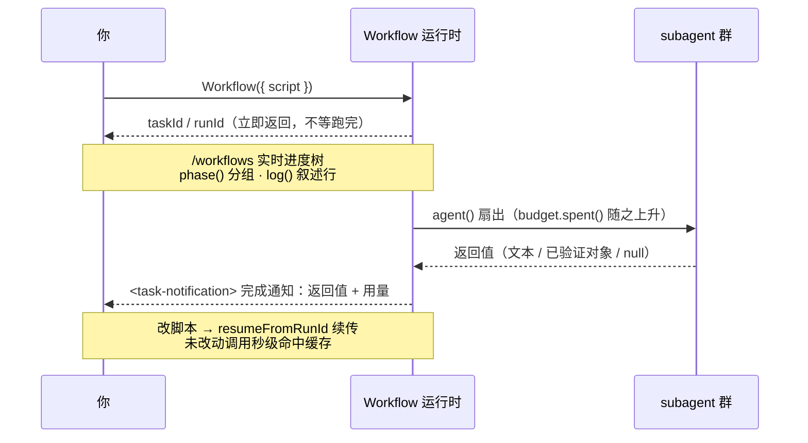

# 第 09 章 · 进度·日志·续传·预算

> 基础篇的最后一块拼图：怎样让一个长流水线**看得见**（进度与日志）、**停得下/接得上**（断点续传）、**省着跑**（预算）。这三件事，是把「能跑」的工作流升级为「能放心交付」的工作流的关键。

---

## 9.1 一图看懂：异步生命周期

把前八章的「启动 → 异步回执 → 看进度 → 完成通知」串成一条时间线。这一章讲的四件事，正好挂在这条线的不同位置上：`phase()`/`log()` 装点**运行中**那段的可观测性，`/workflows` 是你**观察**的窗口，`budget` 在运行中**收着花**，`resumeFromRunId` 则是这条线**跑完后再接一段**的能力。



记住这条线的形状：**Workflow 工具的返回值永远是「已启动」回执，不是结果**（第 04 章）。结果在 `<task-notification>` 里。本章四个原语，就是让这条「看不见的」后台时间线变得**看得见、停得下、省着跑、接得上**。

---

## 9.2 进度：`phase()` + `log()` + `/workflows`

一个工作流跑起来后，你需要知道「它现在在干嘛」。三件工具协同提供可观测性：

### `phase(title)` —— 把进度分组

`phase('Review')` 切换当前阶段，其后所有 `agent()` 调用都在进度树里归到「Review」组下。配合 `meta.phases` 声明，你就得到一棵结构化的进度树。下面是一个**完整可跑**的两阶段脚本（注意它怎样用 `meta.phases` 的 `title` 与 `phase()` 的实参精确对应）：

```javascript
export const meta = {
  name: 'two-phase',
  description: 'phase() groups agents in the live progress tree',
  phases: [
    { title: 'Scan', detail: 'find candidates' },
    { title: 'Verify', detail: 'check each one' },
  ],
}

const FOUND = {
  type: 'object',
  properties: { candidates: { type: 'array', items: { type: 'string' } } },
  required: ['candidates'],
}
const OK = {
  type: 'object',
  properties: { verified: { type: 'array', items: { type: 'string' } } },
  required: ['verified'],
}

phase('Scan')                                  // ← 切到 Scan 阶段
const found = await agent(
  'List three plausible naming smells one might find in a JS module.',
  { label: 'scan', phase: 'Scan', schema: FOUND }
)
log(`扫描到 ${found.candidates.length} 个候选`)  // ← 叙述行

phase('Verify')                                // ← 切到 Verify 阶段
const ok = await agent(
  `Of these candidates, which are genuinely smells? ${JSON.stringify(found.candidates)}`,
  { label: 'verify', phase: 'Verify', schema: OK }
)
log(`确认 ${ok.verified.length} 个`)
return ok
```

> 本段为**示意（未实跑）**；其依赖的 `phase()`/`schema`/`agent()` 真实行为，已由第 04/06/08 章的真实运行（`hello` Run `wf_dacbd480-d5d`、`pipeline-demo` Run `wf_bf086b98-6ec`）验证。

<div class="callout warn">

**在 `parallel()` / `pipeline()` 内部，别依赖全局 `phase()`。** 因为多个分支并发推进，全局「当前阶段」会发生竞争。正确做法是给每个 `agent()` 显式传 `phase`：

```javascript
await pipeline(items,
  d => agent(d.prompt, { phase: 'Review', schema: R }),   // 显式归组
  r => agent(verify(r), { phase: 'Verify', schema: V }),
)
```

`opts.phase` 与 `meta.phases` 的 `title` 按字符串精确匹配——同名即同组。

</div>

### `log(message)` —— 给用户一行叙述

`log()` 在进度树上方打一行叙述性文字。它是**单参数、无返回值**的：`log(message: string): void`（见 `_grounding.md` B 节）。用它报告里程碑、计数、决策——一个旁观者不看代码、只看 `log()` 行，就能跟上工作流的进展：

```javascript
log(`扫描到 ${shards.length} 个分片，开始并发审查`)
// ... 一轮工作之后 ...
log(`${bugs.length}/10 已发现，剩余预算 ${Math.round(budget.remaining() / 1000)}k`)
```

把 `log()` 想成「工作流的旁白」。一条好旁白回答三个问题：**扇出了多少**（`扫描到 N 个分片`）、**收敛到几个**（`确认 M 个`）、**还剩多少预算**（`剩余 Xk`）。下一节的预算循环里，每一轮都 `log()` 一行进度，正是这个用法的范本。

<div class="callout info">

**`console.log` 也能用，但定位不同。** 本书沙箱自省运行（Run `wf_59bf3654-183`）实测确认：脚本里 `console` 是注入的对象、`console.log` 可调用，其输出会进**工作流日志**。区别在于：`log()` 是给用户看的进度旁白（显示在进度树上方），`console.log` 更像开发期的诊断输出（落进日志）。要让旁观者跟上进展，用 `log()`；要留排查痕迹，用 `console.log`。

</div>

### `/workflows` —— 实时进度树

斜杠命令 `/workflows` 打开一棵实时树：每个 phase 一个分组框，组内是各 agent 的标签（来自 `label`）与状态。`meta.phases` 里写的 `title` 决定分组框；`agent()` 的 `label` 决定叶子节点名——所以**描述性的 label 既利于搜索，也利于观察**。

---

## 9.3 完成通知里的真实用量

每个工作流跑完，完成通知都带一份用量统计。这是估算成本的依据。汇总本书基础篇三次真实运行：

| Workflow | agent_count | tool_uses | total_tokens | duration_ms |
|---|---|---|---|---|
| hello（单 agent + schema） | 1 | 1 | 26,338 | 5,506 |
| parallel（3 并发） | 3 | 3 | 78,844 | 8,395 |
| pipeline（3 项 × 2 阶段） | 6 | 8 | 158,982 | 26,743 |

两条经验法则：

- **token ≈ agent 数 × 每 agent 上下文**（约 2.5–3 万 / agent，随提示与产物浮动）。
- **墙钟取决于关键路径**，而非 agent 总数——并发把 N 个 agent 的时间压到约「最慢的一个」。

<div class="callout info">

**编排本身零模型开销。** 上面这条「token ≈ agent 数 ×…」还有个干净的边界：**没有任何 `agent()` 调用的纯编排工作流，花费 0 token。** 本书实测两例都印证了这点——沙箱自省运行（`wf_59bf3654-183`）与嵌套工作流运行（`wf_2b04881f-6a9`）都是 **0 agent / 0 token**（分别 4ms、29ms 跑完）。换句话说，`phase()`/`log()`/`pipeline()`/`parallel()` 这些编排骨架本身不烧 token，**token 只在 `agent()` 真正派发 subagent 时才产生**。这也解释了为什么把控制逻辑尽量留在脚本（编排层）、只把「要动模型的活」丢进 `agent()`，是省钱的根本姿势。

</div>

---

## 9.4 断点续传：`resumeFromRunId`

长流水线最怕「跑到第 8 步崩了，前 7 步昂贵结果全白费」。Workflow 用**断点续传**解决：

```javascript
// 改完脚本后，带上一次的 runId 重跑
Workflow({ scriptPath: ".../my-flow-wf_xxx.js", resumeFromRunId: "wf_xxx" })
```

机制：**最长一段未改动的 `agent()` 前缀**直接返回缓存结果（秒级），只有**第一个被编辑/新增的调用、及其之后**的全部调用才会重新真跑。「同样的脚本 + 同样的 args → 100% 缓存命中」。

这不是口号——本书实测拿到了**字面证据**。对第 04 章那次 `hello-workflow`（Run `wf_dacbd480-d5d`），用**未改动的脚本** + `resumeFromRunId` 重跑，两次运行的真实用量是：

| 运行 | agent_count | tool_uses | total_tokens | duration_ms |
|---|---|---|---|---|
| 首次（真实执行） | 1 | 1 | **26,338** | **5,506** |
| 续传（缓存命中） | **0** | **0** | **0** | **8** |

返回值**逐字节相同**（`{"message":"...","sum":4,"runtimeConfirmed":true}`）。续传那次**0 token、0 工具调用、8 毫秒**——它根本**没有重新派发 subagent**，直接复用了缓存结果（见 `assets/transcripts/advanced.md`，沿用同一 Run ID `wf_dacbd480-d5d`）。这就是「重跑前 7 步几乎免费」的字面依据：未改动的前缀按缓存返回，你只为真正改动的那一段重新付费。

<div class="callout info">

**这就是脚本禁用 `Date.now()` / `Math.random()` / 无参 `new Date()` 的根本原因**：续传依赖「同样的执行必然产生同样的结果」这一可重放性。非确定的时间/随机会破坏它（同一段脚本两次跑出不同结果，缓存就无从比对）。需要时间戳？用 `args` 传进来，或工作流跑完后在外面盖戳。需要随机？用 agent 的下标 `index` 去变化提示词。

</div>

续传是**同会话**内的能力（缓存活在本次会话）；续传前应先用 `TaskStop` 停掉上一次运行。完整用法、缓存命中规律、跨会话兜底见 [第 22 章 · 断点续传与缓存](#/zh/p4-22)。

---

## 9.5 预算：`budget`

当用户用「+500k」式指令给本回合设定 token 目标时，脚本里的全局 `budget` 让你据此**动态调节**工作流的规模与深度。它的三个成员（见 `_grounding.md` B 节）：

```javascript
budget.total        // number | null：本回合 token 目标；null = 未设目标
budget.spent()      // number：本回合已花的 output token（主循环 + 所有工作流共享池）
budget.remaining()  // number：max(0, total - spent())；未设目标时为 Infinity
```

据官方工具定义，它是**硬上限**：`spent()` 一旦达到 `total`，再调 `agent()` 会**抛错**。这层「预算耗尽即停」的设计，目的是防止工作流不受控地烧 token。

<div class="callout info">

**`spent()` 计的是「本回合 output token」，而且是主循环 + 所有工作流的共享池**（官方）。也就是说：你在主对话里消耗的 output、以及同回合任何工作流里 `agent()` 的消耗，都计入同一个 `spent()`。所以 `budget` 约束的是「这一整个回合」的总开销，而非单个工作流。

</div>

### 9.5.1 实测：未设目标时 `budget.total === null`

理解 `budget` 的关键，是先看清「**没设目标**」这一最常见情形下它的真实取值。本书的沙箱自省运行（Run `wf_59bf3654-183`，0 agent / 0 token / 4ms）在脚本里直接读出了 `budget`：返回对象里 `typeof budget === 'object'`、且 **`budget.total === null`**。

这就坐实了第一条关键事实：

- **未设目标 → `budget.total === null`**（实测，`wf_59bf3654-183`）——不是 `0`，也不是某个默认数。

另两条来自官方 API 定义（`_grounding.md` B 节），与 `total` 的取值咬合：

- **`total` 为 null 时，`budget.remaining()` 返回 `Infinity`**（`remaining()` 定义为 `max(0, total - spent())`，total 为 null 时即无上限）——这是个会咬人的值，下面 9.5.3 专门讲。
- **`budget.spent()` 与 `total` 是否为 null 无关**：它永远反映本回合真实花掉的 output token。按本书基线，1 个 agent 一次往返约 2.6 万 token（hello，`wf_dacbd480-d5d`），`spent()` 会随每次 `agent()` 累加。

**一条探针把三件事一次坐实。** 本书另跑了一条带 1 个真实 agent 的预算探针（Run `wf_fd09a6ed-38a`，1 agent / 26,211 token / 6,933ms），在未设目标的会话里一次读全：`budget.total === null`、agent 跑前跑后 `budget.remaining()` **实测都是 `Infinity`**（`remainingBefore` / `remainingAfter` 皆为 `"Infinity"`——是真读到、不是「按定义推断」）、而同一次里 `budget.spent()` 确实**涨了**（`spentIncreased: true`，从近 0 升到那约 2.6 万 token）。这把上面三条从「各自单独成立」收紧成「同一次运行里同时成立」，也正好印证下一句：开关（`total`）始终 `null`、余额（`remaining()`）始终 `Infinity`，计数器（`spent()`）却照涨不误。

换句话说：`total` 是「用户有没有设目标」的开关（未设即 `null`），`spent()` 是「实际花了多少」的计数器，二者独立。这个区别是后面所有用法的地基。

### 9.5.2 两种典型用法

**① 动态循环（按预算决定干多久）：**

```javascript
const BUGS = {
  type: 'object',
  properties: { bugs: { type: 'array', items: { type: 'string' } } },
  required: ['bugs'],
}

const bugs = []
while (budget.total && budget.remaining() > 50_000) {   // ← 必须有 budget.total &&
  const r = await agent('Find one more distinct bug in this module.', {
    label: `hunt:${bugs.length}`,
    schema: BUGS,
  })
  bugs.push(...r.bugs)
  log(`${bugs.length} 个，剩余 ${Math.round(budget.remaining() / 1000)}k`)
}
```

**② 静态扩缩（按预算一次性决定扇出多少）：**

```javascript
// 有目标：每 10 万 token 配 1 个 agent；没目标：退回安全默认值 5
const FLEET = budget.total ? Math.floor(budget.total / 100_000) : 5
log(`本次扇出 ${FLEET} 个 agent`)
```

两种模式**都用 `budget.total` 做了「有没有目标」的判别**：动态循环把它当 `while` 守卫，静态扩缩把它当三元表达式的条件。这不是巧合——下一节解释为什么**必须**这么写。

### 9.5.3 警告：无守卫的 `while` 会跑到天荒地老

反面写法是一个故意**只判 `remaining()`、不判 `total`** 的循环——

```javascript
// ✗ 反例：缺少 budget.total 守卫
while (budget.remaining() > 50_000) { /* ... 派 agent ... */ }
```

把 9.5.1 的两条事实接起来，就能推出它的下场：未设目标时 `budget.total === null`（实测，`wf_59bf3654-183`），而按官方定义此时 `remaining()` 返回 `Infinity`——于是这个反例的判据 `Infinity > 50_000` **永远为真**。这一点还有一条**正向实测**佐证：带守卫的 `while (budget.total && …)` 在未设目标时**实跑 0 轮**——`wf_fd09a6ed-38a` 的 `guardRounds: 0` 就是它，守卫把循环掐死在第 0 轮，根本没机会失控。

<div class="callout warn">

**未设目标时，无守卫的 `while (budget.remaining() > N)` 会变成死循环。** 因为 `remaining()` 返回 `Infinity`、`Infinity > N` 恒真，循环会一直派 agent，直到撞上**单工作流 1000 个 agent 的全局兜底上限**才停（官方硬约束，`_grounding.md`）。反之，正确写法 `while (budget.total && budget.remaining() > N)` 在未设目标时会因 `budget.total` 为 `null`（假值）**短路**为假、一轮都不跑——这正是为什么动态循环**必须**带这个守卫。**口诀：动态循环的条件，第一项永远是 `budget.total &&`。**

</div>

<div class="callout info">

**关于「预算耗尽抛什么错」与同步超时**：官方只描述了**行为**——预算耗尽后再调 `agent()` 会出错、达到 1000 agent 上限会出错——但**没有给出错误类名**。社区第三方资料（某 YouTuber 仓库，非官方）声称这两类错误的类名分别是 `WorkflowBudgetExceededError` 与 `WorkflowAgentCapError`——这两个**类名仍属第三方声称、本书未核实**，所以别在代码里 `catch` 某个具名异常。但其中一条曾与类名一起被列为「未核实」的说法，本书现已**实测确认**：脚本 VM 的 **30000ms 同步超时**是真的（Run `wf_e3b2b123-5f4`：一个无 `await` 的长同步循环在 30,222ms 处被终止，报错原文 `Error: Script execution timed out after 30000ms`）。注意它只约束**同步**执行（用来掐死死循环），**不是** wall-clock 上限——带 `await agent()` 的工作流照样能跑好几分钟。

</div>

预算的完整玩法（与规模化策略）见 [第 21 章 · 动态预算与规模化](#/zh/p4-21)。

---

## 9.6 把可观测性当成一等公民

社区系统给我们的一条教训（见第五部）：**编排不仅要会调度，还要「说清楚自己在干嘛」**。一个不输出进度的工作流，跑 5 分钟和卡死 5 分钟，从外面看没区别。

实践清单：

- 每个 `agent()` 给**描述性 `label`**（`review:auth.ts` 胜过 `agent-7`）。
- 每个里程碑 `log()` 一行（扇出多少、收敛到几个、剩余预算）。
- 用 `phase()` / `opts.phase` 把进度分组，让 `/workflows` 的树清晰。
- 如果工作流做了**有损取舍**（只取 top-N、不重试、抽样），**一定 `log()` 出来**——否则静默截断会被误读为「全覆盖了」。

---

## 9.7 本章小结

- **异步生命周期**：启动立即返回 `taskId`/`runId` 回执 → `/workflows` 看进度 → `<task-notification>` 带回结果与用量；本章四原语挂在这条线的不同位置（9.1）。
- **进度**：`phase()` 分组、`log()` 叙述、`/workflows` 看实时树；并发内部用 `opts.phase` 而非全局 `phase()`。
- **用量**：完成通知带 `agent_count`/`tool_uses`/`total_tokens`/`duration_ms`；token≈agent 数×每 agent 上下文，墙钟看关键路径。
- **续传**：`resumeFromRunId` 让未改动前缀秒级命中缓存——实测 **0 token / 0 工具调用 / 8 ms**（Run `wf_dacbd480-d5d`）；可重放性要求故禁用 `Date.now`/`Math.random`。
- **预算**：`budget.total/spent()/remaining()` 是官方硬上限，`spent()` 是本回合 output token、主循环+所有工作流共享池。实测未设目标时 `total === null`（Run `wf_59bf3654-183`）；据官方定义此时 `remaining()` 为 `Infinity`，故**动态循环务必用 `budget.total &&` 守卫**，否则 `Infinity > N` 恒真会冲到官方 1000 个 agent 兜底上限。
- 把可观测性当一等公民：描述性 label、里程碑 log、显式 phase、有损取舍要说出来。

**基础篇到此完结**——你已经掌握 `meta`/`phase`/`agent`/`schema`/`parallel`/`pipeline`/`log`/`resume`/`budget` 的全部核心。第三部开始，我们把这些拼成真正能用的配方；其中以真实运行为目标，**已实跑的配方附 Run ID 与真实用量（见 [`assets/transcripts/`](https://github.com/AGI-is-going-to-arrive/workflow-cookbook/tree/main/assets/transcripts)），未实跑的示意脚本会明确标注**。

> 继续阅读：[第 10 章 · 分片代码审查](#/zh/p3-10)
