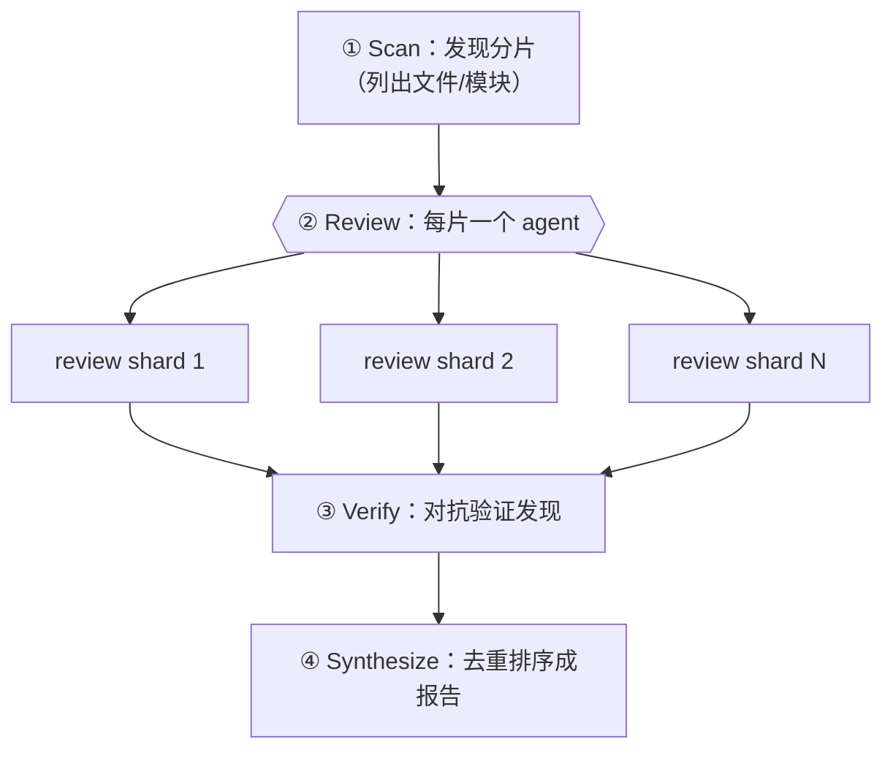

# 第 10 章 · 分片代码审查

> 一个大代码库塞不进单个 agent 的有效上下文，硬塞也会让它「读了后面忘前面」。分片代码审查（sharded review）的思路很朴素：**把大目标切成小分片，每片派一个 agent 独立审，再对抗验证、最后综合**。本章把这套「发现→审查→验证→综合」的四段式讲透。
>
> 它和第 11 章「PR 多维 Review」是一对孪生：第 11 章按**维度**切（a11y/性能/正确性），本章按**分片**切（文件/模块/函数块）。

---

## 10.1 配方动机：分治 + 上下文隔离

为什么不把整个代码库丢给一个 agent？两个原因：

1. **上下文有限**：再大的窗口也有边界，塞满后质量断崖式下跌。
2. **注意力稀释**：让一个 agent 同时盯 50 个文件，它对每个文件的注意力都被摊薄。

分片审查利用了 Workflow 的核心优势——**每个 subagent 有独立上下文**（见第 6 章）：每片只看自己那一小块，注意力集中，且主循环上下文不被原始代码淹没（只有结构化的发现回流）。



---

## 10.2 四段式骨架

```javascript
export const meta = {
  name: 'sharded-review',
  description: 'Discover shards, review each independently, verify findings, synthesize',
  phases: [
    { title: 'Scan', detail: 'Discover code shards' },
    { title: 'Review', detail: 'Review each shard independently' },
    { title: 'Verify', detail: 'Adversarially verify findings' },
    { title: 'Synthesize', detail: 'Produce final report' },
  ],
}

const FINDING = { type: 'object', properties: {
  findings: { type: 'array', items: { type: 'object',
    properties: { severity: { type: 'string', enum: ['critical','high','medium','low'] },
                  shard: { type: 'string' }, title: { type: 'string' }, fix: { type: 'string' } },
    required: ['severity','title','fix'] } } }, required: ['findings'] }

// ① Scan —— 实际项目里可由一个 agent 用 Glob/Grep 发现分片，或直接传入文件清单
phase('Scan')
const shards = ['src/auth.ts', 'src/cart.ts', 'src/checkout.ts' /* … */]

// ②③ Review→Verify 用 pipeline：每片审完立刻验，不必等别片
const reviewed = await pipeline(
  shards,
  (shard) => agent(`Review ${shard} for bugs, security, and clarity. Read the file.`,
    { label: `review:${shard}`, phase: 'Review', schema: FINDING }),
  (review, shard) => parallel((review.findings || []).map(f => () =>
    agent(`Adversarially verify this finding in ${shard}: "${f.title}". Refute if not real.`,
      { label: `verify:${shard}`, phase: 'Verify',
        schema: { type: 'object', properties: { real: { type: 'boolean' } }, required: ['real'] } })
      .then(v => ({ ...f, shard, real: v && v.real }))
  )).then(rs => rs.filter(Boolean).filter(x => x.real))
)

// ④ Synthesize —— 跨分片去重排序（需要全部结果，这里用屏障是正确的）
phase('Synthesize')
const all = reviewed.flat().filter(Boolean)
const report = await agent(
  `Deduplicate and prioritize these ${all.length} verified findings: ${JSON.stringify(all)}`,
  { label: 'synthesize', phase: 'Synthesize',
    schema: { type: 'object', properties: { top: { type: 'array', items: { type: 'object',
      properties: { severity: { type: 'string' }, title: { type: 'string' }, fix: { type: 'string' } }, required: ['severity','title','fix'] } } }, required: ['top'] } }
)
return report
```

> 上面的 `sharded-review` 骨架为**示意（未按此原样实跑）**；但它的每一段都由本书的真实运行验证过：Review→Synthesize 见第 11 章 frontend-review（真实），Verify 的对抗验证见第 15 章 bug-hunter（真实）。

---

## 10.3 用一次真实运行印证：维度分片

本书第 11 章的 **frontend-review** 是一次真实的「分片审查」——只不过它按**维度**而非文件分片，对本书自己的 `index.html` 同时从 a11y / 性能 / 正确性 三个维度审查：

> **真实运行**：Run ID `wf_4c5caabb-b73`，`agent_count=4`（3 维度审查 + 1 综合），`total_tokens=221648`，`duration_ms=272643`。产出 26 条发现 → 综合去重为 16 个问题。详见 `assets/transcripts/frontend-review.md`。

它印证了分片审查的两个关键点：

1. **`parallel` 并发审、`synthesize` 收口**：三个维度 agent 并发，最后一个 agent 拿到全部发现去重排序——这里 synthesize 前的屏障是**正确**的（需要跨分片的全局视图，见第 8 章 §8.5）。
2. **发现可直接驱动修复**：那 16 个问题被逐条修进了 `index.html`（XSS、无焦点指示、重复 heading ID……）——审查不是终点，是行动的起点。

---

## 10.4 设计要点

**① Scan 阶段怎么切分片？** 三种常见切法：
- 按**文件/模块**（最常见）：用一个 agent 配 `agentType: 'Explore'` 跑 Glob/Grep 列出目标文件。
- 按**维度**（如第 11 章）：a11y/性能/安全/架构/可读性。
- 按**变更**：只审 `git diff` 涉及的文件（PR 场景）。

**② Review→Verify 用 pipeline，Synthesize 前才用屏障。** 每片审完立刻验（无需等别片），但去重排序需要全部结果——这是「默认 pipeline、确需全局才屏障」原则的教科书应用（第 8 章）。

**③ 给每个发现配 `severity` + `shard`。** 结构化的严重度让 synthesize 能排序，`shard` 让你能定位回原处。

**④ 别让原始代码回流主循环。** subagent 读文件、只把**结构化发现**返回——这正是分片审查省上下文的关键。

---

## 10.5 本章小结

- 分片审查 = Scan（发现分片）→ Review（每片独立 agent）→ Verify（对抗验证）→ Synthesize（跨片去重排序）。
- 利用 subagent 独立上下文：每片注意力集中，主循环只收结构化发现。
- Review→Verify 用 `pipeline`，Synthesize 前用屏障（需全局视图）。
- 真实印证：frontend-review（维度分片，Run `wf_4c5caabb-b73`）跑出 26→16 个问题并驱动了真实修复。

下一章是它的孪生：按**维度**切的 PR 多维 Review，我们用那次真实 dogfood 详细展开。

> 继续阅读：[第 11 章 · PR 多维 Review](#/zh/p3-11)
