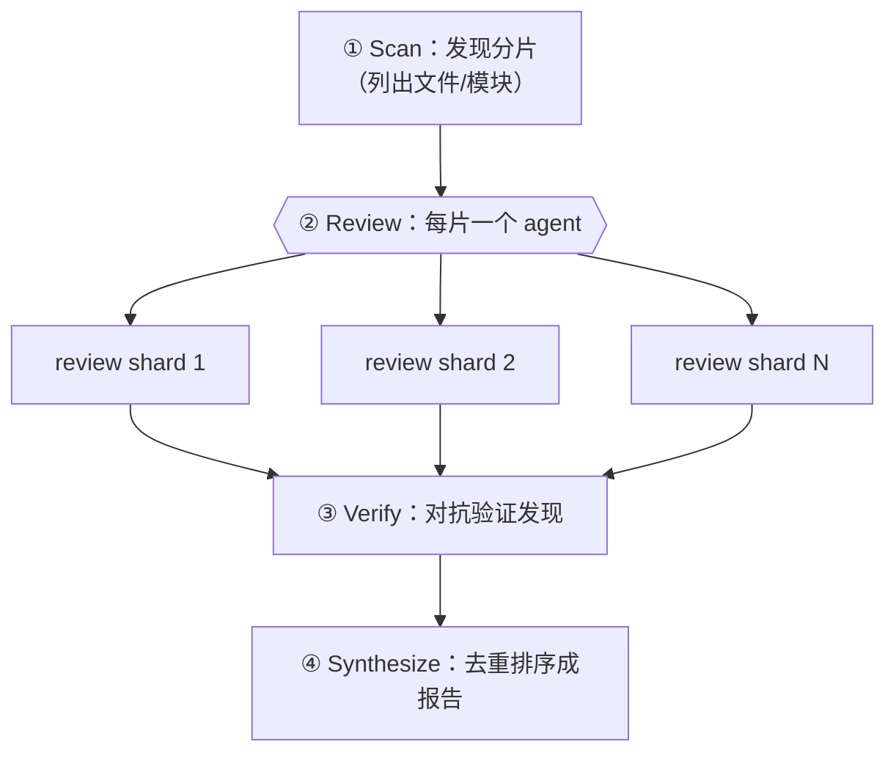
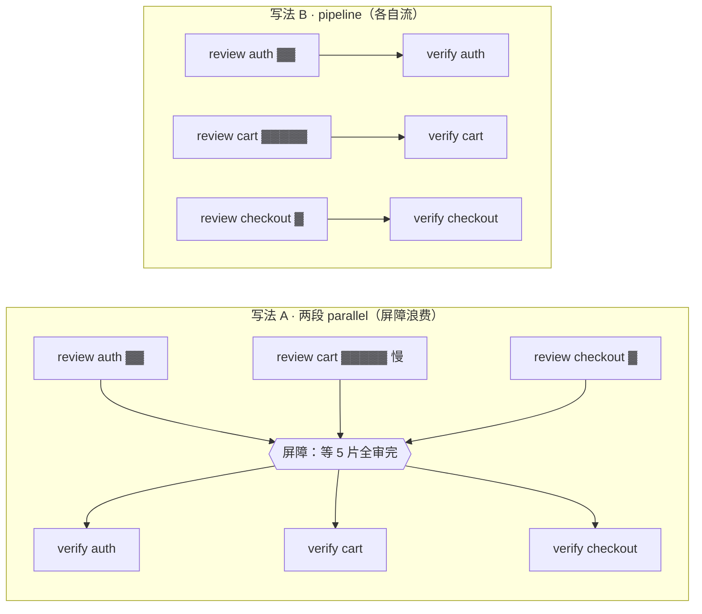

# 第 10 章 · 分片代码审查

> 一个大代码库塞不进单个 agent 的有效上下文，硬塞它也会「读了后面忘前面」。分片代码审查（sharded review）的思路很朴素：**把大目标切成小分片，每片派一个 agent 独立审，再对抗验证、最后综合**。本章把这套「发现→审查→验证→综合」的四段式讲透——重点不在「能切」，而在**怎么用 `pipeline` 让每片独立流过「审查→验证」、阶段间不设屏障**，以及**什么时候该破例加屏障**。
>
> 它和第 11 章「PR 多维 Review」是一对孪生：第 11 章按**维度**切（a11y/性能/正确性），本章按**分片**切（文件/模块/函数块）。两章共用同一组真实运行做经验底座，但讲的是同一枚硬币的两面——Ch 11 讲「同一份代码、多个视角、屏障收口」，本章讲「多个分片、各自独立、流水线推进」。

---

## 10.1 配方动机：分治 + 上下文隔离

为什么不把整个代码库丢给一个 agent？两个原因：

1. **上下文有限**：窗口再大也有边界，塞满之后质量断崖式下跌。
2. **注意力稀释**：让一个 agent 同时盯 50 个文件，它分给每个文件的注意力都被摊薄。

分片审查吃的就是 Workflow 的一个核心优势——**每个 subagent 有独立上下文**（见第 06 章）：每片只看自己那一小块，注意力集中，主循环的上下文也不会被原始代码淹没（回流的只有结构化的发现）。



但先记住一件更准确的事：上图把 Review 和 Verify 画成两道「全宽」横条，**很容易让人误以为它们之间有屏障**——以为「等所有分片都 review 完，才一起进 verify」。**这正是本章要掰过来的直觉。** 分片审查真正高效的形态是：**每个分片审完立刻验、不等别片**，只有最后的 Synthesize 才真的需要「看到全部」。下一节我们就用 `pipeline` 把这个形态写出来。

---

## 10.2 四段式骨架

```javascript
export const meta = {
  name: 'sharded-review',
  description: 'Discover shards, review each independently, verify findings, synthesize',
  phases: [
    { title: 'Scan', detail: 'Discover code shards' },
    { title: 'Review', detail: 'Review each shard independently' },
    { title: 'Verify', detail: 'Adversarially verify findings' },
    { title: 'Synthesize', detail: 'Produce final report' },
  ],
}

const FINDING = { type: 'object', properties: {
  findings: { type: 'array', items: { type: 'object',
    properties: { severity: { type: 'string', enum: ['critical','high','medium','low'] },
                  shard: { type: 'string' }, title: { type: 'string' }, fix: { type: 'string' } },
    required: ['severity','title','fix'] } } }, required: ['findings'] }

// ① Scan —— 实际项目里可由一个 agent 用 Glob/Grep 发现分片，或直接传入文件清单
phase('Scan')
const shards = ['src/auth.ts', 'src/cart.ts', 'src/checkout.ts' /* … */]

// ②③ Review→Verify 用 pipeline：每片审完立刻验，不必等别片
const reviewed = await pipeline(
  shards,
  (shard) => agent(`Review ${shard} for bugs, security, and clarity. Read the file.`,
    { label: `review:${shard}`, phase: 'Review', schema: FINDING }),
  (review, shard) => {
    // review 可能为 null：该片的 review 阶段抛错/被跳过时，pipeline 把这一项置 null（见 §10.3）
    if (!review) { log(`skipped shard: ${shard}`); return [] }
    return parallel((review?.findings ?? []).map(f => () =>
      agent(`Adversarially verify this finding in ${shard}: "${f.title}". Refute if not real.`,
        { label: `verify:${shard}`, phase: 'Verify',
          schema: { type: 'object', properties: { real: { type: 'boolean' } }, required: ['real'] } })
        .then(v => ({ ...f, shard, real: v && v.real }))
    )).then(rs => rs.filter(Boolean).filter(x => x.real))
  }
)

// ④ Synthesize —— 跨分片去重排序（需要全部结果，这里用屏障是正确的）
phase('Synthesize')
const all = reviewed.flat().filter(Boolean)
const report = await agent(
  `Deduplicate and prioritize these ${all.length} verified findings: ${JSON.stringify(all)}`,
  { label: 'synthesize', phase: 'Synthesize',
    schema: { type: 'object', properties: { top: { type: 'array', items: { type: 'object',
      properties: { severity: { type: 'string' }, title: { type: 'string' }, fix: { type: 'string' } }, required: ['severity','title','fix'] } } }, required: ['top'] } }
)
return report
```

> 上面这段 `sharded-review` 骨架是**示意（未按此原样实跑）**；但它的每一段都有本书的真实运行兜底：`pipeline` 的「逐项独立流过 review→verify」见第 08 章 pipeline-demo（真实，Run `wf_bf086b98-6ec`）；Review→Synthesize 的屏障收口见第 11 章 frontend-review（真实，Run `wf_4c5caabb-b73`）；Verify 的对抗验证见第 15 章 bug-hunter（真实）。

这段骨架里藏着本章的全部要点，我们一条条拆开看。

### 关键结构：`pipeline` 把 Review→Verify 串成无屏障流水线

看一眼 `pipeline(shards, reviewStage, verifyStage)` 这个形状。它和第 08 章那段 `pipeline-demo`（Find→Verify）是**同一个模式**——只不过 item 从「bug 类别」换成了「代码分片」：

- **第一个 stage**（`reviewStage`）拿到 `(shard, shard, index)`——首阶段的 `prevResult` 就是 item 本身（见第 08 章的 `(prevResult, originalItem, index)` 签名）。它派一个 agent 去读这片代码、产出结构化发现。
- **第二个 stage**（`verifyStage`）拿到 `(review, shard, index)`——`review` 是上一阶段返回的发现集，`shard` 是**原始分片路径**（不用你手动穿线，pipeline 会自动把 `originalItem` 喂回来）。它对这片里的每条发现并发跑一个验证 agent。

`pipeline` 的语义保证了这一点：**`src/auth.ts` 一审完，它的 verify 立刻开始，根本不用等 `src/checkout.ts` 审完**。这正是「阶段间无屏障」——A 片可能已经在 Verify 了，B 片还在 Review。

### 嵌套：stage 内部用 `parallel` 验证「该片的多条发现」

第二个 stage 里出现了 `parallel(...)`——这是 `pipeline` 套 `parallel` 的典型组合，但要分清**两层并发各自的边界**：

- **外层 `pipeline`**：让**不同分片**各自独立地流（auth 和 cart 互不等待）。
- **内层 `parallel`**：在**单个分片内部**，把「这片的 N 条发现」并发验证——这一层确实需要屏障，因为 `.then(rs => rs.filter(...))` 得等这片的全部验证结果凑齐了一起过滤。

<div class="callout tip">

**为什么内层屏障是对的、外层屏障却是错的？** 内层 `parallel` 的屏障只锁「**单个分片**的那几条发现」——粒度小、墙钟短，而且下一步（过滤出 `real` 的发现）确实得拿到这片的全部裁决。外层要是也上屏障（把 Review 和 Verify 拆成两段全宽 `parallel`），那就锁住了**所有分片**——快的分片只能干等最慢那片审完才能开验。判据还是第 08 章那句话：**屏障只在「下一步需要这一组的全部结果」时才对**；内层满足这个条件，外层不满足。

</div>

### `opts.phase` 显式归组，避免并发竞争全局 `phase()`

骨架里每个 `agent()` 都带了 `phase: 'Review'` / `phase: 'Verify'`。在 `pipeline`/`parallel` 内部，多个 agent 一起并发推进，要是都靠全局 `phase('Review')` 来归组，进度树就会**抢着错位**（A 片的 verify 可能被算进 B 片刚切出来的 Review 组）。显式写 `opts.phase`，就把每个 agent 钉死在它该属于的进度组里——这是第 05/08 章反复强调的进度归组惯用法。

---

## 10.3 pipeline 分片 vs parallel 屏障：本章的核心取舍

这是分片审查最该想清楚的一道选择题，也是它和第 11 章分道扬镳的地方。两种写法都「能跑」，但墙钟代价差得很多。

### 同一个两阶段任务，两种写法

假设有 5 个分片，每片都要先 review 再 verify。

**写法 A · 两段 `parallel`（阶段间有屏障）：**

```javascript
// （示意，未实跑）阶段间有屏障：必须等 5 个 review 全部完成，才能开始任何一个 verify
const reviews = await parallel(shards.map(s => () => agent(reviewPrompt(s), { schema: FINDING })))
const verified = await parallel(reviews.filter(Boolean).map(r => () => agent(verifyPrompt(r), { schema: VERDICT })))
```

**写法 B · 一个 `pipeline`（无屏障流水线）：**

```javascript
// （示意，未实跑）每片自己流：auth 的 review 一完成，它的 verify 立刻开始——不必等别片
const verified = await pipeline(shards,
  s => agent(reviewPrompt(s), { schema: FINDING }),
  review => agent(verifyPrompt(review), { schema: VERDICT })
)
```



差别在于：要是 `cart` 这片特别大、review 特别慢，写法 A 里 **`auth` 和 `checkout` 明明早就审完、本可立刻开验，也只能干等 `cart`**——屏障把快的拖进了慢的节奏。写法 B 的 `pipeline` 则让 `auth`、`checkout` 一审完就立刻验，墙钟 ≈ **最慢的单条链**（`cart` 的 review+verify），而不是「各阶段最慢之和」。

<div class="callout info">

**官方判据（来自工具定义）**：**多阶段任务默认用 `pipeline()`。** 只有当「第 N 阶段需要前一阶段**全部** item 的结果」时，才用屏障（`parallel`）。分片审查的 Review→Verify **不**满足这个条件（验证 auth 的发现，用不着 cart 的发现），所以**默认就该用 pipeline**——这就是骨架那样写的根本原因。

</div>

### 真实数据印证「无屏障」的形态

我们没有专门为分片审查跑一次 N 片的 pipeline，但第 08 章的 **pipeline-demo** 已经把这个机制钉死了——它就是 Review→Verify 的最小真身：

> **真实运行**：Run ID `wf_bf086b98-6ec`，3 项 × 2 阶段，`agent_count=6`、`total_tokens=158982`、`duration_ms=26743`。stage 回调签名实测为 `(prevResult, originalItem, index)`（第二阶段 `(found, kind)` 里 `found` 是上阶段返回值、`kind` 是原始 item）。详见 `assets/transcripts/primitives.md`。

`agent_count=6` 精确印证了「3 项 × 2 阶段 = 6 agent」；而每项独立流过两阶段、阶段间无屏障，把它原样放大到 N 个分片，就是本章的骨架。把分片数从 3 提到 20，agent 数线性涨到 40，但**墙钟不会**跟着线性涨——并发上限是 `min(16, 核心−2)`（官方权威口径，见第 08 章 §8.6）：任意时刻最多这么多 agent 在跑，多出来的排队、有槽位释放出来再补上。而 pipeline 让早完成的分片不空等。

### 什么时候反而该用屏障？（Synthesize 这一步）

骨架的最后一步 `phase('Synthesize')` 用了一个**全宽屏障**——这次是**正确**的。因为去重排序需要**跨分片的全局视图**：

- 同一个工具函数被 `auth.ts` 和 `cart.ts` 各引用一次，两片可能各报一遍同源 bug——只有看到**全部**发现的 agent 才合得起来。
- 排优先级这事是全局的：auth 的一个 CRITICAL 必须排在 cart 的一个 LOW 前面——单片 agent 只看得见自己那一摊，排不出全局序。

所以本章的取舍可以浓缩成一句话：**Review→Verify 用 pipeline（逐片独立流），Synthesize 前才用屏障（需要全局）。** 这是第 08 章「默认 pipeline、确需全局才屏障」原则的教科书级应用。

---

## 10.4 成本模型：先估算，再开跑

分片审查的成本几乎可以**事前全部估出来**——这是 Workflow 比「黑盒 agent」强的一大处。两条经验法则（来自第 08 章对真实运行的归纳）：

<div class="callout tip">

**① token ≈ agent 数 × 每 agent 上下文（约 2.5–3 万 / agent）。**
**② 墙钟取决于关键路径（最慢的单条链），并发把 N 个压到「最慢的一个」。**

</div>

套到分片审查上，先把 agent 数数清楚：

```
agent 总数 = (Scan 的 1 个发现 agent，若用 agent 发现分片)
           + N 片 × 1 个 review agent
           + Σ(每片发现数) 个 verify agent
           + 1 个 synthesize agent
```

举个具体的例子：审 10 个分片，每片平均产出 4 条发现：

| 阶段 | agent 数 | 说明 |
|---|---|---|
| Scan | 0~1 | 直接传文件清单则 0；用 Explore agent 发现则 1 |
| Review | 10 | 每片一个 |
| Verify | ~40 | 10 片 × 平均 4 条发现 |
| Synthesize | 1 | 全局去重排序 |
| **合计** | **~51** | |

代入法则①：`token ≈ 51 × 2.7 万 ≈ 138 万 token`。这数字**不小，但能提前算到**——你开跑前就能判断它会不会超出本回合的 `budget`（见第 09 章），而不是跑到一半被预算硬上限掐断。

<div class="callout warn">

**verify 阶段是 token 大头，别无脑放大。** 上例 40 个 verify agent 贡献了近 80% 的 token。要是每条发现都去对抗验证，分片越多、发现越多，verify 的 agent 数就会**平方级**膨胀。两个收敛的办法：（a）只验 `high`/`critical` 的发现（在 verify stage 前 `filter(f => ['high','critical'].includes(f.severity))`）；（b）让一个 verify agent 一次验**一片的全部发现**（而不是一条配一个 agent），把内层 `parallel` 换成单个带数组 schema 的 agent。后者是拿 agent 数换 token——看你更缺哪种资源。

</div>

墙钟这边套法则②：pipeline 下，10 片的墙钟 ≈ **最慢那一片**走完「review → 该片全部 verify → （它在 synthesize 前结束）」的时间，**不是** 51 个 agent 串起来的总和。这就是为什么分片审查能一边「看完整个大代码库」，一边把墙钟摁在分钟级——真实参照见第 11 章那次 4 维度审查，`agent_count=4` 却跑了约 4.5 分钟（`duration_ms=272643`），因为单 agent 要老老实实读完整个文件，关键路径被「最慢的那个维度」拉长了。

---

## 10.5 分片粒度：按文件 / 按目录 / 按维度

「分片」到底切多大？这是 Scan 阶段的核心决策，直接定了 agent 数和发现质量。三种常见切法：

| 切法 | 一片 = | 适合 | 注意 |
|---|---|---|---|
| **按文件** | 单个源文件 | 改动分散在多文件的 PR；中等规模库 | 最常见、最均衡；超大文件可能仍塞不下，需再降一级 |
| **按目录/模块** | 一个目录或包 | 大型 monorepo、按领域划分清晰的库 | 一片可能含多文件，agent 要 Glob 后逐个读；粒度粗、agent 少、单 agent 上下文重 |
| **按维度** | 一个审查视角（a11y/安全/性能…） | 单文件或小目标、需多视角深挖 | **这是第 11 章的主场**；与「按文件」正交，可叠加 |
| **按变更** | `git diff` 涉及的文件 | PR / CI 场景 | 只审改动面，省 token；用一个 agent 跑 `git diff --name-only` 产出分片清单 |

<div class="callout info">

**粒度的本质，是「单 agent 上下文」和「agent 数」之间的权衡。** 切得越细（按文件、甚至按函数块），每片上下文越轻、注意力越集中、发现密度越高，但 agent 数越多、综合阶段要去重的发现也越多。切得越粗（按目录），agent 越少、综合越省事，但单 agent 上下文重，有「读了后面忘前面」的风险。**经验起点：按文件切**；碰到塞不下的超大文件再降到「按函数块/按 region」，碰到文件太多（>30）再升到「按目录」。

</div>

### Scan 阶段怎么实现？

最省事的 Scan 就是**直接传一份文件清单**（比如骨架里写死的那个数组，或者经 `args` 传进来）——零 token、零延迟。需要动态发现的时候，用一个 agent 配上 `agentType: 'Explore'`（实测可用的内置 agent 之一，见第 06 章）跑 Glob/Grep：

```javascript
// （示意，未实跑）用一个 Explore agent 发现分片，schema 强制返回文件清单
phase('Scan')
const scan = await agent(
  'Glob the repo for source files under src/ that changed in the last commit ' +
  '(use `git diff --name-only HEAD~1`). Return the list.',
  { label: 'scan', agentType: 'Explore',
    schema: { type: 'object', properties: { shards: { type: 'array', items: { type: 'string' } } }, required: ['shards'] } }
)
const shards = scan.shards
```

注意：文件/shell 操作只能塞进 `agent()` 叶子里——脚本本体没有 `require`/`process`/`fetch`（宿主 API 缺席，见第 06 章与附录 B），Glob/Grep/Bash 这些都是 subagent 才有的工具。

---

## 10.6 去重与合并：Synthesize 的真正价值

分片审查最后一步「Synthesize」可不是把发现拼起来就完事——它的核心价值是**去重 + 排序**，而这恰恰就是它为什么需要屏障（看到全部发现）。

**为什么一定会有重复？** 分片是按物理边界（文件/目录）切的，可 bug 不按这个边界长：

- **同源 bug 跨片复现**：一个有缺陷的工具函数被多片引用，每片审到调用点都报一次。
- **同片多视角命中**：要是分片 agent 的 prompt 带了多个关注点（安全+可读性），同一行代码可能被它从两个角度各记一条。
- **类级缺陷**：「按文本生成 id 不去重」这类问题，会在每个生成 id 的地方各报一次——可它们其实是**同一类 bug**。

<div class="callout tip">

**给每个发现配上 `severity` + `shard`，去重才有依据。**
- `severity` 让 synthesize 能**全局排序**（CRITICAL 排在 LOW 前）。
- `shard` 让你能**定位回原处**，也让 synthesize 能认出「这两条来自不同片、但描述的是同一个根因 → 合并，并在合并后的 issue 上列出全部命中的 shard」。

这跟第 11 章给每条发现打 `dim`（来源维度）标签是同一个手法——**给发现打上来源标签，让综合结果可解释、可回溯**。

</div>

合并不是简单地去字符串重复，而是让 synthesize agent 做**语义合并**：把「auth.ts 的 SQL 拼接」和「cart.ts 的 SQL 拼接」认成同一类「注入风险」，输出一条带 `shards: ['auth.ts','cart.ts']` 的合并 issue。这个判断得靠一个**能看到全部发现**的 agent——这就是 Synthesize 必须放在屏障之后的根本原因。

---

## 10.7 用一次真实运行印证：维度分片

本书第 11 章的 **frontend-review** 就是一次真实的「分片审查」——只不过它按**维度**分片，不是按文件，对本书自己的 `index.html` 同时从 a11y / 性能 / 正确性 三个维度审：

> **真实运行**：Run ID `wf_4c5caabb-b73`，`agent_count=4`（3 维度审查 + 1 综合），`total_tokens=221648`，`duration_ms=272643`。产出 26 条发现 → 综合去重为 16 个问题。详见 `assets/transcripts/frontend-review.md`。

它印证了分片审查的两个关键点：

1. **`parallel` 并发审、`synthesize` 收口**：三个维度 agent 并发，最后一个 agent 拿到全部发现去重排序——这里 synthesize 前的屏障是**正确**的（需要跨分片的全局视图，见第 08 章 §8.5）。
2. **发现能直接驱动修复**：那 16 个问题被逐条修进了 `index.html`（XSS、无焦点指示、重复 heading ID……）——审查不是终点，是动手的起点。

<div class="callout info">

**为什么这次真实运行用的是 `parallel` 而不是 `pipeline`？** 因为它只有「Review → Synthesize」两阶段，**中间没有 Verify**。Review 完直接进 Synthesize，而 Synthesize 本就需要全部发现——所以三个维度 agent 用一个 `parallel` 屏障并发跑、一起收，是最干净的写法。本章骨架多了一道 **Verify**，正是这道中间阶段，让 `pipeline` 的「无屏障」优势显出来：每片审完立刻验，不用等别片。**有没有中间阶段，决定了你用屏障还是流水线。** 第 11 章会把这次 dogfood 的 26→16 全过程展开。

</div>

---

## 10.8 设计要点

**① Scan 阶段怎么切分片？** 三种常见切法见 §10.5：按文件/模块（最常见）、按维度（第 11 章）、按变更（PR 场景的 `git diff`）。粒度的本质，是「单 agent 上下文」和「agent 数」的权衡。

**② Review→Verify 用 pipeline，Synthesize 前才用屏障。** 每片审完立刻验（不用等别片），但去重排序需要全部结果——这是「默认 pipeline、确需全局才屏障」原则（第 08 章）的教科书级应用。注意 pipeline 套 parallel 时要分清两层屏障：内层（单片多发现）屏障对、外层（跨片）屏障错。

**③ 给每个发现配上 `severity` + `shard`。** 结构化的严重度让 synthesize 能排序，`shard` 让你能定位回原处、也撑得起跨片语义去重。

**④ 别让原始代码回流主循环。** subagent 读文件，只把**结构化发现**返回——这正是分片审查省上下文的关键。主循环里流动的永远是 `{severity, shard, title, fix}` 这样的小对象，不是几千行源码。

**⑤ 成本先估再跑。** 用 §10.4 的公式把 agent 数数清、把 token 估出来，开跑前对一下本回合的 `budget`（第 09 章）——verify 阶段是大头，按 severity 过滤或者「一片一验」来收敛。

---

## 10.9 变体

<div class="callout info">

**变体 A · 多文件 × 多维度（pipeline 套 parallel）**：把本章（按文件分片）和第 11 章（按维度分片）叠起来——`pipeline(files, reviewAllDims, synthesizePerFile)`，每个文件独立流过「多维并发评审 → 单文件综合」，最后再加一个跨文件的总综合。外层 pipeline 让文件独立流，内层 parallel 让维度并发——这就是两种分片正交叠加的标准形态。

**变体 B · 只验高危发现**：在 verify stage 前 `filter(f => ['critical','high'].includes(f.severity))`，把对抗验证只花在值得验的发现上，verify 的 agent 数和 token 立刻砍掉一大截（见 §10.4 的成本警告）。

**变体 C · 一片一验（拿 agent 数换 token）**：把内层 `parallel(发现.map(一条一 agent))` 换成单个带数组 schema 的 verify agent——一次验完该片全部发现。agent 数从「Σ发现数」降到「N 片」，但每个 verify agent 的上下文更重。

**变体 D · 审查 + 自动修复**：把本章（产出工单）和第 12 章 GCF（照工单修复）串成嵌套 Workflow（第 20 章）——上层分片审查产出 issues，下层对每个 issue 跑「修复 → 验证」，就是「评审产物直接驱动修复」的全自动版。

</div>

---

## 10.10 本章小结

- 分片审查 = Scan（发现分片）→ Review（每片独立 agent）→ Verify（对抗验证）→ Synthesize（跨片去重排序）。
- 吃 subagent 的独立上下文：每片注意力集中，主循环只收结构化发现，原始代码不回流。
- **核心取舍**：Review→Verify 用 `pipeline`（逐片独立流、无屏障，墙钟≈最慢单链），Synthesize 前才用屏障（需要跨片全局视图去重排序）。pipeline 套 parallel 时分清两层屏障：内层（单片多发现）对、外层（跨片）错。
- **成本能事前估**：`token ≈ agent 数 × ~2.7 万`；墙钟取决于关键路径。verify 阶段是 token 大头，按 severity 过滤或「一片一验」来收敛。
- **分片粒度**是「单 agent 上下文 vs agent 数」的权衡：按文件（最均衡）/ 按目录（少 agent、重上下文）/ 按维度（正交，第 11 章）/ 按变更（省 token）。
- 真实印证：pipeline 机制见 pipeline-demo（Run `wf_bf086b98-6ec`，6 agent 印证「3 项×2 阶段」）；端到端分片审查见 frontend-review（维度分片，Run `wf_4c5caabb-b73`），跑出 26→16 个问题，还驱动了真实修复。

下一章是它的孪生：按**维度**切的 PR 多维 Review，我们用那次真实 dogfood（`wf_4c5caabb-b73`）详细展开 26→16 的全过程。

> 继续阅读：[第 11 章 · PR 多维 Review](#/zh/p3-11)

> 📌 中文 README 主版本已移至根目录 [README.md](../../README.md)。

---

[← 返回主 README](../../README.md)
