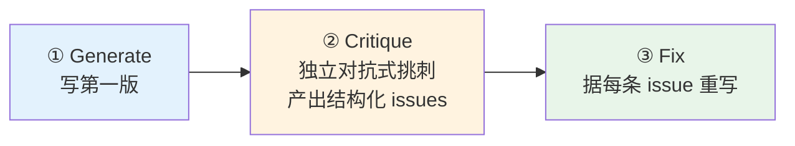
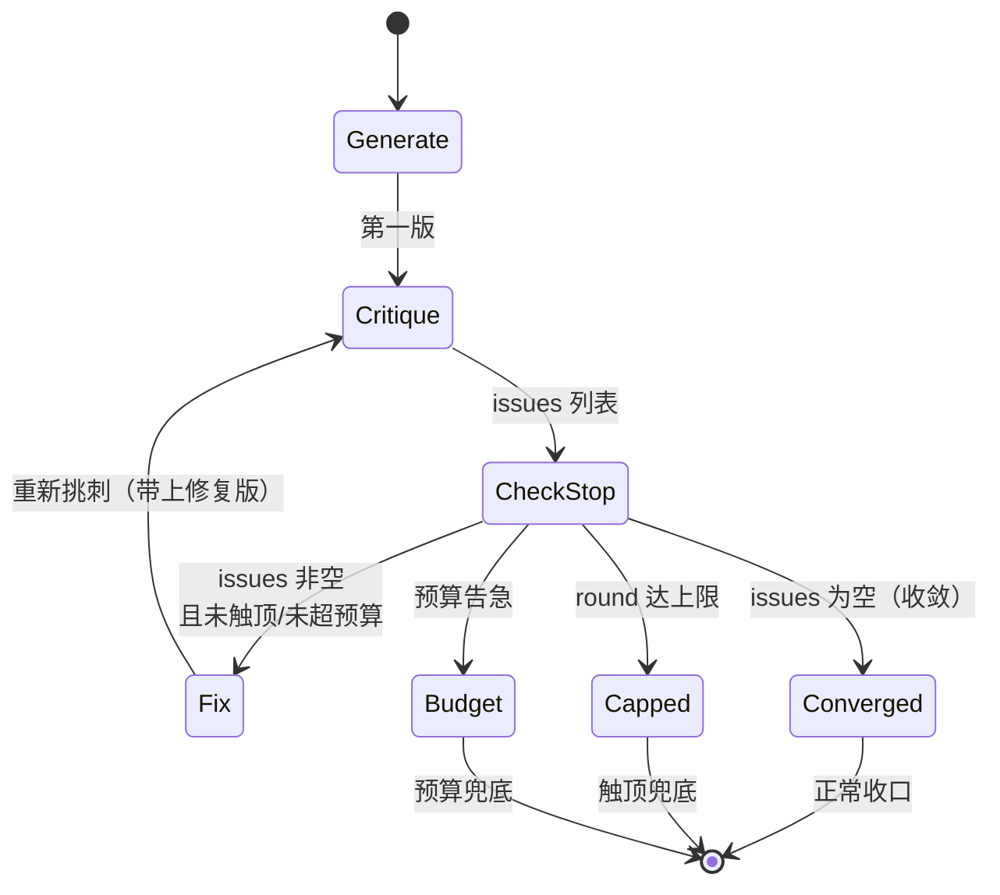
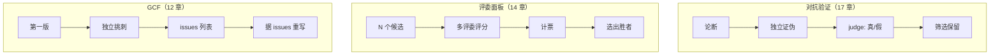

# 第 12 章 · 生成-批评-修复循环（GCF）

> 一句话：**第一版代码几乎总有盲区，但盲区往往看不见——除非换一个被明确要求「挑刺」的独立 agent 去找。「生成-批评-修复」（Generate → Critique → Fix）让三个 agent 接力：一个写、一个专门挑刺、一个据刺重写。本章用一次真实运行展示它如何把一个看似简单的函数从「能跑」逼到「健壮」。**
>
> 这是实战篇里一个看似朴素、却极有杠杆的配方。它和第 17 章「对抗验证」、第 14 章「评委面板」共享同一条母题——**生成与评估分离**——但落点不同：对抗验证**判真伪**、评委面板**选优**，而 GCF **据评修复**。三者的边界与组合，是本章的重点之一。

---

## 12.1 配方动机：为什么不能让 agent「自己检查自己」

先从一个所有人都试过、也几乎都失败过的做法说起。

你让一个 agent「写个 `slugify` 函数」，它写完了；你顺手追问「检查一下有没有 bug」。它扫一眼，回你一句「看起来没问题，已处理了空格、标点和大小写」。然后你上线，第二天就发现 emoji 把锚点搞乱了、全角数字直接被吞掉。

**问题的根子不在模型「不够聪明」，而在「自我评估」这个任务结构本身有缺陷。** 同一个 agent 刚刚生成了这段代码，它的上下文里全是「我为什么这么写」的论证；再让它审视自己，它的立场早已被锚定——它倾向于**为自己辩护**，而不是**质疑自己**。这是确认偏误（confirmation bias）的必然结果，和第 17 章对抗验证开篇讲的是同一个坑。

GCF 的核心洞察只有一句：**把批评交给一个全新的、独立的 agent，并明确要求它「挑刺」。**

- 它有**独立的上下文**：没有「这是我写的」的包袱，看到的只是一段待审的代码。
- 它有**对抗性的立场**：prompt 明确要求它当一个「找茬专家」，成功标准是「找出这段代码站不住脚的地方」。
- 它的产物是**结构化的**：用 schema 把批评钉成一个 `issues` 数组，而不是一段「看起来还行」的客套。

但 GCF 比对抗验证多走了关键的一步——**它不止于「找出问题」，而是把问题交给第三个 agent 去『逐条修复』。** 对抗验证的终点是一个判决（这是不是真 bug），GCF 的终点是一份**改好的产物**。这一步之差，决定了它们的适用场景完全不同（见 12.5）。

于是有了天然的三阶段顺序流水线：



阶段间是**严格的顺序依赖**：Fix 需要 Critique 的产物（`issues` 列表），Critique 需要 Generate 的产物（第一版代码）。这种「每个阶段消费上一阶段的输出」的形态，正是第 08 章 `pipeline` 的拿手场景；单个目标时也可以直接用 `await` 串起来（见 12.4）。

<div class="callout info">

**GCF 与「自我反思」（self-reflection）的区别。** 社区里流行的「reflexion」「self-refine」让**同一个模型**生成、反思、再改。GCF 的关键差异是**换 agent**——每个阶段是一次独立的 `agent()` 调用，拥有独立上下文。据 `_grounding.md`，工作流里的每个 `agent()` 都是一个独立 subagent，这让 GCF 能从架构上规避自我评估的确认偏误，而不是寄希望于「同一个模型这次能客观一点」。

</div>

---

## 12.2 完整脚本

下面是这次真实运行（12.3 节）所用脚本的完整可运行形态。它就是一个最小的三阶段 GCF：

```javascript
export const meta = {
  name: 'gcf-slugify',
  description: 'Generate-Critique-Fix loop producing a robust slugify (CJK + ASCII)',
  phases: [
    { title: 'Generate', detail: 'First draft' },
    { title: 'Critique', detail: 'Independent adversarial critique' },
    { title: 'Fix', detail: 'Rewrite addressing the critique' },
  ],
}

phase('Generate')
const gen = await agent(
  'Write a JavaScript function `slugify(text)` that converts a heading into a URL anchor id. ' +
  'Requirements: keep CJK characters; spaces->hyphens; strip punctuation; collapse consecutive ' +
  'hyphens; lowercase ASCII; no leading/trailing hyphen. Return only the function code.',
  { label: 'generate', schema: { type: 'object', properties: { code: { type: 'string' } }, required: ['code'] } }
)

phase('Critique')
const crit = await agent(
  `You are an adversarial code reviewer. Critique this slugify for correctness bugs and edge cases ` +
  `(empty string, all-punctuation, mixed CJK/ASCII, leading numbers, collisions, unicode). ` +
  `Be specific. Code:\n${gen.code}`,
  { label: 'critique', schema: { type: 'object', properties: { issues: { type: 'array', items: { type: 'string' } } }, required: ['issues'] } }
)

phase('Fix')
const fixed = await agent(
  `Rewrite slugify to fix every one of these issues: ${JSON.stringify(crit.issues)}. ` +
  `Original:\n${gen.code}\nReturn the final code and a one-line changelog.`,
  { label: 'fix', schema: { type: 'object', properties: { code: { type: 'string' }, changelog: { type: 'string' } }, required: ['code', 'changelog'] } }
)

log(`GCF: critique raised ${crit.issues.length} issues; fix applied`)
return { issuesFound: crit.issues, finalCode: fixed.code, changelog: fixed.changelog }
```

逐段解读这个脚本里**每个设计选择**的用意：

**`meta.phases` 三阶段。** 三个 `phase()` 对应进度树上的三个分组（第 05 章）。GCF 的阶段名天然就是 `Generate`/`Critique`/`Fix`，读者在 `/workflows` 实时进度里一眼就能看出「现在跑到哪一步」。

**Generate 用最小 schema。** 第一版只要 `{ code }`——不必结构化太多，因为它的产物马上要交给 Critique 去拆。schema 在这里的作用是**保证拿到的是纯代码字符串**，而不是「这是一个 slugify 函数，它……」这样夹叙夹议的散文（schema 的强制作用见第 07 章）。

**Critique 用 `issues: array` 而非自由文本。** 这是 GCF 的命脉。如果 Critique 返回一段散文，Fix 阶段就只能「凭感觉」去改；而 `issues` 是一个**字符串数组**，每条是一个独立、可逐条对账的缺陷。schema 逼 Critique 把「批评」拆成离散的、可枚举的条目——这直接决定了 Fix 能不能「逐条修」。

**Critique 的 prompt 显式列出了「该往哪些方向挑刺」。** `(empty string, all-punctuation, mixed CJK/ASCII, leading numbers, collisions, unicode)` 这一串不是凑数——它是给对抗者的「攻击清单」，引导它系统性地覆盖边界情形，而不是只挑一两个显眼的。这呼应第 17 章「对抗者 prompt 要赋予角色 + 引导举证」。

**Fix 把整个 `crit.issues` 传回去 + 要求 changelog。** `Rewrite slugify to fix every one of these issues: ${JSON.stringify(crit.issues)}` 把全部缺陷一次性喂给 Fix，并要求「fix every one」——这让修复**有的放矢**。额外要求一行 `changelog`，是让修复**可审计**：你能一眼看出它声称改了什么（呼应第 17 章「举证义务」）。

<div class="callout tip">

**为什么 Fix 要同时收到「原始代码」和「issues 列表」，而不只收 issues？** 因为 Fix 的任务是「在原版基础上修复」，不是「从零重写」。把 `gen.code` 一并传入，Fix 才能保留第一版里**正确的部分**，只动有问题的地方——这既省 token，也避免「修了 A、却把本来对的 B 改坏」的回归。

</div>

---

## 12.3 真实运行结果：一个 30 行函数被揪出 10 个缺陷

> **真实运行**：Run ID `wf_7472ceac-daa`，Task ID `wchxy8dbm`。原始记录见 `assets/transcripts/gcf-slugify.md`。
> 真实用量：`agent_count=3` ｜ `tool_uses=10` ｜ `total_tokens=96468` ｜ `duration_ms=180724`（约 3 分钟）。

这是一次 **dogfooding**——产物正好用来改进本书前端 `index.html` 的 heading-ID 生成。Generate 阶段产出了一个约三十行、「看起来很正经」的 `slugify`：它处理了空格、标点、连字符折叠、大小写，注释里还煞有介事地标了「保留 CJK 范围」。如果让它自我检查，它大概率会说「没问题」。

但 Critique 阶段——一个被明确要求「adversarial」的独立 agent——对它揪出了 **10 个真实缺陷**，按严重度排：

| 严重度 | 缺陷（真实，节选） |
|---|---|
| CRITICAL | 正则缺 `/u` flag，按 UTF-16 **code unit** 而非 code point 匹配；`豈-﫿` 实际是 U+8C48..U+FAFF，**覆盖了代理对区 0xD800–0xDFFF** → emoji/astral 字符全泄漏。实测 `slugify('I love 🍕 pizza') -> 'i-love-🍕-pizza'` |
| CRITICAL | CJK 范围写错/不全：注释声称全角范围 `＀-￯` 实则只含半角片假名 `ｦ-ﾟ` → `slugify('ＨＥＬＬＯ') -> ''`、`slugify('２０２４') -> ''` |
| HIGH | 未 NFKD 规范化 → 预组合 `café` 与分解 `café` 产生**不同** slug；`Straße -> strae`（丢 ß） |
| HIGH | 非 CJK/非拉丁脚本全被清空 → `slugify('Привет мир') -> ''`、阿拉伯语 → `''` |
| HIGH | 碰撞：`C++`/`C`/`C#` 全部 → `c-programming`（不同输入撞同一 slug） |
| MEDIUM×3 | 非字符串输入泄漏（`undefined -> 'undefined'`、`{} -> 'object-object'`、`[1,2,3] -> '123'`）；下划线不与连字符归一（`'foo _ bar' -> 'foo-_-bar'`）；零宽字符（U+200B/200D/FEFF）静默融合单词（`'a​b' -> 'ab'`） |
| LOW×2 | `toLowerCase()` 区域不敏感（土耳其 İ）；未处理「数字开头」（用作 HTML id 非法） |

修复版据此**系统性**改写：改用 **`/u` flag** + `\p{Script=Han}` 等 Unicode 脚本转义（彻底解决 code unit/code point 与范围写错两个 CRITICAL）+ **NFKC**（折叠全角→ASCII）+ **NFKD + 剥离 `\p{M}` 组合记号**（统一重音形态）+ 零宽/下划线统一折叠为 `-` + 非字符串输入返回 `fallback` + 可选 `transliterateSymbols`（`C++` → `c-plus-plus`，解决碰撞）。

<div class="callout tip">

**这正是 GCF 的价值，也是它和「自我检查」的分水岭。** 这 10 个缺陷里，没有一个是「语法错误」那种一眼能看出的低级问题——它们全是**需要主动构造边界输入才能暴露**的隐蔽缺陷（emoji、全角、组合字符、跨脚本、碰撞）。一个为自己产物辩护的 agent 不会去构造这些反例；而一个**被要求挑刺、且 prompt 给了攻击清单**的独立 agent，会系统性地把它们逼出来。本书前端 `index.html` 的 heading-ID 生成，正是吸取了这次运行的「去重 + `/u` + 空值兜底」教训。

</div>

### 从用量数字读懂 GCF 的成本结构

`agent_count=3` 精确对应脚本的三阶段——Generate / Critique / Fix 各一个 agent，无并发。这印证了第 08 章「token ≈ agent 数 × 每 agent 上下文」的经验法则：`96468 / 3 ≈ 32K/agent`，与本书其它单 agent 运行（hello `wf_dacbd480-d5d` 为 26,338）同量级，Critique 与 Fix 因为要带上「上一阶段的全文」入上下文而略高。

`duration_ms=180724`（约 3 分钟）则揭示了 GCF 的另一个特性：**三阶段严格串行，墙钟是三段之和**。这和并发模式（第 08 章 parallel 把 N 个压到「最慢的一个」）截然不同——GCF 没有并发可言，因为每一步都必须等上一步的产物。这是「质量换时间」的明确取舍：你用 3 倍于单次生成的时间，换来一份经过对抗审查、逐条修复的产物。

---

## 12.4 编排：单目标用 await，多目标用 pipeline

GCF 的三阶段可以用两种方式编排，取决于你要 GCF **一个**目标还是**多个**。

### 单目标：直接 await 串联

像 12.2 那样，三个 `agent()` 用 `await` 顺序串起来即可。控制流就是普通 JavaScript——`gen` → `crit` → `fixed`，每一步都拿着上一步的结果。这是单个 slugify 这种「一个目标」场景的最自然写法，也是真实运行 `wf_7472ceac-daa` 采用的形态。

### 多目标：pipeline 让每条 GCF 链独立流动

如果你要对**多个**目标（比如一次给五个工具函数都跑 GCF）同时施工，把它们塞进 `pipeline(targets, gen, crit, fix)`——每个目标独立地流过三阶段，**阶段间无屏障**（第 08 章）。

```javascript
// （示意，未实跑）—— 对多个目标并行跑 GCF
export const meta = {
  name: 'gcf-batch',
  description: 'Run Generate-Critique-Fix on multiple targets in parallel via pipeline',
  phases: [
    { title: 'Generate', detail: 'First draft per target' },
    { title: 'Critique', detail: 'Independent adversarial critique' },
    { title: 'Fix', detail: 'Rewrite addressing the critique' },
  ],
}

const CODE = { type: 'object', properties: { code: { type: 'string' } }, required: ['code'] }
const ISSUES = { type: 'object', properties: { issues: { type: 'array', items: { type: 'string' } } }, required: ['issues'] }
const FIXED = {
  type: 'object',
  properties: { code: { type: 'string' }, changelog: { type: 'string' } },
  required: ['code', 'changelog'],
}

const targets = args.targets // 例如 ['slugify', 'debounce', 'parseQuery', ...]

const results = await pipeline(
  targets,
  // 阶段一 Generate：每个目标产第一版
  (spec) =>
    agent(`Write a JavaScript function for: ${spec}. Return only the function code.`,
      { label: `gen:${spec}`, phase: 'Generate', schema: CODE }),
  // 阶段二 Critique：独立对抗式挑刺
  (gen, spec) =>
    agent(
      `You are an adversarial code reviewer. Critique this implementation of "${spec}" for ` +
      `correctness bugs and edge cases. Be specific.\nCode:\n${gen.code}`,
      { label: `crit:${spec}`, phase: 'Critique', schema: ISSUES }
    ).then((crit) => ({ spec, code: gen.code, issues: crit.issues })),
  // 阶段三 Fix：逐条修复
  (prev) =>
    agent(
      `Rewrite to fix every one of these issues: ${JSON.stringify(prev.issues)}. ` +
      `Original:\n${prev.code}\nReturn final code and a one-line changelog.`,
      { label: `fix:${prev.spec}`, phase: 'Fix', schema: FIXED }
    ).then((fixed) => ({ spec: prev.spec, issuesFound: prev.issues, ...fixed }))
)

return results.filter(Boolean)
```

这里有几处工程细节呼应了基础篇的硬约束：

- **每个 `agent()` 显式传 `phase`。** 在 pipeline 内部，不写 `phase('Generate')` 这种全局调用，而是给每个 `agent()` 传 `phase: 'Generate'`——否则多个目标的 agent 会**竞争全局 `phase()`**，进度树会乱（`_grounding.md` 明确建议）。
- **用 `.then()` 把上一阶段的产物「带下去」。** pipeline 的每个 stage 回调收到 `(prevResult, originalItem, index)`，但我们常常需要把「原始 spec + 上一阶段代码 + 本阶段产物」一起传给下一阶段。用 `.then()` 组装一个合并对象，是 pipeline 链里传递富上下文的标准手法（第 08 章、第 17 章都用过）。
- **`.filter(Boolean)` 不可省。** 某个目标在任一阶段抛错（或被用户跳过）会让该 item 变 `null`；收口前必须先滤掉（`_grounding.md`）。

<div class="callout warn">

**pipeline 的墙钟 ≈ 最慢的一条 GCF 链，不是「所有 Generate 之和 + 所有 Critique 之和 + 所有 Fix 之和」。** 这是 pipeline「阶段间无屏障」带来的关键优势（第 08 章）：当目标 A 还在 Fix 时，目标 B 可能已经在 Critique。但要注意并发上限是 `min(16, CPU 核心数 − 2)`（官方），超出的 agent 会**排队**——目标数远超核心数时，墙钟会被排队拉长。

</div>

---

## 12.5 何时停止迭代：收敛、预算、轮次的三重判据

12.2 的脚本只跑了**一轮** Critique→Fix。但 Fix 之后的产物，真的就「干净」了吗？也许 Fix 在修 10 个老问题时，又引入了 1 个新问题；也许有些缺陷第一轮没被 Critique 发现。于是自然的念头是：**把 Critique→Fix 放进循环，反复迭代，直到「再也挑不出问题」。**

这就引出 GCF 最需要工程纪律的部分——**何时停止**。一个只靠「Critique 说没问题了」就退出的循环是危险的：Critique 是概率性的，它可能总能「编」出一个看似存在的问题，让循环永不停止；每一轮又都在真实地烧 token 和墙钟。**停止判据必须多重设防**，这与第 18 章「循环到干」的刹车纪律同源：



三条停止判据各司其职：

**判据一 · 收敛（converged）——理想的退出。** 当某一轮 Critique 返回 `issues.length === 0`，说明对抗者已挑不出新问题，产物收敛了。这是最干净的退出。但**绝不能只靠它**——因为它可能永远不来。

**判据二 · 轮次上限（round cap）——最可靠的刹车。** `while (round < MAX_ROUNDS)`，无论 Critique 怎么说，到顶就停。这是最简单、最可靠的安全带。经验上，**3 轮**足以覆盖绝大多数情况：第一轮揪出主要缺陷（如本例 10 个），第二轮捕捉 Fix 引入的回归或漏网之鱼，第三轮通常就收敛了。

**判据三 · 预算兜底（budget guard）——最后防线。** 据 `_grounding.md`，`budget` 是**硬上限**——`spent()` 达 `total` 后再调 `agent()` 会抛错。更主动的做法是每轮开头检查 `budget.remaining()`，不够跑完整一轮就提前收口（第 21 章）。

下面是把单轮 GCF 升级为「多轮 GCF」的可运行骨架，三条判据全部就位：

```javascript
// （示意，未实跑）—— 多轮 GCF：收敛 / 轮次 / 预算 三重停止判据
export const meta = {
  name: 'gcf-iterative',
  description: 'Iterative Generate-Critique-Fix that loops until critique converges or caps',
  phases: [
    { title: 'Generate', detail: 'First draft' },
    { title: 'Refine', detail: 'Critique→Fix until clean or capped' },
  ],
}

const MAX_ROUNDS = 3                       // 判据二：轮次硬上限
const ROUND_COST = 60_000                  // 单轮（critique+fix 两个 agent）的粗略 token 估算

phase('Generate')
let current = (await agent(
  `Write a JavaScript function for: ${args.spec}. Return only the function code.`,
  { label: 'generate', schema: { type: 'object', properties: { code: { type: 'string' } }, required: ['code'] } }
)).code

phase('Refine')
let round = 0
const history = []                         // 记录每轮的 issues 数，用于审计收敛轨迹

while (round < MAX_ROUNDS) {
  // 判据三：预算不足以再跑一轮，提前收口
  if (budget.total !== null && budget.remaining() < ROUND_COST) {
    log(`预算告急（剩余 ${budget.remaining()}），在第 ${round} 轮后收口`)
    break
  }
  round++

  // Critique：独立对抗式挑刺（带上当前版本）
  const crit = await agent(
    `You are an adversarial code reviewer. Critique this implementation of "${args.spec}" ` +
    `for correctness bugs and edge cases. Be specific. List only genuine issues.\nCode:\n${current}`,
    {
      label: `critique:r${round}`, phase: 'Refine',
      schema: { type: 'object', properties: { issues: { type: 'array', items: { type: 'string' } } }, required: ['issues'] },
    }
  )
  history.push(crit.issues.length)

  // 判据一：收敛——挑不出问题就退出
  if (crit.issues.length === 0) {
    log(`第 ${round} 轮收敛：critique 无新问题`)
    break
  }

  // Fix：逐条修复（带上当前版本 + issues）
  const fixed = await agent(
    `Rewrite to fix every one of these issues: ${JSON.stringify(crit.issues)}. ` +
    `Original:\n${current}\nReturn the final code only.`,
    {
      label: `fix:r${round}`, phase: 'Refine',
      schema: { type: 'object', properties: { code: { type: 'string' } }, required: ['code'] },
    }
  )
  current = fixed.code   // 下一轮在修复版上继续挑刺
}

log(`GCF 迭代结束：${round} 轮，每轮 issues 数 = [${history.join(', ')}]`)
return { rounds: round, issuesPerRound: history, finalCode: current }
```

<div class="callout warn">

**永远不要写一个只靠 Critique 判决退出的无界循环。** `while (crit.issues.length > 0)` 而不带轮次上限，是 GCF 最危险的反模式——Critique 几乎总能「再挑出一条」，循环可能永不收敛，烧光预算。`_grounding.md` 给的全局兜底（单工作流 `agent()` 总数上限 **1000**）是最后的安全网，但你**绝不该**依赖它来终止业务循环。正确的纪律是：**轮次上限是主刹车、收敛是理想退出、budget 是最后防线——三者缺一不可。**

</div>

<div class="callout tip">

**收益递减也是一个有用的退出信号。** 如果你记录了 `issuesPerRound`（如上面的 `history`），会发现它通常快速衰减：`[10, 2, 0]` 是典型轨迹。如果出现 `[10, 8, 9]` 这种**不衰减**的情况，往往说明 Critique 在「换着花样挑同类问题」或 Fix 没真正修——这时与其继续烧轮次，不如停下来人工介入。把「连续两轮 issues 数不下降」也作为一个退出条件，能避免无效迭代（呼应第 18 章「收益递减检测」）。

</div>

---

## 12.6 设计要点

把前面的细节提炼成五条可迁移的纪律：

**① Critique 必须独立且对抗。** 在 prompt 里明确「You are an adversarial code reviewer」「Be specific」，并给出**攻击清单**（该往哪些边界方向挑刺）。它必须是一次**全新的 `agent()` 调用**——独立上下文，看不到「我刚写了这段代码」的包袱。这是 GCF 区别于「自我检查」的根本（与第 17 章同源）。

**② 批评必须结构化成可逐条对账的列表。** 用 `schema` 把批评钉成 `issues: array`，而非自由文本。结构化是「逐条修复」能落地的前提——散文式的批评只能换来散文式的重写。

**③ Fix 要「逐条」对账，并带上原版。** Fix 的 prompt 把 `crit.issues` 整个传进去，要求「fix every one of these issues」；同时传入原始代码，让 Fix 在原版上修而非从零重写（保留正确部分、避免回归）。要求一行 changelog 让修复可审计。

**④ 顺序依赖用 pipeline 或直接 await。** 单目标直接 `await` 串联；多目标用 `pipeline(targets, gen, crit, fix)`，每条链独立流动、阶段间无屏障。pipeline 内部务必给每个 `agent()` 显式传 `phase`，避免竞争全局进度组。

**⑤ 多轮迭代必须有界。** 收敛（issues 为空）是理想退出，但轮次上限（经验 3 轮）才是主刹车，budget 是最后防线。绝不写只靠 Critique 判决退出的无界循环。

---

## 12.7 与对抗验证、评委面板的区别与组合

GCF、对抗验证（第 17 章）、评委面板（第 14 章）共享同一条母题——**生成与评估分离**——初学者很容易混淆。它们的本质区别在于**「评估之后做什么」**：

| 配方 | 评估者职责 | 评估的产物 | 评估**之后**做什么 | 典型 Run |
|---|---|---|---|---|
| **对抗验证**（第 17 章） | 证伪一个论断 | `verdict`（confirmed/refuted/uncertain） | **筛选**：保留 confirmed、丢弃 refuted | `wf_bf086b98-6ec` |
| **评委面板**（第 14 章） | 在 N 个候选间评分 | 每个候选的分数 + 投票 | **选优**：计票选出胜者 | `wf_f5b69668-b18`（3:0） |
| **GCF**（本章） | 找出一个产物的全部缺陷 | `issues` 列表 | **修复**：据 issues 重写产物 | `wf_7472ceac-daa`（10 缺陷） |

一句话记忆：**对抗验证「判真伪」、评委面板「选优」、GCF「据评修复」。** 对抗验证的输出是一个布尔/枚举判决，评委面板的输出是「哪个候选赢」，而 GCF 的输出是**一份改好的产物**——只有 GCF 会「动手改」。



它们不是互斥的——**真正的生产级质量门往往把三者组合**起来。下面是几种高价值的组合：

<div class="callout info">

**组合 A · GCF + 评委把关（呼应 superpowers「两段式评审」）**：Fix 之后再加一个**独立**的验证 agent，对比「原始 issues」和「修复版」，逐条确认每个 issue 都真的被修了（而不是 Fix 嘴上说改了、实则没改）。这一步本质是对抗验证（第 17 章）——把「Fix 声称修好了」当作一个待证伪的论断。`_grounding.md` D 节记录的 superpowers 系统，其精华正是这种「生成→修复→独立验证修复是否到位」的两段式评审闭环。

**组合 B · 评委面板选优 → 对胜者跑 GCF（N 选优后再精修）**：Generate 阶段用 `parallel` 产出 N 个候选（不同视角/不同采样），先用**评委面板**（第 14 章）选出最佳的一个，再只对这个胜者跑 Critique→Fix。这样既享受了「多候选」的多样性，又把昂贵的 GCF 集中投到最有希望的那一个上。这正是第 14 章「变体 D」的落点。

**组合 C · 多轮 GCF + 收敛式完整性核对（呼应第 18 章）**：把 12.5 的多轮 GCF 当「找对 + 修对」，再在最后用第 18 章的「收敛式完整性核对」逐条核对一份已知需求清单（spec），确认所有需求都被满足。GCF 保证「写得对」、完整性核对保证「需求全」——两条正交的质量轴。

</div>

<div class="callout tip">

**为什么「验证 Fix 是否到位」要用独立 agent，而不是让 Fix 自己声明？** 因为这又回到了自我评估陷阱——Fix 刚改完，倾向于说「都修好了」。组合 A 的验证 agent 必须是**独立**的一次 `agent()` 调用，只接收「原始 issues + 修复后代码」，自己重新判断每条是否真的解决。这与第 17 章「对抗者只接收结论+原始证据、不接收原作者推理」的纪律完全一致。

</div>

---

## 12.8 变体速查

<div class="callout info">

**变体 A · 多轮 GCF（循环到收敛）**：见 12.5——把 Critique→Fix 放进 `while` 循环，收敛/轮次/预算三重停止。

**变体 B · 评委把关 Fix**：见组合 A——Fix 后加独立验证 agent 逐条确认修复到位。

**变体 C · N 选优后 GCF**：见组合 B——Generate 用 `parallel` 产 N 个候选，评委面板选优，再对胜者 GCF。

**变体 D · 分层 Critique**：Critique 阶段用 `parallel` 派多个不同视角的批评者（一个查正确性、一个查性能、一个查安全），合并它们的 issues 后再统一 Fix——把「一个批评者」升级为「批评面板」，覆盖更全（代价是 token 随批评者数线性增长）。

**变体 E · 带验证的修复闭环**：Generate → Critique → Fix → **Verify**（独立验证修复）→ 若仍有未修项则回到 Fix——这是组合 A 与多轮 GCF 的融合，适合「修对了才能交付」的高代价场景。

</div>

---

## 12.9 本章小结

- **GCF = Generate → 独立对抗式 Critique → 逐条 Fix**，三阶段顺序流水线。核心是**把批评交给一个被要求「挑刺」的独立 agent**，规避自我评估的确认偏误。
- 真实运行（`wf_7472ceac-daa`，3 agent / 96,468 token / 180,724ms）：一个看似正经的 30 行 `slugify` 被揪出 **10 个真实缺陷**（含 2 个 CRITICAL），修复版用 `/u` + Unicode 脚本 + NFKC/NFKD + 非字符串兜底系统性解决。这些缺陷全是需主动构造边界输入才能暴露的隐蔽问题——自我检查发现不了。
- 关键纪律：Critique 必须**独立 + 被要求挑刺 + 给攻击清单**；批评必须**结构化成可逐条对账的 issues 列表**；Fix 必须**逐条对账 + 带上原版 + 给 changelog**。
- 编排：单目标用 `await` 串联，多目标用 `pipeline` 让每条 GCF 链独立流动（务必显式传 `phase`、收口先 `.filter(Boolean)`）。
- 停止判据三重设防：**收敛**（issues 为空，理想退出）、**轮次上限**（经验 3 轮，主刹车）、**budget**（最后防线）；绝不写只靠 Critique 退出的无界循环。
- 与邻章的边界：**对抗验证判真伪、评委面板选优、GCF 据评修复**——只有 GCF「动手改」。三者可组合成生产级质量门（GCF + 评委把关、N 选优后 GCF、GCF + 完整性核对）。

下一章进入「深度研究」配方：多源并发检索 + 交叉验证，把一个开放问题查深查透。

> 继续阅读：[第 13 章 · 深度研究](#/zh/p3-13)
