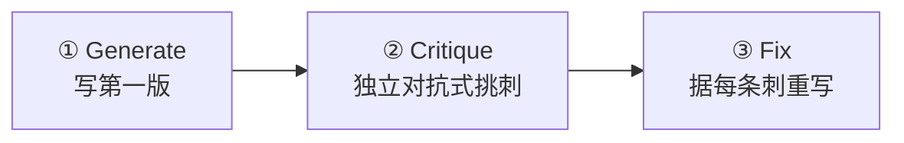

# 第 12 章 · 生成-批评-修复循环（GCF）

> 第一版代码几乎总有盲区。「生成-批评-修复」（Generate → Critique → Fix）让三个 agent 接力：一个写、一个**专门挑刺**、一个据刺重写。本章用一次**真实运行**展示它如何把一个看似简单的函数从「能跑」逼到「健壮」。

---

## 12.1 配方动机

让同一个 agent「写完再自己检查」，效果往往不好——它倾向于为自己的产物辩护。GCF 的关键是**把批评交给一个独立的 agent**，并明确要求它「挑刺」。三阶段顺序流水线：



这是一个天然的三阶段 `pipeline`（单 item 也适用），阶段间顺序依赖：Fix 需要 Critique 的产物，Critique 需要 Generate 的产物。

---

## 12.2 完整脚本

```javascript
export const meta = {
  name: 'gcf-slugify',
  description: 'Generate-Critique-Fix loop producing a robust slugify (CJK + ASCII)',
  phases: [
    { title: 'Generate', detail: 'First draft' },
    { title: 'Critique', detail: 'Independent adversarial critique' },
    { title: 'Fix', detail: 'Rewrite addressing the critique' },
  ],
}

phase('Generate')
const gen = await agent(
  'Write a JavaScript function `slugify(text)` that converts a heading into a URL anchor id. ' +
  'Requirements: keep CJK characters; spaces->hyphens; strip punctuation; collapse consecutive ' +
  'hyphens; lowercase ASCII; no leading/trailing hyphen. Return only the function code.',
  { label: 'generate', schema: { type: 'object', properties: { code: { type: 'string' } }, required: ['code'] } }
)

phase('Critique')
const crit = await agent(
  `You are an adversarial code reviewer. Critique this slugify for correctness bugs and edge cases ` +
  `(empty string, all-punctuation, mixed CJK/ASCII, leading numbers, collisions, unicode). ` +
  `Be specific. Code:\n${gen.code}`,
  { label: 'critique', schema: { type: 'object', properties: { issues: { type: 'array', items: { type: 'string' } } }, required: ['issues'] } }
)

phase('Fix')
const fixed = await agent(
  `Rewrite slugify to fix every one of these issues: ${JSON.stringify(crit.issues)}. ` +
  `Original:\n${gen.code}\nReturn the final code and a one-line changelog.`,
  { label: 'fix', schema: { type: 'object', properties: { code: { type: 'string' }, changelog: { type: 'string' } }, required: ['code', 'changelog'] } }
)

log(`GCF: critique raised ${crit.issues.length} issues; fix applied`)
return { issuesFound: crit.issues, finalCode: fixed.code, changelog: fixed.changelog }
```

---

## 12.3 真实运行结果

> **真实运行**：Run ID `wf_7472ceac-daa`，Task ID `wchxy8dbm`。原始记录见 `assets/transcripts/gcf-slugify.md`。
> 真实用量：`agent_count=3` ｜ `total_tokens=96468` ｜ `duration_ms=180724`（约 3 分钟）。

批评阶段对一个三十行的 `slugify` 揪出了 **10 个真实缺陷**，按严重度排：

| 严重度 | 缺陷（真实，节选） |
|---|---|
| CRITICAL | 正则缺 `/u` flag，按 UTF-16 **code unit** 而非 code point 匹配；`豈-﫿` 实际是 U+8C48..U+FAFF，**覆盖了代理对区** → emoji/astral 字符全泄漏。实测 `slugify('I love 🍕 pizza') -> 'i-love-🍕-pizza'` |
| CRITICAL | CJK 范围写错/不全：注释声称全角范围实则只含半角片假名 → `slugify('ＨＥＬＬＯ') -> ''`、`slugify('２０２４') -> ''` |
| HIGH | 未 NFKD 规范化 → 预组合 `café` 与分解 `café` 产生**不同** slug；`Straße -> strae`（丢 ß） |
| HIGH | 非 CJK/非拉丁脚本全被清空 → `slugify('Привет мир') -> ''` |
| HIGH | 碰撞：`C++`/`C`/`C#` 全部 → `c-programming` |
| MEDIUM×3 | 非字符串输入泄漏（`undefined -> 'undefined'`、`{} -> 'object-object'`）；下划线不归一；零宽字符静默融合单词 |
| LOW×2 | `toLowerCase()` 区域不敏感（土耳其 İ）；未处理「数字开头」 |

修复版据此改用 **`/u` flag** + `\p{Script=Han}` 等 Unicode 脚本转义 + **NFKC**（折叠全角→ASCII）+ **NFKD + 剥离 `\p{M}`** + 零宽/下划线统一折叠 + 非字符串兜底。

<div class="callout tip">

**这正是 GCF 的价值**：Generate 阶段的第一版几乎总有盲区（这里多达 10 个），而一个**被明确要求「挑刺」的独立 Critique agent**，能系统性地把它们逼出来。本书前端 `index.html` 的 heading-ID 生成，正是吸取了这次运行的「去重 + `/u` + 空值兜底」教训。

</div>

---

## 12.4 设计要点

**① Critique 必须独立且对抗。** 在 prompt 里明确「You are an adversarial code reviewer」「Be specific」，并用 schema 强制它产出**结构化的 issues 列表**（而非一段「看起来还行」的客套）。结构化让 Fix 阶段能逐条处理。

**② Fix 要「逐条」对账。** Fix 的 prompt 把 `crit.issues` 整个传进去，要求「fix every one of these issues」——这样修复有的放矢，而不是泛泛重写。

**③ 顺序依赖用 pipeline 或直接 await。** 三阶段严格顺序，本例用直接 `await` 串起（单 item）。若要对**多个**目标同时跑 GCF，就用 `pipeline(targets, gen, crit, fix)`，每个目标独立流过三阶段（见第 8 章）。

---

## 12.5 变体

<div class="callout info">

**变体 A · 多轮 GCF（循环到干净）**：把 Critique→Fix 放进 `while` 循环，直到 Critique 返回 `issues.length === 0` 或达到轮数上限。配合 `budget` 守卫（见第 21 章），避免无限循环。

**变体 B · 评委把关 Fix**：Fix 之后再加一个独立 agent，对比「原始 issues」与「修复版」，确认每条都真的修了（呼应第 23 章 superpowers 的「两段式评审」）。

**变体 C · N 选优**：Generate 阶段用 `parallel` 产出 N 个候选，先用评委面板（第 14 章）选最佳，再对胜出者跑 Critique→Fix。

</div>

---

## 12.6 本章小结

- GCF = Generate → 独立对抗式 Critique → 逐条 Fix，三阶段顺序。
- 真实运行：一个简单 `slugify` 被揪出 10 个缺陷（含 2 个 CRITICAL），修复版用 `/u`+Unicode 脚本+NFKC/NFKD 系统性解决。
- 关键：Critique 必须**独立**、**被要求挑刺**、产出**结构化 issues**；Fix 逐条对账。
- 变体：多轮循环到干净、评委把关、N 选优。

下一章进入「深度研究」配方：多源并发检索 + 交叉验证，把一个开放问题查深查透。

> 继续阅读：[第 13 章 · 深度研究](#/zh/p3-13)
