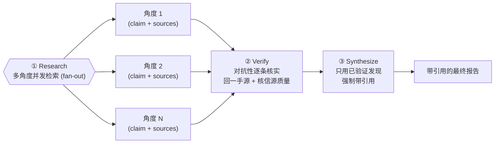
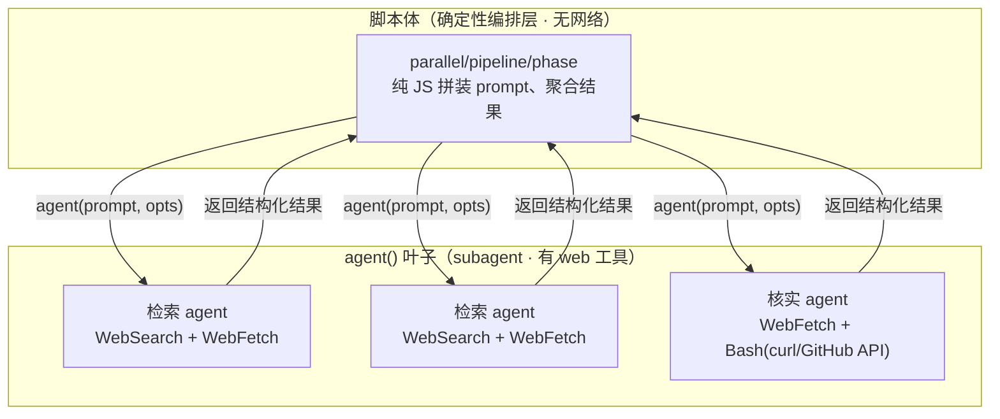
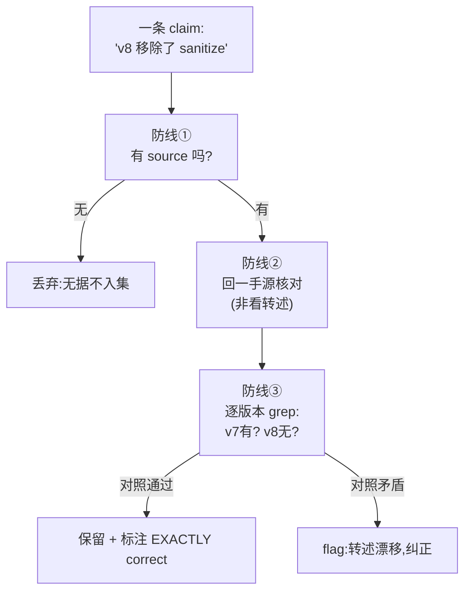

# 第 13 章 · 深度研究

> 单个 agent 回答「X 是什么」时，常常是「我印象里好像是……」——既不溯源，也不自查。深度研究配方把它升级成一支研究小队：**多角度并发检索（fan-out）→ 抓取一手来源 → 对抗性逐条核实每个 claim → 综合出带引用的报告**。本章用一次真实运行，展示它如何把一个技术问题查到「一手源、逐版本核实」的程度，以及——更关键的——它如何防住「看似可信、实则错」的结论。

---

## 13.1 配方动机：为什么「让 agent 查一下」靠不住

把一个问题直接丢给单个 agent「查一下」，几乎必然踩中这三个失败模式：

1. **单视角（blind spot）**：一个 agent 只从一个角度切入，覆盖面窄，盲区大。问「marked 安不安全」，它可能只看了 README，没看 changelog、没看 issue 区。
2. **不溯源（unsourced）**：给你一个结论却不给出处，你无法核实，只能选择「信」或「不信」。
3. **不自查（no self-check）**：最危险的一种——它把检索到的**二手转述**当真，不回到一手源。二手博客把「v8 移除了 sanitize」写成「v7 移除了」，agent 就照单全收。

这三者叠加，产出的是**「看似可信、实则错」的 claim**——带着自信的措辞、却经不起核对。这恰恰是 LLM 检索最危险的地方：它不是「不知道」，而是「言之凿凿地错」。

深度研究的四段式编排，逐一拆解这三个病：



<div class="callout info">

**它和「搜索引擎」「单次 web 检索」的本质区别**：搜索引擎给你一堆链接，要你自己判断；单次 web 检索给你一个 agent 的一次性印象。深度研究配方多了两层——**多角度 fan-out**（降低单视角盲区）和**对抗性核实**（降低「言之凿凿地错」）。它产出的不是「搜索结果」，而是**一份可被审计的、每条结论都挂着一手源的报告**。

</div>

---

## 13.2 一个反直觉的关键事实：脚本体内没有网络

在写脚本之前，必须先建立一个**容易被误解、但决定整个配方形态**的事实：

<div class="callout warn">

**Workflow 脚本体（你写的那段 JS）里没有 `fetch`、没有任何网络能力。** 真实实测（`wf_59bf3654-183`）：脚本沙箱内 `require` / `process` / `fetch` **全部是 `undefined`**。文件读写、shell、网络——这些「副作用」**只能发生在 `agent()` 叶子里**：subagent 才持有 Read / Write / Bash / WebSearch / WebFetch 等工具。

</div>

这意味着深度研究的真实形态是：



把这件事记牢，你就不会写出「在脚本里 `await fetch(url)`」这种跑不起来的代码。**编排层负责「派谁去查、查完怎么核、怎么聚合」；真正「上网」的动作，全部下沉到 subagent。** 脚本本身是**零网络、零模型开销**的——没有 `agent()` 调用的纯编排是 0 token / 4ms（`wf_59bf3654-183`、`wf_2b04881f-6a9`）。

<div class="callout info">

**为什么这是好事？** 正因为脚本体确定（无网络、无随机、无时钟），它才能**断点续传**：改一行 prompt 重跑，未改动的 `agent()` 全部命中缓存、0 token 秒回（详见第 22 章）。把网络这种不确定副作用关进 subagent，是 Workflow「确定性骨架 + 不确定叶子」设计的直接体现。

</div>

---

## 13.3 脚本结构

> 下面是这次研究的**脚本结构**——研究问题 `Q` 与检索角度 `angles` 已参数化为占位符（本次真实运行代入的具体问题、真实用量与产出见 13.4 与 `assets/transcripts/deep-research.md`）。注意：脚本里没有任何 `fetch`；所有「上网」都写在交给 `agent()` 的 prompt 里，由 subagent 用它的 web 工具完成。

```javascript
export const meta = {
  name: 'deep-research',
  description: 'Multi-angle web research with cross-verification then synthesis',
  phases: [{ title: 'Research' }, { title: 'Verify' }, { title: 'Synthesize' }],
}
const Q = '<你的研究问题>'

// ① Research：多角度并发检索（fan-out）。每个角度是一个独立子问题，
//    prompt 里明确要求 subagent「真实检索 + 返回一手 source URL」。
phase('Research')
log('Researching ' + Q + ' across multiple angles…')   // 网络检索慢，让等待可见
const angles = [
  '<子问题 A：要求带 source URL，优先一手源（官方 README / changelog / PR）>',
  '<子问题 B：要求带 source URL，覆盖与 A 不重叠的维度>',
]
const findings = await parallel(angles.map((a, i) => () =>
  agent(a, {
    label: `research:${i}`, phase: 'Research',
    schema: { type: 'object', properties: {
      claim: { type: 'string' },
      sources: { type: 'array', items: { type: 'string' } },
    }, required: ['claim', 'sources'] },
  })))

// ② Verify：对抗性核实。独立 agent，明确要求「回一手源逐条核对 + 核信源质量 +
//    flag 任何无据 claim」——而不是复述检索 agent 的话。
phase('Verify')
const valid = findings.filter(Boolean)            // 被用户跳过的 agent 返回 null
const verify = await agent(
  `Cross-verify these findings for internal consistency AND source quality. ` +
  `Go back to PRIMARY sources to check each claim. Flag any claim lacking a credible source, ` +
  `and flag any dead/unreachable citation. Findings: ${JSON.stringify(valid)}`,
  { label: 'cross-verify', phase: 'Verify',
    schema: { type: 'object', properties: {
      consistent: { type: 'boolean' },
      notes: { type: 'string' },
    }, required: ['consistent', 'notes'] } })

// ③ Synthesize：只用已验证发现，schema 把 sources 设为 required，逼它给出处。
phase('Synthesize')
const ans = await agent(
  `Synthesize a concrete final answer to "${Q}". Use ONLY these verified findings and cite sources ` +
  `inline per claim (no citation dump). Verified findings: ${JSON.stringify(valid)}`,
  { label: 'synthesize', phase: 'Synthesize',
    schema: { type: 'object', properties: {
      answer: { type: 'string' },
      sources: { type: 'array', items: { type: 'string' } },
    }, required: ['answer', 'sources'] } })

return { findings: valid, crossCheck: verify, answer: ans.answer, sources: ans.sources }
```

逐行对照三段式：

| 阶段 | API 用法 | 治哪个病 |
|---|---|---|
| Research | `parallel([…])` 把 N 个角度并发派出，屏障等齐 | 治**单视角**——多角度覆盖盲区 |
| Verify | 单个**独立** `agent()`，prompt 强制「回一手源核对」 | 治**不自查**——独立核实「言之凿凿地错」 |
| Synthesize | `agent()` + `schema.sources` 设 `required` | 治**不溯源**——schema 仅保证返回 `sources` 字段（字段存在）；每条 claim 与来源的对应、来源是否可信，仍靠 prompt + 对抗验证（Verify 阶段）逐条核实 |

<div class="callout tip">

**为什么 Research 用 `parallel` 而不是 `pipeline`？** 这里 N 个角度**互相独立**、且**需要全部到齐**才能交给 Verify 一起核——这正是 `parallel`（屏障：等全部完成）的语义。如果是「每个角度查完立刻进入各自的下一阶段」，才该用 `pipeline`（阶段间无屏障）。两者区别见第 8 章。

</div>

---

## 13.4 真实运行结果

为了能**验证它查得对不对**，我们特意选了一个有标准答案、可逐条核实的问题：

> 「零构建客户端 Markdown 站点如何防 XSS？marked v12 是否内置消毒？」

> **真实运行**：Run ID `wf_6090decc-8a5`，Task ID `wva3qtdps`。`agent_count=4`（2 检索 + 1 交叉验证 + 1 综合），`tool_uses=31`，`total_tokens=148975`，`duration_ms=298530`（约 5 分钟——含真实网络检索，比纯推理慢得多）。详见 `assets/transcripts/deep-research.md`。

检索 agent 进行了**真实网络检索**并溯源到一手资料，得出三条核心结论（均经一手源核实）：

- marked v12 **不消毒**（官方 README 原文：「Marked does not sanitize the output HTML... use a sanitize library, like DOMPurify (recommended)」）。
- `sanitize`/`sanitizer` 选项 v0.7.0（2019-07-06）**弃用**（PR #1504「Sanitize hardening」，因发现绕过），v8.0.0（2023-09-03）**移除**。
- 共识最佳实践：用 DOMPurify（cure53，allowlist 安全默认），且**必须 parse 之后再 sanitize**：`DOMPurify.sanitize(marked.parse(input))`——先消毒后 parse 会被两库解析差异绕过。

<div class="callout info">

**读数字**：4 个 agent、约 15 万 token，符合「token ≈ agent 数 × 每 agent 上下文（约 2.5–3 万）」的经验法则。但 `duration_ms=298530`（约 5 分钟）远高于同等 agent 数的纯推理任务（对比第 14 章评委面板 5 agent 仅 79 秒）——**这 5 分钟的差额几乎全花在 subagent 的真实 web 检索与抓取上**。这也是 13.6「设计要点④」强调 `log` 的原因：检索慢，得让等待可见。

</div>

---

## 13.5 惊艳之处：交叉验证 agent 回到一手源

最值得看的是 **Verify 阶段**。它没有复述检索 agent 的话，而是**用 GitHub API 逐版本拉取 `src/defaults.ts` 源码核对**——这是「真核实」与「假复述」的分水岭：

> "src/defaults.ts @ v7.0.0 — CONTAINS `sanitize: false`... @ v8.0.0 — NO sanitize/sanitizer keys (grep exit 1)... => 「present through v7.0.0, absent from v8.0.0 onward」is EXACTLY correct."

注意它做了什么：**它没有相信检索 agent 说的「v8 移除」，而是自己去 GitHub 把 v7.0.0 和 v8.0.0 两个版本的 `src/defaults.ts` 都拉下来 grep**，确认 v7 有 `sanitize: false`、v8 没有——用一手源**实证**了版本断点。这就是「逐版本核实」。

更进一步，它主动**揪出了信源缺陷**：

> "DEAD CITATION #1232: GitHub API returns HTTP 410 'This issue was deleted'... should be DROPPED. NOTE: harmless because the real PR is #1504, which IS cited and verified."

它发现检索结果里引用的 issue #1232 已被删除（HTTP 410），建议丢弃；同时确认真正承重的引用是 PR #1504，那个是活的、已验证。`crossCheck.consistent = true`，但 notes 里精确指出了这两处非承重的失效引用。

<div class="callout tip">

**这就是「交叉验证」与「再问一遍」的本质区别**：一个被要求「回一手源核对、核信源质量、flag 无据声明」的独立 agent，会回到一手源逐条验证，甚至发现引用里的失效链接。把它单列为一个阶段（而非塞进检索 prompt），是这个配方可信度的来源——检索 agent 的「言之凿凿」必须先过这一关，才能进入综合。

</div>

**额外收获**：这次研究的结论 `DOMPurify.sanitize(marked.parse(input))`，**正是**本书 `index.html` 在第 11 章 frontend-review 之后落地的 XSS 修复——一次独立的深度研究，反过来印证了那次修复的正确性。

---

## 13.6 如何防住「看似可信、实则错」的 claim

这是深度研究配方的**核心**，值得单独拆开讲。LLM 检索的头号风险不是「查不到」，而是「查到一个似是而非的二手转述，并自信地复述」。配方用三道防线把这种 claim 拦下来：

### 防线一 · 强制溯源（让错误「可被发现」）

Research 阶段的 schema 把 `sources` 设为必填。一条没有出处的 claim 根本进不了结果集——这把「凭印象瞎说」从源头堵住。**没有出处的结论，连被核实的资格都没有。**

### 防线二 · 独立核实 + 回一手源（让错误「被发现」）

Verify 是**独立的另一个 agent**，prompt 明确命令它：**回到 PRIMARY 源逐条核对**，而不是看检索 agent 的转述。这至关重要——

<div class="callout warn">

**二手源的「转述漂移」是错误的主要来源。** 一篇博客把「v8 移除」误写成「v7 移除」，检索 agent 若只读到这篇博客，就会把错误带进 claim。只有一个**回到 GitHub 源码逐版本 grep** 的核实者，才能戳破它。本次真实运行里，Verify agent 正是这么做的（13.5）——它不信任何转述，只信自己从一手源拉到的字节。

</div>

### 防线三 · 逐版本 / 逐来源交叉验证（让单点错误「不致命」）

对「随版本变化」的事实（如「哪个版本移除了某选项」），核实者要**逐版本拉取**对照（v7 有、v8 无）；对「多来源声称同一事实」的情况，要**交叉比对**多个独立来源是否一致。单个来源、单个版本的「看起来对」不算数——必须经得起逐点对照。



三道防线合起来，回答了开头那个问题——**怎么防「看似可信实则错」？答案是：让每条 claim 都必须挂出处（防线一）、被一个回一手源的独立 agent 核（防线二）、且经得起逐版本/逐来源的对照（防线三）。** 任何一条过不了，要么被丢弃、要么被 flag。

---

## 13.7 与第 15 章 Bug 猎手的共性：对抗证伪

读到这里你可能已经发现：深度研究的 Verify 阶段，和第 15 章 Bug 猎手的「对抗验证」，骨子里是**同一套思路**——**对抗证伪（adversarial falsification）**。

| 维度 | 深度研究（本章） | Bug 猎手（第 15 章） |
|---|---|---|
| 第一阶段产出 | 带 source 的 claim（可能含错误转述） | 疑似 bug（可能含假阳性） |
| 核心风险 | 「言之凿凿地错」的 claim | 「看起来像 bug」的假阳性 |
| 验证手段 | **独立** agent 回一手源逐条核 | **独立**「唱反调」agent 默认证伪 |
| 举证责任 | 压给「这条 claim 为真」一方 | 压给「这是真 bug」一方（refuted-by-default） |
| 意外收获 | 核实者纠正了检索的错误论证（dead citation） | 证伪者纠正了猎手的错误论证（`*` 不拼接字符串） |

两者共享的内核是同一句话：**让一个独立的、抱着怀疑态度的 agent，回到一手证据去较真，而不是附和。** 区别只在「证据」是什么——深度研究的证据是 web 上的一手源（README/changelog/源码），Bug 猎手的证据是目标文件本身。

<div class="callout info">

**为什么「独立」和「对抗」缺一不可？** 一个只会附和的「检查者」会把第一阶段的偏差原样放大；一个被明确要求「默认怀疑、回一手源、不确定就 flag」的对抗者，才会去戳破「言之凿凿的错」。这正是第 17 章「对抗验证」会系统展开的进阶模式——本章和第 15 章是它在「研究」与「找 bug」两个场景的具体落地。

</div>

---

## 13.8 设计要点

**① 检索角度要正交。** 把大问题拆成互不重叠的子问题，每个一个 agent 并发（`parallel`）。重叠的角度只是浪费 token，且不增加覆盖面。

**② Verify 必须独立成阶段，且明确要求「回一手源 + 核信源质量」。** prompt 要写死：回 PRIMARY 源逐条核对、核信源可信度、flag 无据声明、flag 失效链接。这是配方可信的关键，**绝不能**把它合进检索 prompt——检索 agent 核自己的活，等于没核。

**③ Synthesize 只用已验证发现 + 强制带 source。** schema 里把 `sources` 设为 `required`，逼综合 agent 给出处；prompt 里要求「逐条 inline 引用，别堆引用」（避免 citation dump）。

**④ 网络检索慢，要 `log`。** 本例约 5 分钟（`duration_ms=298530`），几乎全花在 subagent 真实抓取上。用 `log` 报告「N 个角度检索中…」让等待可见，否则用户会以为卡死。

**⑤ 别在脚本体里 `fetch`。** 重申 13.2 的铁律：脚本沙箱没有网络。所有「上网」都写进交给 `agent()` 的 prompt，由 subagent 完成。

---

## 13.9 变体

<div class="callout info">

**变体 A · 多源投票（降低单次检索偶然性）**：同一子问题派 3 个 agent 用不同搜索词检索，再交叉比对它们的 claim 是否一致——把第 14 章评委面板的「多评委计票」思路用在检索上。三个独立来源都指向同一结论，比单次检索可信得多。

**变体 B · 迭代深挖（呼应完整性批评）**：Verify 阶段若发现「某关键点证据不足」，回灌一个补充检索 agent。这正是第 18 章「完整性批评」的思路——让验证者指出「还缺什么」，缺的就是下一轮检索的目标。配合 `budget` 守卫防止无限深挖。

**变体 C · 分层综合（大型调研）**：先按子主题各自综合，再做一次总综合——适合跨多个维度的大型调研。这是 `pipeline`（各子主题独立流过「检索→子综合」）+ 末尾一个总 `agent()` 的组合。

</div>

下面给出**变体 B 的骨架**（结合预算守卫；脚本体仍无网络，检索动作在 agent prompt 内）：

```javascript
// （示意，未实跑）迭代深挖：Verify 发现缺口 → 回灌补充检索
let valid = (await researchAngles(angles)).filter(Boolean)
let round = 0
while (round < 2 && budget.total && budget.remaining() > 60_000) {
  const gap = await agent(
    `Review these findings. If a key point lacks sufficient evidence, name the SINGLE most ` +
    `important missing sub-question (as a search angle). Else return done=true. ${JSON.stringify(valid)}`,
    { label: `gap-check:${round}`, phase: 'Verify',
      schema: { type: 'object', properties: {
        done: { type: 'boolean' }, missingAngle: { type: 'string' },
      }, required: ['done'] } })
  if (gap.done || !gap.missingAngle) break
  log('Gap found, researching: ' + gap.missingAngle)
  const more = await researchAngles([gap.missingAngle])   // 回灌一个检索 agent
  valid = valid.concat(more.filter(Boolean))
  round++
}
```

---

## 13.10 本章小结

- 深度研究 = Research（多角度并发 fan-out 检索，带 source）→ Verify（独立 agent 回一手源逐条对抗核实、核信源质量）→ Synthesize（只用已验证发现，强制带引用）。
- **脚本体内没有 `fetch`/网络**（`require`/`process`/`fetch` 全 `undefined`，`wf_59bf3654-183`）；所有「上网」下沉到 `agent()` 叶子（subagent 才有 web 工具）。编排层只负责派活与聚合，本身 0 token。
- 真实运行（`wf_6090decc-8a5`，4 agent / 148,975 token / 298,530ms）：subagent 真实检索 + **逐版本拉 GitHub 源码核对**，得出 marked 无消毒、DOMPurify parse 后消毒的结论，并揪出失效引用 #1232。
- 防「看似可信实则错」三道防线：强制溯源（无据不入集）、独立核实回一手源（戳破转述漂移）、逐版本/逐来源交叉验证（单点错误不致命）。
- 与第 15 章 Bug 猎手共享内核：**对抗证伪**——让独立、怀疑的 agent 回一手证据较真，而非附和。

本章每一步都锚定了真实运行。深度研究与第 15 章的 Bug 猎手共用「对抗证伪」内核——这条主线会在第四部被抽象成通用模式。实战食谱篇还剩三章，下一章先看另一种「让多个独立判断汇聚成结论」的结构：评委面板。

> 继续阅读：[第 14 章 · 评委面板：A/B 评估](#/zh/p3-14)
