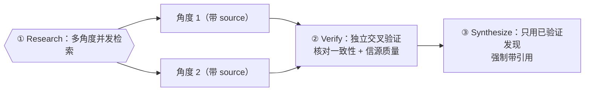

# 第 13 章 · 深度研究

> 单个 agent 回答「X 是什么」时，常常是「我印象里好像是……」——既不溯源，也不自查。深度研究配方把它升级成一支研究小队：**多角度并发检索 → 独立交叉验证 → 带引用综合**。本章用一次真实运行展示它如何把一个技术问题查到「一手源、逐版本核实」的程度。

---

## 13.1 配方动机

「让 agent 查点东西」的三个失败模式：

1. **单视角**：一个 agent 只从一个角度查，盲区大。
2. **不溯源**：给结论不给出处，无法核实。
3. **不自查**：把检索到的二手转述当真，不回到一手源。

深度研究的三段式分别治这三个：



---

## 13.2 脚本结构

> 下面是这次研究的**脚本结构**——研究问题 `Q` 与检索角度 `angles` 已参数化为占位符（本次真实运行代入的具体问题、真实用量与产出见 13.3 与 `assets/transcripts/deep-research.md`）。

```javascript
export const meta = {
  name: 'deep-research',
  description: 'Multi-angle web research with cross-verification then synthesis',
  phases: [{ title: 'Research' }, { title: 'Verify' }, { title: 'Synthesize' }],
}
const Q = '<你的研究问题>'

phase('Research')
const angles = [ '<子问题 A，要求带 source URL>', '<子问题 B，要求带 source URL>' ]
const findings = await parallel(angles.map((a, i) => () =>
  agent(a, { label: `research:${i}`, phase: 'Research',
    schema: { type:'object', properties:{ claim:{type:'string'}, sources:{type:'array',items:{type:'string'}} }, required:['claim','sources'] } })))

phase('Verify')
const valid = findings.filter(Boolean)
const verify = await agent(
  `Cross-verify these findings for internal consistency AND source quality. Flag any claim lacking a credible source. ${JSON.stringify(valid)}`,
  { label: 'cross-verify', phase: 'Verify',
    schema: { type:'object', properties:{ consistent:{type:'boolean'}, notes:{type:'string'} }, required:['consistent','notes'] } })

phase('Synthesize')
const ans = await agent(
  `Synthesize a concrete final answer to "${Q}". Use ONLY these verified findings and cite sources. ${JSON.stringify(valid)}`,
  { label: 'synthesize', phase: 'Synthesize',
    schema: { type:'object', properties:{ answer:{type:'string'}, sources:{type:'array',items:{type:'string'}} }, required:['answer','sources'] } })
return { findings: valid, crossCheck: verify, answer: ans.answer, sources: ans.sources }
```

---

## 13.3 真实运行结果

为了能**验证它查得对不对**，我们特意选了一个可核实的问题：

> 「零构建客户端 Markdown 站点如何防 XSS？marked v12 是否内置消毒？」

> **真实运行**：Run ID `wf_6090decc-8a5`，Task ID `wva3qtdps`。`agent_count=4`，`total_tokens=148975`，`duration_ms=298530`（约 5 分钟——含真实网络检索，比纯推理慢）。详见 `assets/transcripts/deep-research.md`。

检索 agent 进行了**真实网络检索**并溯源到一手资料，得出：

- marked v12 **不消毒**（官方 README 原文：「use a sanitize library, like DOMPurify (recommended)」）。
- `sanitize`/`sanitizer` 选项 v0.7.0（2019-07-06）**弃用**、v8.0.0（2023-09-03）**移除**。
- 共识：用 DOMPurify，且**必须 parse 之后再 sanitize**：`DOMPurify.sanitize(marked.parse(input))`。

---

## 13.4 惊艳之处：交叉验证 agent 回到一手源

最值得看的是 **Verify 阶段**。它没有复述检索 agent 的话，而是**用 GitHub API 逐版本拉取 `src/defaults.ts` 源码核对**：

> "src/defaults.ts @ v7.0.0 — CONTAINS `sanitize: false`... @ v8.0.0 — NO sanitize/sanitizer keys... => 「present through v7.0.0, absent from v8.0.0 onward」is EXACTLY correct."

并主动**揪出了信源缺陷**：

> "DEAD CITATION #1232: GitHub API returns HTTP 410 'This issue was deleted'... should be DROPPED. NOTE: harmless because the real PR is #1504, which IS cited and verified."

<div class="callout tip">

**这就是「交叉验证」与「再问一遍」的本质区别**：一个被要求「核对**信源质量**、flag 无据声明」的独立 agent，会回到一手源逐条验证，甚至发现引用里的失效链接。把它单列为一个阶段（而非塞进检索 prompt），是这个配方可信度的来源。

</div>

**额外收获**：这次研究的结论 `DOMPurify.sanitize(marked.parse(input))`，**正是**本书 `index.html` 在第 11 章 frontend-review 之后落地的 XSS 修复——一次独立的深度研究，反过来印证了那次修复的正确性。

---

## 13.5 设计要点

**① 检索角度要正交。** 把大问题拆成互不重叠的子问题，每个一个 agent 并发（`parallel`）。重叠的角度只是浪费 token。

**② Verify 必须独立成阶段，且核「信源质量」。** prompt 明确要求：核对一致性**与信源可信度**、flag 无据声明。这是配方可信的关键，别把它合进检索。

**③ Synthesize 只用已验证发现 + 强制带 source。** schema 里把 `sources` 设为 required，逼综合 agent 给出处。

**④ 网络检索慢，要 `log`。** 本例约 5 分钟。用 `log` 报告「N 个角度检索中…」让等待可见。

---

## 13.6 变体

<div class="callout info">

**变体 A · 多源投票**：同一子问题派 3 个 agent 用不同搜索词检索，交叉比对——降低单次检索的偶然性。

**变体 B · 迭代深挖**：Verify 阶段若发现「某关键点证据不足」，回灌一个补充检索 agent（呼应第 18 章「完整性批评」：让批评者指出「还缺什么」，缺的就是下一轮检索）。

**变体 C · 分层综合**：先按子主题各自综合，再做一次总综合——适合跨多个维度的大型调研。

</div>

---

## 13.7 本章小结

- 深度研究 = Research（多角度并发检索，带 source）→ Verify（独立交叉验证一致性 + 信源质量）→ Synthesize（只用已验证发现，强制带引用）。
- 真实运行：subagent 真实检索 + 逐版本核对一手源，得出 marked 无消毒、DOMPurify parse 后消毒的结论，并揪出失效引用。
- 关键：角度正交、Verify 独立成阶段且核信源、Synthesize 强制带 source、慢任务要 log。

**实战食谱篇（10–16）至此全部完结**，每一篇都锚定了真实运行。第四部转向让这些配方更可信的进阶模式。

> 继续阅读：[第 17 章 · 对抗验证](#/zh/p4-17)
