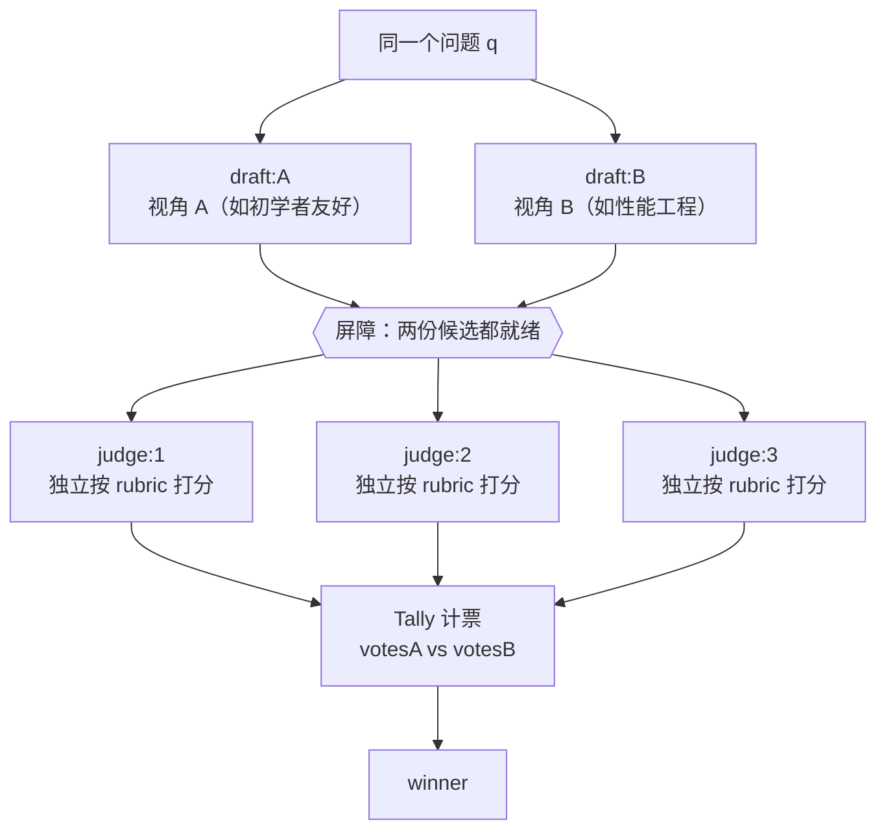

# 第 14 章 · 评委面板：A/B 评估

> 手上有两份（或 N 份）候选答案，怎么客观地挑出更好的那个？最糟的办法是丢给**一个** agent「看看哪个好」——单个裁判既有自己的偏好，又有盲区。本章把现实世界里的**评委面板**搬进 Workflow：**N 个候选 → 多名互相独立的评委按同一套 rubric 打分 → 计票聚合定胜负**。整个配方用一次真实运行串起来：两份候选答案，3 名独立评委，**3:0** 判出胜者——而且这几名评委还顺手做了一件意料之外、却极有价值的事。

---

## 14.1 配方动机

「让 LLM 当裁判」（LLM-as-judge）这事本身不新鲜，难的是**怎么当**才靠谱。单评委有三个硬伤：

- **偏好偏差**。单个 agent 对「啰嗦但全面」还是「简洁但浅」有自己的口味，它一次裁决里就混着这点偏好，你分不清到底是「B 真的更好」，还是「这个评委恰好喜欢 B 的风格」。
- **不稳定**。同一个评委、同一对候选，措辞稍微一变就可能翻盘——你根本不知道结果有多稳。
- **没法计票**。一个评委只给一个结论，你拿不到「多大比例认为 B 更好」这种**置信度**信息。

评委面板用**多个互不通信的独立评委**，把这三点一次性解决：



三个关键设计——本章剩下的内容都是围着它们展开：

1. **评委必须独立**：用 `parallel` 让每个评委**各打各的**，谁也看不见别人的结论（不然就会从众，退化成单评委）。
2. **打分要有 rubric**：用 `schema` 把评分维度（accuracy / clarity / completeness）**钉成数字**，逼着评委结构化地想，而不是甩一句「我觉得 B 好」。
3. **聚合靠计票，不靠单 agent 拍板**：最后谁赢是**计票**数出来的，不是再派一个 agent「来综合一下大家意见」——后者会把好不容易拉开的多评委独立性又收回到单点。

---

## 14.2 完整脚本

**（依据 transcript 骨架补全的示意脚本，未逐字实跑；本次真实运行的 Run ID 与用量见 14.3。）** 下面就是这次真实运行的脚本（结构跟 `assets/transcripts/judge-panel.md` 一致）。transcript 里 `answer` 和 `SCORE` 这两处 schema 都用 `{...}` 省略掉了，这里**补成能跑的样子**，并逐处标了「（示意补全）」；transcript 里真实有的部分（`meta`、`q`、`parallel` 起草、3 评委 `parallel` 打分、Tally 计票和 `return`）原样照搬。

```javascript
export const meta = {
  name: 'judge-panel',
  description: 'A/B evaluation: two candidates scored by 3 independent judges, then tallied',
  phases: [{ title: 'Draft' }, { title: 'Judge' }, { title: 'Tally' }],
}

const q = 'When should you use parallel() vs pipeline() in a Claude Code Workflow?'

// 候选答案的 schema（示意补全：transcript 中以 {...answer} 省略）
const ANSWER = {
  type: 'object',
  properties: { answer: { type: 'string' } },
  required: ['answer'],
}

phase('Draft')
// 两份候选并发产出，刻意用不同视角，制造真实的质量差异
const [a, b] = await parallel([
  () => agent(`${q} Write a thorough answer from a beginner-friendly angle.`,
    { label: 'draft:A', phase: 'Draft', schema: ANSWER }),
  () => agent(`${q} Write a thorough answer from a performance-engineering angle.`,
    { label: 'draft:B', phase: 'Draft', schema: ANSWER }),
])

phase('Judge')
// rubric 固化为 schema：三个评分维度 + 胜者枚举 + 理由（示意补全 SCORE）
const SCORE = {
  type: 'object',
  properties: {
    scoreA: {
      type: 'object',
      properties: {
        accuracy: { type: 'number' },
        clarity: { type: 'number' },
        completeness: { type: 'number' },
      },
      required: ['accuracy', 'clarity', 'completeness'],
    },
    scoreB: {
      type: 'object',
      properties: {
        accuracy: { type: 'number' },
        clarity: { type: 'number' },
        completeness: { type: 'number' },
      },
      required: ['accuracy', 'clarity', 'completeness'],
    },
    winner: { type: 'string', enum: ['A', 'B'] },
    reason: { type: 'string' },
  },
  required: ['scoreA', 'scoreB', 'winner', 'reason'],
}

// 3 名评委各自独立打分：parallel 屏障，互不可见对方的裁决
const judges = await parallel(
  [1, 2, 3].map((i) => () =>
    agent(
      `Independently score answers A and B on accuracy, clarity, completeness (0-10 each), ` +
        `then pick the better overall.\nA: ${a.answer}\nB: ${b.answer}`,
      { label: `judge:${i}`, phase: 'Judge', schema: SCORE }
    )
  )
)

phase('Tally')
// 计票聚合：数票，不让某个 agent「综合大家意见」
const valid = judges.filter(Boolean)
const votesA = valid.filter((j) => j.winner === 'A').length
const votesB = valid.filter((j) => j.winner === 'B').length
return {
  votesA,
  votesB,
  winner: votesA > votesB ? 'A' : 'B',
  judgeReasons: valid.map((j) => j.reason),
}
```

注意这个结构跟第 11 章 PR 多维 Review **长得像、骨子里不一样**：两者都用 `parallel` 屏障并发，但——

- 第 11 章：每个 agent 看**不同**的维度（分工），最后把它们的产出**综合**起来。
- 本章：每个评委看**同一对**候选（重复评判），最后把它们的投票**计票**。

**「分工后综合」交给 agent，「重复后计票」交给代码。** 这就是评委面板的灵魂——把聚合从「再叫一个 agent 拍板」降成一段**确定性的计票代码**，这样一来每个评委的独立性都保得住。

---

## 14.3 真实运行结果

> **真实运行**：Run ID `wf_f5b69668-b18`，Task ID `w7rykwriv`。原始记录见 `assets/transcripts/judge-panel.md`。
> 真实用量：`agent_count=5`（2 起草 + 3 评委）｜ `tool_uses=26` ｜ `total_tokens=201852` ｜ `duration_ms=79462`。

### 计票结果：3:0 判 B 胜

脚本真实返回的值：

```json
{
  "votesA": 0,
  "votesB": 3,
  "winner": "B",
  "judgeReasons": [ "...三段详尽理由..." ]
}
```

**3 名评委一致（3:0）判 B 胜**。理由收敛得很干净：B（性能工程视角）在 **completeness** 上压倒性领先——它带上了**真实测量数据**，也点到了「back-to-back parallel 屏障浪费」这个核心反模式（正好是第 08 章讲的）；A（初学者视角）在 **clarity** 上略占上风，但深度不够、定不了胜负。三个维度摆在一起，completeness 拉开的差距盖过了 clarity 那点小优势。

<div class="callout tip">

**注意 `agent_count=5` 怎么跟脚本结构对上。** 2 份草稿 + 3 名评委 = 5 个 agent，跟真实用量分毫不差（也印证了第 08 章那条经验法则「token ≈ agent 数 × 每 agent 上下文」：`201852 / 5 ≈ 40K/agent`）。`tool_uses=26` 偏高，下一节就揭晓原因——评委多干了一件事。

</div>

### 两个意料之外、却极有价值的观察

这次运行最有意思的地方不是「B 赢了」，而是评委**怎么**得出这个判断的：

<div class="callout info">

**观察 1 · 评委会主动求证。** 3 名评委在各自的理由里都写明了：它们**真的去读了 `docs/en/p2-08-parallel-vs-pipeline.md` 和 `assets/_grounding.md` 来交叉核对**，把候选答案里的数字一条条对过——`8.4s / 78844 token`、`26.7s / 158982 token`、`3×5.5≈16.5s` 基线、`min(16, cores−2)` 并发上限、`1000` agent 兜底。三名评委各自得出的结论都是「zero factual errors，每个数字精确吻合」。

这就解释了 `tool_uses=26` 为什么这么高：评委不是「凭印象打分」，而是**真的去翻了事实源**。**副作用**：这等于**顺手验证了本书 p2-08 章的全部真实数据都没错**——跑一次评委面板，白送一次事实核查。

**观察 2 · 独立评委会收敛。** 三名**互不通信**的评委，各自独立却得出了完全一致的结论（3:0）。这正好把评委面板的核心价值兑现了：候选「质量明显有别」时，多个独立视角会**稳稳地收敛**到一处；要是候选质量接近，你就会看到 2:1 甚至分裂的打分——这本身就是「这俩差不多」的信号。

</div>

这两个观察放一起说明了一件事：**结构化的 rubric（schema）会逼着评委认真求证，而不是说客套话。** 当 schema 要求它给 `accuracy` 打一个具体数字时，一个尽责的评委自然就会去核对事实——这就是 schema 约束带来的「副作用红利」。

---

## 14.4 设计要点

**① 评委独立是不可妥协的红线。** 用 `parallel` 让评委**并发跑，而且互相看不见**对方的裁决。一旦你写成「评委 2 看着评委 1 的打分再打」，面板就退化成「一个评委 + 几个附和者」，多视角降偏差的价值直接归零。

<div class="callout warn">

**反例**：不要这样串行喂结论——

```javascript
// ✗ 错：评委 2/3 看得到前面的裁决 → 从众，独立性丧失
let prev = null
for (const i of [1, 2, 3]) {
  prev = await agent(`Previous judge said: ${JSON.stringify(prev)}. Now you score...`, { schema: SCORE })
}
```

正确写法就是脚本里那句 `parallel([1,2,3].map(...))`——三个评委一起跑，谁也看不见谁。

</div>

**② rubric 必须用 schema 固化成数字。** 让评委给 `accuracy / clarity / completeness` 各打一个 `number`，比让它写一段「总体感觉」强太多了：数字能比较、能解释（你一眼看得出「B 赢在 completeness」）、还能加权（变体 B）。schema 在工具调用层就会校验（第 07 章），评委打得不合规就会被要求重打——这就把「打分」从一条软建议，变成了一种硬结构。

**③ 聚合用计票，绝不用「综合 agent」。** 最后的 `Tally` 阶段是**纯 JavaScript**——`filter` 加计票。**别**在这里塞一个 agent「综合三位评委的意见给出最终结论」：那等于把三个独立信号又压回成一个单点判断，前面辛辛苦苦保住的独立性全白费。**计票是确定性的、可复现的、零额外 token**——这正是 Workflow「确定性骨架」该干的活（呼应第 02 章）。

**④ 候选之间要拉开真实差异。** 本例刻意让 A 走「初学者视角」、B 走「性能工程视角」,这样才拉得出能被区分的质量差。要是两份候选几乎一个样，评委就只能在噪声里硬挑，结果没什么参考价值。候选可以来自**不同 prompt、不同模型、不同温度，或者同一 prompt 多采样几次**。

**⑤ 评委数取奇数。** 3、5、7……奇数个评委才不会平票。本例 3 名就够在「质量明显有别」时稳定收敛；要是候选势均力敌、或者赌注很高，加到 5 名能进一步压低单评委的噪声（代价是 token 线性增长，但墙钟仍受屏障约束、不会随评委数线性增长）。

---

## 14.5 变体

<div class="callout info">

**变体 A · N 候选锦标赛**：候选不止两份时，把 schema 的 `winner` 从 `enum:['A','B']` 扩成 `enum:['A','B','C',...]`，让评委直接挑最优；或者让每个评委把全部候选**排个序**（返回一个 ranking 数组），Tally 阶段用 Borda 计数这类排序聚合法定胜负。

**变体 B · 加权 rubric**：给不同维度配上权重（比如 `accuracy×3 + completeness×2 + clarity×1`），在 Tally 阶段把每个评委的 `scoreA/scoreB` 加权求和再比大小——这就把「投票」升级成了「加权计分」，适合各维度重要性不一样的场景。

**变体 C · 评委 + 一票否决**：给 schema 加一个 `disqualify: boolean` 字段（比如「含事实错误」「越权」）。Tally 时只要任一评委否决，就直接淘汰这份候选——把「打分」和「红线检查」拆开，呼应第 17 章对抗验证。

**变体 D · 接在 GCF / 生成之后（N 选优）**：这正好是第 12 章 GCF「变体 C」的落点——Generate 阶段用 `parallel` 产出 N 个候选，**用本章的评委面板挑出最佳那个**，再对胜者跑 Critique→Fix。评委面板就是任何「先发散、后收敛」流水线的那道**收敛闸**。

**变体 E · 嫁接式综合（不丢落选者的好点子）**：更强的收敛不止于「选出胜者」，而是**拿胜出候选当主干，把落选候选里独有的好点子嫁接进来**。落选≠全盘皆输——一个总分第二的候选，可能恰好在某个维度上更好（比如某个被胜者漏掉的边界条件、一句更精准的措辞）。做法是：计票选出胜者之后，**再加一个综合 agent**，喂给它「胜者全文 + 各份落选者，外加评委点出的各自亮点」，让它产出一份「以胜者为骨架、择优吸收落选者长处」的最终稿。

```javascript
// （示意，未实跑）—— 计票选出胜者后，嫁接式综合
const winnerDraft = votesA > votesB ? a.answer : b.answer
const final = await agent(
  // 以胜者为主干综合，并把落选候选里独有的好点子嫁接进来——别浪费落选者里的真知灼见
  `以下方为主干改写出最终答案：\n${winnerDraft}\n\n` +
    `从以下落选候选中，仅吸收其独有的、胜者缺失的优点（如遗漏的边界情形、更准的措辞）：\n${votesA > votesB ? b.answer : a.answer}`,
  { label: 'synthesize', phase: 'Tally', schema: ANSWER }
)
```

注意这个综合 agent **加在计票之后**，不是拿来替代计票——胜负仍由 14.4 节「③ 聚合用计票」那段确定性代码定出，综合只发生在「主干已定」之后，所以不会破坏评委独立性。它跟「让一个 agent 综合大家意见来拍板胜负」（那条红线）有本质区别：**前者用 agent 拼装文本，后者用 agent 拍板胜负。**

</div>

---

## 14.6 本章小结

- 评委面板 = **N 个候选 → 多名独立评委按同一 rubric 打分 → 计票聚合**，靠多视角压下单评委的偏好偏差和不稳定。
- 三条红线：评委**独立**（`parallel` 各打各的、互相看不见）、rubric **用 schema 固化成数字**、聚合**用计票代码**而不是「综合 agent」拍板。
- 跟第 11 章长得像、骨子里不同：PR 评审是「分工后综合（用 agent）」，评委面板是「重复后计票（用代码）」。
- 真实运行：`agent_count=5`、`total_tokens=201852`、`duration_ms=79462`；2 候选、3 评委、**3:0 判 B 胜**。
- 两个实证观察：评委**主动读 `docs/en/p2-08` 与 `_grounding.md` 交叉核对**（这就是 `tool_uses=26` 的来由，顺手验证了本书 p2-08 数据全对）；三名互不通信的评委**各自独立却收敛到一处**。
- 变体：N 候选锦标赛、加权 rubric、一票否决、接在生成/GCF 之后做 N 选优、**嫁接式综合**（拿胜者当主干、把落选者独有的好点子吸收进来，不浪费落选稿里的真知灼见）。

下一章进入「Bug 猎手」配方：自繁殖的 finder 池流入对抗验证，把一条分支里的潜在缺陷高精度地挖出来。

> 继续阅读：[第 15 章 · Bug 猎手](#/zh/p3-15)

> 📌 中文 README 主版本已移至根目录 [README.md](../../README.md)。

---

[← 返回主 README](../../README.md)
