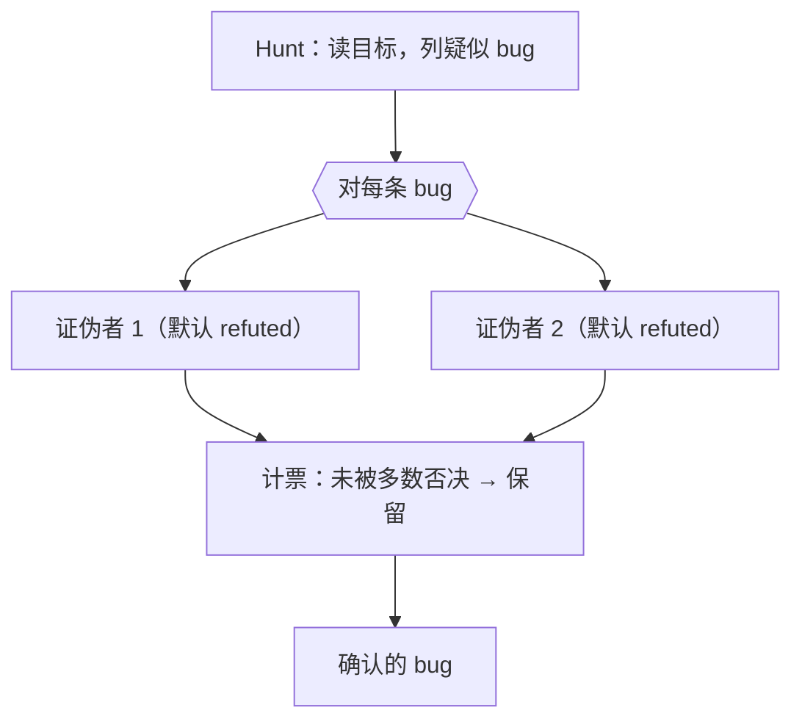

# 第 15 章 · Bug 猎手

> 让 agent「找 bug」不难，难的是**信**它找到的 bug。LLM 很会编出「看起来像 bug」的假阳性。本章的 Bug 猎手配方用**对抗验证**解决这个信任问题：先猎，再让独立的「唱反调」agent **默认证伪**——挺过证伪的才算数。
>
> 本章基于一次真实运行；它顺带演示了对抗验证最惊艳的一面：**验证者反过来纠正了猎手。**

---

## 15.1 配方动机

「找 bug」是典型的**未知规模发现任务**——你不知道有几个 bug。两个陷阱：

1. **假阳性**：模型倾向于「报告点什么」，于是编出似是而非的 bug。
2. **错误论证**：就算 bug 是真的，模型给的「为什么」也可能是错的。

对抗验证（第 17 章会单独深入）同时治这两个：对每条疑似 bug，派 N 个**独立**的、被明确要求「默认证伪」的验证者。举证责任被压给「这是真 bug」一方。



---

## 15.2 完整脚本

```javascript
export const meta = {
  name: 'bug-hunter',
  description: 'Hunt bugs in a target file, then adversarially verify each finding',
  phases: [{ title: 'Hunt' }, { title: 'Verify' }],
}
const FILE = '.../assets/samples/buggy-cart.js'

phase('Hunt')
const hunt = await agent(
  `Read the file ${FILE} and find genuine bugs. For each: function name, one-line bug, why it's wrong.`,
  { label: 'hunt', schema: { type: 'object', properties: {
    bugs: { type: 'array', items: { type: 'object',
      properties: { fn: { type: 'string' }, bug: { type: 'string' }, why: { type: 'string' } },
      required: ['fn','bug','why'] } } }, required: ['bugs'] } }
)

const verified = await pipeline(
  hunt.bugs,
  (b) => parallel([1,2].map(i => () =>
    agent(`You are a skeptic. Try to REFUTE this claimed bug in ${FILE}. Default to refuted=true if not certain. ` +
          `Claim — in \`${b.fn}\`: ${b.bug} (${b.why}). Read the file to check.`,
      { label: `refute:${b.fn}:${i}`, phase: 'Verify',
        schema: { type: 'object', properties: { refuted: { type: 'boolean' }, reason: { type: 'string' } }, required: ['refuted','reason'] } })
  )).then(votes => {
    const v = votes.filter(Boolean)
    const confirms = v.filter(x => !x.refuted).length
    return { ...b, confirmVotes: confirms, refuteVotes: v.length - confirms, confirmed: confirms >= 1 }
  })
)
const confirmed = verified.filter(Boolean).filter(b => b.confirmed)
return { hunted: hunt.bugs.length, confirmedCount: confirmed.length, confirmed }
```

注意结构：**Hunt 是单 agent**（产出疑似列表），**Verify 用 `pipeline`**——每条 bug 独立流过「2 个证伪者并发 + 计票」这一阶段。这是 `pipeline` 内套 `parallel` 的典型组合（第 8 章）。

---

## 15.3 真实运行结果

> **真实运行**：Run ID `wf_53da9a06-915`，Task ID `wsj4ypt3x`。原始记录见 `assets/transcripts/bug-hunter.md`。
> 真实用量：`agent_count=11`（1 猎手 + 5×2 证伪者）｜ `total_tokens=311134` ｜ `duration_ms=61660`。

目标文件埋了 5 个 bug，**全部找到、全部以 2:0 通过验证**：

| 函数 | bug | 票数 |
|---|---|---|
| `applyDiscount` | percent 无边界校验（>100 得负价） | 2:0 |
| `cartTotal` | off-by-one：`i < length-1` 跳过末项 | 2:0 |
| `checkout` | 缺 `await`，Promise 恒真，未付款就清空购物车 | 2:0 |
| `findItem` | `==` 而非 `===`，类型强制误配 | 2:0 |
| `mergeCarts` | 原地修改入参（别名 bug） | 2:0 |

---

## 15.4 惊艳之处：验证者纠正了猎手

`applyDiscount` 的证伪者在**确认 bug 真实**的同时，纠正了猎手（和种子注释）的一处错误论证。原文声称「percent 作字符串会拼接」，证伪者指出：

> "the source comment's 'percent as string concatenates' claim is false — `*` and `/` coerce strings to numbers, so `applyDiscount(100,'10')` correctly returns 90; concatenation would require `+`."

它说得对：`*`/`/` 会把字符串强制转成数字，只有 `+` 才拼接。

<div class="callout tip">

**这就是对抗验证不可替代的价值**：它不只过滤假阳性，还能**修正真阳性里的错误推理**。一个只会附和的「检查者」永远发现不了这一点；一个被要求「默认证伪、不确定就判 refuted」的验证者才会去较真——连埋在前提里的瑕疵都不放过。

</div>

---

## 15.5 设计要点

**① 验证者必须独立。** 用 `parallel` 让多个证伪者**各自**判断、互不可见——这样它们的错误不相关，多数表决才有意义。

**② 默认证伪（refute-by-default）。** prompt 里写死「Default to refuted=true if not certain」，把举证责任压给「这是真 bug」一方。宁可漏报，不可让假阳性蒙混过关。

**③ 用计票，不用单 agent 拍板。** 让一个 agent「综合判断真假」会把它自己的偏差带进来；多个独立证伪者 + 计票更稳。

**④ 阈值可调。** 本例 2 票、「未被多数否决即保留」（较宽松）。要更严：加到 3–5 票，并改成「需多数**确认**才保留」（见第 17 章）。

---

## 15.6 变体：循环到干（未知规模发现）

单轮猎手可能漏掉尾部的 bug。对「不知道有多少」的发现任务，用**循环到干**（第 18 章）：反复派新猎手，直到连续 K 轮没有**新增**确认 bug。配合 `budget` 守卫防止无限循环：

```javascript
// （示意，未实跑）循环到干的骨架
const found = []
let dryRounds = 0
while (dryRounds < 2 && budget.total && budget.remaining() > 80_000) {
  const round = await huntAndVerify()           // 一轮猎+验
  const fresh = round.filter(b => !seen(b))
  found.push(...fresh)
  dryRounds = fresh.length === 0 ? dryRounds + 1 : 0
  log(`本轮新增 ${fresh.length}，连续无新增 ${dryRounds} 轮`)
}
```

---

## 15.7 本章小结

- Bug 猎手 = Hunt（单 agent 列疑似）→ Verify（每条 bug 并发多个**默认证伪**的独立验证者 + 计票）。
- 真实运行：5 个种子 bug 全部找到并 2:0 确认；验证者还**纠正了猎手的错误论证**。
- 关键：验证者独立、默认证伪、计票而非拍板、阈值可调。
- 未知规模发现用「循环到干」+ `budget` 守卫。

下一章是本部最后一个配方：把分散在大量文件里的同类改动一次性扫完的「文档/迁移大扫除」。

> 继续阅读：[第 16 章 · 文档与迁移大扫除](#/zh/p3-16)
