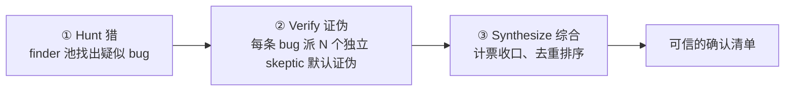
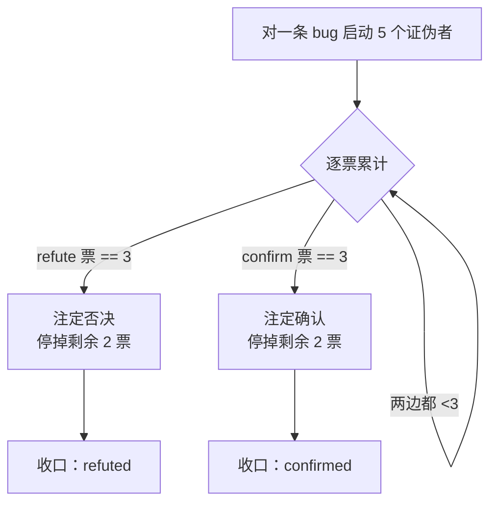
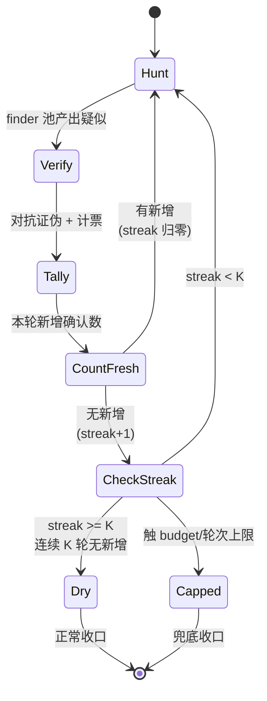

# 第 15 章 · Bug 猎手

> 让 agent「找 bug」不难，难的是**信**它找到的 bug。LLM 很会编出「看起来像 bug」的假阳性。本章的 Bug 猎手配方用**对抗验证**解决这个信任问题：先猎，再让独立的「唱反调」agent **默认证伪**——挺过证伪的才算数。
>
> 本章基于一次真实运行（Run `wf_53da9a06-915`，11 个 agent / 311,134 token / 61,660ms，5/5 确认）；它顺带演示了对抗验证最惊艳的一面：**验证者反过来纠正了猎手。** 在那之上，我们再把 Claude Code 自带的具名工作流 `bughunt` / `bughunt-lite` 的编排骨架拆开——**finder 池 → 对抗证伪 → 综合**，以及它怎么靠 **pigeonhole 提前退出** 和 **连续 K 轮 dry-streak** 既省钱又防漏。

---

## 15.1 配方动机：一个「未知规模 + 不可信」的双重难题

「找 bug」是典型的**未知规模发现任务**（unknown-scale discovery）——你不知道有几个 bug，所以不能写成「找出这 5 个」那种定额循环。它同时叠加了发现任务最难缠的两个陷阱：

1. **假阳性（false positive）**：模型有强烈的「报告点什么」的倾向。你说「找 bug」，它就算找不到也会编出几个似是而非的「bug」来交差——因为「交白卷」对它而言像是没完成任务。
2. **错误论证（wrong argumentation）**：就算 bug 是真的，模型给出的「为什么错」也可能是错的。它可能抓对了症状、却给了一个站不住脚的机理。

这两个陷阱合在一起，意味着**单靠一个猎手 agent 的输出，你既不知道它找全了没，也不知道它找对了没**。本章的配方就是用三段编排把这两个不确定性都按下去：



- **① Hunt（猎）**——治「找全」：用一个或一**池** finder agent 列出疑似 bug。规模未知时，让池子能自我复制、循环到干（15.5、15.7）。
- **② Verify（证伪）**——治「找对」：对**每一条**疑似 bug，派 N 个**独立**的、被明确要求「默认证伪」的验证者。举证责任被压给「这是真 bug」一方。这是第 17 章对抗验证的直接应用。
- **③ Synthesize（综合）**——收口：用**代码**计票、去重、排序，产出最终的确认清单。

<div class="callout info">

**为什么是「证伪」而不是「确认」？** 因为确认偏误（confirmation bias）是单向的：一个被问「这是不是 bug」的 agent 倾向于点头。而一个被命令「尽力**证伪**它、不确定就判 refuted」的 agent，必须主动去找反例。把默认值设成 refuted，就把举证责任从「证明它不是 bug」（防守方累）翻转成「证明它是 bug」（进攻方累）——**沉默与犹豫都倒向「不算数」**，假阳性自然被滤掉。这条原则贯穿第 17 章，本章是它在「猎 bug」上的落地。

</div>

---

## 15.2 完整脚本

下面是本章真实运行用的脚本——一个 finder（Hunt）+ 每条 bug 两个证伪者（Verify）的最小可信形态：

```javascript
export const meta = {
  name: 'bug-hunter',
  description: 'Hunt bugs in a target file, then adversarially verify each finding',
  phases: [{ title: 'Hunt' }, { title: 'Verify' }],
}
const FILE = '.../assets/samples/buggy-cart.js'

phase('Hunt')
const hunt = await agent(
  `Read the file ${FILE} and find genuine bugs. For each: function name, one-line bug, why it's wrong.`,
  { label: 'hunt', schema: { type: 'object', properties: {
    bugs: { type: 'array', items: { type: 'object',
      properties: { fn: { type: 'string' }, bug: { type: 'string' }, why: { type: 'string' } },
      required: ['fn','bug','why'] } } }, required: ['bugs'] } }
)

const verified = await pipeline(
  hunt.bugs,
  (b) => parallel([1,2].map(i => () =>
    agent(`You are a skeptic. Try to REFUTE this claimed bug in ${FILE}. Default to refuted=true if not certain. ` +
          `Claim — in \`${b.fn}\`: ${b.bug} (${b.why}). Read the file to check.`,
      { label: `refute:${b.fn}:${i}`, phase: 'Verify',
        schema: { type: 'object', properties: { refuted: { type: 'boolean' }, reason: { type: 'string' } }, required: ['refuted','reason'] } })
  )).then(votes => {
    const v = votes.filter(Boolean)
    const confirms = v.filter(x => !x.refuted).length
    return { ...b, confirmVotes: confirms, refuteVotes: v.length - confirms, confirmed: confirms >= 1 }
  })
)
const confirmed = verified.filter(Boolean).filter(b => b.confirmed)
return { hunted: hunt.bugs.length, confirmedCount: confirmed.length, confirmed }
```

注意结构：**Hunt 是单 agent**（产出疑似列表），**Verify 用 `pipeline`**——每条 bug 独立流过「2 个证伪者并发 + 计票」这一阶段。这是 `pipeline` 内套 `parallel` 的典型组合（第 8 章）：pipeline 阶段间无屏障，所以 bug A 还在被证伪时、bug B 可能已经进入综合；而每条 bug 内部的两个证伪者用 `parallel` 屏障等齐、好计票。

<div class="callout tip">

**这个最小形态足以建立直觉，但它有意省略了三件「生产级」的事**，本章后面逐一补上：①Hunt 只有一个 finder（规模一大就会漏）→ 15.5 的 finder 池；②每条 bug 跑满全部证伪者才计票（多数已否决也不早停）→ 15.6 的 pigeonhole；③单轮 Hunt（漏掉的尾部 bug 永远找不回）→ 15.7 的 loop-until-dry。先吃透最小形态，再加这三层。

</div>

---

## 15.3 真实运行结果

> **真实运行**：Run ID `wf_53da9a06-915`，Task ID `wsj4ypt3x`。原始记录见 `assets/transcripts/bug-hunter.md`。
> 真实用量：`agent_count=11`（1 猎手 + 5×2 证伪者）｜ `tool_uses=25` ｜ `total_tokens=311134` ｜ `duration_ms=61660`。

目标文件 `assets/samples/buggy-cart.js`（合成样本，故意埋了 5 个 bug）。猎手**全部找到、全部以 2:0 通过验证**：

| 函数 | bug | 票数 |
|---|---|---|
| `applyDiscount` | percent 无边界校验（>100 得负价、负 percent 反而抬价） | 2:0 |
| `cartTotal` | off-by-one：`i < items.length-1` 跳过末项 | 2:0 |
| `checkout` | 缺 `await`，`gateway.charge()` 返回 Promise 恒真，未付款就清空购物车 | 2:0 |
| `findItem` | `==` 而非 `===`，类型强制误配 | 2:0 |
| `mergeCarts` | 原地 `a.push()` 修改入参（别名 bug） | 2:0 |

11 个 agent 的账怎么算：`1 个 finder + 5 条 bug × 2 个证伪者 = 11`。token 约 31 万、墙钟约 62 秒——注意墙钟远小于「11 × 单 agent」，因为 5 条 bug 的证伪在 pipeline 里**重叠**进行，墙钟取决于关键路径而非总和（第 8 章）。

<div class="callout info">

**为什么用一个合成样本来做「猎手对象」？** 因为要验证「猎手到底准不准」，你得有**已知真值**——`buggy-cart.js` 里每个 bug 都带了种子注释，所以「找到 5/5」是可核对的硬指标，而不是「看起来找了不少」的模糊感觉。真实项目里没有这种标注，这也正是 ② Verify 存在的理由：用对抗证伪去**逼近**真值。

</div>

---

## 15.4 惊艳之处：验证者纠正了猎手

`applyDiscount` 的证伪者在**确认 bug 真实**的同时，纠正了猎手（和种子注释）的一处错误论证。种子注释和猎手都声称「percent 作字符串会拼接」，证伪者指出：

> "the source comment's 'percent as string concatenates' claim is false — `*` and `/` coerce strings to numbers, so `applyDiscount(100,'10')` correctly returns 90; concatenation would require `+`."

它说得对：`*`/`/` 会把字符串强制转成数字，只有 `+` 才拼接。所以 `applyDiscount(100,'10')` 实际返回 `90`（正确），bug 的真正机理是「无边界校验」（`percent>100` 得负价），而非「字符串拼接」。

<div class="callout tip">

**这正是对抗验证的过人之处**：它不只过滤假阳性，还能**修正真阳性里的错误推理**。一个只会附和的「检查者」永远发现不了这一点；一个被要求「默认证伪、不确定就判 refuted」的验证者才会去较真——连埋在前提里的瑕疵都不放过。换句话说，证伪者交回来的不只是一张「真/假」选票，还有**一份可审计的推理**，这份推理本身能纠正上游。这也是为什么 15.2 的证伪 schema 里 `reason` 是必填字段。

</div>

---

## 15.5 finder 池：固定 vs 自我复制

15.2 的最小形态只有**一个** finder。当目标从一个 40 行的合成文件，变成一整条分支的几十个文件时，单个 finder 会力不从心——它的注意力被摊薄，必然漏报。这时需要一个 **finder 池（finder pool）**：多个猎手并发扫描，把发现**汇流（stream）**进同一个证伪管道。

Claude Code 自带两个具名工作流 `bughunt` 与 `bughunt-lite`（**确已在本机环境注册**——见 `_grounding.md` A2，Run `wf_2b04881f-6a9` 实测：调用未知具名工作流时报错并列出已注册清单 `bughunt, bughunt-lite, deep-research, plan-hunter, review-branch`）。下表把它们的编排骨架拆成「固定池」与「自我复制池」两种形态：

| 工作流 | finder 池 | 验证 | 收口 |
|---|---|---|---|
| `bughunt-lite` | **固定**：3 个 rapid + 2 个 deep，跑完即止 | 5 票对抗证伪（pigeonhole 提前退出） | 综合 |
| `bughunt` | **自我复制**：3 个 rapid + deep 猎手持续派发，直到 **dry-streak** | 5 票对抗证伪（pigeonhole 提前退出） | 综合 |

<div class="callout warn">

**「池子结构」这一层不是 `_grounding.md` 里的官方/实测真值，请按推测读。** 上表的「3 rapid / 2 deep / 5 票 / pigeonhole / dry-streak」措辞来自这两个工作流在技能列表里的**一行注册简介**（`bughunt`：「Self-respawning finder pool (3 rapid + deep-until-dry-streak) streams into 5-vote adversarial verification with pigeonhole early-exit, then synthesis」；`bughunt-lite`：「fixed 3-rapid+2-deep finders stream into 5-vote adversarial verification (pigeonhole early-exit), then synthesis. Simpler than bughunt: no self-respawning, no dry-streak」）。按本书接地分级（`_grounding.md` A2），**唯一被实测确认的只是「这些具名工作流存在」这一层**；它们的**内部架构没有官方工具定义、也未经本书实测复现**。故本章据这段简介与通用模式给出的池子拆解与下文骨架代码，是**本书的推测性示例实现，并非官方架构**——拿它建立直觉，但别把数字与流程当成已验证事实。

</div>

两种池的区别只有一个轴：**finder 数量是否固定**。

- **固定池（fixed pool）**：派出去 `N` 个猎手就收 `N` 份发现，编排可预测、成本有上界。适合「目标规模大致已知」或「想要确定性预算」的场景。`bughunt-lite` 的「3 rapid + 2 deep」就是固定 5 个 finder。
- **自我复制池（self-respawning pool）**：finder 池会**不断补充新猎手**，直到满足停止条件（dry-streak，见 15.7）。适合「目标规模完全未知、宁可多花也不愿漏」的场景。代价是成本上界不确定——所以必须有 dry-streak + budget 双重刹车（第 18 章）。

两种池里都出现的「rapid + deep」是另一条正交的设计：

- **rapid finder**：快、浅、广撒网，负责把「一眼能看出」的可疑点先捞上来（可用 `model:'haiku'` 降成本）。
- **deep finder**：慢、深、抠细节，负责揪出 rapid 漏掉的、需要跨函数推理才能发现的隐蔽 bug。

「池流入管道」（finders **stream into** verification）这个词很关键：finder 不必全部跑完才开始证伪——这正是 `pipeline` 阶段间**无屏障**特性的用武之地（第 8 章）。一个 finder 刚交回发现，证伪管道就可以开始处理它，而其余 finder 还在跑。

下面是一个**固定池 + 汇流去重 + 流入证伪**的骨架（呼应 `bughunt-lite`）：

```javascript
// （示意，未实跑）—— 固定 finder 池：rapid 撒网 + deep 深挖，汇流去重后流入证伪
const BUG = { type: 'object', properties: {
  bugs: { type: 'array', items: { type: 'object',
    properties: { fn: { type: 'string' }, bug: { type: 'string' }, why: { type: 'string' } },
    required: ['fn','bug','why'] } } }, required: ['bugs'] }

phase('Hunt')
// 3 个 rapid（浅、用 haiku 降本）+ 2 个 deep（深、默认模型）并发撒网
const finders = await parallel([
  ...[0,1,2].map(i => () => agent(
    `RAPID pass #${i}: skim ${FILE} and surface obvious-looking bugs fast. ` +
    `Cover a different region than other passes (use index ${i} to vary focus).`,
    { label: `find:rapid:${i}`, phase: 'Hunt', model: 'haiku', schema: BUG })),
  ...[0,1].map(i => () => agent(
    `DEEP pass #${i}: read ${FILE} carefully, reason across functions, find subtle bugs ` +
    `(aliasing, async, coercion) that a quick skim would miss.`,
    { label: `find:deep:${i}`, phase: 'Hunt', schema: BUG })),
])

// 汇流：把池里所有 finder 的发现拍平、用 (fn+bug) 归一化去重（确定性，交给代码）
const pooled = finders.filter(Boolean).flatMap(f => f.bugs || [])
const seen = new Set()
const candidates = pooled.filter(b => {
  const key = (b.fn + '|' + b.bug).toLowerCase().replace(/\s+/g, ' ').trim()
  return seen.has(key) ? false : (seen.add(key), true)
})
log(`finder 池汇流 ${pooled.length} 条，去重后 ${candidates.length} 条进入证伪`)
// candidates 随后流入 15.6 的证伪管道
```

<div class="callout warn">

**finder 池一定要在「汇流去重」后再进证伪，且去重用代码而非 agent。** 多个 finder（尤其 rapid 与 deep）必然报出重复的 bug；若不先去重，同一个 bug 会被 N 组证伪者各验一遍，token 白白翻几倍。去重是**确定性操作**（同输入同输出），用 `Set` + 归一化键零成本完成——这与第 18 章「凡确定性操作交给代码、判断才交给 agent」一脉相承。让 agent 去「帮我去重」既贵又引入不确定性。

</div>

---

## 15.6 pigeonhole 提前退出：多数已否决就别再投了

15.2 的证伪是「每条 bug 跑满全部 N 个证伪者，再计票」。当 N 较大（`bughunt` 用 **5 票**）时，这有个明显的浪费：**如果一条 bug 已经被多数证伪者否决了，剩下的票投不投都改变不了结局**——结论已定。

这就是 **pigeonhole（鸽笼）提前退出**：把「多数」当成一个可以提前触达的阈值，一旦某一方的票数已经锁定胜负，就可以在**逻辑上**提前判决（不再等待剩余票的结果）。但要注意——据本章 15.6，**已发出的 agent 通常仍会跑完（其结果被忽略）**；要在**物理上**少发 agent，就得**分批投票**：先发到多数线的票数，平票或接近时才追加后续票。

用 5 票、「多数确认才保留」（≥3 confirm）举例，鸽笼原理给出两个提前退出点：

- **提前否决**：一旦累计到 **3 张 refute 票**，无论剩下 2 票怎么投，confirm 都不可能 ≥3 → 这条 bug 注定被否决 → 停掉剩余证伪者。
- **提前确认**：一旦累计到 **3 张 confirm 票**，多数已达成 → 这条 bug 注定保留 → 停掉剩余证伪者。



提前退出能省多少？在「5 票多数」下，最快第 3 票就能定局，省下 2 个证伪者——**接近 40% 的验证成本**，且越是「一边倒」的 bug（真 bug 全 confirm、假阳性全 refute）省得越多。

实现上，`parallel` 是**屏障**（等齐所有 thunk），天然不支持「中途叫停」。要实现 pigeonhole 提前退出，需要换成「可提前结算的竞速」结构——下面是一个**示意**骨架（用 `Promise` 竞速 + 计票闭包；注意这超出了 `parallel` 的标准用法，仅作思路演示）：

```javascript
// （示意，未实跑）—— pigeonhole 提前退出的思路骨架
// 注意：parallel 是屏障、不支持中途停；这里用 Promise 竞速演示「多数锁定即结算」的逻辑。
async function verifyWithPigeonhole(bug, voters = 5) {
  const majority = Math.floor(voters / 2) + 1   // 5 票 → 3
  let confirms = 0, refutes = 0, done = 0, settled = false
  let resolve
  const decided = new Promise(r => { resolve = r })

  for (let i = 0; i < voters; i++) {
    agent(
      `You are skeptic #${i}. Try to REFUTE this claimed bug in \`${bug.fn}\`: ${bug.bug}. ` +
      `Default refuted=true if not certain. Read the file to check.`,
      { label: `refute:${bug.fn}:${i}`, phase: 'Verify',
        schema: { type: 'object', properties: { refuted: { type: 'boolean' }, reason: { type: 'string' } }, required: ['refuted','reason'] } }
    ).then(v => {
      if (settled) return
      done++                       // 统计「已返回」的票（含被跳过返回 null 的）
      if (v) (v.refuted ? refutes++ : confirms++)   // 跳过/失败返回 null 的票不计入任一方
      // 鸽笼：任一方达到多数，胜负已定，立即结算
      if (confirms >= majority) { settled = true; resolve({ ...bug, confirmed: true,  confirmVotes: confirms, refuteVotes: refutes }) }
      else if (refutes >= majority) { settled = true; resolve({ ...bug, confirmed: false, confirmVotes: confirms, refuteVotes: refutes }) }
      // 兜底：所有投票者都已返回、仍无多数（被跳过的 null 太多）→ 结算为 uncertain，避免 promise 永不 resolve
      else if (done >= voters) { settled = true; resolve({ ...bug, confirmed: false, uncertain: true, confirmVotes: confirms, refuteVotes: refutes }) }
    })
  }
  return decided   // 多数锁定即返回；全部返回仍无多数则兜底为 uncertain。剩余票的结果被忽略（已在途的 agent 仍会跑完）
}
```

<div class="callout warn">

**「提前退出」省的是「等待与决策」，不一定省「已在途的 agent」。** 据 `_grounding.md`，`parallel` 一旦把 N 个 thunk 都启动，它们就在并发跑了；上面的竞速骨架能让你**在多数锁定时立刻拿到结论、不阻塞**，但已经发出的 agent 调用通常会跑完（其结果被忽略）。真正要在「物理上少发 agent」，得**分批投票**：先发 3 票（多数线），只有平票或接近时才追加第 4、5 票。这就把 pigeonhole 从「逻辑早停」升级为「物理省钱」。无论哪种，核心都是：**别为一个已成定局的判决付满额成本。**

</div>

---

## 15.7 loop-until-dry 与「连续 K 轮无新发现」：防漏尾

单轮 Hunt（哪怕用了 finder 池）仍可能漏掉尾部的 bug——尤其是那些需要前几轮发现作为「线索」才能联想到的隐蔽问题。对「不知道有多少」的发现任务，终极武器是**循环到干（loop-until-dry）**（第 18 章）：反复派新猎手，直到**连续 K 轮都没有新增**确认 bug 才停。

这里的关键是**停止条件**。有两种写法，差别很大：

- **天真写法**：「这一轮没找到新 bug 就停」（K=1）。问题是发现任务常有「空轮」——某一轮恰好没捞到新东西，但下一轮换个角度又能挖出来。K=1 会**过早收手**，漏掉尾部。
- **dry-streak 写法**：「**连续 K 轮**（如 K=2 或 3）都没有新增才停」。这给了猎手「再试几次」的机会，显著降低漏尾概率。这正是 `bughunt` 注册描述里 **deep-until-dry-streak** 的含义——deep 猎手持续派发，直到连续若干轮榨不出新东西。



下面把 finder 池 + 对抗证伪 + dry-streak 拧成一个完整的循环骨架：

```javascript
// （示意，未实跑）—— loop-until-dry：连续 K 轮无新增确认 bug 才停
const K = 2                 // dry-streak 阈值：连续 2 轮无新增才判干
const MAX_ROUNDS = 5        // 硬上限（防失控，第 18 章）
const confirmed = []        // 累积已确认的 bug
const seen = new Set()      // 跨轮去重键
let dryStreak = 0, round = 0

phase('Hunt')
while (dryStreak < K && round < MAX_ROUNDS) {
  // budget 兜底：单轮约数万 token，不够就提前收口（budget 是硬上限，第 9 章）
  if (budget.total !== null && budget.remaining() < 80_000) {
    log(`预算告急（剩余 ${budget.remaining()}），提前收口`); break
  }
  round++

  // 1) Hunt：finder 池（这里简化为 1 个，生产用 15.5 的池），告知「已确认的、勿重复」
  const known = confirmed.map(b => `- ${b.fn}: ${b.bug}`).join('\n') || '（暂无）'
  const hunt = await agent(
    `Read ${FILE} and find genuine bugs NOT already listed below.\n已确认（勿重复）：\n${known}`,
    { label: `hunt:round-${round}`, phase: 'Hunt', schema: BUG })

  // 2) 去重 + 对抗证伪（复用 15.2 / 15.6 的证伪管道）
  const fresh = (hunt.bugs || []).filter(b => {
    const key = (b.fn + '|' + b.bug).toLowerCase().replace(/\s+/g, ' ').trim()
    return seen.has(key) ? false : (seen.add(key), true)
  })
  const verified = await pipeline(fresh, b => verifyWithPigeonhole(b))   // 见 15.6
  const newlyConfirmed = verified.filter(Boolean).filter(b => b.confirmed)

  // 3) dry-streak 计数：本轮无新增确认 → streak+1；有新增 → 归零
  if (newlyConfirmed.length === 0) {
    dryStreak++
    log(`第 ${round} 轮无新增确认，连续无新增 ${dryStreak}/${K} 轮`)
  } else {
    dryStreak = 0
    confirmed.push(...newlyConfirmed)
    log(`第 ${round} 轮新增确认 ${newlyConfirmed.length} 条`)
  }
}
return { rounds: round, confirmedCount: confirmed.length, confirmed }
```

三个角色分工要看清：**finder 池**负责「找」（每轮注入「已确认清单」、要求只给新增）；**对抗证伪管道**负责「筛」（每条新疑似仍要过证伪）；**`while` + `dryStreak` 计数器**负责「何时停」——这是真正的 JavaScript 控制流，模型只做判断、代码做编排。

<div class="callout warn">

**dry-streak 防漏尾，但绝不能去掉硬上限。** `while` 条件里的 `round < MAX_ROUNDS` 和 `budget.remaining()` 检查是**安全带**，不是装饰。一个总能「编」出新疑似的猎手会让 dry-streak 永远清零、循环永不退出；据 `_grounding.md`，`budget` 是硬上限（达 `total` 后再调 `agent()` 抛错）、单工作流生命周期 agent 总数上限 1000 是最后的全局安全网——但你**绝不该**依赖它们来终止业务循环。正确的纪律：**dry-streak 决定「正常何时停」，轮次上限 + budget 决定「最坏何时强停」，三者缺一不可**（详见第 18 章 §18.3）。

</div>

---

## 15.8 设计要点

**① 验证者必须独立。** 用 `parallel`（或竞速）让多个证伪者**各自**判断、互不可见——这样它们的错误不相关，多数表决才有意义。一旦让它们看到彼此的票，就退化成「随大流」，投票失去价值。

**② 默认证伪（refute-by-default）。** prompt 里写死「Default to refuted=true if not certain」，把举证责任压给「这是真 bug」一方。宁可漏报，不可让假阳性蒙混过关。

**③ 用计票，不用单 agent 拍板。** 让一个 agent「综合判断真假」会把它自己的偏差带进来；多个独立证伪者 + 计票更稳。计票、去重、过滤都是**确定性操作**，交给 JS 代码（`filter`/`Set`/`reduce`），别交给 agent。

**④ 阈值可调，且决定成本。** 本章真实运行用 2 票、「未被多数否决即保留」（`confirms >= 1`，较宽松，适合「宁可多报也别漏」）；`bughunt` 用 5 票多数。要更严：加到 3–5 票，并改成「需多数**确认**才保留」（见第 17 章 §17.6）。票数越多越可信、也越贵，用**判错代价**来定票数。

**⑤ finder 池规模匹配目标规模。** 小目标（单文件）一个 finder 够了；整条分支用固定池（`bughunt-lite`，5 个 finder）；规模完全未知、漏报代价高，才上自我复制池 + dry-streak（`bughunt`）。

| 决策维度 | 宽松（省） | 严格（稳） |
|---|---|---|
| finder 池 | 单 finder / 固定小池 | 自我复制池 + dry-streak |
| 证伪票数 | 2 票 | 5 票 |
| 保留判据 | `confirms >= 1`（未被多数否决） | 多数确认（≥3/5） |
| 提前退出 | 跑满再计票 | pigeonhole 提前退出 |
| 循环 | 单轮 | loop-until-dry（K≥2） |

---

## 15.9 与「代码审查」「对抗验证」的边界

Bug 猎手很容易和第 10/11 章的 review、第 17 章的对抗验证混淆。它们共享底层 primitive（`agent`/`pipeline`/`parallel`/`schema`），但**目标轴**不同，搞清楚边界才能选对配方：

| | 偏向 | 切分方式 | 核心问题 | 真实运行 |
|---|---|---|---|---|
| **第 10 章** 分片审查 | **覆盖**（不漏文件） | 按**文件/模块**分片 | 「每一片都审到了吗」 | frontend-review `wf_4c5caabb-b73` |
| **第 11 章** 多维 Review | **覆盖**（不漏维度） | 按**维度**切（a11y/性能/正确性…） | 「每个维度都查到了吗」 | `wf_4c5caabb-b73`（26→16） |
| **第 17 章** 对抗验证 | **真伪**（母题） | 生成 ↔ 验证分离 | 「这个论断是真的吗」 | pipeline-demo `wf_bf086b98-6ec` |
| **第 15 章** Bug 猎手（本章） | **发现 + 证伪** | finder 池 → 证伪 → 综合 | 「有哪些真 bug，且我能信」 | `wf_53da9a06-915`（5/5） |

一句话区分：

- **Review（10/11）偏「分维度覆盖」**——它假设目标边界已知（这些文件、这些维度），任务是把每一块都审到、别漏。它的难点在**切分**与**综合去重**，对抗验证只是其 Verify 一步（第 10 章骨架里的一环）。
- **对抗验证（17）是「真伪判定」的母题**——它不关心「找全」，只关心「把一个已生成的论断证伪/证实」。它是一种**可复用的子结构**，被 Bug 猎手、评委面板（第 14 章）、分片审查（第 10 章）共同复用。
- **Bug 猎手（15）偏「发现 + 证伪」**——它的目标规模**未知**（不知道有几个 bug），所以重头戏是 ① 怎么**找全**（finder 池、loop-until-dry、dry-streak）和 ② 怎么**信得过**（对抗证伪、pigeonhole）。它 = 「未知规模发现」+「对抗验证」的合体。

<div class="callout tip">

**怎么选？** 看你的「不确定性」主要在哪一边：
- 不确定「**审没审到**」（边界已知、怕漏块）→ 用 **review**（第 10/11 章）。
- 不确定「**是不是真的**」（已有一个论断、怕假阳性）→ 用 **对抗验证**（第 17 章）。
- 不确定「**有几个、且哪些是真的**」（规模未知 + 怕假阳性）→ 用 **Bug 猎手**（本章）——它把两种不确定性一次性按下去。

</div>

---

## 15.10 本章小结

- Bug 猎手 = **Hunt（finder 池找疑似）→ Verify（每条 bug 派 N 个独立、默认证伪的验证者 + 计票）→ Synthesize（代码去重排序收口）**。它专治「未知规模 + 不可信」的双重难题。
- 真实运行 `wf_53da9a06-915`（11 agent / 311,134 token / 61,660ms）：5 个种子 bug 全部找到并 2:0 确认；验证者还**纠正了猎手的错误论证**（字符串拼接那条）。
- **finder 池**有两形态：固定池（`bughunt-lite`：3 rapid + 2 deep）与自我复制池（`bughunt`：deep-until-dry-streak）；rapid 撒网、deep 深挖；finder **流入**证伪管道（pipeline 无屏障）。
- **pigeonhole 提前退出**：多数票已锁定胜负就别再投——逻辑早停（竞速结算）省「等待」，分批投票省「物理 agent」。
- **loop-until-dry + dry-streak**：用「连续 K 轮（K≥2）无新增」而非「一轮没找到就停」来防漏尾；硬上限 + budget 是不可去掉的安全带。
- 与 review（偏分维度**覆盖**）、对抗验证（偏**真伪**母题）的边界：Bug 猎手 = **发现 + 证伪** 的合体。

下一章是本部最后一个配方：把分散在大量文件里的同类改动一次性扫完的「文档/迁移大扫除」。

> 继续阅读：[第 16 章 · 文档与迁移大扫除](#/zh/p3-16)
