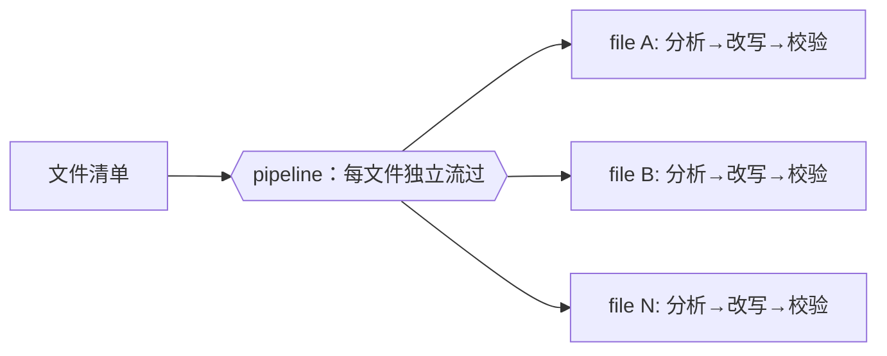
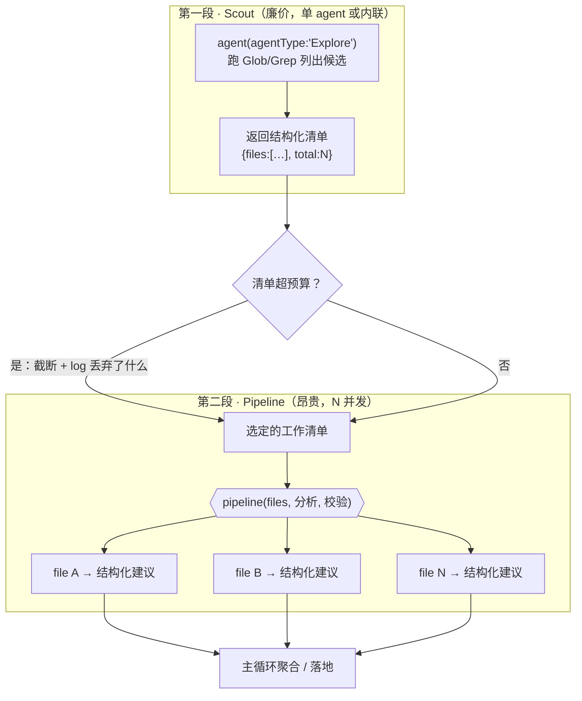
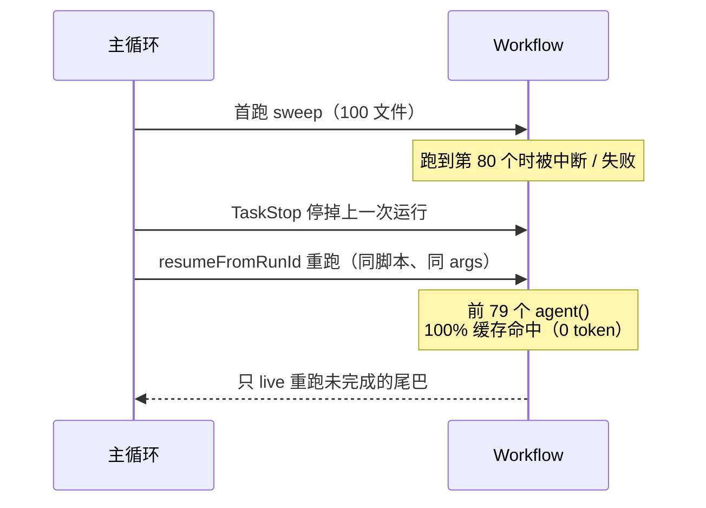

# 第 16 章 · 文档与迁移大扫除

> 「把同一种改动套到几十个文件上」——重命名一个 API、统一一处措辞、给每个模块补一段说明、把旧写法迁成新写法。这类**大扫除（sweep）**是 Workflow 的甜区：天生能切片、能并发、每片产出还能结构化。这一章讲清它长什么样、它的**两段法骨架**（先 scout 列清单，再 pipeline 逐项处理），还有三个让大扫除「靠得住」的工程原则：**no-silent-caps**（覆盖有上限必须说出来）、**report-only 优先**（默认先报告、人审过再动手）、**幂等可恢复**（断了能续、重跑不翻车）。

---

## 16.1 sweep 的本质就是 pipeline

一次 sweep = **拿一批文件，每个都单独跑同一条处理链**。这正是 `pipeline` 的定义（第 8 章）：



> 所以 sweep 没有什么单独的「新 API」要学——它就是你早就会的 `pipeline` + `agent` + `schema` 拿来用。本书的 **bug-hunter**（第 15 章，Run `wf_53da9a06-915`，真实，11 agent）就是一次只读 sweep：把一个文件里每条疑似 bug 单独验证一遍。把「文件内的条目」换成「目录里的文件」，就成了跨文件 sweep。

大扫除为什么值得专门一章？因为它把 pipeline 推到了**规模**上：不是 3 个写死的 item，而是「目录里有几个文件就有几个 item」。item 数量一旦不再是定值、而是**跑起来才知道**，三个新问题就冒出来了——清单从哪来（16.2 两段法）、清单太大怎么办（16.4 no-silent-caps）、跑到一半挂了怎么办（16.6 幂等）。这一章就是来回答这三问的。

---

## 16.2 两段法：先 scout 列清单，再 pipeline 逐项处理

最常见的错误，是想拿一个 agent 「既发现文件、又一个个处理」。这行不通，也不该这么干：**发现清单**和**逐项处理**压根是两种活——前者是一次廉价的目录扫描（一个 agent 跑 Glob/Grep 就够），后者是 N 个并发 subagent 各啃一个文件。把它们揉一块，你既丢了对清单**审阅、裁剪**的机会，也没法对处理阶段做结构化聚合。

对的做法是**两段法（scout → pipeline）**：



- **第一段 Scout**：用一个 `agentType: 'Explore'` 的 agent 跑 Glob/Grep，返回**结构化清单**（文件路径数组 + 总数）。这一步特别廉价——它不读全文，只列名字。你也可以干脆不用 agent：要是你（主循环/编排者）本来就知道清单，直接把数组传进脚本就行，省掉一次 agent 往返。
- **裁剪关口**：在两段中间卡一道——清单有没有超出本回合预算（token / agent 数 / 时间）？要截断就**截断，再 `log` 说清丢了什么**（见 16.4）。
- **第二段 Pipeline**：拿**选定的**清单跑 `pipeline`，每个文件单独流过「分析 → 校验」链，返回结构化建议。

下面是两段法的可运行骨架（**示意，未实跑**；但它 `pipeline` 跨文件并发 + 结构化产出的行为，已经由第 8 章 pipeline-demo（Run `wf_bf086b98-6ec`，真实，6 agent / 158,982 token / 26.7s）和第 15 章 bug-hunter（真实）验证过）：

```javascript
export const meta = {
  name: 'docs-footer-sweep',
  description: 'Two-phase sweep: scout lists docs, then audit each for a required footer link',
  phases: [
    { title: 'Scout', detail: 'List candidate files (cheap, single agent)' },
    { title: 'Audit', detail: 'Per-file structured conformance report' },
  ],
}

// —— 第一段：Scout，列清单（廉价；也可由主循环直接传 args.files 省掉这步）——
phase('Scout')
let files
if (Array.isArray(args && args.files)) {
  files = args.files            // 主循环已知清单：直接用，省一次 agent
} else {
  const found = await agent(
    'Glob docs/zh/*.md and return the list of file paths. Do NOT read file contents.',
    { label: 'scout', agentType: 'Explore',
      schema: { type: 'object',
        properties: { files: { type: 'array', items: { type: 'string' } } },
        required: ['files'] } })
  files = found.files
}
log(`scout found ${files.length} candidate files`)

// —— 第二段：Pipeline，逐项分析（昂贵，N 并发）——
phase('Audit')
const reports = await pipeline(files,
  (f) => agent(
    `Read ${f}. Does it end with a "继续阅读" footer link AND contain a 小结 section? ` +
    `Report yes/no plus exactly what is missing.`,
    { label: `audit:${f}`, phase: 'Audit',
      schema: { type: 'object',
        properties: {
          file: { type: 'string' },
          ok: { type: 'boolean' },
          missing: { type: 'string' },
        }, required: ['file', 'ok', 'missing'] } })
)
const problems = reports.filter(Boolean).filter((r) => !r.ok)
log(`audited ${reports.length} files, ${problems.length} need attention`)
return { scanned: reports.length, problems }
```

<div class="callout tip">

**为什么先 scout，而不是把 Glob 塞进 pipeline 的第一阶段？** 因为清单得**让人/主循环先看一眼再定**——可能太大要裁，可能混进了不该动的文件（生成产物、第三方 vendored 目录）。把「列清单」单拎出来，你就多了一个**能裁、能审的接缝**；塞进 pipeline 里，清单一冒出来就直接被吃掉，没你回旋的余地。

</div>

---

## 16.3 两种 sweep：只读分析 vs 真实改写

两段法的「第二段」到底干什么，看你做的是哪一种 sweep。

**抉择一：只读分析 sweep（建议先做这个）。** agent 读文件、返回**结构化的改动建议**（不直接动手），主循环拿到建议后统一审一遍、再决定怎么落地。安全、能回滚、产出可审计。上一节 16.2 的骨架就是只读分析 sweep——它只返回 `{file, ok, missing}` 报告，一个字都不改。

**抉择二：真实改写 sweep。** 让 agent 直接改文件。**关键陷阱**：多个 agent 并发改文件会**互相踩踏**。解法是 `isolation: 'worktree'`——每个 agent 在自己独立的 git worktree 里改，互不冲突（详见 [第 19 章 · Worktree 隔离](#/zh/p4-19)）。

<div class="callout warn">

**沉重提醒**：`isolation: 'worktree'` **昂贵**（每个约 200–500ms 启动 + 磁盘开销 + 一个 agent）。**只有当多个 agent 真的会并发改同一组文件、不然就会冲突时，才用它**；只读分析、或改动彼此不重叠的文件，都用不着。

</div>

这就引出大扫除最重要的安全取舍：**report-only（只报告）vs apply（真改）**。

| 维度 | report-only（默认） | apply（真改） |
|---|---|---|
| 第二段 agent 做什么 | 只读 + 返回结构化建议 | 调 Write/Edit 真改文件 |
| 隔离成本 | 无（不写文件，不冲突） | 需 `worktree` 防踩踏，昂贵 |
| 可审计性 | 高：人能一条条看建议再放行 | 低：改完才看，回滚靠 git |
| 可回滚性 | 天然（什么都没改） | 靠 git revert / worktree 丢弃 |
| 适用时机 | 第一遍、影响面没底、要人审 | 建议已审过、改动模式定了、批量执行 |

工程上的标准做法是**两遍**：第一遍 report-only 摸清全貌、让人把建议审一遍；建议稳了，第二遍才 apply（或者干脆把审过的建议交给主循环、用原生 Write/Edit 落地，连 worktree 都省了）。**默认先报告**，是因为大扫除「同一种改动套到几十个文件」，一旦错就是几十个文件一起错——report-only 把这个风险挡在人审前面。

---

## 16.4 no-silent-caps：覆盖有上限，必须说出来

大扫除最危险的失败不是报错——报错你看得见。最危险的是**静默截断**：脚本悄悄给覆盖设了上限（只取 top-N、采样一部分、失败不重试就跳过），却让结果**看着像是全覆盖**。读者据此以为「整个目录都扫过了、都合规」，其实有一半压根没碰。这种闷声不响的谎，比一个响亮的报错危险得多。

原则叫 **no-silent-caps**：**任何对覆盖的削减——上限、采样、跳过、去重、提前退出——都必须 `log()` 出来，说清「丢了什么、为什么、还剩多少没处理」。** Workflow 的 `log()` 正是为这个而生——它在进度树上方打一行叙述（见 §B），是脚本对人「交底」的唯一通道。

为什么会有上限？因为大扫除天生就会撞上 grounding 里的硬约束：

- **并发上限** = `min(16, CPU 核心数 − 2)`（官方）：超了会**排队**，不报错——所以 N=500 个文件不会爆，但会慢，而且你可能想主动只取一批。
- **生命周期 `agent()` 总数上限 1000**（官方，runaway-loop backstop）：一次 sweep 要是文件数 ×阶段数逼近 1000，必须主动设上限。
- **token 预算**（`budget.total`，硬上限）：`spent()` 一到 `total`，再调 `agent()` 就抛错——所以大清单要么分批、要么主动截断。

撞上这些约束时，**主动截断 + log** 远比「让它撞到 1000 上限抛错」或「让 budget 耗光中途崩」强。下面是把 no-silent-caps 写进脚本长什么样（**示意，未实跑**）：

```javascript
export const meta = {
  name: 'capped-sweep',
  description: 'Sweep with an explicit per-run cap that LOGS what it drops (no silent truncation)',
  phases: [{ title: 'Scout' }, { title: 'Process' }],
}

phase('Scout')
const all = (await agent('Glob src/**/*.ts and return paths only.',
  { label: 'scout', agentType: 'Explore',
    schema: { type: 'object', properties: { files: { type: 'array', items: { type: 'string' } } }, required: ['files'] } })).files

// —— 显式上限：不是 200 个就跑 200 个，而是设一个本回合能负担的数 ——
const CAP = 50
const selected = all.slice(0, CAP)
const dropped = all.length - selected.length

// —— no-silent-caps 的核心：把丢弃说清楚 ——
if (dropped > 0) {
  log(`⚠ COVERAGE CAP: scouted ${all.length} files, processing first ${selected.length}, ` +
      `DROPPED ${dropped}. This run is NOT full coverage — re-run on the remainder ` +
      `(e.g. args.files = the next batch) to continue.`)
}

phase('Process')
const reports = await pipeline(selected,
  (f) => agent(`Audit ${f} for the migration checklist; report findings.`,
    { label: `proc:${f}`, phase: 'Process',
      schema: { type: 'object',
        properties: { file: { type: 'string' }, findings: { type: 'array', items: { type: 'string' } } },
        required: ['file', 'findings'] } }))

// —— 返回值也带上覆盖事实，别让调用方误读 ——
return {
  coverage: { total: all.length, processed: selected.length, dropped },
  complete: dropped === 0,
  reports: reports.filter(Boolean),
}
```

<div class="callout warn">

**静默截断是大扫除的头号事故源。** 三个最隐蔽的版本：①`array.slice(0, N)` 之后不 log，结果看着像全跑了；②`pipeline` 某项抛错 → 该项被静默置 `null`，`filter(Boolean)` 顺手把它过滤掉，于是「失败的文件凭空消失」；③用 `Set` 去重时，把本该各自处理的同名文件折叠成一个。**对策**：凡是会改变「处理了多少」的操作，要么 `log` 出来，要么写进返回值的 `coverage` 字段。让覆盖率当**一等公民**，别当脚注。

</div>

特别提醒 `pipeline` 的「失败即 null」语义（见 §B）：某 stage 抛错→该 item 变 `null`，剩下的 stage 全跳过。`reports.filter(Boolean)` 是干净，但它**悄悄把失败吃掉了**。稳的写法是先数一遍再过滤：

```javascript
const failed = reports.filter((r) => r === null).length
if (failed > 0) log(`⚠ ${failed}/${reports.length} files failed mid-pipeline (returned null) and were skipped`)
const ok = reports.filter(Boolean)
```

---

## 16.5 推荐工作流：让分析并发、让写入收敛到一处

把前面几节合到一起，最稳的 sweep 模式是把「思考」交给 subagent、「写入」留给主循环：

1. **Scout 列清单**（16.2），裁到本回合能负担的规模，丢掉的 `log` 出来（16.4）。
2. **只读 sweep** 让 N 个 agent 并发分析，各自返回结构化改动建议（16.3 抉择一）。
3. **主循环**（你，或编排者）拿到全部建议，统一审、去重、拍板。
4. **主循环用原生 Write/Edit 落地**——Workflow **脚本体**本身、以及 `ctx_execute`/Bash 子进程的写入**不持久化**（见 grounding）；但 subagent 要是调用 Write/Edit，是**能**产生真实文件副作用的（[第 19 章 · Worktree 隔离](#/zh/p4-19) 正是让并行 agent 各自用 Edit 改文件）。sweep **推荐**让 subagent 只返回结构化建议、由主循环统一落地，是出于「安全、可审、收敛」的工程考量——不是因为 subagent 不能写。

这也呼应了第 23 章 oh-my-openagent 的「外部模型零写入、由编排者落地」护栏思路：**让分析并发、让写入收敛到一处**，又快又可控。两段法把「快」（pipeline 扇出 N 个分析）和「可控」（写入收敛到主循环一处串行落地）拆到两个阶段，互不打架。

---

## 16.6 幂等与可恢复：大清单跑一半挂了怎么办

大扫除是长任务——几十上百个文件、每个一个 subagent 往返，墙钟可能要几分钟。长任务必然碰上：**中途断了怎么办？重跑会不会把已经做完的又做一遍？**

Workflow 给了两件武器。

**第一件：续传（`resumeFromRunId`）。** 同脚本 + 同 args 重跑 = **100% 缓存命中**：没改动的 `agent()` 调用直接复用缓存结果，**0 token、0 工具调用**。这不是估的，是实测——本书对 `hello-workflow`（Run `wf_dacbd480-d5d`）续传时，那个 agent 以 **0 token / 8ms** 返回了和首跑**完全一样**的结果（见 `assets/transcripts/advanced.md`）。对 sweep 来说就是：一个扫了 100 个文件、在第 80 个挂掉的 run，续传时前 79 个秒级缓存命中、几乎不烧 token，只把没做完的尾巴重跑一遍。



但续传有两条铁律（见 §A2 / §B2），正好就是大扫除的设计约束：

- **续传前先 TaskStop 停掉上一次运行**（官方）——别让两个 run 抢同一份 journal。
- **仅同会话**——续传句柄活在本会话里；跨会话不保证。所以真正的「跨会话可恢复」得靠下面第二件武器。

<div class="callout warn">

**续传 ≠ 脚本可以用时间戳/随机数。** 续传的全部前提，是脚本**可重放**：禁用 `Date.now()` / `Math.random()` / 无参 `new Date()`（grounding 实测：字面量在提交期被静态拒绝、别名形式在运行时抛错）。原因正是续传——脚本每次跑结果一飘，缓存键就废了、续传就退化成全量重跑。要时间戳就用 `args` 传进来，要随机性就用 agent 下标去变提示词。

</div>

**第二件：报告本身就是断点（report-only 的额外红利）。** report-only sweep 不改文件，所以它**天然幂等**——重跑一遍，最坏也就是重新生成一份一样的报告，绝不会把文件改坏两次。把每批的报告（含 16.4 的 `coverage` 字段）落盘，下一批就从「上一批报告里 `complete:false` 的剩余清单」接着扫。这就是**跨会话**的可恢复：状态外化在报告文件里，而不是塞在 Workflow 的会话内 journal 里。这种「一直跑到再没新东西可处理为止」的迭代形态，正是 [第 18 章 · 循环到干](#/zh/p4-18) 的主题——大扫除的「分批续扫，直到剩余清单为空」就是 loop-until-dry 的一个实例。

| 恢复手段 | 作用域 | 代价 | 适用 |
|---|---|---|---|
| `resumeFromRunId` 续传 | **仅同会话** | 0 token（缓存命中） | 同一会话里一次 run 断了之后接着跑 |
| report-only + 外化清单 | **跨会话** | 把剩余清单重新跑一遍 | 大到要分好几批、跨会话的大扫除 |

---

## 16.7 设计要点

- **两段法**：先 scout 列清单（廉价，单 agent 或主循环直接传），再 pipeline 逐项处理（昂贵，N 并发）。别把发现和处理揉进一个 agent。
- **切分片**：用 `agentType: 'Explore'` 的 agent 跑 Glob/Grep 发现文件，或者直接传清单。
- **每片结构化产出**：用 `schema` 把「文件名 + 是否合规 + 缺什么 / 改动 diff」固定下来，方便聚合和落地。
- **report-only 优先**：能先出「建议」就别让 agent 直接改；建议能审、能回滚、天然幂等。
- **no-silent-caps**：凡是削减覆盖（上限/采样/跳过/去重/失败置 null），一律 `log` 出来、再写进返回值的 `coverage`，别让静默截断被当成「全扫了」。
- **真要并发改写**：用 `worktree` 隔离（第 19 章）防踩踏，也掂量一下它的成本。
- **可恢复**：同会话用 `resumeFromRunId`（0 token 缓存命中）；跨会话靠 report-only + 外化清单分批续扫。
- **保持可重放**：脚本禁用时间戳/随机数，不然续传就退化成全量重跑。

---

## 16.8 本章小结

- sweep = `pipeline` 跨文件套用同一条处理链；没有新 API，但被推到了**规模**，于是冒出清单、上限、恢复三问。
- **两段法**：scout（廉价列清单）→ pipeline（昂贵逐项处理），中间留一道裁剪关口。
- 两种形态：**只读分析**（report-only，安全、推荐、幂等）vs **真实改写**（apply，需 `worktree` 隔离防踩踏，昂贵）。标准做法是「先报告、人审、再改」两遍。
- **no-silent-caps**：覆盖有上限必须 `log` + 写进 `coverage`；尤其当心 `pipeline` 失败置 null 被 `filter(Boolean)` 悄悄吃掉。
- **幂等可恢复**：同会话 `resumeFromRunId` 100% 缓存命中（实测 `wf_dacbd480-d5d` 续传 0 token / 8ms）；跨会话靠 report-only + 外化清单分批续扫。
- 真实印证：pipeline-demo（`wf_bf086b98-6ec`，6 agent）/ bug-hunter（`wf_53da9a06-915`，11 agent）已经验证了跨条目并发 + 结构化产出。

**实战食谱篇到这里就结束了**。第四部我们转向让这些配方**靠得住**的进阶模式——对抗验证、循环到干、判官面板、完整性批评。

> 继续阅读：[第 17 章 · 对抗验证](#/zh/p4-17)

> 📌 中文 README 主版本已移至根目录 [README.md](../../README.md)。

---

[← 返回主 README](../../README.md)
