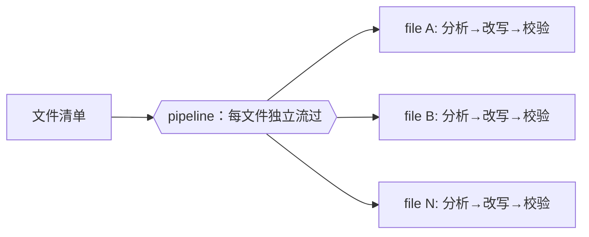

# 第 16 章 · 文档与迁移大扫除

> 「把同一种改动套用到几十个文件上」——重命名一个 API、统一一处措辞、给每个模块补一段说明、把旧写法迁到新写法。这类**大扫除（sweep）**是 Workflow 的甜区：天然可分片、可并发、每片产出可结构化。本章讲清它的形态与两个关键抉择（只读分析 vs 真实改文件）。

---

## 16.1 sweep 的本质就是 pipeline

一次 sweep = **对一批文件，每个独立地跑同一条处理链**。这正是 `pipeline` 的定义（第 8 章）：



> 所以 sweep 没有独立的「新 API」要学——它是你已经掌握的 `pipeline` + `agent` + `schema` 的应用。本书的 **bug-hunter**（第 15 章，Run `wf_53da9a06-915`，真实）就是一次只读 sweep：对一个文件的每条疑似 bug 独立验证。把「文件内的条目」换成「目录里的文件」，就是跨文件 sweep。

---

## 16.2 两种 sweep：只读分析 vs 真实改写

**抉择一：只读分析 sweep（推荐先做）。** agent 读文件、返回**结构化的改动建议**（不直接改），主循环拿到建议后统一审阅、再决定怎么落地。安全、可回滚、产出可审计。

```javascript
export const meta = {
  name: 'audit-sweep',
  description: 'Read-only sweep: check each file against a checklist, report conformance',
  phases: [{ title: 'Scan' }, { title: 'Audit' }],
}
phase('Scan')
// 用一个 agent 配 agentType:'Explore' 跑 Glob 列出目标，或直接传清单
const files = ['docs/zh/p1-01.md', 'docs/zh/p1-02.md' /* … */]
phase('Audit')
const reports = await pipeline(files,
  (f) => agent(`Read ${f}. Does it end with a "继续阅读" footer link and a 小结 section? Report yes/no + what's missing.`,
    { label: `audit:${f}`,
      schema: { type: 'object', properties: { file: { type:'string' }, ok: { type:'boolean' }, missing: { type:'string' } }, required: ['file','ok','missing'] } })
)
const problems = reports.filter(Boolean).filter(r => !r.ok)
log(`audited ${reports.length} files, ${problems.length} need attention`)
return { problems }
```

> 上为**示意**（未按此原样实跑）；其 `pipeline` 跨文件并发、结构化产出的行为，已由第 8 章 pipeline-demo（Run `wf_bf086b98-6ec`，真实）与第 15 章 bug-hunter（真实）验证。

**抉择二：真实改写 sweep。** 让 agent 直接修改文件。**关键陷阱**：多个 agent 并发改文件会**互相踩踏**。解法是 `isolation: 'worktree'`——每个 agent 在独立的 git worktree 里改，互不冲突（详见 [第 19 章 · Worktree 隔离](#/zh/p4-19)）。

<div class="callout warn">

**沉重提醒**：`isolation: 'worktree'` **昂贵**（每个约 200–500ms 启动 + 磁盘开销）。**只有当多个 agent 真的会并发改同一组文件、否则会冲突时才用它**；只读分析、或改动彼此不重叠的文件，都不需要。

</div>

---

## 16.3 推荐工作流：先分析，再由主循环落地

最稳的 sweep 模式，是把「思考」交给 subagent、把「写入」留给主循环：

1. **只读 sweep** 让 N 个 agent 并发分析，各自返回结构化改动建议。
2. **主循环**（你，或编排者）拿到全部建议，统一审阅、去重、决定。
3. **主循环用原生 Write/Edit 落地**——Workflow **脚本体**本身、以及 `ctx_execute`/Bash 子进程的写入**不持久化**（见 grounding）；但 subagent 若调用 Write/Edit 是**能**产生真实文件副作用的（[第 19 章 · Worktree 隔离](#/zh/p4-19) 正是让并行 agent 各自用 Edit 改文件）。sweep **推荐**让 subagent 只返回结构化建议、由主循环统一落地，是出于「安全、可审、收敛」的工程选择——而非 subagent 不能写。

这也呼应了第 23 章 oh-my-openagent 的「外部模型零写入、由编排者落地」护栏思想：**让分析并发、让写入收敛到一处**，既快又可控。

---

## 16.4 设计要点

- **切分片**：用 `agentType: 'Explore'` 的 agent 跑 Glob/Grep 发现文件，或直接传清单。
- **每片结构化产出**：用 `schema` 固定「文件名 + 是否合规 + 缺什么 / 改动 diff」，便于聚合与落地。
- **只读优先**：能先出「建议」就别让 agent 直接改；建议可审、可回滚。
- **真要并发改写**：用 `worktree` 隔离（第 19 章），并掂量其成本。
- **大扫除要 `log` 取舍**：如果只扫了 top-N 文件或跳过了某些，**一定 log 出来**，别让静默截断被误读为「全扫了」。

---

## 16.5 本章小结

- sweep = `pipeline` 跨文件套用同一处理链；没有新 API。
- 两种形态：**只读分析**（安全、推荐）vs **真实改写**（需 `worktree` 隔离防踩踏，昂贵）。
- 最稳模式：subagent 并发**分析**出结构化建议 → 主循环统一**落地**（Write/Edit）。
- 真实印证：pipeline-demo / bug-hunter 已验证跨条目并发 + 结构化产出。

**实战食谱篇至此完结**。第四部我们转向让这些配方**可信**的进阶模式——对抗验证、循环到干、判官面板、完整性批评。

> 继续阅读：[第 17 章 · 对抗验证](#/zh/p4-17)
