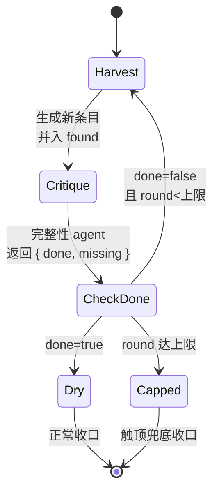

# 第 18 章 · 循环到干与完整性批评

> 一句话：**拿一个普通的 JavaScript `while` 循环，反复「生成 → 问一句『还有遗漏吗』」，一直问到一个完整性 agent 说『再也榨不出新东西了』为止——这就是『循环到干』（loop-until-dry）。**
>
> 上一章解决「产物**对不对**」（对抗验证），这一章解决「产物**全不全**」（完整性）。这两件事是质量门上两条不重叠的轴：一个查真伪，一个查覆盖。

---

## 18.1 单次生成的天花板：模型会「早早收手」

先看一个又真实又普遍的现象。

你让一个 subagent「列出这个模块所有的安全隐患」，它给了你 5 条，然后就停了。真的只有 5 条吗？往往不是——模型给出「一组看起来合理的答案」之后就倾向于收手，因为在它看来，「列出几条」这活儿已经「干完了」。它不会主动回头问自己「我是不是漏了什么」。

这就是单次 `agent()` 调用的天花板：**它一次性吐完就完事，没有『再想想』这个动作。** 你可以在 prompt 里写「请尽可能详尽、列出全部」，数量能拉高一些，但终归是一锤子买卖——模型停在某个它自己觉得「够了」的点上，而这个点几乎总是早于「真正穷尽」。

「循环到干」的思路，就是把「再想想」这件事**从 prompt 里的恳求，挪进代码里的循环**：

1. 生成一批结果。
2. 拿着「已有的结果」去问：**还有没有遗漏？**
3. 如果有，把新发现并入，回到第 2 步。
4. 如果「没有了」——**dry**——退出循环。

每一轮，模型看到的都是「已经找到的 N 条」，并被明确要求「找出**还没被提到**的新东西」。这份「已有清单」会逼它越过自己那个舒服的停止点，一轮一轮把剩下的东西榨出来，直到真的榨干。

<div class="callout info">

**这个模式，社区里的系统已经反复验证过了。** 据 `_grounding.md` D 节：superpowers 的精华之一是「两段式评审闭环，各自循环到过」；oh-my-claudecode 的招牌是「`Stop` 钩子持久循环——boulder never stops，让『是否允许停止』可编程」。它们都在拿 Hook 加状态文件**模拟**「不到完整不罢休」。而原生 Workflow 让你用一个 `while` 循环 + 一个 schema 化的「完整性判决」，把同样的逻辑写成**确定性的、自带刹车的**结构。本章讲的就是这个。

</div>

---

## 18.2 核心结构：while 循环 + 完整性门控

「循环到干」的骨架，说白了就是一个 `while` 循环，由「完整性 agent 给出的布尔判决」来驱动。先看最小形态：

```javascript
// （示意，未实跑）—— 循环到干的核心骨架
phase('Harvest')
let found = []          // 累积已发现的全部条目
let done = false        // 完整性门控
let round = 0

while (!done && round < 6) {   // 6 是防失控硬上限，见 18.3
  round++

  // 1) 生成：找出「还没被提到」的新条目
  const fresh = await agent(
    `目标：列出该模块所有安全隐患。\n` +
    `已经找到的（不要重复）：\n${found.map((f) => '- ' + f.title).join('\n') || '（暂无）'}\n` +
    `请只给出**新的、未被提及**的隐患。`,
    {
      label: `harvest:round-${round}`, phase: 'Harvest',
      schema: {
        type: 'object',
        properties: {
          items: {
            type: 'array',
            items: {
              type: 'object',
              properties: { title: { type: 'string' }, detail: { type: 'string' } },
              required: ['title', 'detail'],
            },
          },
        },
        required: ['items'],
      },
    }
  )

  found.push(...fresh.items)

  // 2) 完整性批评：还有遗漏吗？
  const critique = await agent(
    `已找到的隐患清单：\n${found.map((f) => '- ' + f.title).join('\n')}\n` +
    `你是完整性审查员。判断这份清单是否已经穷尽该模块的安全隐患。\n` +
    `若你能指出任何**仍被遗漏**的方向，则 done=false 并在 missing 里列出；\n` +
    `若确信已无遗漏，则 done=true。`,
    {
      label: `completeness:round-${round}`, phase: 'Harvest',
      schema: {
        type: 'object',
        properties: {
          done: { type: 'boolean' },
          missing: { type: 'array', items: { type: 'string' } },
        },
        required: ['done', 'missing'],
      },
    }
  )

  done = critique.done   // 布尔门控驱动循环
  if (!done) log(`第 ${round} 轮后仍有遗漏：${critique.missing.join('、')}`)
}

log(`循环到干：${round} 轮，共 ${found.length} 条`)
return found
```

这个骨架里有三个关键角色，分别对应进阶篇要讲透的三件事：

**角色一：生成者（Harvest agent）。** 每轮接过「已找到的清单」，只被要求产出**新增**条目。它的 schema 是一个数组（`items`），每项都结构化——这正是第 07 章「数组模式」的用法。

**角色二：完整性批评者（Completeness agent）。** 它**不**生成新内容，只干一件事：判断「够了没有」。它的 schema 核心是 `done: boolean` 这个**门控字段**——`while (!done)` 直接读它，来决定要不要接着跑。

**角色三：循环本身（JS while）。** 这是 Workflow 的精髓所在——**控制流就是真正的 JavaScript**。`while`、`round` 计数器、`found.push(...)` 全是普通代码。模型管「判断」，代码管「编排」，各管各的，分得清清楚楚。



<div class="callout tip">

**为什么要把「生成」和「判完整」拆成两个 agent？** 让同一个 agent 既生成又自己评「够了没」，就会掉回第 17 章讲过的那个自我评估陷阱——它刚生成完，就倾向于说「够了」。拆出一个独立的完整性批评者（独立上下文、专门负责「找遗漏」），判决才靠得住。**这跟对抗验证是一个道理：把评估者和被评估者分开。**

</div>

---

## 18.3 刹车：循环必须有界，这是纪律不是可选项

上一节那个骨架里，`while` 条件写的是 `!done && round < 6`——那个 `round < 6` 不是摆设，是**安全带**。

「循环到干」最大的风险就是**死循环**：要是完整性 agent 永远判 `done=false`（它总能「编」出一个看着像遗漏的方向），循环就永远停不下来。而 Workflow 每跑一轮都在实打实地烧 token 和墙钟，失控的循环转眼就把预算榨干。

防失控必须**多重设防**：

**第一道：硬轮次上限。** `round < N`（比如 6）。不管完整性 agent 怎么说，到顶就停。这是最简单、也最靠谱的刹车。

**第二道：budget 兜底。** 据 `_grounding.md`，`budget` 是**硬上限**——`spent()` 一旦摸到 `total`，再调 `agent()` 就抛错。所以哪怕你忘了设轮次上限，预算见底也会强制中止。更主动的做法，是在循环里盯着 `budget.remaining()`：

```javascript
// （示意，未实跑）—— 用 budget.remaining() 主动刹车
while (!done && round < 6) {
  // 估算单轮成本约 5 万 token（生成+批评两个 agent）；不够就提前收手
  if (budget.total !== null && budget.remaining() < 50_000) {
    log(`预算不足以再跑一轮（剩余 ${budget.remaining()}），提前收口`)
    break
  }
  round++
  // ... 生成 + 批评
}
```

**第三道：收益递减检测。** 要是连续两轮新增条目都是 0（或者趋近 0），那就算完整性 agent 还嘴硬说有遗漏，你也可以主动退出——因为生成者已经榨不出东西了：

```javascript
// （示意，未实跑）—— 收益递减：连续空轮则停
let emptyStreak = 0
while (!done && round < 6) {
  round++
  const fresh = await agent(/* ... */)
  if (fresh.items.length === 0) {
    emptyStreak++
    if (emptyStreak >= 2) { log('连续两轮无新增，判定已干'); break }
  } else {
    emptyStreak = 0
    found.push(...fresh.items)
  }
  // ... 完整性批评
}
```

<div class="callout warn">

**永远不要写一个只靠模型判决来退出的无界循环。** 模型给的「done」是个概率性判断，它可能因为「想表现得彻底点」而迟迟不肯给 done。`_grounding.md` 还兜了一个全局底：单工作流生命周期里 agent 总数上限 **1000**——这是最后那张安全网，但你**绝不该**指望它来终止业务循环。正确的纪律是：**每个循环都把退出条件显式写出来（轮次上限 + 收益递减），把 budget 当成最后一道防线，而不是唯一防线。**

</div>

---

## 18.4 完整性批评的两种形态：发散式 vs 收敛式

「完整性」这个词在不同任务里意思不一样，对应两种循环形态。

### 形态一：发散式——「还能找到更多吗」

这就是 18.2 那个形态：目标是**把一个开放集合穷尽**（所有 bug、所有隐患、所有边界情况）。完整性 agent 的职责，是「指出还有哪些**方向**没覆盖到」。退出条件是「再也找不出新方向」。

典型场景：Bug 猎手（第 15 章）、安全隐患排查、测试用例枚举。这类任务**事先并没有一个已知的『全集』**，只能靠反复逼问，一点点逼近完整。

### 形态二：收敛式——「这份清单都核对过了吗」

还有一种「完整」，是**拿一个已知清单逐项核对**：比如「这份 spec 的每一条需求，代码到底实现了没有」。这时候全集是已知的（就是那些 spec 条目），完整性 agent 的职责就是**一项项打勾**，把没满足的挑出来。

```javascript
// （示意，未实跑）—— 收敛式：逐项核对已知清单
const checklist = args.requirements   // 已知的需求清单
const review = await agent(
  `逐条核对以下需求是否在实现中被满足：\n${checklist.map((r, i) => `${i + 1}. ${r}`).join('\n')}\n` +
  `对每一条给出 satisfied 布尔与证据。`,
  {
    schema: {
      type: 'object',
      properties: {
        items: {
          type: 'array',
          items: {
            type: 'object',
            properties: {
              requirement: { type: 'string' },
              satisfied: { type: 'boolean' },
              evidence: { type: 'string' },
            },
            required: ['requirement', 'satisfied', 'evidence'],
          },
        },
      },
      required: ['items'],
    },
  }
)
const unmet = review.items.filter((i) => !i.satisfied)
// unmet 非空 → 进入修复循环；为空 → dry
```

收敛式通常不用 `while` 来反复榨，而是走「核对 → 修复未满足项 → 再核对」这么一个闭环，直到 `unmet` 清空为止。**这正是 superpowers「spec 合规循环」的结构**（`_grounding.md` D 节）。

| | 发散式 | 收敛式 |
|---|---|---|
| 全集 | 未知，开放 | 已知（spec/清单） |
| 完整性 agent 职责 | 指出遗漏的**方向** | 逐项**打勾**找未满足 |
| 退出条件 | 找不到新方向（dry） | 未满足项清空 |
| 典型场景 | Bug 猎手、隐患枚举 | spec 合规、迁移核对 |

<div class="callout tip">

**两种形态可以串起来用。** 真实的质量门往往是这样：先**发散**着把所有问题找干（loop-until-dry），再对每个问题**对抗验证**（第 17 章）判个真伪，最后**收敛**着核对「所有确认的问题是不是都修了」。三步一组合，就是一条既能自我纠错、又能自证完整的流水线。

</div>

---

## 18.5 生产骨架：找干 → 去重 → 验证 → 收口

把发散式找干跟去重、验证拼到一起，就得到一个生产可用的完整骨架。注意：循环到干会冒出**重复或近似**的条目（不同轮次的生成者可能从不同角度提到同一个问题），所以收口前得先去重。

```javascript
// （示意，未实跑）—— 完整生产骨架
export const meta = {
  name: 'loop-until-dry-review',
  description: '反复榨取问题直到完整性 agent 判干，去重后逐项验证，收口',
  phases: [{ title: 'Harvest', detail: '循环到干' }, { title: 'Verify', detail: '逐项核验' }],
}

const MAX_ROUNDS = 6
let found = []
let done = false
let round = 0
let emptyStreak = 0

phase('Harvest')
while (!done && round < MAX_ROUNDS) {
  round++
  if (budget.total !== null && budget.remaining() < 60_000) {
    log(`预算告急，提前收口`); break
  }

  const fresh = await agent(
    `目标：${args.goal}\n已找到（勿重复）：\n` +
    `${found.map((f) => '- ' + f.title).join('\n') || '（暂无）'}\n只给新增条目。`,
    {
      label: `harvest:${round}`, phase: 'Harvest',
      schema: {
        type: 'object',
        properties: {
          items: {
            type: 'array',
            items: {
              type: 'object',
              properties: { title: { type: 'string' }, detail: { type: 'string' } },
              required: ['title', 'detail'],
            },
          },
        },
        required: ['items'],
      },
    }
  )

  if (fresh.items.length === 0) {
    if (++emptyStreak >= 2) { log('连续两轮无新增，判干'); break }
  } else {
    emptyStreak = 0
    found.push(...fresh.items)
  }

  const critique = await agent(
    `已找到：\n${found.map((f) => '- ' + f.title).join('\n')}\n` +
    `你是完整性审查员，确信无遗漏则 done=true，否则 done=false 并列出 missing。`,
    {
      label: `completeness:${round}`, phase: 'Harvest',
      schema: {
        type: 'object',
        properties: { done: { type: 'boolean' }, missing: { type: 'array', items: { type: 'string' } } },
        required: ['done', 'missing'],
      },
    }
  )
  done = critique.done
}

// 去重：用 title 归一化（小写去空格）做键
const seen = new Set()
const unique = found.filter((f) => {
  const key = f.title.toLowerCase().replace(/\s+/g, ' ').trim()
  if (seen.has(key)) return false
  seen.add(key)
  return true
})
log(`找干结束：${round} 轮，原始 ${found.length} 条，去重后 ${unique.length} 条`)

// 逐项对抗验证（复用第 17 章的 verdictSchema 思想）
phase('Verify')
const verified = await pipeline(
  unique,
  (item) =>
    agent(
      `证伪以下论断，能给反例判 refuted，证据确凿判 confirmed，不足判 uncertain。\n` +
      `论断：${item.title}\n细节：${item.detail}`,
      {
        label: `verify:${item.title.slice(0, 20)}`, phase: 'Verify',
        schema: {
          type: 'object',
          properties: {
            verdict: { type: 'string', enum: ['confirmed', 'refuted', 'uncertain'] },
            reasoning: { type: 'string' },
          },
          required: ['verdict', 'reasoning'],
        },
      }
    ).then((v) => ({ ...item, ...v }))
)

const confirmed = verified.filter(Boolean).filter((v) => v.verdict === 'confirmed')
return { rounds: round, total: unique.length, confirmed }
```

这个骨架把进阶篇前两章拧成了一股绳：**循环到干**（本章）保证「找全」，**对抗验证**（第 17 章）保证「找对」，中间夹一段普通 JS 来**去重**。三件事各管各的。

<div class="callout warn">

**去重为什么必须用代码做，而不是再开一个 agent？** 因为去重是个**确定性**操作——同样的输入，必然吐出同样的输出。用 `Set` 加归一化键，零成本、可重放、不含糊。可你要是再开一个 agent「帮我去重」，不光多烧 token，还顺手引进了不确定性（模型可能漏判，也可能把不重复的当成重复）。**凡是能用确定性代码搞定的（去重、计数、过滤、排序、聚合），就不要交给 agent**——这是 Workflow「代码编排、模型判断」这套分工的核心纪律。

</div>

---

## 18.6 反模式与最佳实践速查

| 反模式 | 后果 | 正确做法 |
|---|---|---|
| 无界 `while`（只靠模型 done 退出） | 死循环，烧光预算 | 必加轮次上限 + 收益递减 + budget 兜底 |
| 生成者不知道「已找到什么」 | 反复产出重复条目 | 每轮把已有清单注入 prompt，要求只给新增 |
| 同一 agent 既生成又判完整 | 确认偏误，过早 done | 完整性批评必须是独立 agent |
| 用 agent 做去重/计数 | 浪费 token + 不确定 | 用 JS（Set/filter/reduce）做确定性操作 |
| 完整性判决用自由文本 | 无法驱动 while | `done: boolean` 门控字段 + `required` |
| 把 budget 当唯一刹车 | 退出时机不可控，体验差 | budget 是最后防线，业务退出靠显式条件 |
| 每轮全量重新生成 | token 随轮次平方增长 | 每轮只产**增量**，累积在 JS 数组里 |

<div class="callout info">

**成本直觉**：循环到干的 token 成本，大致等于「轮数 × 每轮（生成 + 批评两个 agent）」。拿真实数据估一下，单个 agent 约 2.6 万 token（hello `wf_dacbd480-d5d`），那一轮约 5 万、跑 4 轮约 20 万 token——跟真实 pipeline-demo 的 `158982` 是一个量级。所以轮次上限不只是防死循环，它还是**成本闸门**：把它卡在「边际收益已经很低」的那个轮数上（经验上，3–6 轮足够覆盖绝大多数发散任务）。

</div>

---

## 18.7 本章小结

- **循环到干（loop-until-dry）= 拿 JS `while` 反复「生成增量 → 完整性批评」，一直跑到判干。** 它捅破了单次 `agent()` 「早早收手」的天花板，把「再想想」从 prompt 里的恳求，变成代码里的循环。
- 三角色分工：**生成者**（每轮产新增条目，数组 schema）、**完整性批评者**（独立 agent，`done: boolean` 门控）、**循环本身**（真正的 JS while + 计数器）。
- **刹车就是纪律**：必须多重设防——轮次硬上限、收益递减（连续空轮）、`budget.remaining()` 兜底。绝不写那种只靠模型判决退出的无界循环（全局 1000 agent 上限是张安全网，不是业务退出机制）。
- 两种形态：**发散式**（穷尽未知开放集，找遗漏方向）和**收敛式**（逐项核对已知清单，找未满足项，对应 spec 合规循环）；可以串起来用。
- 生产骨架把三章拧成一股绳：**循环到干**保证找全、**对抗验证**保证找对、**JS 去重**保证不重复——确定性的活儿交给代码，判断的活儿交给 agent。

下一章，我们要啃一个并行写文件时绕不开的问题：多个 agent 要同时改代码，怎么让它们互不踩脚——`isolation: 'worktree'`。

> 继续阅读：[第 19 章 · Worktree 隔离](#/zh/p4-19)

> 📌 中文 README 主版本已移至根目录 [README.md](../../README.md)。

---

[← 返回主 README](../../README.md)
