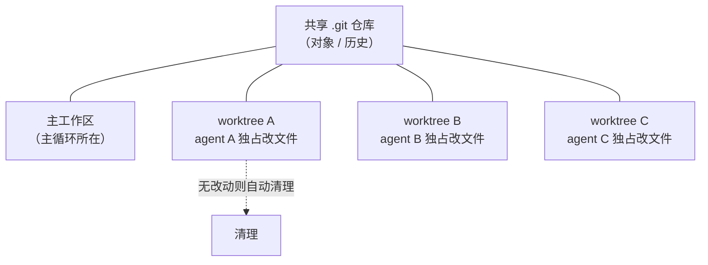
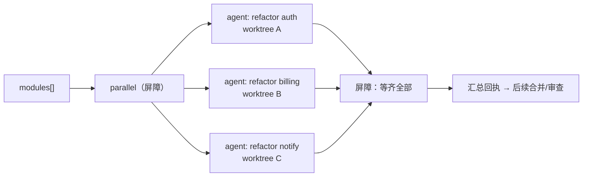

# 第 19 章 · Worktree 隔离

> 一句话：**当多个 agent 要同时修改同一份代码时，给它们各自一个独立的 git worktree——`opts.isolation: 'worktree'`——让它们在物理隔离的工作区里互不踩踏。**
>
> 进阶篇里，这是少数几章直接碰「副作用」的。前面的 agent 大多在「读和想」（审查、研究、判断）；可一旦 agent 开始**并行写文件**，竞态就来了。Worktree 隔离就是 Workflow 给的答案。

---

## 19.1 问题：并行写文件的竞态

先回顾一个事实：据 `_grounding.md`，`parallel()` 和 `pipeline()` 能让多个 agent 真正并发跑起来（实测印证：3 个 agent 并发约 8.4 秒，`wf_52957913-6d2`）。这些 agent 要是只「读代码、产出结构化发现」，并发一点问题没有——它们谁也不碰谁，各自把数据返回来。

可换一个任务想想：**让 5 个 agent 并行地各自重构一个模块**。每个 agent 都得用 Write/Edit 工具改文件。这下问题就来了：

- agent A 在改 `utils.js` 的第 10 行，agent B 同时也在改 `utils.js` 的第 50 行——它俩看到的是同一个文件的同一个版本，各改各的，**后写的会盖掉先写的**，要么就弄出一个谁都没想到的混合状态。
- 就算它们改的是不同文件，git 的暂存区、索引也是**共享**的——并发的 git 操作会互相打架。
- 哪个 agent 中途挂了，留下的半成品会污染其他 agent 看到的工作区。

这就是并行写的**竞态**：多个执行体共用同一份可变状态（工作区文件 + git 索引），不隔离就会互相搞坏。

Workflow 出现之前，社区里的系统各有各的绕坑办法。据 `_grounding.md` D 节，ccg-workflow 走的是「文件归属 + Layer 分层并行」——也就是**约定好**每个 agent 只碰自己那层的文件，靠纪律来躲冲突。这管用，但脆：约定一被打破，竞态立马回来。

Worktree 隔离给的是**物理**隔离，不是**约定**隔离。

---

## 19.2 git worktree 是什么：一棵树，多个工作区

想搞懂 `isolation: 'worktree'`，得先搞懂 git worktree 这个底层机制。

平时你用 git，一个仓库对应一个工作目录（working tree）——你 checkout 哪个分支，工作目录里就是哪个分支的内容。而 `git worktree` 允许**同一个仓库**同时挂**多个**工作目录，每个挂在不同的路径上、可以 checkout 不同的分支或提交：

```bash
# git worktree 的原生用法（仅作背景说明）
git worktree add ../feature-x feature-x   # 在 ../feature-x 目录挂出一个独立工作区
```

关键在于：这些工作区**共用同一个 `.git` 仓库底层**（对象、提交历史），但**各自有独立的工作目录文件和索引**。所以你在 `../feature-x` 里随便改、随便 commit，一点都不影响主工作目录。

把这个机制套到 Workflow 上：一个 `agent()` 带上 `isolation: 'worktree'`，运行时就给它**单独开一个 git worktree**，这个 agent 的所有文件改动都落在那个隔离的工作区里。多个这样的 agent 并行跑，就是多个隔离工作区并行——**物理上不可能互相覆盖**。



<div class="callout info">

**官方语义（据 `_grounding.md` B 节 agent opts）**：`opts.isolation: 'worktree'` 让这个 agent「在独立 git worktree 运行」，并明确写了两条性质——**昂贵**（仅当并行改文件会冲突时用），以及**无改动自动清理**（agent 最终没产生文件改动的话，对应的 worktree 会被自动回收）。本章其余那些更细的运行机制，比如「怎么合并 worktree 改动」「worktree 路径」，事实源没给，一律标「（待核实）」，不瞎猜。

</div>

<div class="callout warn">

**`isolation` 的取值校验，实测只特判两个值——别以为「只接受 `'worktree'`、其余报错」。** 本书专门跑了一次探针，验证 `isolation` 到底怎么对待各种取值（Run `wf_dace2fc6-966`，3 agent / 52,014 token / 5,253ms）：

- `isolation: 'remote'` → **抛错**，原文 `agent({isolation:'remote'}) is not available in this build`——这说明 `'remote'` 这个值是存在的，只是当前 build 把它禁掉了。
- `isolation: 'totally-bogus'`（一个根本不存在的值）→ **不抛错**，agent 照常跑完，返回 `"OK"`。

换句话说，运行时只对两个值做特判：`'worktree'`（执行隔离）和 `'remote'`（拒绝）；**其它任何未知值都被静默忽略**（按「不隔离」处理），并不会报错。某些第三方资料声称「`isolation` 只接受 `'worktree'`、其余一律报错」——本书实测**不成立**，在这里纠正一下。落到实践上：拼错 `isolation`（比如写成 `'worktre'`）**不会**给你任何提示，agent 会闷头在共享工作区里跑——所以这个字段你得自己拼对，运行时不替你兜底。

</div>

---

## 19.3 何时该用、何时不该用

`isolation: 'worktree'` 被官方明确标成**昂贵**，所以它不是默认选项，而是**针对特定问题的特定工具**。判断准则只有一条：

> **多个 agent 是否会并发地修改同一棵工作树？** 会 → 用 worktree 隔离；不会 → 不要用。

把这条准则摊成一张决策表：

| 场景 | agent 行为 | 要 worktree 吗 | 理由 |
|---|---|---|---|
| 并行代码审查 | 只读，产出结构化发现 | **否** | 无写，无竞态 |
| 并行研究 / 多维分析 | 只读，返回数据 | **否** | 无写，无竞态 |
| 对抗验证 / 评委面板 | 只读+判断 | **否** | 无写，无竞态 |
| 多 agent 并行重构不同模块 | 各自 Write/Edit | **是** | 并发写，必须隔离 |
| 多 agent 各自尝试同一问题的不同解法 | 各自改同一批文件 | **是** | 改同一棵树，必冲突 |
| 串行的单 agent 改文件 | 一次一个写 | **否** | 无并发，无竞态 |

<div class="callout warn">

**绝大多数 Workflow 用不到 worktree 隔离。** 本书前面所有真实运行（hello / parallel / pipeline）的 agent 都是「读 + 产出结构化数据」，**没有一个**要隔离。原因在于，Workflow 最常见、最划算的用法就是「扇出一群 agent 去并行地读和想，再把结构化结果汇总回来」——这类任务天生没副作用。只有当你真要让多个 agent **并发改文件**，才值得付 worktree 的代价。把它当成「最后才掏出来的重武器」，别一并行就开。

</div>

---

## 19.4 典型模式：并行重构 + 隔离

来看 worktree 隔离最典型的用法：让一组 agent 各自在隔离工作区里重构一个模块，谁也不碰谁。

```javascript
// （示意，未实跑）—— 并行重构，每个 agent 一个隔离 worktree
export const meta = {
  name: 'parallel-refactor',
  description: '多个模块并行重构，每个 agent 在独立 git worktree 中改文件互不冲突',
  phases: [{ title: 'Refactor', detail: '隔离工作区内并行重构' }],
}

phase('Refactor')
const modules = args.modules   // 如 ['src/auth', 'src/billing', 'src/notify']

const results = await parallel(
  modules.map((mod) => () =>
    agent(
      `重构模块 ${mod}：消除重复、改进命名、补全错误处理。直接用 Edit 工具修改文件。\n` +
      `完成后返回你改动的文件清单与一句话摘要。`,
      {
        label: `refactor:${mod}`,
        isolation: 'worktree',   // ← 关键：每个 agent 独立工作区
        schema: {
          type: 'object',
          properties: {
            changedFiles: { type: 'array', items: { type: 'string' } },
            summary: { type: 'string' },
          },
          required: ['changedFiles', 'summary'],
        },
      }
    )
  )
)

return results.filter(Boolean)
```

有几个要点要留意：

**`isolation: 'worktree'` 加在每个要写文件的 agent 上。** 它是 `agent()` 的一个选项，和 `schema`、`label`、`phase` 这些并列（据 `_grounding.md`，「与 schema 可组合」）。所以你既能隔离，又能拿到结构化的「改了哪些文件」回执。

**返回的是「改动摘要」这种轻量回执，不是文件内容本身。** 这呼应控制面/数据面分离（第 07 章、第 17 章）——编排脚本要知道「谁改了什么」，好做后续的合并/审查，而文件本体就留在各自的 worktree 里。至于 worktree 改动具体怎么回流到主分支，事实源没说清楚，属「（待核实）」，实际用的时候你应该通过 `/workflows` 观察运行时行为来确认。

**用 `parallel`，不是 `pipeline`。** 因为这里要的是「全部重构完，一起把所有回执拿到手，再走下一步（比如统一审查/合并）」——这恰好是 `parallel` 屏障语义的用武之地。



---

## 19.5 隔离的代价与权衡

官方反复强调 worktree「昂贵」，搞清楚它贵在哪，你才能把取舍做对。

worktree 的开销主要来自**给每个隔离 agent 创建一个独立工作区**——这要动到文件系统层面（检出工作树文件等），比「共享同一个工作目录」重得多。agent 越多、仓库越大，开销越扎眼。它和 token 成本是**两个维度**的代价：token 量的是模型推理，worktree 量的是文件系统隔离。

权衡的核心是：

| 维度 | 不隔离（共享工作区） | worktree 隔离 |
|---|---|---|
| 并发写文件 | 竞态，互相覆盖 | 安全，物理隔离 |
| 开销 | 低 | **高**（每 agent 一个工作区） |
| 适用 | 只读 / 串行写 | **并发写同一棵树** |
| 无改动时 | —— | 自动清理，不留垃圾 |

<div class="callout tip">

**「无改动自动清理」是个贴心的安全阀。** 据 `_grounding.md`，一个带 `isolation: 'worktree'` 的 agent 要是最终一个文件都没改，它的 worktree 会被自动回收。这就是说，你不用担心「开了隔离、agent 却没真改东西」会留下一堆空工作区——运行时帮你兜着。但这改变不了一个事实：「创建工作区」的开销已经花出去了。所以**别给只读 agent 加 `isolation`**：它本来就不会冲突，加了只是白付一遍隔离的代价（哪怕最后被清掉）。

</div>

<div class="callout warn">

**worktree 隔离要求项目是个 git 仓库。** worktree 是 git 的机制，所以这个选项暗含一个前提：当前工作目录得是 git 仓库。本书的写作环境本身就是 git 仓库（见 `manifest.json` 的 repo 字段）。在非 git 项目里用 `isolation: 'worktree'` 会怎样，事实源没覆盖，属「（待核实）」。

</div>

---

## 19.6 与其他并行策略的关系

worktree 隔离不是单打独斗的，它和前面学过的并发原语、还有社区的「文件归属」思路，凑成一个谱系。把它们摆一块儿对比，能帮你选对工具：

| 策略 | 隔离方式 | 强度 | 来源 |
|---|---|---|---|
| 文件归属约定（一写者/文件） | 纪律约定 | 弱（靠自觉） | ccg-workflow（`_grounding.md` D 节） |
| Layer 分层并行 | 按层划分文件，层间串行 | 中 | ccg-workflow |
| `isolation: 'worktree'` | git worktree 物理隔离 | **强（物理）** | 原生 Workflow |

三者不是互斥的，而是**强度一级比一级高**：

- 要是你能保证每个并行 agent 改的文件**完全不相交**，「文件归属约定」就够了，零额外开销。
- 要是文件有交叉、或者你没法提前划清边界，就上 `isolation: 'worktree'`，让 git 来物理兜底。

<div class="callout info">

**一个常被忽略的判断**：很多看着像「需要并行改文件」的任务，其实能**改写成「并行读 + 串行写」**——让多个 agent 并行地**产出 patch / 改动建议**（只读，返回结构化的 diff 描述），再交给主循环、或者一个串行的收尾 agent **依次应用**这些改动。这样既吃到了并行的速度，又彻底躲开了并发写的竞态，连 worktree 都省了。所以你打算用 worktree 之前，先问自己一句：**这个任务能不能拆成「并行想、串行改」？** 能的话，往往比 worktree 更简单也更省。

</div>

---

## 19.7 本章小结

- 并行**写文件**会闹竞态：多个 agent 共享同一棵工作树和 git 索引，互相覆盖。`isolation: 'worktree'` 给每个 agent 一个独立 git worktree，提供**物理隔离**。
- git worktree = 同一仓库、多个独立工作目录，共享 `.git` 底层但各自有独立工作区文件——这就是隔离的底层机制。
- **何时用**：仅当多个 agent 会**并发改同一棵工作树**时。只读任务（审查、研究、验证、评委）**绝不需要**——它们才是 Workflow 最常见也最划算的用法。
- 官方说得明白：worktree **昂贵**（每 agent 一个工作区的文件系统开销，与 token 成本正交）、**无改动自动清理**。别给只读 agent 加 `isolation`。
- 隔离强度谱系：文件归属约定（弱）< Layer 分层（中）< worktree（强/物理）。能拆成「并行想、串行改」的话，往往比 worktree 更简单。
- 事实源没覆盖的细节（worktree 改动怎么回流主分支、非 git 项目的行为）标注为「（待核实）」，实际使用时应通过 `/workflows` 观察运行时行为来确认。

下一章我们换一个组合维度：当一个工作流自己想复用另一个工作流时——`workflow()` 内联调用，以及「嵌套仅一层」的约束。

> 继续阅读：[第 20 章 · 嵌套 Workflow](#/zh/p4-20)

> 📌 中文 README 主版本已移至根目录 [README.md](../../README.md)。

---

[← 返回主 README](../../README.md)
