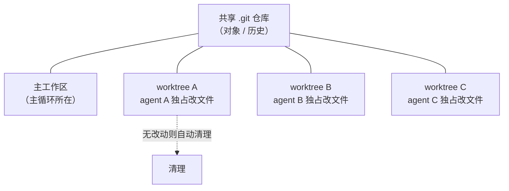
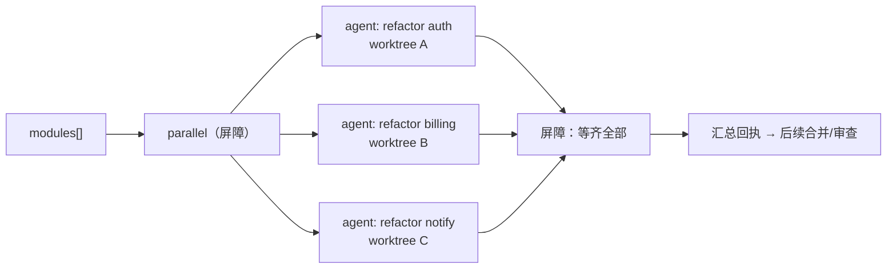

# 第 19 章 · Worktree 隔离

> 一句话：**当多个 agent 要同时修改同一份代码时，给它们各自一个独立的 git worktree——`opts.isolation: 'worktree'`——让它们在物理隔离的工作区里互不踩踏。**
>
> 这是进阶篇里少数直接触及「副作用」的一章。前面的 agent 大多在「读与想」（审查、研究、判断）；一旦 agent 开始**并行写文件**，竞态就来了。Worktree 隔离是 Workflow 给出的答案。

---

## 19.1 问题：并行写文件的竞态

回顾一个事实：据 `_grounding.md`，`parallel()` 和 `pipeline()` 能让多个 agent 真正并发运行（真实印证：3 个 agent 并发约 8.4 秒，`wf_52957913-6d2`）。当这些 agent 只是「读代码、产出结构化发现」时，并发毫无问题——它们互不干扰，各自返回数据。

但设想一个不同的任务：**让 5 个 agent 并行地各自重构一个模块**。每个 agent 都要用 Write/Edit 工具改文件。现在问题来了：

- agent A 在改 `utils.js` 的第 10 行，agent B 同时也在改 `utils.js` 的第 50 行——它们看到的是同一个文件的同一个版本，各自编辑，**后写的会覆盖先写的**，或者产生一个谁都没预期的混合状态。
- 即使它们改的是不同文件，git 的暂存区、索引是**共享**的——并发的 git 操作会互相干扰。
- 一个 agent 中途失败留下的半成品，会污染其他 agent 看到的工作区。

这就是并行写的**竞态**：多个执行体共享同一份可变状态（工作区文件 + git 索引），没有隔离就会互相破坏。

在 Workflow 之前，社区系统用各种办法绕这个坑。据 `_grounding.md` D 节，ccg-workflow 用「文件归属 + Layer 分层并行」——即**约定**每个 agent 只碰自己那层的文件，靠纪律避免冲突。这有效，但脆弱：一旦约定被打破，竞态就回来了。

Worktree 隔离提供的是**物理**隔离，而非**约定**隔离。

---

## 19.2 git worktree 是什么：一棵树，多个工作区

要理解 `isolation: 'worktree'`，得先理解 git worktree 这个底层机制。

平时你用 git，一个仓库对应一个工作目录（working tree）——你 checkout 哪个分支，工作目录就是哪个分支的内容。`git worktree` 允许**同一个仓库**同时拥有**多个**工作目录，每个挂在不同的路径上、可以 checkout 不同的分支或提交：

```bash
# git worktree 的原生用法（仅作背景说明）
git worktree add ../feature-x feature-x   # 在 ../feature-x 目录挂出一个独立工作区
```

关键在于：这些工作区**共享同一个 `.git` 仓库底层**（对象、提交历史），但**各自有独立的工作目录文件和索引**。所以你可以在 `../feature-x` 里随便改、随便 commit，完全不影响主工作目录。

把这个机制套到 Workflow：当一个 `agent()` 带上 `isolation: 'worktree'`，运行时就为它**单独开一个 git worktree**，这个 agent 的所有文件改动都发生在那个隔离的工作区里。多个这样的 agent 并行跑，就是多个隔离工作区并行——**物理上不可能互相覆盖**。



<div class="callout info">

**官方语义（据 `_grounding.md` B 节 agent opts）**：`opts.isolation: 'worktree'` 让该 agent「在独立 git worktree 运行」，并明确标注了两条性质——**昂贵**（仅当并行改文件会冲突时用），以及**无改动自动清理**（如果 agent 最终没产生文件改动，对应的 worktree 会被自动回收）。本章其余的「如何合并 worktree 改动」「worktree 路径」等更细的运行机制，事实源未给出，标注为「（待核实）」，不臆测。

</div>

---

## 19.3 何时该用、何时不该用

`isolation: 'worktree'` 被官方明确标注为**昂贵**，所以它不是默认选项，而是**针对特定问题的特定工具**。判断准则只有一条：

> **多个 agent 是否会并发地修改同一棵工作树？** 会 → 用 worktree 隔离；不会 → 不要用。

把它展开成一张决策表：

| 场景 | agent 行为 | 要 worktree 吗 | 理由 |
|---|---|---|---|
| 并行代码审查 | 只读，产出结构化发现 | **否** | 无写，无竞态 |
| 并行研究 / 多维分析 | 只读，返回数据 | **否** | 无写，无竞态 |
| 对抗验证 / 评委面板 | 只读+判断 | **否** | 无写，无竞态 |
| 多 agent 并行重构不同模块 | 各自 Write/Edit | **是** | 并发写，必须隔离 |
| 多 agent 各自尝试同一问题的不同解法 | 各自改同一批文件 | **是** | 改同一棵树，必冲突 |
| 串行的单 agent 改文件 | 一次一个写 | **否** | 无并发，无竞态 |

<div class="callout warn">

**绝大多数 Workflow 用不到 worktree 隔离。** 本书前面所有真实运行（hello / parallel / pipeline）的 agent 都是「读 + 产出结构化数据」，**没有一个**需要隔离。这是因为 Workflow 最常见、最划算的用法是「扇出一群 agent 去并行地读和想，把结构化结果汇总回来」——这类任务天然无副作用。只有当你确实要让多个 agent **并发地改文件**时，才付出 worktree 的代价。把它当成「最后才动用的重武器」，而不是「并行就开」。

</div>

---

## 19.4 典型模式：并行重构 + 隔离

来看 worktree 隔离最典型的用法：让一组 agent 各自在隔离工作区里重构一个模块，互不干扰。

```javascript
// （示意，未实跑）—— 并行重构，每个 agent 一个隔离 worktree
export const meta = {
  name: 'parallel-refactor',
  description: '多个模块并行重构，每个 agent 在独立 git worktree 中改文件互不冲突',
  phases: [{ title: 'Refactor', detail: '隔离工作区内并行重构' }],
}

phase('Refactor')
const modules = args.modules   // 如 ['src/auth', 'src/billing', 'src/notify']

const results = await parallel(
  modules.map((mod) => () =>
    agent(
      `重构模块 ${mod}：消除重复、改进命名、补全错误处理。直接用 Edit 工具修改文件。\n` +
      `完成后返回你改动的文件清单与一句话摘要。`,
      {
        label: `refactor:${mod}`,
        isolation: 'worktree',   // ← 关键：每个 agent 独立工作区
        schema: {
          type: 'object',
          properties: {
            changedFiles: { type: 'array', items: { type: 'string' } },
            summary: { type: 'string' },
          },
          required: ['changedFiles', 'summary'],
        },
      }
    )
  )
)

return results.filter(Boolean)
```

注意几个要点：

**`isolation: 'worktree'` 加在每个要写文件的 agent 上。** 它是 `agent()` 的一个选项，与 `schema`、`label`、`phase` 等并列（据 `_grounding.md`，「与 schema 可组合」）。所以你既能隔离，又能拿到结构化的「改了哪些文件」回执。

**返回的是「改动摘要」这样的轻量回执，而非文件内容本身。** 这呼应控制面/数据面分离（第 07 章、第 17 章）——编排脚本需要知道「谁改了什么」用于后续合并/审查，而文件本体留在各自的 worktree 里。具体的 worktree 改动如何回流到主分支，事实源未明确，属「（待核实）」，实际使用时应通过 `/workflows` 观察运行时行为来确认。

**`parallel` 而非 `pipeline`。** 因为这里要的是「全部重构完，一起拿到所有回执再做下一步（如统一审查/合并）」——这正是 `parallel` 屏障语义的用武之地。



---

## 19.5 隔离的代价与权衡

官方反复强调 worktree「昂贵」，理解它贵在哪里，才能做对取舍。

worktree 的开销主要来自**为每个隔离 agent 创建一个独立工作区**——这涉及文件系统层面的操作（检出工作树文件等），比「共享同一个工作目录」重得多。agent 越多、仓库越大，开销越显著。这与 token 成本是**两个维度**的代价：token 衡量模型推理，worktree 衡量文件系统隔离。

权衡的核心是：

| 维度 | 不隔离（共享工作区） | worktree 隔离 |
|---|---|---|
| 并发写文件 | 竞态，互相覆盖 | 安全，物理隔离 |
| 开销 | 低 | **高**（每 agent 一个工作区） |
| 适用 | 只读 / 串行写 | **并发写同一棵树** |
| 无改动时 | —— | 自动清理，不留垃圾 |

<div class="callout tip">

**「无改动自动清理」是一个贴心的安全阀。** 据 `_grounding.md`，如果一个带 `isolation: 'worktree'` 的 agent 最终没产生任何文件改动，它的 worktree 会被自动回收。这意味着你不必担心「开了隔离但 agent 其实没改东西」会留下一堆空工作区——运行时帮你兜底。但这不改变「创建工作区」本身的开销已经付出的事实，所以**别给只读 agent 加 `isolation`**：它不会冲突，加了只是白白付隔离的代价（哪怕最后被清理）。

</div>

<div class="callout warn">

**worktree 隔离要求项目是一个 git 仓库。** worktree 是 git 的机制，所以这个选项隐含「当前工作目录是 git 仓库」的前提。本书写作环境本身就是 git 仓库（见 `manifest.json` 的 repo 字段）。在非 git 项目里使用 `isolation: 'worktree'` 的行为，事实源未覆盖，属「（待核实）」。

</div>

---

## 19.6 与其他并行策略的关系

worktree 隔离不是孤立的，它和前面学过的并发原语、以及社区的「文件归属」思路，构成一个谱系。把它们放在一起对比，能帮你选对工具：

| 策略 | 隔离方式 | 强度 | 来源 |
|---|---|---|---|
| 文件归属约定（一写者/文件） | 纪律约定 | 弱（靠自觉） | ccg-workflow（`_grounding.md` D 节） |
| Layer 分层并行 | 按层划分文件，层间串行 | 中 | ccg-workflow |
| `isolation: 'worktree'` | git worktree 物理隔离 | **强（物理）** | 原生 Workflow |

三者不是互斥的，而是**强度递增**：

- 如果你能保证每个并行 agent 改的是**完全不相交**的文件集，「文件归属约定」就够了，零额外开销。
- 如果文件有交叉、或你无法预先划清边界，就上 `isolation: 'worktree'` 让 git 来物理保证。

<div class="callout info">

**一个常被忽略的判断**：很多看似「需要并行改文件」的任务，其实可以**重构成「并行读 + 串行写」**——让多个 agent 并行地**产出 patch / 改动建议**（只读，返回结构化的 diff 描述），再由主循环或一个串行的收尾 agent **依次应用**这些改动。这样既享受了并行的速度，又彻底回避了并发写的竞态，连 worktree 都不需要。当你打算用 worktree 时，先问自己一句：**这个任务能不能拆成「并行想、串行改」？** 能的话，往往比 worktree 更简单也更省。

</div>

---

## 19.7 本章小结

- 并行**写文件**会产生竞态：多个 agent 共享同一棵工作树和 git 索引，互相覆盖。`isolation: 'worktree'` 给每个 agent 一个独立 git worktree，提供**物理隔离**。
- git worktree = 同一仓库、多个独立工作目录，共享 `.git` 底层但各自有独立工作区文件——这是隔离的底层机制。
- **何时用**：仅当多个 agent 会**并发修改同一棵工作树**时。只读任务（审查、研究、验证、评委）**绝不需要**——它们是 Workflow 最常见也最划算的用法。
- 官方明确：worktree **昂贵**（每 agent 一个工作区的文件系统开销，与 token 成本正交）、**无改动自动清理**。别给只读 agent 加 `isolation`。
- 隔离强度谱系：文件归属约定（弱）< Layer 分层（中）< worktree（强/物理）。能拆成「并行想、串行改」时，往往比 worktree 更简单。
- 事实源未覆盖的细节（worktree 改动如何回流主分支、非 git 项目行为）标注为「（待核实）」，实际使用应通过 `/workflows` 观察运行时行为确认。

下一章，我们换一个组合维度：当一个工作流本身想复用另一个工作流时——`workflow()` 内联调用与「嵌套仅一层」的约束。

> 继续阅读：[第 20 章 · 嵌套 Workflow](#/zh/p4-20)
