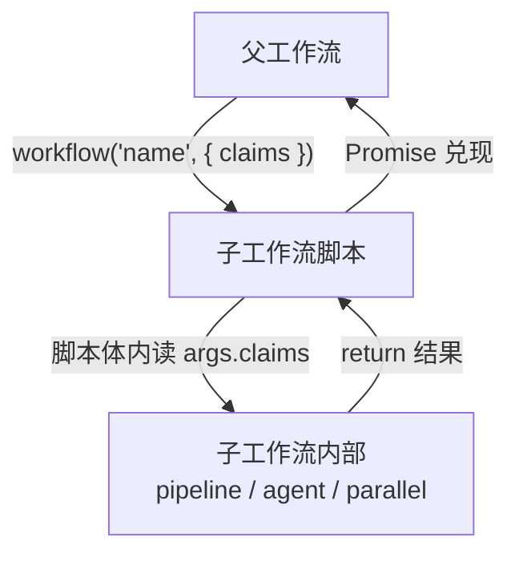
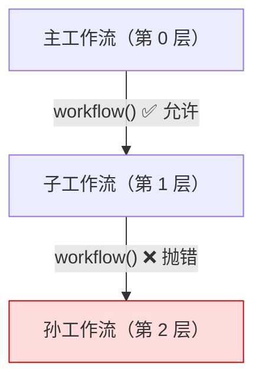
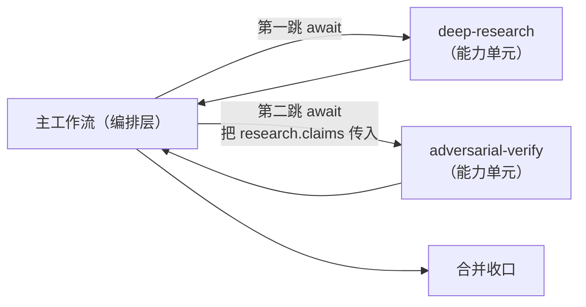
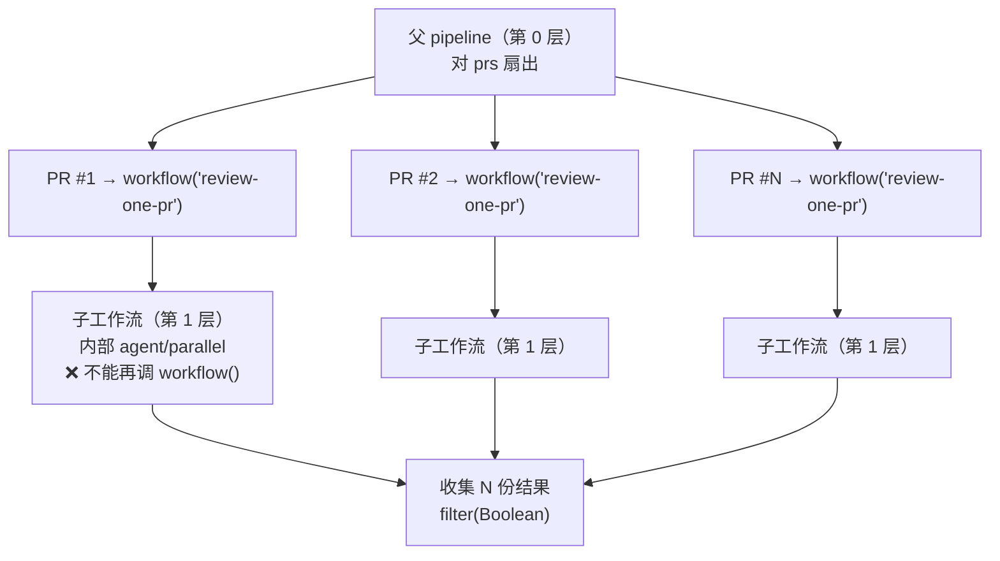

# 第 20 章 · 嵌套 Workflow

> 一句话：**在一个工作流脚本里，用 `workflow(nameOrRef, args?)` 内联调用另一个工作流——把验证过的工作流当作「可复用的子程序」拼装起来。但有一条铁律：嵌套只能一层。**
>
> 这一章讲的是 Workflow 的「模块化」维度。前面我们把 `agent()` 当函数、把 `pipeline` 当控制流；现在我们把**整个工作流**当成一个可被调用的单元——这是构建「工作流库」（第五部）的技术地基。

---

## 20.1 为什么需要嵌套：从复制粘贴到复用

随着你写的工作流变多，会发现一些**模式反复出现**。

比如「对抗验证」（第 17 章）——生成、独立验证、三态判决收口——这套结构你在 Bug 猎手里用、在 PR 审查里用、在文档核查里也用。每次都把那二三十行 `pipeline + verdictSchema` 复制粘贴一遍，是典型的坏味道：

- 改进了验证 prompt，得回到每一处复制点逐一同步。
- 每个调用点的细微差异让它们慢慢漂移，最后谁也不敢动。

软件工程对付重复的标准答案是**抽取成可复用单元**。Workflow 的答案就是 `workflow()`：把「对抗验证」沉淀成一个独立的具名工作流，其他工作流需要时**内联调用**它，像调用一个函数。

```javascript
// （示意，未实跑）—— 主工作流内联调用一个验证子工作流
phase('Review')
const findings = await agent('找出这段代码的问题…', { schema: findingsSchema })

// 把「对抗验证」整个子工作流当函数调用
const verified = await workflow('adversarial-verify', { claims: findings.items })

log(`验证后保留 ${verified.confirmed.length} 项`)
return verified
```

`workflow('adversarial-verify', {...})` 这一行，运行的是另一个完整的工作流脚本（它内部可能有自己的 `pipeline`、自己的多个 `agent()`），把结果作为返回值交回来。**复用的不再是一段代码，而是一个经过验证的、自带 schema 契约的执行单元。**

<div class="callout info">

**官方语义（据 `_grounding.md` B 节）**：`workflow(nameOrRef, args?): Promise<any>` —— 内联运行另一个工作流（具名，或 `{scriptPath}` 引用）。它**共享并发上限 / agent 计数 / 中止信号 / token 预算**。并且——**嵌套仅一层**：子工作流里再调 `workflow()` 会抛错。这两条性质是本章的核心，下面分别展开。

</div>

---

## 20.2 两种调用方式：具名 与 scriptPath

`workflow()` 的第一个参数 `nameOrRef`，对应 `_grounding.md` 里 WorkflowInput 的两种定位方式：

**方式一：具名工作流。** 传一个字符串名字，运行时去找对应的工作流——内置的，或你沉淀在 `.claude/workflows/` 里的。这是复用「已固化、反复使用」的工作流的方式：

```javascript
// （示意，未实跑）—— 按名字调用一个已沉淀的工作流
const result = await workflow('deep-research', { topic: args.topic })
```

**方式二：scriptPath 引用。** 传一个 `{ scriptPath }` 对象，指向磁盘上的某个脚本文件。这对应 `_grounding.md` 里「`scriptPath` 优先级高于 script/name」的规则，适合调用尚未固化为具名工作流、但已落盘的脚本：

```javascript
// （示意，未实跑）—— 按脚本路径调用
const result = await workflow(
  { scriptPath: '.claude/workflows/scripts/verify-stage.js' },
  { claims }
)
```

两种方式的取舍：

| 方式 | 适合 | 类比 |
|---|---|---|
| 具名 `'name'` | 已固化、跨项目复用的标准工作流 | 调用已安装的库函数 |
| `{ scriptPath }` | 项目内、迭代中、尚未命名的工作流 | 调用本地相对路径的模块 |

参数 `args` 的传递规则与顶层调用一致：据 `_grounding.md`，它成为子工作流脚本体内的全局 `args`。所以子工作流读 `args.claims`，就拿到了你传进去的值——**这正是父子工作流之间的数据接口**。



---

## 20.3 铁律：嵌套仅一层

这是本章最重要、也最容易踩的约束。据 `_grounding.md`：**嵌套仅一层——子工作流里再调 `workflow()` 会抛错。**

用图说话：



也就是说：

- **主工作流 → 子工作流**：允许。这是一层嵌套。
- **子工作流 → 孙工作流**：**禁止**，运行时抛错。

为什么是这条规则？可以从几个角度理解（机制层面的确切原因事实源未展开，以下为基于约束的合理推断）：

**防止无限递归与资源失控。** 如果允许任意深度嵌套，一个工作流可以无限地 `workflow()` 下去，配合循环就能炸开成天文数字的 agent。限制为一层，是一道结构性的护栏——它和「单工作流 agent 总数上限 1000」（`_grounding.md`）是同一种「防失控」哲学。

**保持心智模型简单。** 一层嵌套意味着调用关系是「父—子」两级,你永远能一眼看清「谁调了谁」。任意深度的嵌套会让追踪执行、归因 token、调试变得困难。

这条规则对你的设计有一个直接影响：**子工作流必须是「叶子级」的——它自己可以扇出很多 `agent()`、用 `pipeline` / `parallel`，但不能再委派给另一个工作流。** 所以当你设计工作流库时，要把「会被别人调用的」工作流设计成不依赖再调用其他工作流。

<div class="callout warn">

**别试图用嵌套搭多层流水线。** 一个常见的错误念头是「我把大任务拆成 A→B→C 三个工作流，让 A 调 B、B 调 C」——这第二跳（B 调 C）会直接抛错。正确做法是：**在主工作流里用普通 JS 顺序调用** `await workflow('B')` 再 `await workflow('C')`，或者把 B、C 的逻辑用 `pipeline` 的多个 stage 表达。嵌套不是用来做「深度管道」的，它是用来做「主流程复用一个独立子能力」的。

</div>

---

## 20.4 共享的是什么：一个池，不是各管各的

`workflow()` 一个极重要的性质：子工作流**不是**一个全新独立的世界，它和父工作流**共享**几样关键资源。据 `_grounding.md`，共享的是：**并发上限、agent 计数、中止信号、token 预算。**

逐一看清这意味着什么：

| 共享项 | 含义 | 你要注意的 |
|---|---|---|
| **并发上限** | 父子合用同一个 `min(16, CPU−2)` 名额池 | 子工作流的 agent 和父的 agent 抢同一批并发槽位 |
| **agent 计数** | 父子的 agent 数合并计入那个 1000 上限 | 子工作流的扇出会消耗父的全局配额 |
| **中止信号** | 父被中止，子也被中止 | 一处取消，整体停止，不会有「孤儿子流程」 |
| **token 预算** | 父子共用同一个 `budget` 池 | 子工作流烧的 token 直接从父的 `budget.remaining()` 里扣 |

最需要警惕的是**预算共享**。回顾 `_grounding.md`：`budget` 是**硬上限**，`spent()` 达 `total` 后再调 `agent()` 会抛错，且「池为主循环 + 所有工作流共享」。这意味着：

```javascript
// （示意，未实跑）—— 预算是父子共享的同一个池
phase('Pipeline')
// 假设本回合 budget.total = 500k
const a = await workflow('deep-research', { topic })   // 子工作流烧了 300k
// 现在 budget.remaining() 只剩约 200k —— 子工作流的消耗算在了同一个池里
const b = await workflow('adversarial-verify', { claims: a.findings })  // 只能在剩余 200k 内跑
```

如果你天真地以为「每个子工作流有自己的预算」，就会在第二个子工作流处意外撞上预算耗尽的抛错。**正确的心智模型是：无论嵌套与否，整个回合就一个 token 池、一个并发池、一个 agent 计数器。** `workflow()` 只是把活儿组织得更模块化，并没有变出额外的资源。

<div class="callout tip">

**这其实是好事。** 共享池意味着你在主工作流里设的 `budget` 上限，会**自动覆盖**所有被它调用的子工作流——你不必在每个子工作流里重复设防。一处设上限，整棵调用树都受这个上限约束。中止信号同理：用户取消主流程，所有子流程一起干净停止，不留后台孤儿。**共享池是「整体可控」的保证，而不是限制。**

</div>

---

## 20.5 典型模式：用子工作流拼装主流程

把前面几节合起来，看一个把「研究 + 验证」两个独立能力拼装起来的主工作流。

```javascript
// （示意，未实跑）—— 主流程内联复用两个子工作流
export const meta = {
  name: 'research-and-verify',
  description: '先调研究子工作流产出论断，再调验证子工作流逐条核验',
  phases: [{ title: 'Research', detail: '调研究子工作流' }, { title: 'Verify', detail: '调验证子工作流' }],
}

phase('Research')
// 第一跳：复用「深度研究」子工作流
const research = await workflow('deep-research', { topic: args.topic })
log(`研究产出 ${research.claims.length} 条论断`)

phase('Verify')
// 第二跳：在主流程里顺序调用另一个子工作流（不是在 research 内部调！）
const verified = await workflow('adversarial-verify', { claims: research.claims })

return {
  topic: args.topic,
  confirmed: verified.confirmed,
  refuted: verified.refuted,
}
```

请特别注意这里的**两跳都发生在主工作流（第 0 层）**——`research` 和 `verify` 是**平级的、顺序的**两次调用，由主工作流用普通 `await` 串起来。这与「让 `deep-research` 内部去调 `adversarial-verify`」（那会触发第 2 层嵌套、抛错）有本质区别。

这就是 20.3 节那条铁律的实践推论：**多步复用靠主流程的顺序/控制流来编排，而不是靠子工作流互相调用。** 主工作流是唯一的「编排层」，子工作流都是它直接调用的「能力单元」。



子工作流之间的数据流，依然走 `args` 进、`return` 出这条标准通道：`research.claims` 是第一个子工作流的返回值，作为 `args.claims` 喂给第二个。**这与第 07 章「schema 是阶段间契约」的思想一脉相承**——只不过这里的「阶段」是整个子工作流，契约是它的输入 `args` 形状与输出结构。

---

## 20.6 嵌套 vs 不嵌套：什么时候真的需要 workflow()

`workflow()` 很优雅，但不是所有「复用」都需要它。很多时候，直接在脚本里写 JS 函数就够了，甚至更好。分清两者：

| 你想复用的是… | 用什么 | 理由 |
|---|---|---|
| 一段**纯计算**逻辑（去重、聚合、格式化） | 普通 JS 函数 | 确定性、零 agent 成本，不该动用 workflow |
| 一个 **schema 定义** | 一个 `const schema = {...}` 变量 | 直接共享对象即可 |
| 一段**固定的 prompt 模板** | 一个返回字符串的 JS 函数 | 轻量，无需工作流开销 |
| 一个**完整的、含多 agent 编排的能力单元** | `workflow()` | 这才是嵌套的正当用途 |
| 一个**已固化、跨项目复用**的标准流程 | 具名 `workflow('name')` | 沉淀为库，像调用第三方能力 |

<div class="callout warn">

**不要为了「看起来模块化」而过度嵌套。** 如果一个「子工作流」内部其实只有一个 `agent()` 调用，那它根本不配做工作流——把它写成主脚本里的一个 `agent()` 调用或一个返回 `agent(...)` 的 JS 函数就好。`workflow()` 的开销与心智成本（独立脚本、独立 meta、跨文件追踪）只有在被复用的单元**本身就是一套完整编排**时才划算。**判断标准：这个单元如果不复用、直接内联进主脚本，会不会让主脚本臃肿到难以理解？** 会，才值得抽成子工作流。

</div>

---

## 20.7 与 Agent Teams 的边界

最后澄清一个容易混淆的点。Workflow 的 `workflow()` 嵌套，和 Agent Teams（`CLAUDE_CODE_EXPERIMENTAL_AGENT_TEAMS`，见 `_grounding.md` A 节关联标志）听起来都像「让多个执行单元协作」，但它们是**完全不同**的东西，第 01 章已划过界，这里从「组合」角度再强调：

| | `workflow()` 嵌套 | Agent Teams |
|---|---|---|
| 本质 | 一个工作流调用另一个工作流（确定性脚本） | 有状态、可互相通信的长期协作团队 |
| 控制流 | 父工作流的 JS 代码完全决定 | 团队成员通过消息动态协商 |
| 状态 | 无状态、一次性、可重放 | 有状态、可往返对话 |
| 嵌套 | 仅一层 | 不适用（是另一套模型） |

简言之：**`workflow()` 是「确定性地把子流程拼进主流程」，Agent Teams 是「让多个有状态 agent 像团队一样协作」。** 当你的复用单元是一段「输入→确定性编排→输出」的纯流程时，用 `workflow()`；当你需要的是成员之间动态、有状态的来回协商时，那是 Agent Teams 的领域，不在本书 Workflow 的范畴内。

---

## 20.9 招牌组合：每个条目本身是一整个 Workflow

前面 20.5 节讲的是「主流程顺序拼装几个子工作流」。把它和 `pipeline`（第 08 章）叠在一起，就得到嵌套 Workflow 最具代表性的形态——**父流程是对一批条目的 `pipeline`，而每个条目都被委派给一个具名子工作流独立处理。**

最经典的例子就是「审 10 个 PR」：

```javascript
// （示意，未实跑）父 pipeline，每个 PR 交给一个子 workflow 独立处理
const results = await pipeline(
  prs,
  pr => workflow('review-one-pr', { pr }),   // 每个条目本身是一整个 workflow
)
```

读这段代码：`prs` 是待审的一批 PR；`pipeline` 让每个 PR **独立流过**这条链；而链上的那个 stage 不是一个 `agent()`，而是一整个 `workflow('review-one-pr', { pr })`——**每个条目都触发一次完整的子工作流**。子工作流 `review-one-pr` 内部可以自己扇出多个 `agent()`（按维度审、对抗验证、汇总），把「审一个 PR」这件事完整封装起来。父流程只负责「把 N 个 PR 分发出去、收集 N 份结果」，单个 PR 怎么审的复杂度被收进子工作流里。

这正是 20.1 节「从复制粘贴到复用」的终点形态：**「审一个 PR」沉淀为一个具名能力单元，「审一批 PR」只是对它做 `pipeline` 扇出。** 加一个 PR、改审查逻辑，都只动一处。

但有三条约束必须时刻记牢，它们都是前几节铁律在这个形态下的直接推论：

**其一，仍然只有一层。** 这里的嵌套深度依然是「父 pipeline（第 0 层）→ `review-one-pr`（第 1 层）」——正好一层。所以 `review-one-pr` 的脚本体内**绝不能再调 `workflow()`**：据 `_grounding.md`，子工作流里再调 `workflow()` 会抛错。`review-one-pr` 必须是「叶子级」的，它可以用 `agent()` / `parallel` / 内部 `pipeline` 任意扇出，但不能再委派给另一个工作流。如果你发现 `review-one-pr` 想调用又一个子工作流，说明该把那段逻辑直接内联进它自己的脚本，或上提到父 pipeline 这一层来编排。

**其二，所有子工作流的 agent 与 token 都计入父的同一个池。** 据 `_grounding.md`，`workflow()` 共享并发上限 / agent 计数 / 中止信号 / token 预算（详见 20.4 节）。所以这个形态下，**总 agent 数 ≈ PR 数 × 每个 `review-one-pr` 内部的 agent 数**，全部合并计入父的 1000 上限与父的 `budget` 池。审 10 个 PR、每个子工作流内部用 4 个 agent，就是约 40 个 agent 一起从同一个预算里扣——规模放大很快，务必结合第 21 章的预算自适应来收口。

**其三，子工作流抛错 → 该条目变 `null`。** 这是 `pipeline` 的既有语义（第 08 章）：某个 PR 的 `review-one-pr` 内部抛错，该位置变 `null` 并跳过，不影响其余 PR。消费前照例 `results.filter(Boolean)`。

<div class="callout info">

**这个形态的「一层嵌套 + 共享池」两条性质，已被本章引用的真实运行 `wf_85e22b38-126` 实测验证。** 据 `_grounding.md` C 节，该次 nested workflow() 运行证实了两件事：①子工作流的 agent **计入父**（`agent_count=1` 归到父的计数里）；②**嵌套仅一层**的约束真实存在。本节这段「pipeline-of-nested」组合**本身未单独实跑**（故标「（示意，未实跑）」），但它只是把已验证的 `workflow()`（`wf_85e22b38-126`）放进同样已验证的 `pipeline`（`wf_bf086b98-6ec`，见第 08 章）里——两块都是实测过的积木，组合方式是标准 JS。

</div>



---

## 20.8 本章小结

- `workflow(nameOrRef, args?)` 在一个工作流里**内联调用另一个工作流**，把验证过的工作流当作可复用的「能力单元」，是构建工作流库的地基。
- 两种定位：**具名**（`'name'`，调用已固化/跨项目的标准工作流）与 **`{ scriptPath }`**（调用项目内、迭代中的脚本）。`args` 进、`return` 出是父子间的数据接口。
- **铁律：嵌套仅一层。** 子工作流里再调 `workflow()` 会抛错。多步复用靠**主流程的顺序/控制流**编排（主工作流是唯一编排层），而非子工作流互相调用。
- **共享一个池**：父子合用同一个并发上限、agent 计数（计入 1000 上限）、中止信号、token 预算（`budget` 硬上限对整棵调用树生效）。心智模型——整回合就一个资源池，`workflow()` 不变出额外资源。
- 取舍：纯计算用 JS 函数、schema 用共享变量、prompt 用模板函数；只有**完整的多 agent 编排单元**才值得抽成 `workflow()`。别为「看起来模块化」过度嵌套。
- 招牌组合（20.9）：**父 `pipeline` 扇出、每个条目本身是一整个子工作流**（如「审 10 个 PR」），是「复用」的终点形态。仍受一层嵌套约束（子工作流内不能再调 `workflow()`），且所有子工作流的 agent / token 合并计入父的同一个池。
- 与 Agent Teams 划界：`workflow()` 是确定性子流程拼装；Agent Teams 是有状态协作团队，不在本书范畴。

下一章，我们深入那个反复出现的「共享资源池」里最关键的一项——token 预算：如何用 `budget.total` / `remaining()` 让工作流**根据剩余预算动态调整规模**。

> 继续阅读：[第 21 章 · 动态预算与规模化](#/zh/p4-21)
