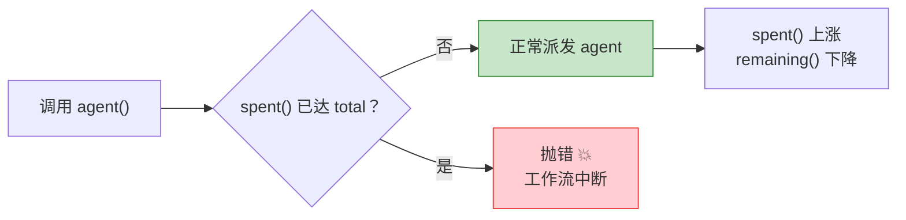
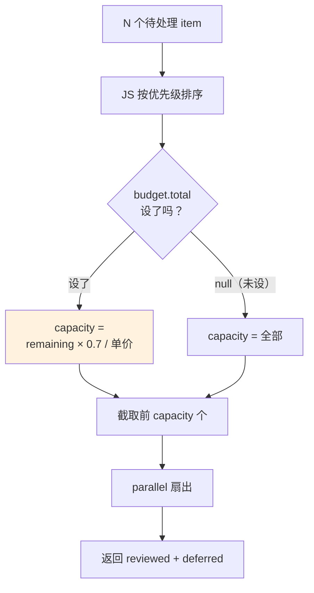
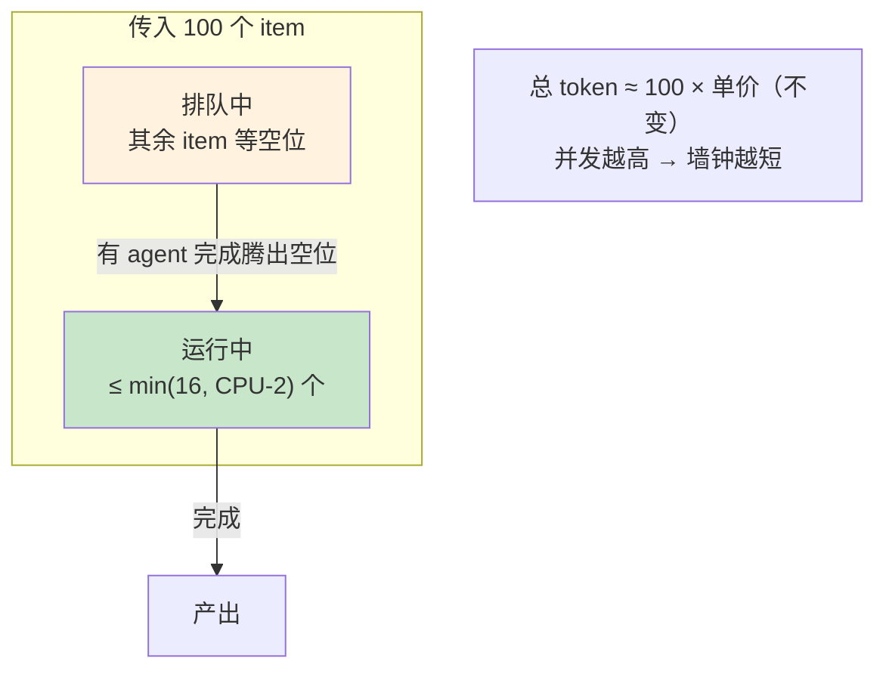

# 第 21 章 · 动态预算与规模化

> 一句话：**`budget` 让你的工作流在运行时『看一眼钱包还剩多少』，据此动态决定扇出多少 agent、要不要降级到便宜模型——把『花多少 token』从一个赌注，变成一个能算、能自己调的工程量。**
>
> 前面的配方大多把规模写死：五个维度就五路并行，三项就三段 pipeline。但生产环境里，规模常常是**变量**——「审查这次 PR」可能改了 3 个文件，也可能改了 80 个。一刀切地「每个文件派一个 agent」，3 个文件时浪费，80 个文件时又可能跑到一半把预算烧光、`agent()` 直接抛错。这一章教你用 `budget` 把规模**绑到预算上**，让工作流自己量入为出。

---

## 21.1 `budget`：运行时注入的「钱包」

第 01 章列过全局钩子，第 18 章用 `budget` 给循环做过刹车。这一章我们把它**讲透**——因为「动态规模化」的每一个决策，都建立在对 `budget` 三个成员的精确理解上。

`budget` 是运行时注入脚本的一个全局对象（不用 import），它反映**本回合**的 token 目标和消耗（据 `_grounding.md` B 节）：

```javascript
budget.total        // number | null：本回合的 token 目标
budget.spent()      // number：本回合已花的 output token
budget.remaining()  // number：还剩多少；= max(0, total - spent())
```

三者的精确语义，一个个钉死：

### `budget.total`：目标从哪来，可能是 `null`

`total` 是**本回合的 token 目标**，它来自用户的指令——比如用户说一句「`+500k`」，`total` 就是对应的那个目标值。

<div class="callout warn">

**头号陷阱：用户没设目标时，`total` 是 `null`，`remaining()` 是 `Infinity`。** 这不是「0」，也不是「没限制就等于很小」——是**无穷大**。任何「余量够不够」的判断，都必须先用 `budget.total` 分清「用户到底设没设目标」这两种情况，否则你的自适应逻辑在「未设预算」时会全部失效（拿 `Infinity` 去比，所有阈值判断都恒为真）。后面 21.3 会反复用到这个守卫。

**`total === null` 不是推测，是实测。** 本书的沙箱自省探针（Run `wf_59bf3654-183`，0 agent / 0 token / 4ms）在没设预算目标的会话里，直接读出 `budget` 已经注入（`typeof budget === 'object'`），而且 `budget.total === null`。所以「没设目标 → `total` 为 `null`」是本机实测确认的行为，不是从类型签名脑补出来的。

</div>

### `budget.spent()`：是个函数，而且是**共享池**

注意 `spent()` 和 `remaining()` 是**函数**（得带括号调用），因为它们的值会随工作流推进**实时变**——每派一个 agent、它一吐 token，`spent()` 就往上涨。

还有更关键的一点：**这个池是「主循环 + 所有工作流」共享的**（`_grounding.md` B 节）。也就是说，`spent()` 算进去的不只是你这个工作流花的，还有主循环本身、以及同回合起来的其他工作流花的。你不是一个人占着整个预算，而是和别人**共用一个钱包**——这就让「量入为出」更有必要了。

### `budget.remaining()`：硬上限，超了会**抛错**

`remaining()` 返回 `max(0, total - spent())`。它最要紧的性质是：**`budget` 是一个硬上限**——一旦 `spent()` 达到 `total`，再调用 `agent()` 会**直接抛错**（`_grounding.md` B 节）。

这就是「动态规模化」必须存在的根本原因：

> **你要是不主动量入为出，预算一耗尽 `agent()` 就会抛错——你的工作流会在跑到一半时『撞墙』崩掉，已经派出去的 agent 全白跑。** 与其被动撞墙，不如主动一点：「先看钱包，再决定派几个」。



<div class="callout info">

**「会抛错」是官方明确的行为；但「抛的是哪个异常类、在途的 agent 怎么处置」本书未实测。** 「`spent()` 达 `total` 后再调 `agent()` 抛错」来自官方工具定义，可以放心采信。但这个错误的**具体类名**（社区第三方资料称作 `WorkflowBudgetExceededError`）、还有「预算耗尽时已经在途的 agent 是否跑完、结果保不保留、是不是只是不再启新 agent」这类**精细处置语义**——都属于社区第三方资料声称、本书未独立触发复现。本章不靠它们：所有模式都建立在「**主动量入为出、根本别撞到这个上限**」之上，而不是去 `catch` 某个特定异常类。所以写代码时**别假设**能捕获到某个具名异常，也别假设撞墙后在途结果一定保留——把预算守卫摆在前面，比事后接异常可靠得多。

</div>

<div class="callout tip">

**`budget` 的设计哲学，是「把成本变成一等公民」。** 在手动编排里，「这次要花多少 token」是个事后才知道的黑盒；`budget` 让它变成脚本运行时**读得到、还能拿来做决策**的变量。第 02 章说「代码即控制流」——`budget` 则让它变成「代码即**成本控制**流」。

</div>

---

## 21.2 成本的可预测性：用真实数据建立「每 agent 单价」

想「量入为出」，先得知道「一个 agent 大概花多少」。这正是本书一直坚持记录真实运行的价值所在。三组真实数据（`assets/transcripts/primitives.md`，同一会话实测）：

| 真实运行 | agent 数 | total_tokens | 单 agent 摊销 |
|---|---|---|---|
| hello（单 agent + schema） | 1 | 26,338 | ~2.6 万 |
| parallel（3 agent 并发） | 3 | 78,844 | ~2.6 万 |
| pipeline（6 agent，3 项×2 阶段） | 6 | 158,982 | ~2.6 万 |

> 三组数据高度一致地落在 **~2.6 万 token / agent**。`_grounding.md` C 节据此给出一条经验法则：**token ≈ agent 数 × 每 agent 上下文（约 2.5–3 万 / agent）**。

这条法则是动态规模化的**定价基础**。有了它，规模和成本就能互相换算：

- **正算（规模 → 成本）**：要派 N 个 agent？预估成本 ≈ N × 2.6 万。
- **反算（预算 → 规模）**：还剩 `remaining()` token？最多还能派大约 `remaining() / 2.6万` 个 agent。

<div class="callout warn">

**这个「单价」是量级估计，不是精算。** 真实的单 agent token 受三个因素影响会大幅浮动：①**提示词长度**（喂进去的上下文越大越贵）；②**产物大小**（schema 越复杂、要的输出越多越贵）；③**任务难度**（需要多轮工具调用的 agent，远比一次问答贵）。所以做预算决策时，**单价要往高里估、规模要留出安全边际**（下文用 `SAFETY = 0.7` 之类的系数）。把 2.6 万当「轻量 agent 的下限」，重活按 4–6 万估更稳妥。

</div>

---

## 21.3 模式一：动态扇出——据余量决定派几个

第一个、也是最常用的动态规模化模式：**手上有一批待处理的 item（文件、模块、问题），但不一定全派 agent——而是看预算够派几个，就先处理几个最重要的。**

### 朴素版的危险

先看反面教材：不管预算，全量扇出。

```javascript
// ⚠️ 危险：不看预算，文件多时会中途撞墙抛错（示意，未实跑）
const results = await parallel(
  files.map(f => () => agent(`审查 ${f}`, { schema: REVIEW }))
)
```

`files` 有 80 个时，这会一次性排队 80 个 agent（受 `min(16, CPU-2)` 并发上限节流，但**总量**还是 80）。预估成本 80 × 2.6 万 ≈ **208 万 token**。要是用户只给了 `+500k`，跑到第 19 个 agent 左右 `spent()` 就触顶，第 20 个 `agent()` 调用**抛错**，整个工作流中断——而你已经为前 19 个白花了钱，连一份完整结果都还没拿到。

### 自适应版：先算「能派几个」，再派

正确做法是**先反算出规模上限，再据此截取**：

```javascript
// 自适应扇出：据剩余预算决定处理多少 item（示意，未实跑）
export const meta = {
  name: 'adaptive-fanout',
  description: '据剩余预算动态决定扇出规模，按优先级截取',
  phases: [{ title: 'Review' }],
}

const PER_AGENT = 50000   // 单 agent 成本上界（审查类偏重，按 5 万估）
const SAFETY = 0.7        // 安全系数：只用 70% 余量，给主循环和收尾留余地

// 1) 先按重要性排序（确定性操作，用 JS 做）
const ranked = args.files.slice().sort((a, b) => b.churn - a.churn)  // 改动量大的优先

// 2) 反算：这一回合最多能派几个 agent
let capacity
if (budget.total) {
  capacity = Math.floor((budget.remaining() * SAFETY) / PER_AGENT)
} else {
  capacity = ranked.length   // 用户未设预算（total=null）→ 不额外设限
}
const toProcess = ranked.slice(0, Math.max(1, capacity))   // 至少处理 1 个

log(`预算余量 ${budget.total ? budget.remaining() : '∞'}，` +
    `本回合处理 ${toProcess.length}/${ranked.length} 个文件`)

// 3) 在容量内扇出
phase('Review')
const results = (await parallel(
  toProcess.map(f => () => agent(`审查 ${f.path}`, { label: f.path, schema: REVIEW }))
)).filter(Boolean)

// 4) 诚实交代：哪些因预算没处理
return {
  reviewed: results,
  processed: toProcess.length,
  deferred: ranked.slice(toProcess.length).map(f => f.path),  // 没轮到的，如实列出
}
```

这个模式有三个要点：

1. **排序用 JS，不用 agent。** 「按改动量排序」是确定性操作，交给 `Array.sort` 就行，零成本、还能重放（呼应第 18 章「确定性操作交给代码」的纪律）。
2. **`budget.total` 守卫从头贯到尾。** 没设预算（`null`）时不额外设限——因为这时 `remaining()` 是 `Infinity`，反算会算出一个没意义的巨大值。
3. **老实交代 `deferred`。** 因为预算没处理的 item 要如实返回，而不是假装全做完了——这样调用方就能「追加预算、之后再把剩下的跑掉」（甚至用第 22 章的断点续传）。



---

## 21.4 模式二：动态降级——预算紧张就用便宜模型

第二个模式用的是 `agent()` 的 `model` 选项（`_grounding.md` B 节）：**预算宽裕时用强模型（继承主循环模型；本书实测会话为 Opus 4.7），预算紧张时把一部分 agent 降级到 `'haiku'`**——拿质量换覆盖率。

`agent()` 的 `model` 选项：省略就继承主循环模型（推荐默认），也可以显式覆盖。简单任务用 `'haiku'` 能大幅降本。

```javascript
// 据预算余量动态选模型（示意，未实跑）
function pickModel() {
  if (!budget.total) return undefined            // 未设预算：用默认（继承主循环）
  const ratio = budget.remaining() / budget.total
  if (ratio > 0.5) return undefined              // 余量过半：维持强模型
  if (ratio > 0.2) return 'haiku'                // 余量吃紧：降级提速降本
  return 'haiku'                                 // 余量告急：能跑完比跑得好更重要
}

phase('Triage')
const results = (await parallel(
  items.map(it => () => agent(`分类：${it.title}`, {
    label: it.title,
    model: pickModel(),       // 运行时据余量决定
    schema: TRIAGE,
  }))
)).filter(Boolean)
```

<div class="callout tip">

**降级是一种「优雅退化」（graceful degradation）。** 与其在预算告急时硬撑着强模型、跑到一半撞墙崩掉，不如降到 haiku 把**所有** item 都覆盖一遍——拿到一份「全覆盖但精度略低」的结果，往往比「只覆盖一半、但每条都精」更有用。具体怎么取舍，取决于任务：分类、初筛这类适合降级保覆盖；安全审计这种「宁缺毋滥」的就不适合降级。**这个判断应该由你写进代码，而不是让模型临场决定。**

</div>

<div class="callout warn">

**降级要在「扇出前」一次性定下来，别在循环里反复横跳。** 如果你在一个长 `pipeline` 里每个 item 都重新 `pickModel()`，可能跑出「前一半强模型、后一半 haiku」的割裂结果，让产物质量不一致、还难以汇总。更稳的做法：**进扇出前先评估一次余量，定下本批次统一的模型策略**；只有在分批、分轮（比如第 18 章的循环）之间才重新评估。</div>

---

## 21.5 规模化的硬边界：并发上限与 1000 兜底

动态扇出再聪明，也跑在两条**运行时硬边界**之内。做规模化必须把它们记在心里（`_grounding.md` B 节 / A2 节「官方硬约束」）：

| 边界 | 值 | 含义 |
|---|---|---|
| **单工作流并发上限** | `min(16, CPU 核心数 − 2)` | 同时**运行**的 agent 数；超出的**排队**，有空位再跑 |
| **单工作流 agent 总数上限** | **1000** | 整个工作流生命周期内派发的 agent 总数兜底，防失控循环 |

这两条边界的关键区别——**并发上限管「同时几个」，总数上限管「一共几个」**：

### 并发上限：不限总量，只限「同时」

你**可以**给 `parallel()` / `pipeline()` 传 100 个 item，它们**全都会完成**——只是任意时刻只有约 `min(16, CPU-2)` 个在真正跑，其余的排队（`_grounding.md` A 节）。所以并发上限**不是**「最多只能处理 16 个」，而是「同时最多 16 个在跑」。

这对成本意味着什么？**并发上限影响的是墙钟，不是总 token。** 100 个 agent，不管你并发 8 个还是 16 个，总 token 都约等于 100 × 单价；只是并发越高、墙钟越短（同时跑的 agent 更多）。



### 1000 总数兜底：失控循环的最后安全网

单个工作流的生命周期内，agent 总数上限是 **1000**。这是防止失控循环（比如第 18 章那种写错的无界 `while`）烧穿一切的最后一道安全网。

<div class="callout warn">

**绝不要把 1000 兜底当成业务退出机制。** 它是「安全网」，不是「围栏」——等你撞到 1000 时，早就烧掉约 1000 × 2.6 万 ≈ **2600 万 token** 了。真正的规模控制，应该靠你显式的 `budget` 守卫和轮次上限（第 18 章），远在 1000 之前就收住。你可以把 1000 理解成「万一我写的所有闸门都失效了，运行时还会拉我一把」——但你不该让代码走到那一步。

</div>

---

## 21.6 综合骨架：预算感知的批处理

把三件事——动态扇出、动态降级、边界意识——拧成一个生产骨架：处理一批数量不定的 item，据预算决定**处理多少**、**用什么模型**，最后老实交代结果。

```javascript
// 预算感知批处理（示意，未实跑）
export const meta = {
  name: 'budget-aware-batch',
  description: '据剩余预算动态决定扇出规模与模型，量入为出地处理一批 item',
  phases: [{ title: 'Plan' }, { title: 'Process' }],
}

// —— 定价参数（按任务调，重活往高估）——
const PER_AGENT = 50000     // 单 agent 成本上界
const SAFETY    = 0.7       // 安全系数

phase('Plan')
// 1) 确定性预处理：排序（最重要的优先）
const ranked = args.items.slice().sort((a, b) => b.priority - a.priority)

// 2) 反算容量 + 选模型（统一策略，一次定）
const hasBudget = !!budget.total
const capacity  = hasBudget
  ? Math.max(1, Math.floor((budget.remaining() * SAFETY) / PER_AGENT))
  : ranked.length
const model = (() => {
  if (!hasBudget) return undefined
  const ratio = budget.remaining() / budget.total
  return ratio > 0.5 ? undefined : 'haiku'   // 余量过半维持强模型，否则降级保覆盖
})()

const batch    = ranked.slice(0, capacity)
const deferred = ranked.slice(capacity)

log(`预算 ${hasBudget ? budget.remaining() : '∞'}；` +
    `处理 ${batch.length}/${ranked.length}；模型 ${model || '默认（继承主循环）'}；` +
    `预估成本 ~${(batch.length * PER_AGENT / 1000).toFixed(0)}k token`)

// 3) 在容量内扇出
phase('Process')
const done = (await parallel(
  batch.map(it => () => agent(`处理：${it.title}`, {
    label: it.title, model, schema: RESULT,
  }))
)).filter(Boolean)

// 4) 诚实返回（含未处理项与停因，便于追加预算续跑）
return {
  processed: done,
  count: done.length,
  deferred: deferred.map(it => it.title),
  modelUsed: model || 'inherited',
  budgetAtStart: hasBudget ? budget.total : null,
  spentApprox: budget.spent(),
}
```

这个骨架体现了「预算感知工作流」的核心做法：**先规划（看钱包、定规模、选模型），再执行（在容量内扇出），最后老实交代（处理了什么、还欠什么、花了多少）。**

<div class="callout info">

**为什么把 `Plan` 单列成一个 phase？** 因为「看预算、排序、算容量、选模型」这些**纯 JS** 的决策几乎不花 token，却决定了 `Process` 阶段的全部成本规模。把它单拎成一个阶段（哪怕里头没有 agent），既让 `/workflows` 进度更好读，也提醒读代码的人：**规模决策是发生在扇出之前的一个独立动作**，不是混在循环里临时拍板的。

</div>

---

## 21.7 与第 18、22 章的分工

`budget` 在本书这三章里各有侧重，别混为一谈：

| 章 | budget 的角色 | 关键动作 |
|---|---|---|
| **第 18 章 循环到干** | 循环的**刹车**之一 | `budget.total && remaining() < PER_ROUND` → 提前收尾 |
| **本章（第 21 章）** | 规模的**调节阀** | 据 `remaining()` 反算扇出规模、动态选模型 |
| **第 22 章 续传** | 跨运行的**省钱手段** | 改一步后续传，未变 agent 命中缓存、不重花 token |

三者互相正交、可以叠加：一个工作流完全可以**据预算决定扇出规模（本章）→ 在循环里用预算刹车（18 章）→ 改完脚本续传省钱（22 章）**。

<div class="callout tip">

**一句话记住本章模式：** 别写「不管预算、全量扇出」的工作流——那是在赌预算够用，赌输了就中途抛错崩掉。要写「先看钱包、反算能做几个、量入为出、老实交代欠账」的工作流。**把成本当成一个运行时变量来编程，而不是一个事后才知道的黑盒。**

</div>

---

## 21.8 本章小结

- **`budget` 是运行时注入的「钱包」**：`total`（本回合目标，**用户未设时为 `null`**）、`spent()`（已花，是函数，**主循环+所有工作流共享池**）、`remaining()`（余量，**未设时为 `Infinity`**）。它是**硬上限**——`spent()` 达 `total` 后再调 `agent()` 会**抛错**。
- **头号守卫**：任何余量判断都先写上 `budget.total &&`，分清「设了预算」和「`null`/`Infinity`」两种情况，否则自适应逻辑在未设预算时失效。
- **定价基础**：真实数据一致显示 **~2.6 万 token / agent**；据此可以正算（N agent ≈ N×2.6 万）、反算（余量 / 单价 ≈ 还能派几个）。单价往高估、留安全系数。
- **模式一 动态扇出**：JS 排序定优先级 → 据 `remaining()×SAFETY/单价` 反算容量 → 截取处理 → 老实返回 `deferred`。
- **模式二 动态降级**：据 `remaining()/total` 的比例选 `model`，预算紧张就降到 `'haiku'` 换覆盖率；**扇出前一次性定、别在循环里横跳**。
- **硬边界**：并发上限 `min(16, CPU-2)`（管「同时几个」，影响墙钟、不影响总 token，超出的排队、但全会完成）；agent 总数上限 **1000**（失控兜底，绝非业务退出机制）。
- 本章脚本都是**结构示意（未实跑）**；token 量级（hello/parallel/pipeline）是 `assets/transcripts/primitives.md` 里的真实数据。

下一章是进阶篇的收官：一条长流水线跑到一半要改其中一步，怎么**不从头重跑**——`resumeFromRunId` 断点续传加缓存，让「同样的脚本必然产生同样的执行」这条铁律，变成真金白银的省钱利器。

> 继续阅读：[第 22 章 · 断点续传与缓存](#/zh/p4-22)
