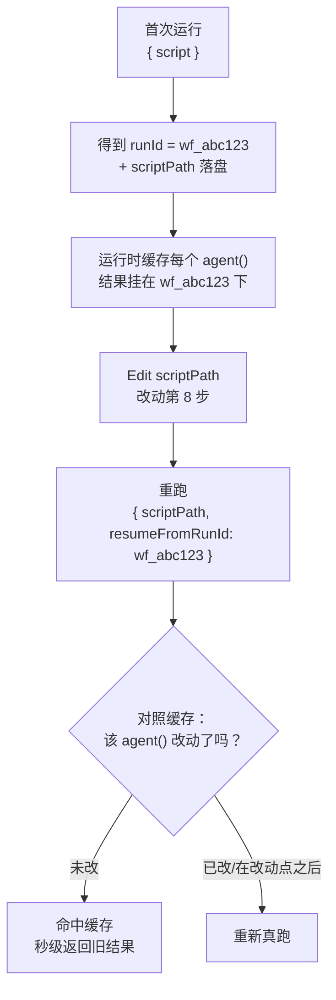
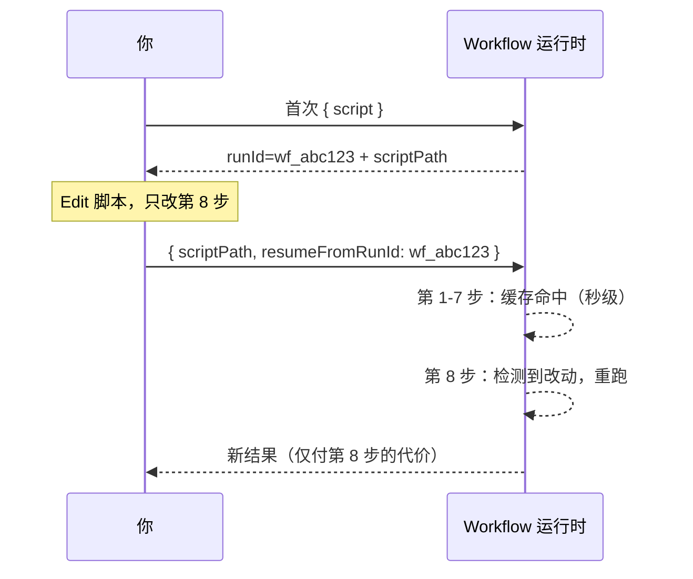

# 第 22 章 · 断点续传与缓存

> 一句话：**改了长流水线的第 8 步，前 7 步昂贵的结果直接秒级复用——这就是断点续传（resume）。用 `{ scriptPath, resumeFromRunId }` 重跑，未改动的 `agent()` 调用命中缓存，只有被编辑的及其之后的才重新真跑。**
>
> 这是进阶篇的收官一章，也是把前面所有「昂贵的多 agent 流水线」变得**可迭代**的关键。它还揭晓了一个贯穿全书的禁令的最终原因——为什么脚本里不准用 `Date.now()` 和 `Math.random()`。

---

## 22.1 痛点：改一步，却要从头再跑一遍

设想你写了一条 8 阶段的深度研究流水线，每阶段扇出若干 agent，整条跑下来 50 万 token、几分钟。跑完一看，第 8 步（最终报告的措辞）不太满意，你改了那一步的 prompt。

如果没有续传，你只能**从头再跑整条流水线**——前 7 步那 40 多万 token 的工作，明明结果完全没变，却要重新烧一遍、重新等几分钟。这在迭代一条长流水线时是灾难性的：你每调一次末尾的措辞，就要付一次全程的代价。

断点续传就是为消灭这种浪费而生。它的承诺是：

> **同样的脚本 + 同样的 args → 100% 缓存命中。** 只有你**改动过**的 `agent()` 调用（以及它之后的调用）才会重新真跑；没动的，秒级返回上次的结果。

于是迭代长流水线变成：改第 8 步 → 重跑 → 前 7 步瞬间命中缓存 → 只有第 8 步真跑。几秒钟，而不是几分钟。

<div class="callout info">

**官方语义（据 `_grounding.md` A/B 节）**：`WorkflowInput.resumeFromRunId?: string` —— 断点续传：**未改动的 `agent()` 调用返回缓存结果；仅同会话**。配合 `scriptPath`（磁盘脚本路径，每次调用都会落盘）使用。`WorkflowOutput` 里的 `runId`（形如 `wf_...`）就是续传时要传给 `resumeFromRunId` 的值。

</div>

---

## 22.2 机制：脚本即文件 + runId 锚点

要理解续传怎么工作，得先回顾两个第 01 章讲过的事实，它们在这里合体：

**事实一：脚本即文件。** 据 `_grounding.md`，每次调用 Workflow，运行时都把脚本**落盘**到会话目录下的一个 `.js` 文件，并在返回里给出 `scriptPath`。这意味着你的工作流不是一段转瞬即逝的字符串，而是一个**磁盘上可编辑的文件**。

**事实二：每次运行有一个 runId。** 据 `_grounding.md`，`WorkflowOutput` 返回 `runId`（形如 `wf_...`）。它是这次运行的唯一标识——也是这次运行所有 agent 结果缓存的**锚点**。

续传就是把这两者拼起来：

1. 第一次跑：得到 `runId`（如 `wf_abc123`）和落盘的 `scriptPath`。运行时把每个 `agent()` 调用的结果，按其在脚本中的「身份」缓存起来，挂在这个 `runId` 下。
2. 你 `Edit` 那个 `scriptPath` 文件，改动其中某个 `agent()` 调用。
3. 重跑：传 `{ scriptPath, resumeFromRunId: 'wf_abc123' }`。运行时对照缓存——**没改的 `agent()` 调用直接取缓存结果**，改了的（及其之后的）重新执行。



这个迭代循环（改文件 + `scriptPath` 重跑）也正是第 01 章提到的「想迭代？直接 Write/Edit 那个文件，再用 `{ scriptPath }` 重新调用，无需重发整段脚本」的完整形态——续传只是给它加上了「`resumeFromRunId` 复用缓存」这一关键能力。

<div class="callout warn">

**「仅同会话」是一条硬限制。** 据 `_grounding.md`，断点续传只在**同一个会话**内有效。换句话说，缓存的生命周期绑定当前会话——你不能关掉 Claude Code、明天再用昨天的 `runId` 续传。所以续传是「**本次迭代会话内**反复调一条流水线」的利器，不是「跨天恢复进度」的持久化方案。需要跨会话持久化的状态，要靠别的手段（如让 agent 把产物写到磁盘文件，见第 19 章控制面/数据面思想）。

</div>

---

## 22.3 揭晓禁令：为什么不准用 Date.now() 和 Math.random()

现在，我们终于可以回答第 01、02 章反复出现却一直没完全展开的那个禁令了。

据 `_grounding.md`「硬约束」：脚本**禁用 `Date.now()` / `Math.random()` / 无参 `new Date()`**。第 01 章给的理由是「它们会破坏可重放性」。这一节讲清楚**为什么续传需要可重放，以及这两个函数怎么破坏它**。

续传的整个前提是「**同样的脚本必然产生同样的执行**」——只有这样，运行时才能判定「这个 `agent()` 调用没变，可以用缓存」。这个判定依赖一个假设：**脚本的逻辑是确定性的、可重放的**——同样的输入，每次跑到这里的状态都一样。

`Date.now()` 和 `Math.random()` 恰恰**违背**了这个假设：

- `Date.now()`：每次调用返回不同的时间戳。如果你的脚本用它构造 prompt（比如 `agent(\`分析 ${Date.now()} 之前的数据\`)`），那么**同一个 `agent()` 调用，每次重跑的 prompt 都不同**——它「变」了，缓存还能信吗？续传的判定逻辑就崩了。
- `Math.random()`：每次返回不同的随机数。同样道理，任何依赖它的 `agent()` 调用都不可重放。

```javascript
// ❌ 错误（示意，未实跑）—— 破坏可重放性，会被运行时拒绝
const ts = Date.now()                              // 禁用
const pick = items[Math.floor(Math.random() * 3)]  // 禁用
await agent(`分析 ${ts} 的 ${pick}`)               // 每次重跑都不同 → 续传失效
```

正确的替代方案，`_grounding.md` 也给了：

**需要时间戳 → 用 `args` 传入，或事后盖戳。** 把时间作为参数从外面传进来（`args.timestamp`），脚本内部就是确定性的——同样的 `args` 同样的执行。或者让工作流跑完后，在外面给结果盖时间戳。

```javascript
// ✅ 正确（示意，未实跑）—— 时间戳由 args 传入，保持可重放
await agent(`分析 ${args.cutoffDate} 之前的数据`)
```

**需要随机性/多样性 → 用 agent 的下标（index）变化提示词。** 这正是第 17 章「多验证者投票」里用过的技巧——用 `i` 去给每个 agent 不同视角，既制造了多样性，又完全确定（同样的下标 → 同样的 prompt）。

```javascript
// ✅ 正确（示意，未实跑）—— 用 index 而非 random 制造差异
const views = ['性能', '安全', '可读性']
await parallel(views.map((v, i) => () => agent(`从${views[i]}角度审查…`)))
```

<div class="callout tip">

**记住这条因果链**：续传要省钱 → 续传需要判定「调用没变」→ 判定需要脚本可重放 → 可重放禁止不确定性 → 故禁 `Date.now()` / `Math.random()` / 无参 `new Date()`。这个禁令不是运行时在找茬，而是**「可迭代的长流水线」这个能力的必然代价**。理解了这条链，你就不会觉得它是个奇怪的限制，而会主动地把所有不确定性「赶到脚本外面」（`args`）或「用下标替代」。

</div>

---

## 22.4 实战：迭代一条长流水线

把机制落到实际操作。假设你在迭代一条研究流水线，工作流程是这样的：

**第一步——首次运行，拿到 runId。** 正常启动工作流，从完成通知/返回里记下 `runId` 和 `scriptPath`：

```text
Run ID: wf_abc123
Script file: .../workflows/scripts/research-pipeline-wf_abc123.js
```

**第二步——编辑落盘的脚本。** 用 `Edit` 工具直接改那个 `scriptPath` 指向的文件，比如只改最后一个汇总 agent 的 prompt。**关键：不要改前面阶段的任何 `agent()` 调用**，否则它们的缓存会失效。

**第三步——带 resumeFromRunId 重跑。** 再次调用 Workflow 工具，这次传：

```javascript
// （示意，未实跑）—— 续传调用的入参形态
{
  scriptPath: '.../research-pipeline-wf_abc123.js',
  resumeFromRunId: 'wf_abc123'
}
```

运行时会复用前面所有未改动阶段的缓存，只重跑你改的那个 agent 及其下游。你会看到前几个阶段**秒级**完成（缓存命中），算力只花在改动点之后。



<div class="callout tip">

**真实运行印证（缓存命中 = 0 token / 8 毫秒）**：本书对第 4 章跑过的 `hello-workflow`（Run `wf_dacbd480-d5d`），用**未改动的脚本** + `resumeFromRunId` 重跑。两次用量对比（同一 Run ID）——

| 运行 | tool_uses | total_tokens | duration_ms |
|---|---|---|---|
| 首次（真实执行） | 1 | **26,338** | **5,506** |
| 续传（缓存命中） | **0** | **0** | **8** |

返回值完全相同。**缓存命中的 `agent()` 调用零 token、零工具调用、8 毫秒返回**——它直接复用结果、没有重新派发 subagent。这也实证回答了上一节「缓存命中算不算 token」：**不算**。原始记录见 `assets/transcripts/advanced.md`。

</div>

<div class="callout warn">

**改动点之后的所有调用都会重跑，即使它们本身没改。** 这是因为续传是「从改动点往后失效」——如果第 8 步变了，第 9、10 步的输入可能因此改变，所以它们也必须重跑以保证正确。**推论：把最可能反复调整的步骤放在流水线靠后的位置**，能最大化缓存收益。如果你总在调第 2 步，那第 3 步之后全都得重跑，续传省不了多少。把「稳定的、昂贵的」放前面，「易变的、需反复打磨的」放后面——这是为续传友好而做的流水线设计。

</div>

---

## 22.5 续传与 budget、嵌套的相互作用

续传不是孤立特性，它和前面几章讲的机制有微妙的相互作用，理清能避免踩坑。

**与 budget（第 21 章）的关系：缓存命中还算 token 吗？** 续传的价值正在于「命中的调用不重新执行」——既然不执行，自然不消耗模型推理的 token。本书的真实续传运行已实证这一点：缓存命中的那次重跑 `total_tokens=0`（见上方「真实运行印证」与 `assets/transcripts/advanced.md`）。所以续传是**实打实省 token** 的——**迭代的边际成本只来自你改动的那部分**，前面命中的阶段近乎免费。

**与嵌套 `workflow()`（第 20 章）的关系。** 续传的「未改动 `agent()` 命中缓存」是针对当前工作流脚本里的 `agent()` 调用。当脚本里有 `workflow()` 子调用时，续传如何与子工作流的缓存交互，事实源未展开说明，属「（待核实）」——实际迭代含嵌套的工作流时，应通过 `/workflows` 观察实际的缓存命中行为来确认。

**与 worktree（第 19 章）的关系。** worktree 隔离的 agent 涉及文件系统副作用。续传重跑改动点之后的 agent 时，这些副作用如何处理（重新建 worktree？），同样属事实源未覆盖的细节，标「（待核实）」。

<div class="callout info">

**一个稳妥的实践原则**：续传最可靠、最被官方明确支持的场景，是「**纯读、纯产出结构化数据**的多阶段流水线」——比如研究、审查、分析。这类工作流的 `agent()` 调用没有外部副作用，缓存命中的语义清晰无歧义（同样输入 → 同样输出 → 可安全复用）。对于带文件写入（worktree）或嵌套子工作流的复杂情形，续传的行为有事实源未覆盖的细节，**用 `/workflows` 观察实际命中情况**，不要凭假设。这与全书「严禁凭记忆臆测 API」的纪律一致。

</div>

---

## 22.6 续传友好的设计清单

把本章的经验提炼成一份「让你的工作流对续传友好」的设计清单：

| 原则 | 做法 | 理由 |
|---|---|---|
| **杜绝不确定性** | 禁 `Date.now()` / `Math.random()` / 无参 `new Date()` | 它们破坏可重放性，续传判定失效（运行时会拒绝） |
| **不确定性赶到外面** | 时间戳用 `args` 传入；多样性用 `index` | 保持脚本体确定性，同输入同执行 |
| **易变步骤靠后放** | 稳定昂贵的在前，反复打磨的在后 | 改动点之后全部重跑，靠后改动缓存收益最大 |
| **善用脚本落盘** | 迭代时 `Edit` 落盘脚本 + `scriptPath` 重跑 | 无需重发整段脚本，且为续传提供文件锚点 |
| **记牢 runId** | 首次运行后记下 `runId` 备续传 | `resumeFromRunId` 的值来源 |
| **同会话内迭代** | 续传只在同会话有效 | 跨会话需另靠磁盘持久化 |
| **复杂情形先观察** | 含 worktree/嵌套时用 `/workflows` 看命中 | 这些场景的续传细节事实源未覆盖 |

<div class="callout tip">

**续传把「写工作流」变成了真正的『编程』体验。** 没有续传，每次改脚本都要付全程代价，迭代成本高到让你不敢轻易调整——这更像「一次性提交批处理作业」。有了续传，改一行、重跑、秒级看到局部效果，就像在 REPL 里调试代码：**改动是廉价的、反馈是即时的**。这正是 Workflow「确定性脚本」相比「概率性 prompt 编排」的一大工程优势——确定性使得缓存成为可能，缓存使得快速迭代成为可能。

</div>

---

## 22.7 本章小结

- **断点续传（resume）**：用 `{ scriptPath, resumeFromRunId }` 重跑，**未改动的 `agent()` 调用秒级命中缓存**，只有被编辑的及其**之后**的调用才重新真跑。承诺是「同脚本 + 同 args → 100% 命中」。
- 机制 = **脚本即文件**（每次调用落盘 `scriptPath`）+ **runId 锚点**（`WorkflowOutput.runId` 是缓存的挂载点，也是 `resumeFromRunId` 的值）。
- **续传仅同会话**有效；跨会话持久化需另靠 agent 写磁盘等手段。
- 揭晓禁令的因果链：续传省钱 → 需判定「调用没变」→ 需脚本**可重放** → 禁不确定性 → 故禁 `Date.now()` / `Math.random()` / 无参 `new Date()`。替代：时间戳用 `args`、多样性用 `index`。
- **续传友好设计**：把易变步骤放流水线靠后（改动点之后全部重跑），稳定昂贵的放前面。
- 与 budget/嵌套/worktree 的精细交互有事实源未覆盖处（标「（待核实）」）；最可靠场景是**纯读、纯产出结构化数据**的多阶段流水线，复杂情形用 `/workflows` 观察实际命中。

这一章为进阶篇画上句号。从对抗验证、循环到干，到 worktree 隔离、嵌套、动态预算、断点续传——你已经掌握了把 Workflow 用到生产级的全部进阶武器。下一部，我们把目光投向社区：四大编排系统在原生 Workflow 之前是怎么「模拟」这些能力的，又有哪些精华值得用 `phase`/`schema` 重写为可复用的工作流。

> 继续阅读：[第 23 章 · 四大系统横评](#/zh/p5-23)
