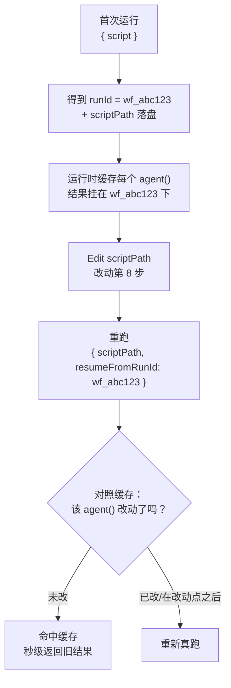
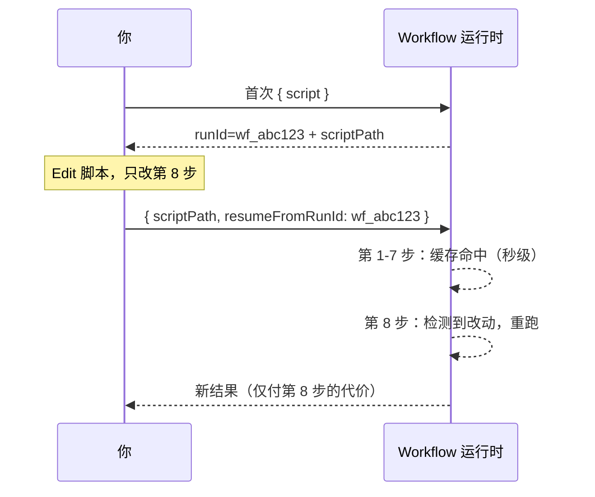

# 第 22 章 · 断点续传与缓存

> 一句话：**改了长流水线的第 8 步，前 7 步昂贵的结果直接秒级复用——这就是断点续传（resume）。用 `{ scriptPath, resumeFromRunId }` 重跑，未改动的 `agent()` 调用命中缓存，只有被编辑的及其之后的才重新真跑。**
>
> 这是进阶篇的收官一章，也是让前面那些「昂贵的多 agent 流水线」真正能**反复改、反复跑**的关键。它还顺手揭晓了一个贯穿全书的禁令到底为什么存在——为什么脚本里不准用 `Date.now()` 和 `Math.random()`。

---

## 22.1 痛点：改一步，却要从头再跑一遍

假设你写了一条 8 阶段的深度研究流水线，每阶段扇出若干 agent，整条跑完要烧 50 万 token、花上几分钟。跑完一看，第 8 步（最终报告的措辞）不太满意，于是你改了那一步的 prompt。

没有续传，你就只能**从头把整条流水线再跑一遍**——前 7 步那 40 多万 token 的活儿，结果明明一个字没变，却得重新烧一次、再干等几分钟。迭代一条长流水线时这有多要命：末尾的措辞每调一次，你就得为全程买一次单。

断点续传，就是来消灭这种浪费的。它的承诺是：

> **同样的脚本 + 同样的 args → 100% 缓存命中。** 只有你**动过**的 `agent()` 调用（以及它之后的调用）才会重新真跑；没动的，秒级就把上次的结果给你。

这样一来，迭代长流水线就成了：改第 8 步 → 重跑 → 前 7 步瞬间命中缓存 → 只有第 8 步真跑。几秒钟搞定，不再是几分钟。

<div class="callout info">

**官方语义（据 `_grounding.md` A/B 节）**：`WorkflowInput.resumeFromRunId?: string` —— 断点续传：**未改动的 `agent()` 调用返回缓存结果；仅同会话**。要配合 `scriptPath`（磁盘脚本路径，每次调用都会落盘）一起用。`WorkflowOutput` 里那个 `runId`（形如 `wf_...`），就是续传时你要传给 `resumeFromRunId` 的值。

</div>

---

## 22.2 机制：脚本即文件 + runId 锚点

想搞懂续传怎么干活，先把第 01 章讲过的两个事实捡回来——它们在这里合体了：

**事实一：脚本即文件。** 据 `_grounding.md`，每次调用 Workflow，运行时都会把脚本**落盘**成会话目录下的一个 `.js` 文件，并在返回里给出 `scriptPath`。也就是说，你的工作流不是一段转瞬即逝的字符串，而是一个**摆在磁盘上、随时能改的文件**。

**事实二：每次运行有一个 runId。** 据 `_grounding.md`，`WorkflowOutput` 会返回 `runId`（形如 `wf_...`）。它是这次运行的唯一标识——也是这次运行所有 agent 结果缓存挂靠的**锚点**。

续传，就是把这俩拼到一块：

1. 第一次跑：拿到 `runId`（如 `wf_abc123`）和落盘的 `scriptPath`。运行时把每个 `agent()` 调用的结果，按它在脚本里的「身份」缓存下来，全挂在这个 `runId` 底下。
2. 你 `Edit` 那个 `scriptPath` 文件，动了其中某个 `agent()` 调用。
3. 重跑：传 `{ scriptPath, resumeFromRunId: 'wf_abc123' }`。运行时拿缓存一对照——**没改的 `agent()` 调用直接取缓存结果**，改了的（以及它之后的）才重新执行。



这个迭代循环（改文件 + `scriptPath` 重跑），其实就是第 01 章那句「想迭代？直接 Write/Edit 那个文件，再用 `{ scriptPath }` 重新调用，不用重发整段脚本」的完整版——续传只是又给它添了「用 `resumeFromRunId` 复用缓存」这一关键本事。

<div class="callout warn">

**「仅同会话」是一条硬限制。** 据 `_grounding.md`，断点续传只在**同一个会话**内有效。说白了，缓存的命就绑在当前会话上——你没法关掉 Claude Code、明天再拿昨天的 `runId` 来续传。所以续传是「**本次迭代会话里**反复调一条流水线」的利器，不是「隔天接着干」的持久化方案。要跨会话保住的状态，得靠别的招（比如让 agent 把产物写到磁盘文件，见第 19 章的控制面/数据面思想）。

</div>

---

## 22.3 揭晓禁令：为什么不准用 Date.now() 和 Math.random()

到这儿，第 01、02 章反复冒头却一直没讲透的那个禁令，我们终于能给个交代了。

据 `_grounding.md`「硬约束」：脚本**禁用 `Date.now()` / `Math.random()` / 无参 `new Date()`**。第 01 章给的理由是「它们会破坏可重放性」。这一节就把**为什么续传需要可重放、这两个函数又是怎么把它搅黄的**讲清楚。

续传的整个前提就是「**同样的脚本，必然跑出同样的执行**」——只有这样，运行时才敢判定「这个 `agent()` 调用没变，能用缓存」。而这个判定，又押在一个假设上：**脚本的逻辑是确定性的、可重放的**——同样的输入，每次跑到这一步时的状态都一样。

偏偏 `Date.now()` 和 `Math.random()` 就**违背**了这个假设：

- `Date.now()`：每次调用都给你一个不一样的时间戳。要是你的脚本拿它来拼 prompt（比如 `agent(\`分析 ${Date.now()} 之前的数据\`)`），那**同一个 `agent()` 调用，每次重跑 prompt 都不一样**——它「变」了，缓存还能信吗？续传的判定逻辑当场就崩。
- `Math.random()`：每次返回不同的随机数。一个道理，任何靠它的 `agent()` 调用都没法重放。

```javascript
// ❌ 错误（示意，未实跑）—— 破坏可重放性，会被运行时拒绝
const ts = Date.now()                              // 禁用
const pick = items[Math.floor(Math.random() * 3)]  // 禁用
await agent(`分析 ${ts} 的 ${pick}`)               // 每次重跑都不同 → 续传失效
```

该怎么替代，`_grounding.md` 也写明了：

**需要时间戳 → 用 `args` 传进来，或者事后再盖戳。** 把时间当成参数从外面递进去（`args.timestamp`），脚本内部就是确定性的——同样的 `args`，同样的执行。再不然，等工作流跑完，在外头给结果盖个时间戳也行。

```javascript
// ✅ 正确（示意，未实跑）—— 时间戳由 args 传入，保持可重放
await agent(`分析 ${args.cutoffDate} 之前的数据`)
```

**需要随机性/多样性 → 拿 agent 的下标（index）去变提示词。** 这正是第 17 章「多验证者投票」里用过的招——用 `i` 给每个 agent 派一个不同视角，既凑出了多样性，又完全确定（同样的下标 → 同样的 prompt）。

```javascript
// ✅ 正确（示意，未实跑）—— 用 index 而非 random 制造差异
const views = ['性能', '安全', '可读性']
await parallel(views.map((v, i) => () => agent(`从${views[i]}角度审查…`)))
```

<div class="callout tip">

**把这条因果链记牢**：续传要省钱 → 续传得判定「调用没变」→ 判定靠脚本可重放 → 可重放就禁止不确定性 → 故禁 `Date.now()` / `Math.random()` / 无参 `new Date()`。这禁令不是运行时故意找茬，而是**「可迭代的长流水线」这件事躲不掉的代价**。这条链一想通，你就不会觉得它是个怪规矩，反而会主动把所有不确定性「赶到脚本外面」（`args`）、或者「用下标顶上」。

</div>

---

## 22.4 实战：迭代一条长流水线

把机制落到实操上。假设你正在迭代一条研究流水线，整套流程是这样走的：

**第一步——首次运行，拿到 runId。** 照常启动工作流，从完成通知/返回里把 `runId` 和 `scriptPath` 记下来：

```text
Run ID: wf_abc123
Script file: .../workflows/scripts/research-pipeline-wf_abc123.js
```

**第二步——改那份落盘的脚本。** 用 `Edit` 工具直接动 `scriptPath` 指向的那个文件，比如只改最后一个汇总 agent 的 prompt。**关键：别去碰前面阶段的任何 `agent()` 调用**，不然它们的缓存就全废了。

**第三步——带着 resumeFromRunId 重跑。** 再调一次 Workflow 工具，这回传：

```javascript
// （示意，未实跑）—— 续传调用的入参形态
{
  scriptPath: '.../research-pipeline-wf_abc123.js',
  resumeFromRunId: 'wf_abc123'
}
```

运行时会把前面所有没动过的阶段全部走缓存，只重跑你改的那个 agent 和它的下游。你会看到前几个阶段**秒级**就过（缓存命中），算力只往改动点之后砸。



<div class="callout tip">

**真实运行印证（5 个 agent 的流水线，续传 = 0 token / 3 毫秒）**：本书跑了一条 5-agent 的模型解析工作流（Run `wf_9c94951d-58c`），首跑是真实执行；接着用**完全没动过的脚本** + `{ scriptPath, resumeFromRunId: 'wf_9c94951d-58c' }` 原样再跑一遍。两次用量摆一块对比（同一 Run ID）——

| 运行 | agent 数 | total_tokens | duration_ms |
|---|---|---|---|
| 首次（真实执行） | 5 | **133,691** | **32,959** |
| 续传（100% 缓存命中） | 5（全缓存） | **0** | **3** |

续传返回的 5 个结果，和首跑**完全一致**。**5 个 agent 的活儿，续传时全数命中缓存——0 新 token、3 毫秒就返回**（首跑可是 13 万 token、33 秒）。运行时直接从 journal 里把每个 `agent()` 的结果回放出来，一个 subagent 都没重新派。这就把「同脚本 + 同 args → 100% 命中」从一句承诺变成了实打实的数字，也顺带实证回答了下一节那个「缓存命中算不算 token」：**不算**。原始记录见 `assets/transcripts/api-facts-r4.md`（另外还有一个更早的单 agent 续传 `wf_dacbd480-d5d`，0 token / 8ms，结论一样，见 `assets/transcripts/advanced.md`）。

</div>

<div class="callout warn">

**改动点之后的所有调用都会重跑，哪怕它们自己一个字没改。** 因为续传是「从改动点起往后全失效」——第 8 步一变，第 9、10 步的输入就可能跟着变，所以它们也必须重跑，才能保证结果对。**由此可推：把最可能反复调的步骤往流水线后面放**，缓存收益最大。要是你老在调第 2 步，那第 3 步往后全都得重跑，续传也就省不下多少。把「稳定的、烧钱的」搁前面，「爱变的、得反复打磨的」搁后面——这就是为续传友好而做的流水线设计。

</div>

<div class="callout info">

**「什么算改动」——哪些字段会让一个 `agent()` 丢掉缓存？** 本书实测到的边界是：**同脚本 + 同 args = 100% 命中**（`wf_9c94951d-58c`）——这一条是实打实跑出来的。在这之上，R8 又做了受控实测（基线 `wf_4ffde230-535`，3 个 agent / 91,044 token），把两个字段单独拎出来隔离：**只改某 agent 的 `label`（其余不动）→ 续传 0 token 全命中 ⇒ `label` 不入缓存键**；**只改它的 `prompt`（label 还原）→ 91,044 重跑成 60,702 token（≈基线 2/3），改动点之前的 agent 照样命中、该 agent 及其下游重跑 ⇒ `prompt` 入键**。所以最稳的心智模型，还是保守那一套：**只要你动了喂给 agent 的 `prompt`、或它依赖的上游数据，就当它丢了缓存**；想稳稳吃到缓存，就让脚本和 args 一个字都别动（只改你确实想重跑的那一步及其下游）。

至于缓存键里**其余字段到底入不入键**——社区第三方资料声称 `opts` 里的 `schema / model / isolation / agentType` 都入键、`phase` 只用来显示、排在键外。**这几个字段本书尚未逐一隔离验证**，所以整体标成**社区第三方资料声称、本书未独立实测**（已实测的 `label`/`prompt` 见上，不算在内）。实践上你不用去背那张精确清单——记住「改了 prompt/上游数据就当缓存失效」这条保守的粗粒度规则，就能安全迭代。

</div>

---

## 22.5 续传与 budget、嵌套的相互作用

续传不是个孤零零的特性，它和前面几章那些机制有些微妙的牵扯，理清楚了能少踩坑。

**和 budget（第 21 章）的关系：缓存命中还算 token 吗？** 续传值钱就值钱在「命中的调用根本不重新执行」——既然不执行，自然就不烧模型推理的 token。本书真实跑过的续传已经实证了这点：5-agent 流水线缓存命中的那次重跑 `total_tokens=0`（见上面「真实运行印证」，Run `wf_9c94951d-58c`，原始记录 `assets/transcripts/api-facts-r4.md`）。所以续传是**实打实省 token** 的——**迭代的边际成本只从你改的那一块来**，前面命中的阶段近乎免费。

**和嵌套 `workflow()`（第 20 章）的关系。** 续传那句「未改动 `agent()` 命中缓存」，针对的是当前工作流脚本里的 `agent()` 调用。可一旦脚本里套了 `workflow()` 子调用，续传跟子工作流的缓存怎么互动，事实源没展开讲，属于「（待核实）」——真到要迭代带嵌套的工作流时，得靠 `/workflows` 去看实际的缓存命中行为来确认。

**和 worktree（第 19 章）的关系。** worktree 隔离出来的 agent，会牵涉文件系统的副作用。续传重跑改动点之后那些 agent 时，这些副作用怎么处理（重新建 worktree？），同样是事实源没覆盖的细节，标「（待核实）」。

<div class="callout info">

**一个稳妥的实践原则**：续传最可靠、官方也最明确撑腰的场景，就是「**纯读、纯产出结构化数据**的多阶段流水线」——比如研究、审查、分析。这类工作流的 `agent()` 调用没有外部副作用，缓存命中的语义干净利落、不含糊（同样输入 → 同样输出 → 可安全复用）。至于带文件写入（worktree）或者套了子工作流的复杂情形，续传的行为有些事实源没覆盖的细节，**拿 `/workflows` 看实际命中情况**，别凭假设瞎猜。这跟全书「严禁凭记忆臆测 API」的纪律是一脉相承的。

</div>

---

## 22.6 续传友好的设计清单

把本章的经验拢成一份「让你的工作流对续传友好」的设计清单：

| 原则 | 做法 | 理由 |
|---|---|---|
| **杜绝不确定性** | 禁 `Date.now()` / `Math.random()` / 无参 `new Date()` | 它们破坏可重放性，续传判定失效（运行时会拒绝） |
| **不确定性赶到外面** | 时间戳用 `args` 传入；多样性用 `index` | 保持脚本体确定性，同输入同执行 |
| **易变步骤靠后放** | 稳定昂贵的在前，反复打磨的在后 | 改动点之后全部重跑，靠后改动缓存收益最大 |
| **善用脚本落盘** | 迭代时 `Edit` 落盘脚本 + `scriptPath` 重跑 | 无需重发整段脚本，且为续传提供文件锚点 |
| **记牢 runId** | 首次运行后记下 `runId` 备续传 | `resumeFromRunId` 的值来源 |
| **同会话内迭代** | 续传只在同会话有效 | 跨会话需另靠磁盘持久化 |
| **复杂情形先观察** | 含 worktree/嵌套时用 `/workflows` 看命中 | 这些场景的续传细节事实源未覆盖 |

<div class="callout tip">

**续传把「写工作流」变成了真正的『编程』体验。** 没有续传，每改一次脚本都得付全程的代价，迭代成本高到你不敢随便动一下——那更像「一次性把批处理作业丢出去」。有了续传，改一行、重跑、秒级就看到局部效果，跟在 REPL 里调代码一个样：**改动很便宜、反馈很即时**。这正是 Workflow「确定性脚本」相比「概率性 prompt 编排」的一大工程优势——确定性让缓存成为可能，缓存又让快速迭代成为可能。

</div>

---

## 22.7 本章小结

- **断点续传（resume）**：用 `{ scriptPath, resumeFromRunId }` 重跑，**未改动的 `agent()` 调用秒级命中缓存**，只有被编辑的、以及它**之后**的调用才重新真跑。承诺是「同脚本 + 同 args → 100% 命中」。
- 机制 = **脚本即文件**（每次调用落盘 `scriptPath`）+ **runId 锚点**（`WorkflowOutput.runId` 是缓存的挂靠点，也是 `resumeFromRunId` 的值）。
- **续传仅同会话**有效；要跨会话保住状态，得另找 agent 写磁盘之类的招。
- 揭晓禁令的因果链：续传省钱 → 得判定「调用没变」→ 得靠脚本**可重放** → 禁不确定性 → 故禁 `Date.now()` / `Math.random()` / 无参 `new Date()`。替代：时间戳用 `args`、多样性用 `index`。
- **续传友好设计**：把爱变的步骤往流水线后面放（改动点之后全部重跑），稳定烧钱的放前面。
- 和 budget/嵌套/worktree 的精细交互，有事实源没覆盖的地方（标「（待核实）」）；最可靠的场景是**纯读、纯产出结构化数据**的多阶段流水线，复杂情形拿 `/workflows` 看实际命中。

这一章给进阶篇画上句号。从对抗验证、循环到干，到 worktree 隔离、嵌套、动态预算、断点续传——把 Workflow 用到生产级的进阶武器，你已经全拿到手了。下一部，我们把眼光转向社区：在原生 Workflow 出现之前，四大编排系统是怎么「模拟」这些能力的，又有哪些精华值得用 `phase`/`schema` 重写成可复用的工作流。

> 继续阅读：[第 23 章 · 四大系统横评](#/zh/p5-23)
