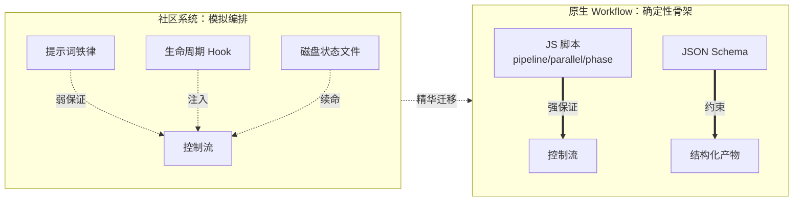

# 第 23 章 · 四大系统横评

> 在原生 Workflow 出现之前，社区早已用各种巧法「编排」多 Agent。本章拆开四个有代表性的开源系统的引擎盖——`ccg-workflow`、`superpowers`、`oh-my-claudecode`、`oh-my-openagent`——看它们**真实的编排机制**，并提炼出可被原生 Workflow 复用的精华。
>
> 本章所有机制描述，基于对各仓库源码的真实阅读（文件路径均已标注），意在「取其精华」，非褒贬高下。

---

## 23.1 一个贯穿全章的洞察

先说结论，再看证据：

> **这四个系统，全都诞生在原生 Workflow 之前；它们都在用「提示词 + 生命周期钩子 + 磁盘状态文件」来_模拟_一个确定性编排引擎。** 因为在很长一段时间里，Claude Code（及类似 harness）并没有「用代码编排 Agent」的原生能力。

它们各自发明的补丁——磁盘状态对抗上下文压缩、Hook 注入「面包屑」防跑偏、`Stop` 钩子拒绝过早收工、工具层 `throw` 护栏——都很聪明。而原生 Workflow 用 `pipeline`/`parallel`/`phase` + JSON Schema 一次性提供了它们苦苦维系的**确定性骨架**。

所以本章（及第 24 章）的主线是：**原生 Workflow 给了骨架；这四个系统的精华，是骨架之上的「韧性层」。** 把两者合起来，才是生产级编排。

<div class="callout info">

**贯穿洞察（请记住这一句，全章都在论证它）**：这四个系统**全部诞生在原生 Workflow 之前**，因此它们只能用「提示词 + 生命周期 Hook + 磁盘状态文件」去**模拟**一个确定性编排引擎——ccg 靠每轮注入 `<ccg-state>` 面包屑、OMC 靠 `Stop` 钩子拦截停止、OmO 靠工具层 `throw` 拦截写文件、superpowers 靠 `SessionStart` 注入「行为宪法」。这些都是在**没有原生控制流**的约束下的精巧补丁。原生 Workflow 一次性补齐了它们最缺的两样东西：**`pipeline`/`parallel`/`phase` 给的确定性骨架**，和 **JSON Schema 给的工具层硬约束**。读后续每一节时，不妨随手把「它用什么 Hook/状态文件模拟」对应到「原生 Workflow 用哪个原语直接给」。

</div>



---

## 23.2 ccg-workflow：多模型协作 + 磁盘状态续命

**它是什么**：CCG（Claude + Codex + Gemini）是装在 Claude Code 之上的多模型协作工作流引擎。一条 `/ccg:go` 自然语言入口，自动判定任务类型/复杂度/风险，选 10 种策略之一，并在执行中协调外部模型做交叉验证。它解决「单 agent 长任务跑偏、上下文压缩后丢进度、单模型有盲区」三大痛点。

**真实编排机制**（四层叠加）：

- **Slash command 作角色注入**：`templates/commands/go.md` 把 Claude 变成「CCG Engine」，走 Phase 0–3 决策矩阵。
- **策略文件＝提示词状态机**：如 `templates/engine/strategies/full-collaborate.md`，用 `[phase-state:N]` 标记阶段、`Gate`、`HARD STOP` 检查点，逐 phase 更新 `task.json`。
- **JS Hook 引擎（真实代码，零依赖）**：`templates/hooks/` 注入 `~/.claude/settings.json`。其中 `workflow-state.js` 在每轮 `UserPromptSubmit` 读 `task.json` 注入 `<ccg-state>` 面包屑——**这是对抗上下文压缩的关键**；`task-utils.js` 的 `detectLoop` 维护 10 轮滚动缓冲，连续 3 轮同 phase 触发死循环告警。
- **执行层双轨**：Agent Teams 并行，或外部模型经 `~/.claude/bin/codeagent-wrapper`（真实 Go 二进制，信号量并发 + DAG 依赖调度）。

**最值得偷师的一点**：**「磁盘状态 + 每轮 Hook 面包屑注入」**。把工作流进度落盘成 `task.json`，每个回合用极小的 `<ccg-state>` 重新喂给模型——用最低成本解决了长任务/压缩后「agent 忘了自己在干嘛」的根本问题。

**两处可观察的具体形态**，让上面的抽象落地：

其一，**「10 种策略」不是宣传话术，而是一张可枚举的表**——`templates/commands/go.md` 的附录恰好列 10 条，每条对应 `templates/engine/strategies/` 下一个真实的策略文件，`/ccg:go` 在 Phase 0 据任务类型/复杂度/风险选其一：

```text
direct-fix · quick-implement · guided-develop · full-collaborate · debug-investigate
refactor-safely · deep-research · optimize-measure · review-audit · git-action
```

其二，**多模型路由是配置驱动的**。生效配置以 `src/utils/config.ts` 的默认值为准（注意：`model-router.md` 文档示例写的是 gemini，但运行时以 config.ts 为准）：

```javascript
// ccg-workflow · src/utils/config.ts 默认值（信源：_grounding.md D2）
const defaults = {
  frontend: { primary: 'antigravity' },          // 前端任务 → antigravity
  backend:  { primary: 'codex' },                // 后端任务 → codex
  review:   { models: ['codex', 'antigravity'] },// 审查 → 两模型并行交叉验证
}
```

外部模型经 `~/.claude/bin/codeagent-wrapper`（真实 Go 二进制）落地：它的 `executor.go` 用 `topologicalSort`（带 cycle 检测的分层拓扑排序）解析任务 DAG，再用 `executeConcurrentWithContext` 里的 `sem := make(chan struct{}, workerLimit)` 信号量限并发——这正是「确定性调度」的一种朴素实现，也恰是原生 Workflow 用 `pipeline`/`parallel` 一行代码就给你的东西。

> 顺带一提：本书的多模型审查（codex 审内容、antigravity 审前端）正是经由 CCG 的 `codeagent-wrapper` 与 `/ccg:frontend`、`/ccg:review` 路由实现的——`review.models=['codex','antigravity']` 两模型并行交叉验证。

---

## 23.3 superpowers：方法论即插件 + 两段式评审

**它是什么**（obra/superpowers）：给编码 agent 用的**完整软件开发方法论**，由一组可组合 skill + 一段开机引导构成，跨 7 个 harness、零依赖。它强制 agent「先退一步澄清意图、产出 spec、写计划、再 TDD 实现」，解决「拿到需求就闷头写代码」的通病。

**真实编排机制**（没有 JS 编排器，没有 `commands/`/`agents/` 目录，纯靠四层软约定）：

- **开机引导 hook**：`hooks/hooks.json` 注册 `SessionStart`，把 `using-superpowers/SKILL.md` 整段包进 `<EXTREMELY_IMPORTANT>` 注入上下文——`CLAUDE.md` 明说「没有这个 bootstrap，skills 就是死代码」。
- **强制 skill 自检**：规定**任何回复前**（哪怕只是提问）都必须先查 skill，「1% 可能相关就必须调用」。
- **skill 链接成流**：每个 skill 末尾用 `REQUIRED SUB-SKILL` 显式点名下一个，`brainstorming → writing-plans → subagent-driven-development → finishing-a-branch` 形成确定性链路。
- **状态文件即交接**：spec 写到 `docs/superpowers/specs/`，plan 用 `- [ ]` checkbox 跟踪。

**它的「两段式评审」长什么样**：在 `subagent-driven-development/SKILL.md` 里，每个任务的验收是一条**两段串联、各自循环到过**的链——用伪码勾勒它的形状（提示词语义，非可运行脚本）：

```text
# superpowers 两段式评审（伪码 · 还原 SKILL.md 的控制结构）
for each task:
  loop:                               # 第一段：spec 合规
    review_spec(task)                 # 过度实现？遗漏实现？
    if compliant: break
    fix(task); # 再 review
  loop:                               # 第二段：code quality
    review_quality(task)              # 命名/错误处理/边界
    if good: break
    fix(task); # 再 review
  # 两段都过，才进入下一个 task
```

注意它的「保证」全靠提示词请求模型「再评一次」——是**软约定**而非硬控制流。这正好能用原生 Workflow 的 `pipeline`（两段串联）+ JSON Schema（`pass: boolean` 门控字段）落成**确定性质量闸**（第 24 章会逐行动手把这条伪码焊成可跑脚本）。

另外值得记一笔：superpowers 的 subagent **结构化状态返回**用一组固定枚举词收口——`DONE` / `BLOCKED` / `NEEDS_REVIEW` 之类，让上游能据此分支。这其实是「自由文本 → 可判定结论」的雏形，而原生 Workflow 的 `schema enum` 把它从约定升级成了工具层强制。

---

## 23.4 oh-my-claudecode：Stop 钩子持久循环

**它是什么**：面向 Claude Code 的大型编排插件，把「多 agent 协作 + 持久化执行 + 质量门禁」打包成开箱即用工作流，解决「复杂任务被静默地半途宣称完成」。

**真实编排机制**（hooks + 状态文件 + skills + 20 角色 subagent）：

- **钩子驱动**（`hooks/hooks.json`）：`UserPromptSubmit→keyword-detector` 检测魔法词注入对应 SKILL；`SubagentStop→verify-deliverables`；**`Stop→persistent-mode`**——灵魂所在：检查 `.omc/state/` 有无活跃 mode，有则**阻断停止**并回注「The boulder never stops」实现循环。
- **状态文件即控制平面**：`.omc/state/sessions/{id}/` 存 mode/phase/iteration，控制面与数据面（`.omc/plans/`、`prd.json`）分离，支持 crash 后 resume。
- **PRD 驱动 + 独立 reviewer 签核**：`ralph` 要求 `prd.json` 每条 story `passes:true` 且经独立 critic 验证才算完。

**`Stop` 钩子的灵魂逻辑长什么样**：它把「是否允许停下」变成一段在 `Stop` 生命周期点执行的判断——用伪码勾勒（还原 `persistent-mode` 的控制结构，非可运行脚本）：

```javascript
// OMC · Stop 钩子伪码 ——「the boulder never stops」
// 触发点：Claude 准备结束本轮时
function onStop() {
  const mode = readActiveMode('.omc/state/')        // 磁盘状态：有没有在跑的 mode？
  if (!mode) return { allow: true }                 // 没有活跃 mode → 放行，正常停
  if (mode.allStoriesPass) return { allow: true }   // PRD 每条 story 都 passes:true → 放行
  return {                                          // 否则：阻断停止 + 回注续推提示
    allow: false,
    inject: 'The boulder never stops. 继续推进未完成的 story。',
  }
}
```

这正是「跑完 ≠ 算完」的物理实现：靠**拦截停止**这个动作来续命循环。注意它把判据（`allStoriesPass`）和状态（mode/phase/iteration）都外化到 `.omc/state/` 磁盘——因为提示词驱动的循环没有内存。

**最值得偷师的一点**：**用 `Stop` 钩子 + 状态文件构成「完成判据闭环」**。原生 Workflow 跑完脚本即结束；OMC 让「是否允许停止」成为可编程的门。把这个思想搬进 Workflow——结合 JSON Schema 校验产物，就能把「流水线跑完」升级为「满足验收标准才算完」（第 18 章「循环到干」就是它的 Workflow 化身）。把上面这段 `Stop` 钩子和第 24 章的 `while (!accepted)` 循环对照看：钩子拦截 + 磁盘状态，坍缩成了一个 `while` 和几个局部变量。

---

## 23.5 oh-my-openagent：工具层护栏 + 不可信验证

**它是什么**（OmO，建在 **opencode** 上，非 Claude Code）：发布为 npm 包的插件型 Agent OS，把单个 agent 扩展成一支「开发团队」（**10 个注册内置角色**，如 Atlas 指挥/Sisyphus 执行/Metis 等；规划由 **Prometheus 人格**担纲——它在 prompt 中出现，但不在注册的 builtin agent 联合内），多模型可混用，入口 `ultrawork`/`ulw`。

**真实编排机制**（运行时 harness：插件 hooks + 自定义 tools + 状态文件）：

- **slash command + hook 切角色**：`/start-work` 由 `start-work-hook.ts` 拦截，读 `boulder.json` 判断 resume/init，再切到 Atlas。
- **程序化 subagent 派发**：`task()`/`call_omo_agent` 工具真正调 opencode API 新建子会话并轮询。
- **system-reminder 注入驱动循环**：Atlas 的 hook 族每轮注入 `BOULDER_CONTINUATION_PROMPT`、`VERIFICATION_REMINDER`（「子 agent 说完成了，它在撒谎，去验证」），并在 Atlas 越界改代码时注入 `DELEGATION_REQUIRED` 拉回。
- **工具层护栏**：`prometheus-md-only/hook.ts` 在工具调用前硬拦截——规划者的 `Write/Edit` 只允许写 `.omo/*.md`，违规直接 `throw`。**规划者物理上无法写代码。**

**几处可观察的具体形态**：

入口是一个正则关键词。`keyword-detector/constants.ts` 用 `/\b(ultrawork|ulw)\b/i` 匹配用户消息来唤起整套编排——和原生 Workflow 的昵称 `ultrawork` 同名并非巧合。

它注册的内置角色恰是 **10 个**（`src/agents/types.ts` 的 `BuiltinAgentName` 联合）：

```text
sisyphus · hephaestus · oracle · librarian · explore
multimodal-looker · metis · momus · atlas · sisyphus-junior
```

（规划人格 **Prometheus** 出现在 prompt 里，但**不在**这个注册联合内——它是「人格」而非「可派发的 builtin agent」。）

而「规划者物理无法写码」的护栏，本质是工具调用层的一行 `throw`——用伪码勾勒（还原 `prometheus-md-only/hook.ts` 的拦截逻辑）：

```javascript
// OmO · 工具层护栏伪码 —— 规划者只能写 .omo/*.md
function beforeToolCall(tool, args) {
  if (tool === 'Write' || tool === 'Edit') {
    if (!args.path.match(/^\.omo\/.*\.md$/)) {
      throw new Error('Planner may only write .omo/*.md')   // 物理拦截，非提示词请求
    }
  }
}
```

这把「规划者别去改代码」从一句**提示词祈祷**变成了一道**运行时物理墙**——这正是第 24 章会把它原生重写成「`schema` 约束的 planner 只能产出计划对象」的母题。

**最值得偷师的一点**：**用工具层护栏 + system-reminder 注入来强制纪律，而非靠提示词祈祷**。以及 **Category（语义意图）而非模型名委派**——LLM 看到 `category="quick"/"ultrabrain"`，运行时再映射到模型 fallback 链，消除「模型自我设限」的分布偏置，且模型可热插拔。这对 Workflow 的 `agent({model})` 选型很有启发：按「任务类别」而非硬编码模型名来决定。

---

## 23.6 横评一览

| 系统 | 宿主 | 编排机制 | 确定性 | 最强项 | 一句话偷师 |
|---|---|---|---|---|---|
| **ccg-workflow** | Claude Code | 提示词状态机 + JS Hook + Go 桥接多模型 | 弱（提示词约束） | 多模型交叉验证 + 抗压缩 | 磁盘状态 + 每轮面包屑注入 |
| **superpowers** | 跨 7 harness | skill 链 + SessionStart 注入「宪法」 | 弱（概率性） | 方法论纪律（TDD/brainstorm） | 两段式评审闭环 |
| **oh-my-claudecode** | Claude Code | hooks + 状态文件 + 20 角色 | 中（Stop 钩子兜底） | 韧性（resume/防静默失败） | Stop 钩子＝完成判据闭环 |
| **oh-my-openagent** | opencode | hooks + 自定义 tools + 状态文件 | 中（工具层护栏） | 越界护栏 + 类别委派 | 工具层 throw + Category 委派 |
| **原生 Workflow** | Claude Code | **JS 脚本 pipeline/parallel/phase + Schema** | **强（代码）** | 确定性 + 结构化 + 可复用 | —— |

**读法**：左四列是「模拟编排」，最后一行是「原生骨架」。它们不是竞争关系——**最佳实践是用原生 Workflow 做骨架，把这四家的精华作为韧性层焊上去。**

<div class="callout warn">

**别把表里的「编排机制」整列照搬。** 这一列写的是**实现**（某宿主上的钩子/状态文件/Go 桥接），不是**模式**。你想要的是「最强项」与「偷师」两列背后的**控制结构**——磁盘面包屑的本质是「显式传递结构化状态」，`Stop` 钩子的本质是「完成判据可编程」，工具层 `throw` 的本质是「角色边界由系统强制」。把实现照搬进原生 Workflow，会得到一个「长在别人宿主上的器官」，立刻排异。**怎样把模式从实现里剥出来、再用 `phase`/`schema` 重新长出实现，是下一章的全部主题。**

</div>

---

## 23.7 本章小结

- 四大系统都在原生 Workflow 之前，用**提示词 + Hook + 状态文件**模拟确定性编排。
- 各自的精华：ccg＝磁盘状态面包屑；superpowers＝两段式评审；OMC＝Stop 钩子完成判据；OmO＝工具层护栏 + 类别委派。
- 原生 Workflow 提供了它们缺的**确定性骨架 + Schema 约束**；二者互补。

下一章，我们把「怎样把别人系统里的好想法，系统性地提炼、抽象、用 `phase`/`schema` 重写成自己的可复用 Workflow」讲成一套方法论。

> 继续阅读：[第 24 章 · 精华提取术](#/zh/p5-24)
