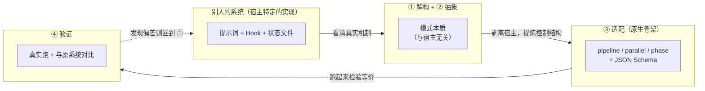
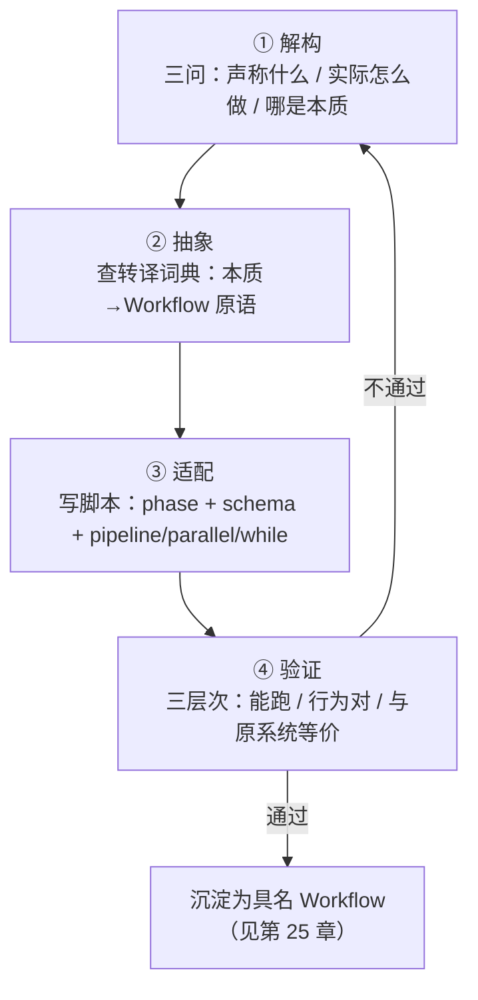
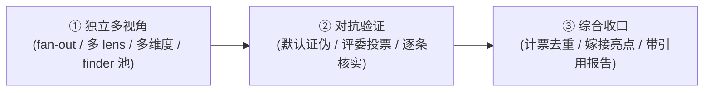

# 第 24 章 · 精华提取术

> 上一章我们掀开四个社区系统的引擎盖看了个遍，一路都在说「这一点值得偷师」。但偷师不等于把别人的提示词复制粘贴过来——那样你拿到的是一个**长在别人宿主上的器官**，移植到原生 Workflow 里立刻就排异。这一章给你一套**能反复用的方法**：怎么把「别人系统里的好想法」一步步拆开、剥下来、重写成你自己的、确定的、能复用的 Workflow。
>
> 四个动作，一个都不能少：**解构（看清它到底怎么运转）→ 抽象（剥掉宿主，把模式的本质提出来）→ 适配（用 `phase`/`schema`/`parallel`/`pipeline` 重写）→ 验证（真跑一遍，和原系统比一比）**。这一章就拿第 23 章那四个真实案例，把这四步从头走一遍。

---

## 24.1 为什么需要「术」，而不是直接抄

先讲一个注定翻车的故事，你立马就懂「术」是来解决什么的。

假设你读了 superpowers 的 `subagent-driven-development/SKILL.md`，一眼相中它的「两段式评审」：每个任务先过一道 spec 合规评审、再过一道 code quality 评审，各自循环到通过为止。你很自然地想：**把这两段评审的提示词拷到我项目里，不就齐活了？**

于是你把那两段 markdown 拷进自己的 `.claude/skills/`，美滋滋地以为「两段式评审」到手了。可你很快会撞上三个问题：

1. **它要靠一个你压根没有的宿主。** superpowers 的评审能「循环到通过」，靠的不是那两段提示词本身，而是它整套 `SessionStart` 注入的「行为宪法」+ skill 链 + checkbox 状态文件。你把提示词单拎出来，它就成了第 23 章说的那种「死代码」——没有 bootstrap，skill 根本不会被强制触发。
2. **它的「保证」是概率性的。** 就算宿主齐全，superpowers 的评审循环说白了也就是「用提示词求模型再评一遍」。模型可能真去评，也可能觉得「差不多了」就跳过。这是**软约定**，不是硬控制流。
3. **它产出的是给人看的文本，不是给程序吃的数据。** 评审结论写在对话里，你没法用代码判断「这一轮到底过没过、要不要再来一轮」。

<div class="callout warn">

**直接抄的病根在这**：你抄来的是**实现**（某个宿主上「提示词 + 钩子 + 状态文件」的特定组合），可你真正想要的是**模式**（「写完先查规范、再查质量，不过就重来」这个控制结构）。实现是长在宿主上的，能搬走的只有模式。**精华提取术的全部要义，就是把模式从实现里剥出来，再拿原生 Workflow 的骨架重新长出一个实现。**

</div>

回到第 23 章那个贯穿全书的洞察：这四个系统都生在原生 Workflow 之前，它们靠「提示词 + Hook + 状态文件」**硬凑出**了一个确定性编排引擎。它们发明的那些精华——验证门、持久循环、磁盘状态、越界护栏——全是**模式**；而它们装这些模式的方式（软约定、钩子注入、文件续命）只是**那个年代的实现**。

原生 Workflow 给了你一套更趁手的承载工具：
- `pipeline` / `parallel` / `phase` —— 用**代码**写控制流，保证够硬；
- JSON Schema —— 把「产物长什么样、合不合格」从一段自由文本变成**机器能判定的契约**；
- `agent({ schema })` 的工具层校验 + 自动重试 —— 把「求模型再试一次」从烧香拜佛变成**运行时纪律**。

所以提取术的产出物，就是一个**把别人的模式焊到原生骨架上**的 Workflow 脚本。下面这张图是全章总纲：



---

## 24.2 第一步 · 解构：看清它真实的机制

「解构」要回答一个问题：**这个好想法，真正起作用的机制到底是什么？** 注意「真正」俩字——人们对自己系统的**说法**，常常和它**实际的实现**对不上。提取的第一性原理就一句：**只信源码，不信营销词。**

解构有三个一层比一层深的拷问，我管它叫「三问」：

### 三问之一：它声称做什么？（叙述层）

先把它的**自我说法**记下来——README 怎么讲、文档怎么写。比如 OMC 说自己「the boulder never stops，让复杂任务不会被悄悄半途宣称完成」。这是它的**意图**，是个好起点，但还不是机制。

### 三问之二：它实际怎么做？（机制层）

这一步得**翻源码**，找到那段真正把意图落地的代码/配置。第 23 章已经替我们干过这活，结论直接拿来用（信源是对各仓库源码的真实阅读）：

| 系统 | 它声称（叙述） | 它实际（机制，源码层） |
|---|---|---|
| superpowers | 「先澄清意图、产出 spec、再 TDD」 | `subagent-driven-development/SKILL.md` 里**每任务两段评审**：spec 合规评审 → code quality 评审，各自要求 re-review 到过 |
| OMC | 「boulder never stops」 | `Stop` 钩子（`persistent-mode`）检查 `.omc/state/` 有无活跃 mode，有则**阻断停止**并回注「The boulder never stops」 |
| ccg | 「对抗上下文压缩、长任务不跑偏」 | `workflow-state.js` 每轮 `UserPromptSubmit` 读 `task.json` 注入 `<ccg-state>` **面包屑** |

注意每一行「实际」列，都精确到了**文件名/钩子名/字段名**。这就是解构的及格线：**你能说清它在哪个文件、用什么数据结构、在哪个生命周期点起作用。** 说不到这个粒度，就还没解构完。

### 三问之三：哪部分是模式，哪部分是宿主？（剥离层）

这是解构和抽象的接缝。拿到机制后，对每个零件追问一句：**它是「这个想法的本质」，还是「这个宿主碰巧这么干」？**

拿 OMC 的 Stop 钩子来说：

| 机制组成 | 本质（模式）还是偶然（宿主）？ | 理由 |
|---|---|---|
| 「跑完不一定算完，要看是否满足判据」 | **本质** | 这是「完成判据闭环」的核心思想，与任何宿主无关 |
| 用 `Stop` 生命周期钩子实现 | **宿主偶然** | 因为 OMC 没有原生控制流，只能借钩子「拦截停止」 |
| 判据存在 `.omc/state/sessions/{id}/` | **宿主偶然** | 因为提示词驱动的循环没有内存，只能靠磁盘续命 |
| 回注「The boulder never stops」文本 | **宿主偶然** | 这是「请模型继续」的提示词手段 |

剥下来的结论一眼就清楚：**本质就一句话——「能不能结束，得由一个可编程的判据说了算」。** 剩下全是 OMC 在「没有原生循环」这道紧箍咒下被逼出来的脚手架。

<div class="callout tip">

**解构的产出物**，是一份「机制说明书」，至少要有三样：①它声称的意图；②把意图落地的真实代码位置和数据流；③逐项标注「本质 / 宿主偶然」。本书第 23 章对四大系统的拆解，本身就是四份现成的机制说明书——做提取时你尽管站在它肩膀上，但**只要是你想偷师的新系统，这一步都得亲手补上**。

</div>

---

## 24.3 第二步 · 抽象：剥离宿主，提炼模式的本质

解构告诉你「哪些是本质」；抽象这一步，是把这些本质**重新说成一句跟宿主无关的控制结构描述**，再翻成原生 Workflow 的词。

抽象的关键手法，是把每个模式对上一个**控制流原语**。原生 Workflow 的原语就那么几个，而模式的本质往往刚好对得上其中一个：

| 模式本质（抽象后的一句话） | 对应的 Workflow 原语 | 为什么是它 |
|---|---|---|
| 「A 做完 B 才能做，且 B 依赖 A 的产物」 | **顺序依赖**：`pipeline` 或直接 `await` | 阶段间有数据依赖，必须串行 |
| 「N 件互不依赖的事同时做，要全部结果」 | `parallel`（屏障） | 无依赖 + 需要汇总 |
| 「N 件事各自独立地流过同一串阶段」 | `pipeline`（无屏障） | 每条链独立，墙钟取最慢的一条 |
| 「重复做，直到满足某个判据」 | `while` + 门控字段 | 退出条件是动态的，要循环 |
| 「产物必须长成某个样子才算数」 | `agent({ schema })` | Schema 在工具层强制结构与类型 |
| 「这件事归到某个阶段下显示」 | `phase()` / `opts.phase` | 进度分组 |

这张表就是提取术的「转译词典」。抽象这一步，说穿了就是反复查这本词典：**把解构出来的每个本质，翻成词典右列一个或几个原语的组合。**

我们把四个案例分别抽象一遍：

**superpowers 两段式评审** 抽象为：
> 「对一份产物，先过**第一道**评审（spec 合规），不过就重来；过了再上**第二道**评审（code quality），不过照样重来。」
>
> 转译：两道评审是**顺序**关系（先 spec 后 quality）→ `pipeline` 的两个 stage；每道评审的「过/不过」得能驱动判断 → 各配一个带 `pass: boolean` 门控字段的 `schema`；「不过就重来」→ 在 stage 内部对单份产物跑有界 `while`。

**OMC Stop 钩子** 抽象为：
> 「一直往前推，直到一个可编程的判据点头『可以收工了』。」
>
> 转译：「反复直到判据」→ `while` + `done`/`accepted` 门控字段（跟第 18 章「循环到干」是一个模子）；「可编程判据」→ 一个独立的验收 `agent({ schema })`，schema 里带个 `accepted: boolean`。

**ccg 磁盘面包屑** 抽象为：
> 「让后面的步骤拿得到前面步骤的**结构化产物**，这样它随时都清楚『当前进展和已知事实』，不用去翻会被压缩的对话历史。」
>
> 转译：ccg 之所以用「磁盘 + 每轮注入」，是因为它的步骤散在好几个对话回合里，会被上下文压缩冲掉。而原生 Workflow 的脚本体是**一个连续的 JS 闭包**——前一个 `agent()` 的返回值，直接就是后一个 `agent()` 提示词里的变量。`task.json` 的本质（「把状态外化、显式传下去」）在 Workflow 里**退化成了普通的变量传递加 structured output**，磁盘根本用不上。

**OmO 工具层护栏 + Category 委派** 抽象成两句：
> 「①规划者的产物只能是『计划』，不能夹带『对代码的副作用』；②『用什么模型』该由任务的_语义类别_说了算，而不是散在提示词里的一堆硬编码模型名。」
>
> 转译：①「产物只能是某种形状」→ `agent({ schema })`，再用 `additionalProperties: false` 把 diff/补丁这类字段**从结构上**挡在门外，然后把「执行」拆成一个独立 phase（角色分离）；②「按类别选模型」→ 一张 `MODEL_BY_CATEGORY` 查找表 + `opts.model`，让 `category` 字段去驱动派发。

<div class="callout info">

**抽象阶段最常见的顿悟**，是发现某个「精华」在原生 Workflow 里**根本不用单独实现**——因为它要解决的问题（上下文压缩、跨回合失忆、跑完即停）是宿主自带的毛病，而原生骨架天生就没这毛病。ccg 的磁盘面包屑就是典型：它在 Workflow 里直接「消失」成了变量传递。**看出「这个精华在新宿主里白送了」，和「把这个精华移植过来」一样值钱。**

</div>

---

## 24.4 第三步 · 适配：用 phase / schema / parallel / pipeline 重写

抽象给了你「用哪些原语、怎么搭」的蓝图；适配就是把这张蓝图落成**能跑的脚本**。这一步我们对四个案例各动一次手，把完整脚本写出来。

> 本节所有脚本都标了「（示意，未实跑）」——它们是把模式落成代码的**范本**，演示结构和原语怎么用；里头引用的真实运行数据（如 GCF 的 `wf_7472ceac-daa`）来自前面章节的实跑记录，可溯源。

### 案例一：superpowers 两段式评审 → `pipeline(tasks, specReview, qualityReview)` + 两个 schema

这是把「方法论纪律」焊成「确定性质量闸」的核心演示。模式抽象已经给好了：两段评审是顺序关系，用 `pipeline` 的两个 stage；每段各带一个 `pass` 门控；不过就有界重来。

先看**最直接的落法**——把两段评审当成 `pipeline` 的两个阶段，让每个待评审任务各自独立流过：

```javascript
// （示意，未实跑）—— superpowers 两段式评审 → pipeline + 两 schema
export const meta = {
  name: 'two-stage-review',
  description: 'Spec-compliance review then code-quality review, each a deterministic gate',
  phases: [
    { title: 'SpecReview', detail: '逐任务核对是否精确实现了 spec（不过度、不遗漏）' },
    { title: 'QualityReview', detail: '通过 spec 闸后再审代码质量' },
  ],
}

// 每个 schema 都有一个 pass 门控字段——这是「闸」的物理形式
const SPEC_SCHEMA = {
  type: 'object',
  properties: {
    pass: { type: 'boolean' },                         // 是否精确符合 spec
    overImplemented: { type: 'array', items: { type: 'string' } },  // 多做了什么
    underImplemented: { type: 'array', items: { type: 'string' } }, // 漏做了什么
    verdict: { type: 'string' },
  },
  required: ['pass', 'overImplemented', 'underImplemented', 'verdict'],
}

const QUALITY_SCHEMA = {
  type: 'object',
  properties: {
    pass: { type: 'boolean' },
    issues: {
      type: 'array',
      items: {
        type: 'object',
        properties: {
          severity: { type: 'string', enum: ['blocker', 'major', 'minor'] },
          note: { type: 'string' },
        },
        required: ['severity', 'note'],
      },
    },
    verdict: { type: 'string' },
  },
  required: ['pass', 'issues', 'verdict'],
}

// args.tasks: [{ id, spec, diff }]，每项是一个待评审的实现单元
const tasks = args.tasks

const results = await pipeline(
  tasks,
  // stage 1：spec 合规评审。收到原始 task
  (task) =>
    agent(
      `你是 spec 合规评审员。对照下面的 spec，判断实现是否**精确**符合——` +
      `既不能多做（over-implementation），也不能少做（under-implementation）。\n` +
      `SPEC:\n${task.spec}\n\nDIFF:\n${task.diff}`,
      { label: `spec:${task.id}`, phase: 'SpecReview', schema: SPEC_SCHEMA }
    ),
  // stage 2：code quality 评审。收到 (specResult, task, index)
  (specResult, task) => {
    // spec 闸没过，就别浪费一个 quality agent——直接把结论透传下去
    if (!specResult.pass) {
      return { stage: 'spec', specResult, qualityResult: null, accepted: false }
    }
    return agent(
      `你是 code quality 评审员。spec 合规已通过，现在只看代码质量` +
      `（命名、错误处理、边界、可读性）。列出问题并给严重度。\n` +
      `DIFF:\n${task.diff}`,
      { label: `quality:${task.id}`, phase: 'QualityReview', schema: QUALITY_SCHEMA }
    ).then((qualityResult) => ({
      stage: 'quality',
      specResult,
      qualityResult,
      accepted: qualityResult.pass,
    }))
  }
)

log(`两段式评审完成：${results.filter(Boolean).length} 个任务流过两道闸`)
return results
```

这段脚本把 superpowers 那套「靠提示词求着 re-review」的软约定，变成了**两道实打实的闸**：第一道 `SPEC_SCHEMA.pass` 不为 true，第二道压根不开（连 quality agent 都不派发，省一份 token）；两道都过，`accepted` 才为 true。`pipeline` 让每个任务**各自独立**流过两道闸——10 个任务的墙钟≈最慢那个任务走完两道闸的时间，而不是「全部 spec 评审完、再全部 quality 评审」（那是 `parallel` 屏障的低效写法，第 26 章会专门拿来批）。

那「不过就重来」呢？上面这版是「评一次、给个结论」就完事。要做出 superpowers 真正的「循环到过」，得在闸内部加**有界重试**——而重试就意味着「评审 → 不过就修 → 再评」，这其实已经退化成第 12 章的 GCF（生成-批评-修复）循环了。我们把它明明白白写出来：

```javascript
// （示意，未实跑）—— 闸内有界循环：评 → 修 → 再评，直到过或触上限
async function gatedFix(task, reviewSchema, reviewerRole, maxRounds = 3) {
  let diff = task.diff
  let round = 0
  let lastReview = null
  while (round < maxRounds) {                          // 有界！见第 18 章
    round++
    const review = await agent(
      `${reviewerRole}\nSPEC:\n${task.spec}\n\nDIFF:\n${diff}`,
      { label: `review:${task.id}:r${round}`, schema: reviewSchema }
    )
    lastReview = review
    if (review.pass) return { passed: true, rounds: round, diff, review }
    // 不过：派一个 fixer 按评审意见重写
    const fixed = await agent(
      `你是实现者。评审未通过，按下列意见**最小化修改**后给出完整新 diff。\n` +
      `意见：${JSON.stringify(review)}\n原 diff：\n${diff}`,
      {
        label: `fix:${task.id}:r${round}`,
        schema: { type: 'object', properties: { diff: { type: 'string' } }, required: ['diff'] },
      }
    )
    diff = fixed.diff
  }
  return { passed: false, rounds: round, diff, review: lastReview }  // 触上限，带着最后状态退出
}
```

这里每个细节都接着前面章节立下的纪律：`maxRounds` 就是第 18 章反复念叨的「刹车是纪律，不是选配」；`pass` 门控字段跟第 18 章「`done: boolean` 门控」是一个模子；独立的 reviewer 和 fixer 来自第 12 章那句「批评必须交给独立 agent，否则它会替自己辩护」。**这就是提取术的复利**——你为一个案例攒下的纪律，能原样搬到下一个案例。

### 案例二：OMC Stop 钩子完成判据 → `while(!done)` 循环 + 验收 schema

OMC 的精华抽象为「一直往前推，直到可编程判据点头可收工」。这玩意儿第 18 章已经有了完整的 Workflow 化身（「循环到干」），这里我们换一个更贴近 OMC「PRD 每条 story 都 `passes:true` 才算完」的形态来演示——**逐条验收，全过才停**：

```javascript
// （示意，未实跑）—— OMC「boulder never stops」→ while + 验收 schema
export const meta = {
  name: 'acceptance-loop',
  description: 'Keep working until an independent acceptance gate passes every story (OMC-style)',
  phases: [
    { title: 'Build', detail: '产出/修订一版实现' },
    { title: 'Accept', detail: '独立验收每条 story，全过才允许收工' },
  ],
}

// 验收 schema：accepted 是「是否允许停」的门控；perStory 给出每条的判定
const ACCEPT_SCHEMA = {
  type: 'object',
  properties: {
    accepted: { type: 'boolean' },                     // 等价于 OMC 的「Stop 钩子放行」
    perStory: {
      type: 'array',
      items: {
        type: 'object',
        properties: {
          id: { type: 'string' },
          passes: { type: 'boolean' },                 // 对应 prd.json 每条 story 的 passes
          gap: { type: 'string' },                     // 没过则说明差在哪
        },
        required: ['id', 'passes', 'gap'],
      },
    },
  },
  required: ['accepted', 'perStory'],
}

const MAX_ROUNDS = 5
const stories = args.stories          // [{ id, requirement }]
let work = args.initialDraft || ''
let round = 0
let accepted = false
let lastReport = null

while (!accepted && round < MAX_ROUNDS) {               // 双重退出：判据 + 硬上限
  round++

  // budget 兜底：预算不足以再跑一轮（Build+Accept 两个 agent）就提前收口
  if (budget.total !== null && budget.remaining() < 60_000) {
    log(`预算不足以再跑一轮（剩余 ${budget.remaining()}），带当前状态收口`)
    break
  }

  phase('Build')
  const built = await agent(
    `你是实现者。根据下列 stories 产出/修订实现。\n` +
    `stories：${JSON.stringify(stories)}\n` +
    `上一轮验收反馈（首轮为空）：${lastReport ? JSON.stringify(lastReport.perStory) : '无'}\n` +
    `当前实现：${work || '（空，从头写）'}`,
    {
      label: `build:r${round}`,
      phase: 'Build',
      schema: { type: 'object', properties: { work: { type: 'string' } }, required: ['work'] },
    }
  )
  work = built.work

  phase('Accept')
  // 关键：验收者是独立 agent，不是上面那个 build agent——否则它会为自己的产物背书
  lastReport = await agent(
    `你是独立验收员。逐条核对每个 story 是否被实现满足。` +
    `**只有全部 passes=true 时，accepted 才为 true。**\n` +
    `stories：${JSON.stringify(stories)}\n实现：${work}`,
    { label: `accept:r${round}`, phase: 'Accept', schema: ACCEPT_SCHEMA }
  )
  accepted = lastReport.accepted

  if (!accepted) {
    const failing = lastReport.perStory.filter((s) => !s.passes).map((s) => s.id)
    log(`第 ${round} 轮验收未过，未满足：${failing.join('、')}`)
  }
}

return {
  accepted,
  rounds: round,
  hitCeiling: !accepted && round >= MAX_ROUNDS,         // 诚实标注：是「真过了」还是「撞上限」
  work,
  finalReport: lastReport,
}
```

把这段和 OMC 的真实机制摆一起，你会看到一次漂亮的**降维**：

| OMC 的实现（宿主特定） | Workflow 的对应（原生骨架） |
|---|---|
| `Stop` 钩子拦截停止 | `while (!accepted ...)` 循环条件 |
| `.omc/state/` 存 mode/phase/iteration | `round` / `work` / `lastReport` 普通变量 |
| 回注「The boulder never stops」 | 循环自然进入下一轮，无需提示词 |
| 独立 critic 验证 `passes:true` | 独立 `agent({ schema: ACCEPT_SCHEMA })` |
| crash 后 resume | `resumeFromRunId` 续传（第 22 章） |

OMC 为「让循环可编程」搭起来的全套脚手架——钩子、状态文件、回注文本——在原生 Workflow 里**坍缩成了一个 `while` 加几个局部变量**。这不是 OMC 笨，而是它生在没有原生循环的年代；这也正好把第 23 章那句话字面兑现了：**原生 Workflow 提供了它们缺的那副确定性骨架。**

<div class="callout warn">

**别把 OMC 的精华移植成「无界循环」。** 移植「反复往前推、直到判据点头」这类持久循环时，**必须**躲开无界循环——Workflow 版一定要带上 `MAX_ROUNDS` + `budget.remaining()` 兜底，这是第 18 章的铁律（模型给的 `done`/`accepted` 是概率性判断，可能迟迟不肯放行）。返回值里老老实实标个 `hitCeiling`，让调用方知道这回是「真验收通过」还是「撞了上限被迫收工」。绝不能让「boulder never stops」变成「token never stops」。

</div>

### 案例三：ccg 磁盘面包屑 → structured output 产物传递

这个案例的「适配」最特殊——因为在抽象阶段我们就发现了：**ccg 的磁盘面包屑在原生 Workflow 里基本是白送的。** 但「白送」不等于「没活干」；它在 Workflow 里对应一个**正面实践**：用结构化产物在阶段之间显式传「已知事实 + 当前进展」，而不是让后面的 agent 去猜、或去读那段会被压缩的历史。

ccg 的 `task.json` + `<ccg-state>` 面包屑，说到底是在回答「下一步该知道什么」。在 Workflow 里，这事由**前一阶段的 structured output 直接喂进后一阶段的提示词**就办了：

```javascript
// （示意，未实跑）—— ccg 磁盘面包屑 → structured output 显式产物传递
export const meta = {
  name: 'breadcrumb-pipeline',
  description: 'Pass a structured "state" object down the pipeline instead of disk breadcrumbs',
  phases: [
    { title: 'Survey', detail: '勘察：产出结构化的「现状事实」' },
    { title: 'Plan', detail: '基于现状产出计划（带它依赖的事实快照）' },
    { title: 'Execute', detail: '基于计划执行（带它依赖的计划与现状）' },
  ],
}

// 这个 schema 就是「面包屑」的结构化形态——显式、可校验、可传递
const STATE_SCHEMA = {
  type: 'object',
  properties: {
    facts: { type: 'array', items: { type: 'string' } },      // 已确认的事实（对应 ccg 写进 task.json 的东西）
    openQuestions: { type: 'array', items: { type: 'string' } },
    nextActions: { type: 'array', items: { type: 'string' } },
  },
  required: ['facts', 'openQuestions', 'nextActions'],
}

phase('Survey')
const state = await agent(
  `你是勘察员。勘察 ${args.target}，产出结构化现状：已确认事实、未决问题、建议的下一步动作。`,
  { label: 'survey', phase: 'Survey', schema: STATE_SCHEMA }
)

phase('Plan')
// 关键：把上一阶段的「面包屑」原样塞进下一阶段的提示词——这就是「注入」，但发生在闭包里，不经磁盘
const plan = await agent(
  `你是规划者。基于下面这份**现状快照**制定计划。不要重新勘察，直接信任这些事实。\n` +
  `现状快照：${JSON.stringify(state)}`,
  {
    label: 'plan',
    phase: 'Plan',
    schema: {
      type: 'object',
      properties: {
        steps: { type: 'array', items: { type: 'string' } },
        assumptions: { type: 'array', items: { type: 'string' } },
      },
      required: ['steps', 'assumptions'],
    },
  }
)

phase('Execute')
const result = await agent(
  `你是执行者。按计划执行。下面同时给你**现状**与**计划**，确保动作与已知事实一致。\n` +
  `现状：${JSON.stringify(state)}\n计划：${JSON.stringify(plan)}`,
  {
    label: 'execute',
    phase: 'Execute',
    schema: { type: 'object', properties: { summary: { type: 'string' }, done: { type: 'boolean' } }, required: ['summary', 'done'] },
  }
)

return { state, plan, result }
```

对照 ccg 的真实机制，差别是结构性的：

| ccg 磁盘面包屑 | Workflow structured output |
|---|---|
| 状态写进 `task.json`（磁盘） | 状态是 `state` / `plan` 局部变量（内存闭包） |
| 每轮 Hook 读盘 → 注入 `<ccg-state>` | 直接 `JSON.stringify(state)` 拼进下一个提示词 |
| 为对抗「跨回合上下文压缩」而存在 | 同一脚本闭包内无压缩问题，天然不丢 |
| 面包屑是非结构化文本片段 | `STATE_SCHEMA` 让面包屑**结构化、可校验** |

<div class="callout tip">

**ccg 这一课真正值钱的地方，不是「把磁盘搬进内存」，而是「显式传、结构化地传」这个原则。** 不少人写 Workflow 图省事，让后一个 agent「自己去读文件 / 自己再勘察一遍」——这既慢，又可能读出对不上的事实。ccg 用磁盘面包屑逼着「状态显式化」，这个**习惯**值得接着用：让每一阶段的关键产出都走 `schema`，再显式喂给下一阶段。原生 Workflow 把这事的成本压到「一个变量 + 一次 `JSON.stringify`」，没理由不做。

</div>

### 案例四：OmO 工具层护栏 → schema 约束的「规划者-执行者」角色分离

第四个案例来自 OmO（建在 opencode 上）。它的精华第 23 章已经解构清楚了，这里把完整的「抽象 → 适配」走一遍。先把两个本质抽出来：

> **本质一（工具层护栏）**：OmO 的 `prometheus-md-only/hook.ts` 在工具调用这一层硬拦——规划者的 `Write/Edit` 只能写 `.omo/*.md`，越界直接 `throw`。**规划者从物理上就写不了代码。** 一句话概括：「规划者的产物必须是『计划』，不能是『对代码的副作用』。」
>
> **本质二（Category 委派）**：OmO 不按模型名派活，而是按**语义意图**（`category`）派——LLM 只声明「这是一件什么类别的事」，运行时再映射到具体模型。一句话概括：「让『用什么模型做』变成一张能热插拔的映射表，而不是散在提示词里的硬编码。」

**适配本质一：用 `schema` + 角色分离，复刻「规划者碰不到代码」。** 原生 Workflow 的脚本体没有 FS/Node API，agent 本来就没法直接写宿主文件；但「规划者不许吐代码」这件事，可以用一个**只许出现计划字段**的严格 `schema` 从物理上保证——`additionalProperties: false` 让规划者**在结构上**就夹带不了 diff/补丁，再让一个**独立的执行者阶段**去消费这份计划：

```javascript
// （示意，未实跑）—— OmO 工具层护栏 → schema 约束的 planner / executor 分离
export const meta = {
  name: 'planner-executor',
  description: 'A schema-locked planner that cannot emit code, then a separate executor stage',
  phases: [
    { title: 'Plan', detail: '规划者只能产出计划对象（schema 锁死，夹带不了代码）' },
    { title: 'Execute', detail: '独立执行者消费计划，是唯一被允许产生代码副作用的阶段' },
  ],
}

// 关键：additionalProperties:false 让「计划」之外的任何字段（如 diff/patch）都通不过校验
// 这就是 OmO「工具层 throw」在原生 Workflow 里的等价物——把护栏从「拦截工具调用」前移到「约束产物形状」
const PLAN_SCHEMA = {
  type: 'object',
  additionalProperties: false,                         // 物理墙：只认下面列出的字段
  properties: {
    steps: {
      type: 'array',
      items: {
        type: 'object',
        additionalProperties: false,
        properties: {
          id: { type: 'string' },
          intent: { type: 'string' },                  // 这一步想达成什么（描述，不是代码）
          targetFile: { type: 'string' },              // 预期改哪个文件（只是声明，不含内容）
          category: { type: 'string', enum: ['research', 'mechanical', 'design', 'risky'] },
        },
        required: ['id', 'intent', 'targetFile', 'category'],
      },
    },
    risks: { type: 'array', items: { type: 'string' } },
  },
  required: ['steps', 'risks'],
}

phase('Plan')
// 规划者：哪怕它「想」写代码，schema 也没有承载代码的字段——StructuredOutput 会因结构不符而打回重试
const plan = await agent(
  `你是规划者。只产出**计划**：把任务拆成步骤，每步给出意图、预期改动的目标文件、以及该步的 category。` +
  `你不能、也无需写任何代码或 diff——下游有独立执行者。\n任务：${args.task}`,
  { label: 'plan', phase: 'Plan', schema: PLAN_SCHEMA }
)

phase('Execute')
// 执行者：唯一被允许真正动代码的角色。它拿到的是一份已被 schema 校验过的纯计划
const execResult = await agent(
  `你是执行者。严格按下面这份计划逐步实现（这是唯一允许产生代码副作用的阶段）。\n` +
  `计划：${JSON.stringify(plan)}`,
  {
    label: 'execute',
    phase: 'Execute',
    schema: {
      type: 'object',
      properties: {
        changedFiles: { type: 'array', items: { type: 'string' } },
        summary: { type: 'string' },
      },
      required: ['changedFiles', 'summary'],
    },
  }
)

return { plan, execResult }
```

把它和 OmO 的真实机制对照，护栏的「位置」漂亮地往前挪了一步：

| OmO 的实现（宿主特定） | Workflow 的对应（原生骨架） |
|---|---|
| `hook.ts` 在**工具调用前**拦截 `Write/Edit` | `PLAN_SCHEMA` 在**产物校验时**拦截非计划字段 |
| 违规路径 → `throw` | 违规结构 → StructuredOutput 打回、模型重试 |
| 「规划者只能写 `.omo/*.md`」 | 「规划者只能产出 `PLAN_SCHEMA` 形状的对象」 |
| 执行交给另一个 agent 角色 | 执行交给独立的 `Execute` phase |

两边给出的**保证是等价的**：规划者都没法把「对代码的副作用」夹带进自己的产出。OmO 靠拦工具调用，原生 Workflow 靠约束产物形状 + 阶段角色分离——后者甚至更干净，因为它干脆不给规划者「写文件」这个能力，而不是等它写了再拦。

**适配本质二：Category → 模型映射表。** OmO 那套「按语义意图派活」，在原生 Workflow 里就是一张普通的查找表 + `opts.model`：

```javascript
// （示意，未实跑）—— OmO Category 委派 → args.category 驱动的模型映射
// 一张可热插拔的映射表：要换模型，改这里一行，不动任何提示词
const MODEL_BY_CATEGORY = {
  research: 'opus',          // 需要深推理的研究类 → 强模型
  design: 'opus',
  mechanical: 'haiku',       // 机械、确定性高的活 → 便宜快模型（呼应 _grounding：简单任务可用 haiku）
  risky: 'opus',
}

// 让上一阶段产出的 plan.steps[].category 直接决定每步派给谁——「按类别」而非「按硬编码模型名」
const stepResults = await pipeline(
  plan.steps,
  (step) =>
    agent(
      `执行这一步：${step.intent}（目标文件 ${step.targetFile}）。`,
      {
        label: `step:${step.id}`,
        model: MODEL_BY_CATEGORY[step.category] || 'opus',   // 兜底：未知类别用强模型
      }
    )
)
```

这张小映射表的价值，和 OmO 的设计动机是一回事：**把「用什么模型」从提示词里拎出来，集中到一处配置。** 模型换代时（比如 haiku 升级、加一档中端模型），你只改 `MODEL_BY_CATEGORY` 一行，所有按类别派发的步骤自动跟着走；提示词里一个模型名都不露面，也就不会欠下「模型名撒得到处都是、一改就漏一个」的维护债。

<div class="callout warn">

**把 schema 的边界说明白（呼应 24.5 的立场）：`schema` 锁住的是产物的_形状_，不是产物的_真实性_。** 上面的 `planner-executor` 能保证「规划者交出来的是一个纯计划对象」，但**不能**保证「这个计划是对的」，更别说保证「执行者真照做了」。OmO 除了工具层护栏，还有一层 **system-reminder 注入**（`VERIFICATION_REMINDER`：「子 agent 说完成了，它在撒谎，去验证」）——而**这一层在原生 Workflow 里没有精确对应物**：Workflow 没有「每轮往子 agent 上下文里硬塞一段提醒」的钩子。所以 OmO「不可信验证」这条精华在原生侧的等价物，**不是 schema，而是一个显式的验证阶段**——你得自己加一个独立的 verify-agent（像案例一的 quality 闸、案例二的 accept 闸），用它的 `pass`/`accepted` 门控去判执行者的产物。**别指望 `schema` 替你做验证；它只管形状，验证得靠独立的人/agent。**

</div>

---

## 24.5 第四步 · 验证：真的跑一遍，和原系统对比

适配产出了脚本，但**没跑过的脚本不算提取成功**。验证回答两个问题：①它真跑得通吗？②它真复刻了原系统的精华吗（还是只是看着像）？

### 验证的三个层次

**层次一：能跑（语法 + 运行）。** 把脚本交给 Workflow 工具。回想第 01 章：返回是异步的，立刻给你 `taskId`/`runId`；要是 `meta` 不是纯字面量、或脚本有语法毛病，`WorkflowOutput` 会带上 `error`（语法检查没过时）。这一层验的是「骨架立住没」。

**层次二：行为对（产物符合预期）。** 跑完看完成通知里的返回值。这里 `schema` 就是你白捡的断言——只要 `agent({ schema })` 返回了，就说明产物**已经**过了结构校验。但结构对不等于语义对，你还得人工核一下：两段评审真拦住那份不合规的 diff 了吗？验收循环真是全过了才停的吗？

**层次三：等价（和原系统比）。** 这是提取特有的一层：你的 Workflow 版，和它模仿的那个原系统，在**关键行为**上对得上吗？做法是造一个「原系统会怎么处理」的输入，看两边结论合不合。

### 一次真实的等价验证：GCF 就是 superpowers 两段式评审的简化实跑

本书第 12 章的 GCF 配方，是一次**真跑过**的「生成 → 对抗式批评 → 修复」，它正好是 superpowers 两段式评审的「单段实跑版」。我们就拿它来演示「等价验证」长啥样——因为它手里有真实数据能锚定：

> **真实运行**：GCF（`slugify`）Run ID `wf_7472ceac-daa`，Task ID `wchxy8dbm`，原始记录见 `assets/transcripts/gcf-slugify.md`。真实用量 `agent_count=3`、`tool_uses=10`、`total_tokens=96468`、`duration_ms=180724`（约 3 分钟）。

这次运行里，**一个独立的对抗式批评 agent（Critique 阶段）对一个 30 行的 `slugify()` 揪出了 10 个真实缺陷**（按严重度排，详见 `gcf-slugify.md`）。这是一次**观察**，不是反事实证明——它说明的是：把「写」和「挑刺」拆给两个 agent、并明确要后者对抗式审查，这一次**确实**把第一版的盲区系统性地翻了出来。本节没跑「让生成 agent 自评同一份代码」的对照组，所以不能据此断言「自评一定挑不出这些缺陷」；能说的只是：GCF/superpowers 这类「独立批评」结构，把找盲区这事交给了一个不替产物背书的视角，而这一次运行印证了这个结构能产出有价值的批评。

**这就是一次「等价验证」的范本**：我们没照搬 superpowers 的提示词，而是用原生原语（三阶段 + 独立批评 agent + schema）重写，然后真跑了一遍，看到它复刻了「用独立视角做对抗式批评」这个**结构本质**。两段式评审比 GCF 也就多了一道「先 spec 后 quality」的分级——结构同源，这次实跑验证了这条结构链走得通。

第 12 章还有个直接的呼应：它的「变体 B · 评委把关 Fix」白纸黑字写着「Fix 之后再加一个独立 agent，把原始 issues 和修复版逐条对一遍，确认每条都真修了（**呼应第 23 章 superpowers 的两段式评审**）」。这条迁移链——superpowers 的模式 → GCF 的实跑 → 变体 B 的两段化——就是本章方法论走通的活样本。

### 验证里的对照实验：用真实数据校准直觉

验证还有个常被忽略的用途：**拿真实运行数据，把你对成本和收敛的直觉校准一下**，免得移植来的模式在你这个规模上失控。本书的真实运行给了几个能直接拿来引用的锚点：

| 真实运行 | Run ID | 给提取的校准 |
|---|---|---|
| judge-panel（3 评委独立打分） | `wf_f5b69668-b18` | 3 名互不通信的评委对「质量明显有别」的候选**独立收敛到 3:0**——观察到与「多独立视角降低单评审偏差」（superpowers/OMC 都依赖的假设）一致的证据（一次 3:0 收敛，非普遍性证明） |
| frontend-review（3 维并发评审 + 综合） | `wf_4c5caabb-b73` | `agent_count=4`、`total_tokens=221648`——印证「token≈agent 数×每 agent 上下文」，移植「多维评审」前可据此估成本 |
| nested-parent（嵌套子流程） | `wf_85e22b38-126` | 子流程的 agent **计入父流程**的 `agent_count`/`budget.spent()`——移植「子流程委派」模式时，预算要按父子合计算 |

<div class="callout info">

**judge-panel 那次运行还有一个值得记下来的观察**：3 名评委在打分理由里写明，它们**真的去读了 `docs/en/p2-08` 和 `assets/_grounding.md`，交叉核对**了书里几个数字（8.4s/78844 token、min(16, cores−2)、1000 上限……），结论是「zero factual errors」。注意这是**这一次运行**里、被塞了打分 rubric/schema 的评委表现出来的行为，**不是** Workflow 的普遍保证——`agent({ schema })` 校验的是产物结构，并不逼着 agent 去外部求证。把它当成一条经验性观察就好：给评委一份明确的 rubric + schema，有助于（而非保证）引出「主动核对事实」这类行为。要是你要的是**强制**的验证门（像 OmO 的 VERIFICATION_REMINDER 那种「子 agent 说完成了就去验证」），那还得靠显式的提示词指令或额外的验证 agent，指望 schema 本身是带不出来的。

</div>

### 验证失败怎么办：回到第一步

验证没过，分两种情况：

- **能跑但行为不对**（比如验收循环永远停不下来）：多半是**抽象**漏了纪律（忘了 `MAX_ROUNDS`），或者 schema 门控字段设计错了。回到 24.3，把转译词典重查一遍。
- **跑通了但和原系统不等价**（比如你的「两段评审」其实只评了一段）：多半是**解构**没做到位，把宿主偶然当成了本质，或者漏了某个关键机制。回到 24.2，把「三问」重做一遍。

这就是 24.1 那张总纲图里那条**回流虚线**的意思：提取是迭代的，验证就是它的质检关。

---

## 24.6 把四步串成一张「提取工作单」

为了让这套方法真能上手，把四步固化成一张**工作单**——下次你在任何系统里瞄到一个好想法，照着填就行：



| 步骤 | 关键问题 | 产出物 | 本书工具 |
|---|---|---|---|
| ① 解构 | 它真正起作用的机制在哪个文件、什么数据流？ | 机制说明书（标注本质/宿主偶然） | 第 23 章四份现成说明书 |
| ② 抽象 | 每个本质对应哪个 Workflow 原语？ | 原语组合蓝图 | 24.3 转译词典 |
| ③ 适配 | 怎么用 `phase`/`schema`/`pipeline` 落成脚本？ | 可运行脚本 | 24.4 四个范本 |
| ④ 验证 | 能跑吗？行为对吗？与原系统等价吗？ | 真实运行 + 对比结论 | 24.5 真实数据锚点 |

走完这张单，你拿到的不是「抄来的提示词」，而是一个**你完全摸透、能确定性复现、能沉进自己库里**的 Workflow。下一章就讲怎么把这些产出物攒成一个好维护、能分享的个人 Workflow 库。

---

## 24.7 官方内置 workflow：五个免剥离的现成范本

本章前面教的提取术，最费劲的一步永远是**剥离宿主**——四个社区系统的精华都长在「提示词 + Hook + 状态文件」这层宿主上，你得先把它们从宿主上剥下来，才能焊到原生骨架上去。但有一类范本天生就省掉了这一步：Claude Code 官方自带的五个具名 workflow，它们**本身就是原生 Workflow**，根本没有宿主可剥。所以它们是最干净的偷师对象——你能直接看清「独立多视角 → 对抗验证 → 综合收口」这套质量套路的骨架，不用先做一遍剥离手术。这一节把这五个范本逐一拆开，正好从横向印证本章的方法论：能搬走的只有模式，而官方内置把模式以最纯的形态摆在了你眼前。

### 我们能看见什么，看不见什么

这一节的所有论断，都踩在三块**有据可查**的地基上，没有第四块：

1. **运行时自证的五个名字**。在脚本里调一个不存在的具名 workflow，运行时会抛错，并**把当前注册表里的内置全列出来**。本书实测（Run `wf_28a5d455-300`）拿到的原文是：

   ```
   Error: workflow('___nonexistent_child_workflow___'): no workflow with that name.
   Available: bughunt, bughunt-lite, deep-research, plan-hunter, review-branch
   ```

   这是比任何文档都硬的证据——内置具名 workflow**恰好这五个**，不多不少。

2. **官方技能列表里的一行注册简介**。每个内置 workflow 在技能列表里都带一句话的架构摘要（下面每节会**摘录这句简介的架构要点**当判断依据，方法论锚在 `examples-r8.md` §7）。注意这是官方文字的**架构摘要**、不是逐字源码——其中只有 `bughunt` 的架构要点在本书真值源里有对照锚点（§7「如 bughunt = 自繁殖 finder 池 + 5 票对抗验证 + pigeonhole 早退 + 综合」），其余四个的**具体措辞以你本机 `/workflows` 实际列出的 skill 简介为准**，本节不对逐字用词打包票。

3. **Workflow 工具定义里的同名模式**，外加本书自己跑过的真实运行。工具描述在讲 `pipeline`/`parallel`/`agent` 时，反复提到「fan-out」「对抗验证」「judge」这些词；本书第 13–17 章也都拿真实 Run ID 复现过同类编排。两边一对，就能确认「这类模式真实存在，而且本书亲手跑通过」。

<div class="callout warn">

**一条铁律，全程适用。** 本书的接地分级里（见 `_grounding.md` A2），关于这五个内置 workflow，**唯一被实测确认的只有「它们存在」这一层**——也就是上面那行报错列出的五个名字。它们的**内部架构（finder 池怎么繁殖、几票算确认、judge 怎么打分）既没有官方工具定义、也没法逐行读源码、更没经本书复现**。所以下文每一处对「内部怎么跑」的拆解，依据都只有**那一行注册简介 + 通用模式知识**，标注为「**基于官方 skill 描述 + 行为观察，非源码逐行**」。拿它来建立直觉、提炼骨架就好——但别把里头的数字（3 rapid、5 票、4 评委）当成已经验证过的实现事实。下面给的骨架代码也一样，全是**本书的推测性示例实现**，标着「（示意，未实跑）」。

</div>

为什么连源码都读不到？因为 Claude Code 的 CLI 是打包产物，内置 workflow 的脚本不落在 `~/.claude` 底下；本书 grep 过 CLI 安装目录里这几个特征串（`self-respawning`、`pigeonhole`、`MVP-first`），**零命中**（依据见 `examples-r8.md` §7）。读不到源码，恰恰是这一节存在的理由：教你**从行为和官方简介里反推可复用模式**，这本身就是「偷师」最实用的姿势——往后你碰上任何一个看不到源码的好工具，都得这么干。

### 五个内置，五个模式

#### 1. `bughunt` —— 自繁殖 finder 池 + 对抗证伪

**官方 skill 描述（架构摘要，非源码）**：
> Multi-agent bug sweep of the current branch. Self-respawning finder pool (3 rapid + deep-until-dry-streak) streams into 5-vote adversarial verification with pigeonhole early-exit, then synthesis.

**一句话定位**：对当前分支做一次「不知道有几个 bug」的全量扫荡——重头戏是**怎么找全**（自繁殖的猎手池）和**怎么信得过**（五票对抗证伪）。

**它示范了哪个模式**（基于官方 skill 描述 + 行为观察，非源码逐行）：

- **自繁殖 finder 池（self-respawning finder pool）**。简介里那句 `Self-respawning finder pool (3 rapid + deep-until-dry-streak)` 说的是：先撒一批快猎手（rapid）广度扫，再让深猎手（deep）不断补派，**直到连着好几轮都榨不出新东西（dry-streak）才停**。这正是本书第 18 章「loop-until-dry + dry-streak」的官方同款——用「连续 K 轮没新增」而不是「一轮没找到就收手」来防漏尾。
- **五票对抗证伪 + pigeonhole 早退**。`5-vote adversarial verification with pigeonhole early-exit`：每条疑似 bug 派几个独立验证者，默认证伪，计票收口；一旦多数已经锁定胜负就提前判决，不再为已成定局的结果付满额成本。这是第 17 章对抗验证 + 第 15 章 pigeonhole 的合体。
- **综合（synthesis）**收口。

**你能偷师什么**——把它抽象成「未知规模发现 + 信任校准」的骨架：

```javascript
// （示意，未实跑）—— 自繁殖 finder 池 + dry-streak 防漏尾
const K = 2                          // dry-streak：连续 2 轮无新增才判干
const MAX_ROUNDS = 6                 // 硬上限（安全带，不可省）
const confirmed = []
let round = 0, dryStreak = 0
while (dryStreak < K && round < MAX_ROUNDS && budget.remaining() > 0) {
  round++
  // ① 撒一批 finder（rapid 撒网 + deep 深挖），告知「这些已确认，只报新增」
  const known = confirmed.map(c => c.id)
  const pooled = await parallel(
    [0, 1, 2].map(i => () =>
      agent(`Sweep for issues. Already confirmed (skip): ${JSON.stringify(known)}. ` +
            `Hunter #${i}: report only NEW suspects.`, { phase: 'Hunt', schema: /* … */ }))
  )
  const suspects = dedupeByKey(pooled.filter(Boolean).flat())   // 用代码去重，别让 agent 去重
  // ② 每条新疑似过对抗证伪（见模式 5）
  const fresh = await verifyAdversarially(suspects)
  // ③ dry-streak 计数
  if (fresh.length === 0) dryStreak++; else { dryStreak = 0; confirmed.push(...fresh) }
}
```

骨架的三个齿轮分得清清楚楚：**finder 池**负责找（每轮注入已确认清单、只收新增）、**对抗证伪管道**负责筛、**`while` + 计数器**负责「啥时候停」——这是地地道道的 JavaScript 控制流，模型只管判断，编排交给代码。

<div class="callout tip">

**`bughunt` 在本书里有专章拆解**：第 15 章 Bug 猎手把 finder 池（固定 vs 自繁殖）、pigeonhole、dry-streak 拆成了能跑的骨架，还有真实运行 `wf_53da9a06-915`（11 agent、5/5 确认、验证者反过来纠正了猎手）。本节只做横向定位，细节去第 15 章看。

</div>

#### 2. `bughunt-lite` —— 同款骨架，去掉「自繁殖」这一层

**官方 skill 描述（架构摘要，非源码）**：
> Lighter bug sweep — fixed 3-rapid+2-deep finders stream into 5-vote adversarial verification (pigeonhole early-exit), then synthesis. Simpler than bughunt: no self-respawning, no dry-streak.

**一句话定位**：`bughunt` 的轻量版——同样是「finder 池 → 五票对抗证伪 → 综合」，但 finder 池是**固定**的（3 rapid + 2 deep，跑完即止），**砍掉了自繁殖和 dry-streak**。

**它示范了哪个模式**（基于官方 skill 描述 + 行为观察，非源码逐行）：**固定 finder 池**。它和 `bughunt` 一对比，正好演示了一个挺重要的工程取舍——

| 维度 | `bughunt-lite`（固定池） | `bughunt`（自繁殖池） |
|---|---|---|
| finder 池 | 固定 3 rapid + 2 deep，跑完即止 | 持续派发，直到 dry-streak |
| 成本上界 | **确定**（5 个 finder 封顶） | 不确定（靠 dry-streak + budget 刹车） |
| 漏尾风险 | 较高（单轮，尾部 bug 找不回） | 较低（多轮 + 连续 K 轮无新增才停） |
| 适用 | 目标规模大致可估、要可预测成本 | 规模完全未知、漏报代价高 |

**你能偷师什么**：**「同一个核心骨架，拿『要不要自繁殖』当一个挡位来开」**。固定池的骨架，就是把上面 `bughunt` 那个 `while` 循环拍平成一轮——

```javascript
// （示意，未实跑）—— 固定 finder 池：rapid 撒网 + deep 深挖，一轮搞定
const pooled = await parallel([
  () => agent('Rapid sweep #1 …', { phase: 'Hunt', schema: /* … */ }),
  () => agent('Rapid sweep #2 …', { phase: 'Hunt', schema: /* … */ }),
  () => agent('Rapid sweep #3 …', { phase: 'Hunt', schema: /* … */ }),
  () => agent('Deep dive #1 …',   { phase: 'Hunt', schema: /* … */ }),
  () => agent('Deep dive #2 …',   { phase: 'Hunt', schema: /* … */ }),
])
const suspects = dedupeByKey(pooled.filter(Boolean).flat())
const confirmed = await verifyAdversarially(suspects)   // 同款证伪管道
```

这给你的设计启发是：**先把验证层（证伪 + 综合）做稳，再把发现层做成能换挡的——便宜场景用固定池，高危场景才上自繁殖。** 验证骨架照旧复用，发现策略随手可换。

#### 3. `deep-research` —— fan-out 检索 + 引用核实

**官方 skill 描述（架构摘要，非源码）**：
> Deep research harness — fan-out web searches, fetch sources, adversarially verify claims, synthesize a cited report.

**一句话定位**：深度调研的脚手架——把一个问题**扇出（fan-out）**成多路并发检索，抓原文，**对每条论断做对抗式核实**，最后产出带引用的报告。

**它示范了哪个模式**（基于官方 skill 描述 + 行为观察，非源码逐行）：

- **fan-out 检索**。`fan-out web searches` 就是「把一个大问题拆成几个子查询、并发去搜」——`parallel` 天生干这个的。
- **抓原文 + 对抗式核实论断**。`fetch sources, adversarially verify claims`：检索结果只是「第三方信号」，得逐条把原文抓回来、再用对抗式校验把没站住的论断剔出去。这跟本书第 13 章深度调研「逐版本核实」一脉相承。
- **带引用综合**。`synthesize a cited report`：收口时每条结论都挂上来源。

**你能偷师什么**——「fan-out → 抓原文 → 核实 → 带引用收口」这套调研骨架：

```javascript
// （示意，未实跑）—— fan-out 检索 + 逐条核实
phase('Fan-out')
const subQueries = await agent(`Decompose this question into 4-6 independent search angles: ${args.question}`,
  { schema: { type: 'object', properties: { queries: { type: 'array', items: { type: 'string' } } }, required: ['queries'] } })

phase('Search & Fetch')
const hits = await parallel(subQueries.queries.map(q => () =>
  agent(`Search the web for "${q}", fetch the top sources, extract claims with URLs.`,
    { schema: /* { claims: [{ text, url }] } */ })))

phase('Verify')
const claims = hits.filter(Boolean).flatMap(h => h.claims)
const verified = await pipeline(claims, (c) =>          // 每条论断独立流过核实
  agent(`Verify this claim against its source. Default to unsupported if the source doesn't back it. ` +
        `Claim: ${c.text} | Source: ${c.url}`, { phase: 'Verify', schema: /* { supported, note } */ }))

phase('Synthesize')
return await agent(`Write a cited report from these verified claims: ` +
  JSON.stringify(verified.filter(Boolean).filter(c => c.supported)), { schema: /* … */ })
```

关键纪律：**检索 agent 管「搜和抓」，核实 agent 管「这条到底站不站得住」，两个分开**——别让同一个 agent 既找证据又替自己背书（确认偏误）。注意网络/抓取这类副作用只能塞进 `agent()` 叶子（subagent 才有 Read/Bash/MCP 能力，脚本体本身没有 `fetch`）。

<div class="callout tip">

`deep-research` 在本书有专章（第 13 章），还有真实运行 `wf_6090decc-8a5`（4 agent、真实 web 检索 + 逐版本核实）。本节只做模式定位。

</div>

#### 4. `plan-hunter` —— 多视角草案 + 评委团投票 + 嫁接综合

**官方 skill 描述（架构摘要，非源码）**：
> Exhaustive planning harness. Generates 4 independent draft plans (MVP-first, risk-first, dependency-first, user-first), scores them with 4 parallel judges, picks the winner by vote, then synthesizes a polished final plan grafting in the best ideas from runners-up.

**一句话定位**：穷尽式规划——从**四个不同视角**各出一份独立草案，用**四个并发评委**打分投票选出冠军，再把亚军里的好点子**嫁接（graft）**进冠军，综合出终稿。

**它示范了哪个模式**（基于官方 skill 描述 + 行为观察，非源码逐行）：

- **多视角独立草案**。`4 independent draft plans (MVP-first, risk-first, dependency-first, user-first)`：同一个任务，用四种**互不相同的优先级框架**各写一版。「独立」是精髓——四份草案并发产出、谁也不看谁，才能真发散、不趋同。
- **评委团投票（judge panel）**。`scores them with 4 parallel judges, picks the winner by vote`：让几个评委并发地各自独立打分，按票收敛。这正是本书第 14 章「judge panel」的官方同款。
- **嫁接综合（graft synthesis）**。`synthesizes a polished final plan grafting in the best ideas from runners-up`：不是「选出冠军就把其余扔了」，而是把亚军的亮点缝进冠军——这比「赢家通吃」聪明。

**你能偷师什么**——「发散（多视角）→ 评判（评委团）→ 收敛（嫁接）」这套方案设计骨架：

```javascript
// （示意，未实跑）—— 多视角草案 + 评委团 + 嫁接综合
phase('Draft')
const lenses = ['MVP-first', 'risk-first', 'dependency-first', 'user-first']
const drafts = await parallel(lenses.map((lens, i) => () =>
  agent(`Draft a plan for: ${args.goal}. Optimize strictly through a ${lens} lens.`,
    { label: `draft:${lens}`, schema: /* … */ })))   // label 含 lens：N 路并发各自有别

phase('Judge')
const valid = drafts.filter(Boolean)
const scored = await parallel([0, 1, 2, 3].map(j => () =>
  agent(`You are judge #${j}. Score each of these ${valid.length} plans on feasibility/coverage/risk. ` +
        `Plans: ${JSON.stringify(valid)}`, { label: `judge:${j}`, phase: 'Judge', schema: /* { rankings:[…] } */ })))

phase('Synthesize')
// 用代码计票选冠军（确定性操作交给代码）
const winner = tallyVotes(scored.filter(Boolean))
return await agent(`Here is the winning plan plus the runner-up drafts. ` +
  `Produce a polished final plan, grafting in the best ideas from the runners-up. ` +
  `Winner: ${JSON.stringify(winner)} | Others: ${JSON.stringify(valid)}`, { schema: /* … */ })
```

两条工程纪律：**①「独立」得靠并发 + 不同的提示词框架来做**（四个 lens 各跑各的，别让它们瞧见彼此）；**②计票用代码、嫁接用 agent**——「谁票多」是确定性运算（`tallyVotes`），「怎么把亮点缝进去」才是判断，交给 agent。

<div class="callout info">

`plan-hunter` 的「评委团投票」这一段，本书第 14 章 judge panel 有专章 + 真实运行 `wf_f5b69668-b18`（5 agent、评委 3:0 收敛）。它的「多视角发散」则呼应第 17 章对抗与多样性。`plan-hunter` 相当于把这两层叠起来、再加一道「嫁接」收口。

</div>

#### 5. `review-branch` —— 多维审查 + 逐条对抗验证

**官方 skill 描述（架构摘要，非源码）**：
> Thoroughly review the current branch for bugs, simplicity, architecture, dead code, best practices, and pattern consistency. Each finding is adversarially verified before reporting.

**一句话定位**：对当前分支做**多维度**审查（bug、简洁性、架构、死代码、最佳实践、模式一致性六个维度），**每一条发现在上报前都先过一遍对抗验证**。

**它示范了哪个模式**（基于官方 skill 描述 + 行为观察，非源码逐行）：

- **多维度分工审查**。`bugs, simplicity, architecture, dead code, best practices, and pattern consistency` 列了六个**正交的审查视角**——这正是本书第 10 章「分片/多维审查」的思路：与其让一个 agent「把所有问题一把抓」（注意力摊薄、维度互相干扰），不如一个维度派一个专职 agent，各管一摊。
- **逐条对抗验证**。`Each finding is adversarially verified before reporting`——和 `bughunt` 同源的那套「默认证伪、挺过才上报」，把多维审查里的假阳性滤掉。

**你能偷师什么**——「多维度 fan-out → 汇流 → 逐条对抗验证」这套审查骨架：

```javascript
// （示意，未实跑）—— 多维度审查 + 逐条对抗验证
phase('Review')
const dims = ['bugs', 'simplicity', 'architecture', 'dead-code', 'best-practices', 'pattern-consistency']
const reviews = await parallel(dims.map(d => () =>
  agent(`Review the current branch strictly for "${d}" issues only. List findings with file:line and rationale.`,
    { label: `review:${d}`, agentType: 'Explore', schema: /* { findings:[…] } */ })))

phase('Verify')
const findings = dedupeByKey(reviews.filter(Boolean).flatMap(r => r.findings))
const verified = await pipeline(findings, (f) =>      // 每条发现独立过对抗验证
  agent(`You are a skeptic. Try to REFUTE this review finding. Default to refuted=true if not certain. ` +
        `Finding (${f.dim}): ${f.text} @ ${f.loc}`, { phase: 'Verify', schema: /* { refuted, reason } */ }))
return verified.filter(Boolean).filter(f => !f.refuted)
```

启发：**审查任务最容易栽的跟头，就是「一个 agent 包打天下」**。把维度拆开 fan-out，每个维度的 agent 注意力集中、提示词专一，召回率立马上一个台阶；再拿对抗验证把准确率拉回来。这正是本书第 11 章 PR 多维 review 的真实做法（Run `wf_4c5caabb-b73`，4 agent、把 26 个问题收敛到 16 个），以及第 10 章分片审查。

### 横向看：五个内置共享的同一套「质量套路」

把五个内置摆一块儿看，你会发现它们不是五个各管各的工具，而是**同一套质量哲学的五种用法**。这套套路有三个固定动作：



| 内置 workflow | ① 独立多视角 | ② 对抗验证 | ③ 综合收口 |
|---|---|---|---|
| `bughunt` | 自繁殖 finder 池 | 五票对抗证伪 + pigeonhole | 综合 |
| `bughunt-lite` | 固定 finder 池（3+2） | 五票对抗证伪 + pigeonhole | 综合 |
| `deep-research` | fan-out 多路检索 | 逐条核实论断 | 带引用报告 |
| `plan-hunter` | 四个视角独立草案 | 四评委投票 | 嫁接亚军亮点 |
| `review-branch` | 六维度分工审查 | 逐条对抗验证 | 汇流上报 |

为什么这套套路一遍遍冒出来？因为单个 agent 有两个改不掉的毛病：**①视野窄**（一个 agent 顾不全所有角度，必漏）；**②爱编**（它有种强烈的「总得报告点啥/替自己背书」的冲动，必有假阳性）。这三个动作正好一病治一个、最后收口：

1. **独立多视角治「漏」**——让多个 agent 从互不相同的角度并发出击（`parallel`），把召回率拉满。「独立」俩字是灵魂：它们不能互相参考，否则就趋同，白白多烧钱。
2. **对抗验证治「编」**——对每一条产出，派**默认唱反调**的验证者（或评委团），把举证责任压到「这是真的」那一方头上，沉默和犹豫都算「不作数」，假阳性就被滤掉了。
3. **综合收口求「准又省」**——计票、去重、嫁接这些**确定性操作交给代码**，只有「怎么把亮点缝进去」这类判断才交给 agent。

<div class="callout tip">

**这就是你能从官方范本里偷到的最值钱的一课：质量不是靠「让 agent 更卖力」堆出来的，而是靠『结构』逼出来的。** 你设计任何一个「要可信产出」的 workflow，都可以照这三步搭骨架：先想清楚**哪些视角要并发覆盖**（①），再想清楚**用什么对抗机制过滤假阳性**（②），最后**把确定性收口交给代码**（③）。`agent()` 管判断，`parallel()`/`pipeline()` 管编排，schema 管约束形状，普通 JavaScript 管计票和控制流——五个内置全是这套积木的不同拼法。

</div>

> 继续阅读：把这套套路落到每个专章——[第 10 章 分片审查](#/zh/p3-10-sharded-review)、[第 13 章 深度调研](#/zh/p3-13-deep-research)、[第 14 章 评委面板](#/zh/p3-14-judge-panel)、[第 15 章 Bug 猎手](#/zh/p3-15-bug-hunter)、[第 17 章 对抗验证](#/zh/p4-17-adversarial)。

---

## 24.8 本章小结

- **直接抄会排异**：你抄来的是「长在别人宿主上的实现」，可你真正要的是「跟宿主无关的模式」。提取术 = 把模式从实现里剥出来，再用原生骨架重新长出一个实现。
- **四步法**：解构（看清真实机制，精确到文件/数据流，分清本质和宿主偶然）→ 抽象（查转译词典，把本质对到 `pipeline`/`parallel`/`while`/`schema`）→ 适配（落成能跑的脚本）→ 验证（能跑、行为对、与原系统等价）。
- **四个案例的归宿**：superpowers 两段式评审 → `pipeline` 两 stage + 两个 `pass` 门控 schema（不过就有界重来）；OMC Stop 钩子 → `while(!accepted)` + 验收 schema（钩子和状态文件直接坍缩掉）；ccg 磁盘面包屑 → structured output 显式传递（在闭包里变成变量，磁盘白白消失）；OmO 工具层护栏 → `additionalProperties:false` 的 planner schema + 独立 executor 阶段（把「拦截工具调用」往前挪成「约束产物形状」），Category 委派 → `MODEL_BY_CATEGORY` 映射表。
- **常见顿悟**：有些「精华」在原生 Workflow 里**白送了**（比如 ccg 面包屑对抗的上下文压缩，在单脚本闭包里压根不存在）。看出「它白送了」和「移植它」一样重要。
- **验证靠真实数据**：GCF（`wf_7472ceac-daa`，批评揪出 10 个缺陷）直观地展示了独立批评能揪出自评容易放过的问题——但本书没设自评对照组，这是观察，不是「优于自评」的严格证明；它是 superpowers 两段式评审的活样本。judge-panel（`wf_f5b69668-b18`，3:0 收敛）、frontend-review（`wf_4c5caabb-b73`）、nested（`wf_85e22b38-126`）分别校准了「多视角收敛」「成本估算」「父子预算合计」的直觉。

下一章，我们把这些验证过的 Workflow 攒成一个**可命名、可参数化、可版本管理、可回归测试、可分享**的个人库。

> 继续阅读：[第 25 章 · 构建你自己的 Workflow 库](#/zh/p5-25)
