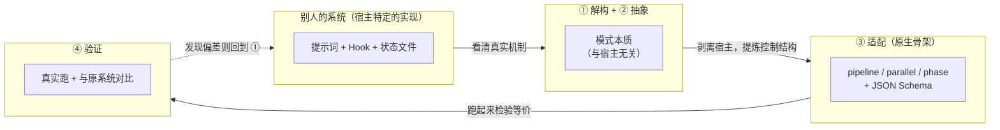
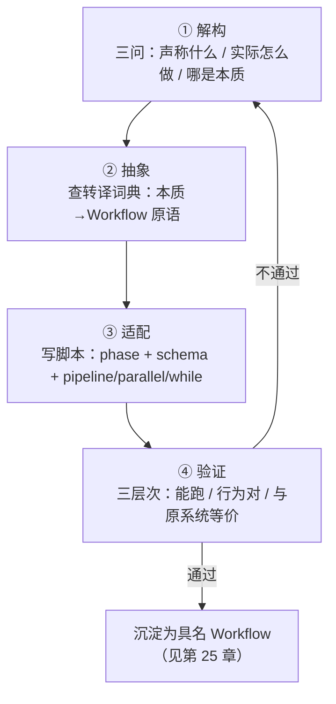

# 第 24 章 · 精华提取术

> 上一章我们解剖了四个社区系统的引擎盖，反复说「这一点值得偷师」。但「偷师」不是把别人的提示词复制粘贴过来——那样你得到的是一个**长在别人宿主上的器官**，移植到原生 Workflow 里会立刻排异。本章给出一套**可复用的方法论**：怎样把「别人系统里的好想法」系统性地拆开、剥离、重写成你自己的、确定性的、可复用的 Workflow。
>
> 四个动作，缺一不可：**解构（看清它真实的机制）→ 抽象（剥离宿主，提炼模式的本质）→ 适配（用 `phase`/`schema`/`parallel`/`pipeline` 重写）→ 验证（真的跑一遍，和原系统对比）**。本章用第 23 章的四个真实案例，把这四步从头走一遍。

---

## 24.1 为什么需要「术」，而不是直接抄

先讲一个会失败的故事，你就明白「术」解决的是什么。

假设你读了 superpowers 的 `subagent-driven-development/SKILL.md`，被它的「两段式评审」打动了：每个任务先做 spec 合规评审、再做 code quality 评审，各自循环到通过。你很自然地想：**把这两段评审的提示词复制到我的项目里不就行了？**

于是你把那两段 markdown 拷进自己的 `.claude/skills/`，开心地以为得到了「两段式评审」。但你很快会发现三个问题：

1. **它依赖一个你没有的宿主。** superpowers 的评审之所以「会循环到通过」，靠的不是那两段提示词本身，而是它整套 `SessionStart` 注入的「行为宪法」+ skill 链 + checkbox 状态文件。把提示词单独摘出来，它就成了第 23 章说的「死代码」——没有 bootstrap，skill 不会被强制触发。
2. **它的「保证」是概率性的。** 即便宿主齐全，superpowers 的评审循环本质是「提示词请求模型再评一次」。模型可能评、可能觉得「差不多了」就跳过。它是**软约定**，不是硬控制流。
3. **它的产物是给人看的文本，不是给程序消费的数据。** 评审结论写在对话里，你没法用代码判断「这一轮到底过没过、要不要再来一轮」。

<div class="callout warn">

**直接抄的根本病灶**：你抄来的是**实现**（某个宿主上的提示词 + 钩子 + 状态文件的特定组合），而你真正想要的是**模式**（「写完先查规范、再查质量，不过就重来」这个控制结构）。实现长在宿主上，模式才是可迁移的。**精华提取术的全部要义，就是把模式从实现里剥出来，再用原生 Workflow 的骨架重新长出一个实现。**

</div>

回到第 23 章那个贯穿全书的洞察：这四个系统都诞生在原生 Workflow 之前，它们用「提示词 + Hook + 状态文件」**模拟**了一个确定性编排引擎。它们发明的精华——验证门、持久循环、磁盘状态、越界护栏——都是**模式**；而它们承载这些模式的方式（软约定、钩子注入、文件续命）是**那个时代的实现**。

原生 Workflow 给了你一套更强的承载工具：
- `pipeline` / `parallel` / `phase` —— 用**代码**表达控制流，强保证；
- JSON Schema —— 把「产物长什么样、合不合格」从自由文本变成**机器可判定的契约**；
- `agent({ schema })` 的工具层校验 + 自动重试 —— 把「请模型再试一次」从祈祷变成**运行时纪律**。

所以提取术的产出物，是一个**把别人的模式焊在原生骨架上**的 Workflow 脚本。下面这张图是全章的总纲：



---

## 24.2 第一步 · 解构：看清它真实的机制

「解构」要回答一个问题：**这个好想法，真正起作用的机制是什么？** 注意「真正」二字——人们对自己系统的**叙述**，常常和它**真实的实现**有出入。提取的第一性原理是：**只信源码，不信营销词。**

解构有三个层层递进的拷问，我称之为「三问」：

### 三问之一：它声称做什么？（叙述层）

先记下它的**自我叙述**——README 怎么说、文档怎么说。比如 OMC 说自己「the boulder never stops，让复杂任务不会被静默地半途宣称完成」。这是它的**意图**，是好的起点，但不是机制。

### 三问之二：它实际怎么做？（机制层）

这一步要**翻源码**，找到那个真正实现意图的代码/配置。第 23 章已经替我们做过这件事，结论可直接引用（信源是对各仓库源码的真实阅读）：

| 系统 | 它声称（叙述） | 它实际（机制，源码层） |
|---|---|---|
| superpowers | 「先澄清意图、产出 spec、再 TDD」 | `subagent-driven-development/SKILL.md` 里**每任务两段评审**：spec 合规评审 → code quality 评审，各自要求 re-review 到过 |
| OMC | 「boulder never stops」 | `Stop` 钩子（`persistent-mode`）检查 `.omc/state/` 有无活跃 mode，有则**阻断停止**并回注「The boulder never stops」 |
| ccg | 「对抗上下文压缩、长任务不跑偏」 | `workflow-state.js` 每轮 `UserPromptSubmit` 读 `task.json` 注入 `<ccg-state>` **面包屑** |

注意每一行「实际」列，都精确到了**文件名/钩子名/字段名**。这就是解构的标准：**你能说出它在哪个文件、用什么数据结构、在什么生命周期点起作用。** 说不到这个粒度，就还没解构完。

### 三问之三：哪部分是模式，哪部分是宿主？（剥离层）

这是解构和抽象的接缝。拿到机制后，对每个组成部分追问：**它是「这个想法的本质」，还是「这个宿主的偶然」？**

以 OMC 的 Stop 钩子为例：

| 机制组成 | 本质（模式）还是偶然（宿主）？ | 理由 |
|---|---|---|
| 「跑完不一定算完，要看是否满足判据」 | **本质** | 这是「完成判据闭环」的核心思想，与任何宿主无关 |
| 用 `Stop` 生命周期钩子实现 | **宿主偶然** | 因为 OMC 没有原生控制流，只能借钩子「拦截停止」 |
| 判据存在 `.omc/state/sessions/{id}/` | **宿主偶然** | 因为提示词驱动的循环没有内存，只能靠磁盘续命 |
| 回注「The boulder never stops」文本 | **宿主偶然** | 这是「请模型继续」的提示词手段 |

剥离的结论一目了然：**本质只有一句——「是否允许结束，应由一个可编程的判据决定」。** 其余全是 OMC 在「没有原生循环」的约束下不得不发明的脚手架。

<div class="callout tip">

**解构的产出物**，是一份「机制说明书」，至少包含：①它声称的意图；②实现意图的真实代码位置与数据流；③逐项标注「本质 / 宿主偶然」。本书第 23 章对四大系统的拆解，本身就是四份现成的机制说明书——你做提取时可以直接站在它的肩膀上，但**对你想偷师的任何新系统，都要亲手补这一步**。

</div>

---

## 24.3 第二步 · 抽象：剥离宿主，提炼模式的本质

解构告诉你「哪些是本质」；抽象则把这些本质**重新表述成一句与宿主无关的控制结构描述**，并翻译成原生 Workflow 的语汇。

抽象的关键技巧，是把每个模式映射到一个**控制流原语**。原生 Workflow 的原语就那么几个，模式的本质往往恰好对应其一：

| 模式本质（抽象后的一句话） | 对应的 Workflow 原语 | 为什么是它 |
|---|---|---|
| 「A 做完 B 才能做，且 B 依赖 A 的产物」 | **顺序依赖**：`pipeline` 或直接 `await` | 阶段间有数据依赖，必须串行 |
| 「N 件互不依赖的事同时做，要全部结果」 | `parallel`（屏障） | 无依赖 + 需要汇总 |
| 「N 件事各自独立地流过同一串阶段」 | `pipeline`（无屏障） | 每条链独立，墙钟取最慢的一条 |
| 「重复做，直到满足某个判据」 | `while` + 门控字段 | 退出条件是动态的，要循环 |
| 「产物必须长成某个样子才算数」 | `agent({ schema })` | Schema 在工具层强制结构与类型 |
| 「这件事归到某个阶段下显示」 | `phase()` / `opts.phase` | 进度分组 |

这张表是提取术的「转译词典」。抽象这一步，本质上就是反复查这本词典：**把解构出的每个本质，翻成词典右列的一个或几个原语的组合。**

我们对四个案例分别做抽象：

**superpowers 两段式评审** 抽象为：
> 「对一份产物，先做**第一种**评审（spec 合规），不过就重来；过了再做**第二种**评审（code quality），不过也重来。」
>
> 转译：两个评审是**顺序**关系（先 spec 后 quality）→ `pipeline` 的两个 stage；每个评审的「过/不过」要能驱动判断 → 各自一个带 `pass: boolean` 门控字段的 `schema`；「不过就重来」→ 在 stage 内部对单份产物做有界 `while`。

**OMC Stop 钩子** 抽象为：
> 「反复推进，直到一个可编程的判据判定『可以收工』。」
>
> 转译：「反复直到判据」→ `while` + `done`/`accepted` 门控字段（与第 18 章「循环到干」同构）；「可编程判据」→ 一个独立的验收 `agent({ schema })`，schema 里有 `accepted: boolean`。

**ccg 磁盘面包屑** 抽象为：
> 「让后续步骤拿到前序步骤的**结构化产物**，从而始终知道『当前进展与已知事实』，无需依赖会被压缩的对话历史。」
>
> 转译：ccg 用「磁盘 + 每轮注入」是因为它的步骤分散在多个对话回合、会被上下文压缩冲掉。而原生 Workflow 的脚本体是**一个连续的 JS 闭包**——前一个 `agent()` 的返回值，就是后一个 `agent()` 提示词里的变量。`task.json` 的本质（「把状态外化、显式传递」）在 Workflow 里**退化成了普通的变量传递与 structured output**，根本不需要磁盘。

**OmO 工具层护栏 + Category 委派** 抽象为两句：
> 「①规划者的产物只能是『计划』，不能夹带『对代码的副作用』；②『用什么模型』应由任务的_语义类别_决定，而非散在提示词里的硬编码模型名。」
>
> 转译：①「产物只能是某种形状」→ `agent({ schema })`，且用 `additionalProperties: false` 把 diff/补丁这类字段**结构上**挡在门外，再把「执行」拆成一个独立 phase（角色分离）；②「按类别选模型」→ 一张 `MODEL_BY_CATEGORY` 查找表 + `opts.model`，让 `category` 字段驱动派发。

<div class="callout info">

**抽象阶段最常见的顿悟**，是发现某个「精华」在原生 Workflow 里**根本不需要单独实现**——因为它解决的问题（上下文压缩、跨回合失忆、跑完即停）是宿主缺陷，而原生骨架天生没有这个缺陷。ccg 的磁盘面包屑就是典型：它在 Workflow 里「消失」成了变量传递。**识别出「这个精华在新宿主里免费了」，和「把这个精华移植过来」同样有价值。**

</div>

---

## 24.4 第三步 · 适配：用 phase / schema / parallel / pipeline 重写

抽象给了你「用哪些原语、怎么组合」的蓝图；适配就是把蓝图落成**可运行的脚本**。这一步我们对四个案例各动一次手，写出完整脚本。

> 本节所有脚本均标注「（示意，未实跑）」——它们是把模式落成代码的**范本**，演示结构与原语用法；其中引用的真实运行数据（如 GCF 的 `wf_7472ceac-daa`）来自前面章节的实跑记录，可溯源。

### 案例一：superpowers 两段式评审 → `pipeline(tasks, specReview, qualityReview)` + 两个 schema

这是把「方法论纪律」焊成「确定性质量闸」的核心演示。模式抽象已得：两段评审是顺序关系，用 `pipeline` 的两个 stage；每段各有 `pass` 门控；不过就有界重来。

先看**最直接的落法**——把两段评审作为 `pipeline` 的两个阶段，让每个待评审任务独立流过：

```javascript
// （示意，未实跑）—— superpowers 两段式评审 → pipeline + 两 schema
export const meta = {
  name: 'two-stage-review',
  description: 'Spec-compliance review then code-quality review, each a deterministic gate',
  phases: [
    { title: 'SpecReview', detail: '逐任务核对是否精确实现了 spec（不过度、不遗漏）' },
    { title: 'QualityReview', detail: '通过 spec 闸后再审代码质量' },
  ],
}

// 每个 schema 都有一个 pass 门控字段——这是「闸」的物理形式
const SPEC_SCHEMA = {
  type: 'object',
  properties: {
    pass: { type: 'boolean' },                         // 是否精确符合 spec
    overImplemented: { type: 'array', items: { type: 'string' } },  // 多做了什么
    underImplemented: { type: 'array', items: { type: 'string' } }, // 漏做了什么
    verdict: { type: 'string' },
  },
  required: ['pass', 'overImplemented', 'underImplemented', 'verdict'],
}

const QUALITY_SCHEMA = {
  type: 'object',
  properties: {
    pass: { type: 'boolean' },
    issues: {
      type: 'array',
      items: {
        type: 'object',
        properties: {
          severity: { type: 'string', enum: ['blocker', 'major', 'minor'] },
          note: { type: 'string' },
        },
        required: ['severity', 'note'],
      },
    },
    verdict: { type: 'string' },
  },
  required: ['pass', 'issues', 'verdict'],
}

// args.tasks: [{ id, spec, diff }]，每项是一个待评审的实现单元
const tasks = args.tasks

const results = await pipeline(
  tasks,
  // stage 1：spec 合规评审。收到原始 task
  (task) =>
    agent(
      `你是 spec 合规评审员。对照下面的 spec，判断实现是否**精确**符合——` +
      `既不能多做（over-implementation），也不能少做（under-implementation）。\n` +
      `SPEC:\n${task.spec}\n\nDIFF:\n${task.diff}`,
      { label: `spec:${task.id}`, phase: 'SpecReview', schema: SPEC_SCHEMA }
    ),
  // stage 2：code quality 评审。收到 (specResult, task, index)
  (specResult, task) => {
    // spec 闸没过，就别浪费一个 quality agent——直接把结论透传下去
    if (!specResult.pass) {
      return { stage: 'spec', specResult, qualityResult: null, accepted: false }
    }
    return agent(
      `你是 code quality 评审员。spec 合规已通过，现在只看代码质量` +
      `（命名、错误处理、边界、可读性）。列出问题并给严重度。\n` +
      `DIFF:\n${task.diff}`,
      { label: `quality:${task.id}`, phase: 'QualityReview', schema: QUALITY_SCHEMA }
    ).then((qualityResult) => ({
      stage: 'quality',
      specResult,
      qualityResult,
      accepted: qualityResult.pass,
    }))
  }
)

log(`两段式评审完成：${results.filter(Boolean).length} 个任务流过两道闸`)
return results
```

这段脚本把 superpowers 那「靠提示词请求 re-review」的软约定，变成了**两道物理的闸**：第一道 `SPEC_SCHEMA.pass` 不为 true，第二道根本不开（连 quality agent 都不派发，省一份 token）；两道都过，`accepted` 才为 true。`pipeline` 让每个任务**独立**流过两道闸——10 个任务的墙钟≈最慢那一个任务走完两道闸的时间，而不是「全部 spec 评审完再全部 quality 评审」（那是 `parallel` 屏障的低效写法，第 26 章会专门批判）。

但「不过就重来」呢？上面的版本是「评一次、给结论」。要实现 superpowers 真正的「循环到过」，得在闸内部加**有界重试**——而重试意味着「评审 → 若不过则修 → 再评」，这其实就退化成了第 12 章的 GCF（生成-批评-修复）循环。我们把它显式写出来：

```javascript
// （示意，未实跑）—— 闸内有界循环：评 → 修 → 再评，直到过或触上限
async function gatedFix(task, reviewSchema, reviewerRole, maxRounds = 3) {
  let diff = task.diff
  let round = 0
  let lastReview = null
  while (round < maxRounds) {                          // 有界！见第 18 章
    round++
    const review = await agent(
      `${reviewerRole}\nSPEC:\n${task.spec}\n\nDIFF:\n${diff}`,
      { label: `review:${task.id}:r${round}`, schema: reviewSchema }
    )
    lastReview = review
    if (review.pass) return { passed: true, rounds: round, diff, review }
    // 不过：派一个 fixer 按评审意见重写
    const fixed = await agent(
      `你是实现者。评审未通过，按下列意见**最小化修改**后给出完整新 diff。\n` +
      `意见：${JSON.stringify(review)}\n原 diff：\n${diff}`,
      {
        label: `fix:${task.id}:r${round}`,
        schema: { type: 'object', properties: { diff: { type: 'string' } }, required: ['diff'] },
      }
    )
    diff = fixed.diff
  }
  return { passed: false, rounds: round, diff, review: lastReview }  // 触上限，带着最后状态退出
}
```

这里每个细节都呼应了前面章节立下的纪律：`maxRounds` 是第 18 章反复强调的「刹车是纪律不是可选」；`pass` 门控字段是第 18 章「`done: boolean` 门控」的同构；独立的 reviewer 与 fixer 是第 12 章「批评必须交给独立 agent，否则会自我辩护」。**这就是提取术的复利**——你为一个案例建立的纪律，可以原样套到下一个案例。

### 案例二：OMC Stop 钩子完成判据 → `while(!done)` 循环 + 验收 schema

OMC 的精华抽象为「反复推进，直到可编程判据判定可收工」。这在第 18 章已经有了完整的 Workflow 化身（「循环到干」），这里我们换一个更贴近 OMC「PRD 每条 story 都 `passes:true` 才算完」的形态来演示——**逐条验收，全过才停**：

```javascript
// （示意，未实跑）—— OMC「boulder never stops」→ while + 验收 schema
export const meta = {
  name: 'acceptance-loop',
  description: 'Keep working until an independent acceptance gate passes every story (OMC-style)',
  phases: [
    { title: 'Build', detail: '产出/修订一版实现' },
    { title: 'Accept', detail: '独立验收每条 story，全过才允许收工' },
  ],
}

// 验收 schema：accepted 是「是否允许停」的门控；perStory 给出每条的判定
const ACCEPT_SCHEMA = {
  type: 'object',
  properties: {
    accepted: { type: 'boolean' },                     // 等价于 OMC 的「Stop 钩子放行」
    perStory: {
      type: 'array',
      items: {
        type: 'object',
        properties: {
          id: { type: 'string' },
          passes: { type: 'boolean' },                 // 对应 prd.json 每条 story 的 passes
          gap: { type: 'string' },                     // 没过则说明差在哪
        },
        required: ['id', 'passes', 'gap'],
      },
    },
  },
  required: ['accepted', 'perStory'],
}

const MAX_ROUNDS = 5
const stories = args.stories          // [{ id, requirement }]
let work = args.initialDraft || ''
let round = 0
let accepted = false
let lastReport = null

while (!accepted && round < MAX_ROUNDS) {               // 双重退出：判据 + 硬上限
  round++

  // budget 兜底：预算不足以再跑一轮（Build+Accept 两个 agent）就提前收口
  if (budget.total !== null && budget.remaining() < 60_000) {
    log(`预算不足以再跑一轮（剩余 ${budget.remaining()}），带当前状态收口`)
    break
  }

  phase('Build')
  const built = await agent(
    `你是实现者。根据下列 stories 产出/修订实现。\n` +
    `stories：${JSON.stringify(stories)}\n` +
    `上一轮验收反馈（首轮为空）：${lastReport ? JSON.stringify(lastReport.perStory) : '无'}\n` +
    `当前实现：${work || '（空，从头写）'}`,
    {
      label: `build:r${round}`,
      phase: 'Build',
      schema: { type: 'object', properties: { work: { type: 'string' } }, required: ['work'] },
    }
  )
  work = built.work

  phase('Accept')
  // 关键：验收者是独立 agent，不是上面那个 build agent——否则它会为自己的产物背书
  lastReport = await agent(
    `你是独立验收员。逐条核对每个 story 是否被实现满足。` +
    `**只有全部 passes=true 时，accepted 才为 true。**\n` +
    `stories：${JSON.stringify(stories)}\n实现：${work}`,
    { label: `accept:r${round}`, phase: 'Accept', schema: ACCEPT_SCHEMA }
  )
  accepted = lastReport.accepted

  if (!accepted) {
    const failing = lastReport.perStory.filter((s) => !s.passes).map((s) => s.id)
    log(`第 ${round} 轮验收未过，未满足：${failing.join('、')}`)
  }
}

return {
  accepted,
  rounds: round,
  hitCeiling: !accepted && round >= MAX_ROUNDS,         // 诚实标注：是「真过了」还是「撞上限」
  work,
  finalReport: lastReport,
}
```

把这段和 OMC 的真实机制对照，你会看到一个漂亮的**降维**：

| OMC 的实现（宿主特定） | Workflow 的对应（原生骨架） |
|---|---|
| `Stop` 钩子拦截停止 | `while (!accepted ...)` 循环条件 |
| `.omc/state/` 存 mode/phase/iteration | `round` / `work` / `lastReport` 普通变量 |
| 回注「The boulder never stops」 | 循环自然进入下一轮，无需提示词 |
| 独立 critic 验证 `passes:true` | 独立 `agent({ schema: ACCEPT_SCHEMA })` |
| crash 后 resume | `resumeFromRunId` 续传（第 22 章） |

OMC 为「让循环可编程」付出的全部脚手架——钩子、状态文件、回注文本——在原生 Workflow 里**坍缩成了一个 `while` 和几个局部变量**。这不是 OMC 笨，而是它生在没有原生循环的年代；这也正是第 23 章那句话的字面兑现：**原生 Workflow 提供了它们缺的确定性骨架。**

<div class="callout warn">

**别把 OMC 精华移植成「无界循环」。** 移植「反复推进直到判据」这类持久循环时**必须**避免无界循环——Workflow 版本一定要带上 `MAX_ROUNDS` + `budget.remaining()` 兜底，这是第 18 章的铁律（模型的 `done`/`accepted` 是概率性判断，可能迟迟不放行）。返回值里诚实地标 `hitCeiling`，让调用方知道这次是「真验收通过」还是「撞了上限被迫收工」。绝不要让「boulder never stops」变成「token never stops」。

</div>

### 案例三：ccg 磁盘面包屑 → structured output 产物传递

这个案例的「适配」最特殊——因为抽象阶段我们已经发现：**ccg 的磁盘面包屑在原生 Workflow 里基本免费了。** 但「免费」不等于「无事可做」；它对应到 Workflow 的一个**正面实践**：用结构化产物在阶段间显式传递「已知事实 + 当前进展」，而不是让后续 agent 去猜或去读会被压缩的历史。

ccg 的 `task.json` + `<ccg-state>` 面包屑，本质是在回答「下一步该知道什么」。在 Workflow 里，这件事由**前一阶段的 structured output 直接喂给后一阶段的提示词**完成：

```javascript
// （示意，未实跑）—— ccg 磁盘面包屑 → structured output 显式产物传递
export const meta = {
  name: 'breadcrumb-pipeline',
  description: 'Pass a structured "state" object down the pipeline instead of disk breadcrumbs',
  phases: [
    { title: 'Survey', detail: '勘察：产出结构化的「现状事实」' },
    { title: 'Plan', detail: '基于现状产出计划（带它依赖的事实快照）' },
    { title: 'Execute', detail: '基于计划执行（带它依赖的计划与现状）' },
  ],
}

// 这个 schema 就是「面包屑」的结构化形态——显式、可校验、可传递
const STATE_SCHEMA = {
  type: 'object',
  properties: {
    facts: { type: 'array', items: { type: 'string' } },      // 已确认的事实（对应 ccg 写进 task.json 的东西）
    openQuestions: { type: 'array', items: { type: 'string' } },
    nextActions: { type: 'array', items: { type: 'string' } },
  },
  required: ['facts', 'openQuestions', 'nextActions'],
}

phase('Survey')
const state = await agent(
  `你是勘察员。勘察 ${args.target}，产出结构化现状：已确认事实、未决问题、建议的下一步动作。`,
  { label: 'survey', phase: 'Survey', schema: STATE_SCHEMA }
)

phase('Plan')
// 关键：把上一阶段的「面包屑」原样塞进下一阶段的提示词——这就是「注入」，但发生在闭包里，不经磁盘
const plan = await agent(
  `你是规划者。基于下面这份**现状快照**制定计划。不要重新勘察，直接信任这些事实。\n` +
  `现状快照：${JSON.stringify(state)}`,
  {
    label: 'plan',
    phase: 'Plan',
    schema: {
      type: 'object',
      properties: {
        steps: { type: 'array', items: { type: 'string' } },
        assumptions: { type: 'array', items: { type: 'string' } },
      },
      required: ['steps', 'assumptions'],
    },
  }
)

phase('Execute')
const result = await agent(
  `你是执行者。按计划执行。下面同时给你**现状**与**计划**，确保动作与已知事实一致。\n` +
  `现状：${JSON.stringify(state)}\n计划：${JSON.stringify(plan)}`,
  {
    label: 'execute',
    phase: 'Execute',
    schema: { type: 'object', properties: { summary: { type: 'string' }, done: { type: 'boolean' } }, required: ['summary', 'done'] },
  }
)

return { state, plan, result }
```

对照 ccg 的真实机制，差异是结构性的：

| ccg 磁盘面包屑 | Workflow structured output |
|---|---|
| 状态写进 `task.json`（磁盘） | 状态是 `state` / `plan` 局部变量（内存闭包） |
| 每轮 Hook 读盘 → 注入 `<ccg-state>` | 直接 `JSON.stringify(state)` 拼进下一个提示词 |
| 为对抗「跨回合上下文压缩」而存在 | 同一脚本闭包内无压缩问题，天然不丢 |
| 面包屑是非结构化文本片段 | `STATE_SCHEMA` 让面包屑**结构化、可校验** |

<div class="callout tip">

**ccg 这一课的真正价值，不是「把磁盘搬进内存」，而是「显式传递、结构化传递」这个原则。** 很多人写 Workflow 时图省事，让后一个 agent「自己去读文件 / 自己再勘察一遍」——这既慢又可能得到不一致的事实。ccg 用磁盘面包屑强迫「状态显式化」，这个**习惯**值得继承：让每一阶段的关键产出都走 `schema`，并显式喂给下一阶段。原生 Workflow 让这件事的成本降到「一个变量 + 一次 `JSON.stringify`」，没有理由不做。

</div>

### 案例四：OmO 工具层护栏 → schema 约束的「规划者-执行者」角色分离

第四个案例来自 OmO（建在 opencode 上）。它的精华在第 23 章已解构清楚，这里走完整的「抽象 → 适配」。先把两个本质抽象出来：

> **本质一（工具层护栏）**：OmO 的 `prometheus-md-only/hook.ts` 在工具调用层硬拦截——规划者的 `Write/Edit` 只能写 `.omo/*.md`，违规直接 `throw`。**规划者物理上无法写代码。** 抽象成一句话：「规划者的产物必须是『计划』，不能是『对代码的副作用』。」
>
> **本质二（Category 委派）**：OmO 不按模型名派发，而按**语义意图**（`category`）——LLM 只声明「这是一件什么类别的事」，运行时再映射到具体模型。抽象成一句话：「让『按什么模型做』成为一张可热插拔的映射表，而非散落在提示词里的硬编码。」

**适配本质一：用 `schema` + 角色分离复刻「规划者碰不到代码」。** 原生 Workflow 的脚本体没有 FS/Node API，agent 本就不能直接写宿主文件；但「规划者不许产出代码」这件事，可以用一个**只允许出现计划字段**的严格 `schema` 来物理保证——`additionalProperties: false` 让规划者**结构上**无法夹带 diff/补丁，再由一个**独立的执行者阶段**去消费这份计划：

```javascript
// （示意，未实跑）—— OmO 工具层护栏 → schema 约束的 planner / executor 分离
export const meta = {
  name: 'planner-executor',
  description: 'A schema-locked planner that cannot emit code, then a separate executor stage',
  phases: [
    { title: 'Plan', detail: '规划者只能产出计划对象（schema 锁死，夹带不了代码）' },
    { title: 'Execute', detail: '独立执行者消费计划，是唯一被允许产生代码副作用的阶段' },
  ],
}

// 关键：additionalProperties:false 让「计划」之外的任何字段（如 diff/patch）都通不过校验
// 这就是 OmO「工具层 throw」在原生 Workflow 里的等价物——把护栏从「拦截工具调用」前移到「约束产物形状」
const PLAN_SCHEMA = {
  type: 'object',
  additionalProperties: false,                         // 物理墙：只认下面列出的字段
  properties: {
    steps: {
      type: 'array',
      items: {
        type: 'object',
        additionalProperties: false,
        properties: {
          id: { type: 'string' },
          intent: { type: 'string' },                  // 这一步想达成什么（描述，不是代码）
          targetFile: { type: 'string' },              // 预期改哪个文件（只是声明，不含内容）
          category: { type: 'string', enum: ['research', 'mechanical', 'design', 'risky'] },
        },
        required: ['id', 'intent', 'targetFile', 'category'],
      },
    },
    risks: { type: 'array', items: { type: 'string' } },
  },
  required: ['steps', 'risks'],
}

phase('Plan')
// 规划者：哪怕它「想」写代码，schema 也没有承载代码的字段——StructuredOutput 会因结构不符而打回重试
const plan = await agent(
  `你是规划者。只产出**计划**：把任务拆成步骤，每步给出意图、预期改动的目标文件、以及该步的 category。` +
  `你不能、也无需写任何代码或 diff——下游有独立执行者。\n任务：${args.task}`,
  { label: 'plan', phase: 'Plan', schema: PLAN_SCHEMA }
)

phase('Execute')
// 执行者：唯一被允许真正动代码的角色。它拿到的是一份已被 schema 校验过的纯计划
const execResult = await agent(
  `你是执行者。严格按下面这份计划逐步实现（这是唯一允许产生代码副作用的阶段）。\n` +
  `计划：${JSON.stringify(plan)}`,
  {
    label: 'execute',
    phase: 'Execute',
    schema: {
      type: 'object',
      properties: {
        changedFiles: { type: 'array', items: { type: 'string' } },
        summary: { type: 'string' },
      },
      required: ['changedFiles', 'summary'],
    },
  }
)

return { plan, execResult }
```

把它和 OmO 的真实机制对照，护栏的「位置」发生了一次漂亮的前移：

| OmO 的实现（宿主特定） | Workflow 的对应（原生骨架） |
|---|---|
| `hook.ts` 在**工具调用前**拦截 `Write/Edit` | `PLAN_SCHEMA` 在**产物校验时**拦截非计划字段 |
| 违规路径 → `throw` | 违规结构 → StructuredOutput 打回、模型重试 |
| 「规划者只能写 `.omo/*.md`」 | 「规划者只能产出 `PLAN_SCHEMA` 形状的对象」 |
| 执行交给另一个 agent 角色 | 执行交给独立的 `Execute` phase |

两者达到的**保证等价**：规划者都无法把「对代码的副作用」夹带进它的产出。OmO 靠拦截工具调用，原生 Workflow 靠约束产物形状 + 阶段角色分离——后者甚至更干净，因为它根本不给规划者「写文件」这个能力，而非事后拦截。

**适配本质二：Category → 模型映射表。** OmO 的「按语义意图委派」，在原生 Workflow 里就是一张普通的查找表 + `opts.model`：

```javascript
// （示意，未实跑）—— OmO Category 委派 → args.category 驱动的模型映射
// 一张可热插拔的映射表：要换模型，改这里一行，不动任何提示词
const MODEL_BY_CATEGORY = {
  research: 'opus',          // 需要深推理的研究类 → 强模型
  design: 'opus',
  mechanical: 'haiku',       // 机械、确定性高的活 → 便宜快模型（呼应 _grounding：简单任务可用 haiku）
  risky: 'opus',
}

// 让上一阶段产出的 plan.steps[].category 直接决定每步派给谁——「按类别」而非「按硬编码模型名」
const stepResults = await pipeline(
  plan.steps,
  (step) =>
    agent(
      `执行这一步：${step.intent}（目标文件 ${step.targetFile}）。`,
      {
        label: `step:${step.id}`,
        model: MODEL_BY_CATEGORY[step.category] || 'opus',   // 兜底：未知类别用强模型
      }
    )
)
```

这个小映射表的价值，和 OmO 的设计动机一致：**把「用什么模型」从提示词里抽出来，集中成一处配置。** 模型换代时（如 haiku 升级、新增一档中端模型），你只改 `MODEL_BY_CATEGORY` 一行，所有按类别派发的步骤自动跟随；提示词里一个模型名都不出现，也就不会有「模型名散落各处、改起来漏一个」的维护债。

<div class="callout warn">

**诚实地说清 schema 的边界（呼应 24.5 的立场）：`schema` 锁住的是产物的_形状_，不是产物的_真实性_。** 上面的 `planner-executor` 能保证「规划者交出来的是一个纯计划对象」，但**不能**保证「这个计划是对的」，更不能保证「执行者真照做了」。OmO 除了工具层护栏，还有一层 **system-reminder 注入**（`VERIFICATION_REMINDER`：「子 agent 说完成了，它在撒谎，去验证」）——而**这一层在原生 Workflow 里没有精确对应物**：Workflow 没有「每轮往子 agent 上下文里硬塞一段提醒」的钩子。所以 OmO「不可信验证」精华的原生等价物，**不是 schema，而是一个显式的验证阶段**——你得自己加一个独立的 verify-agent（如案例一的 quality 闸、案例二的 accept 闸），用它的 `pass`/`accepted` 门控去判定执行者的产物。**别指望 `schema` 帮你做验证；它只负责形状，验证要靠独立的人/agent。**

</div>

---

## 24.5 第四步 · 验证：真的跑一遍，和原系统对比

适配产出了脚本，但**没跑过的脚本不算提取成功**。验证回答两个问题：①它真能跑通吗？②它真的复刻了原系统的精华吗（而不是看起来像）？

### 验证的三个层次

**层次一：能跑（语法 + 运行）。** 把脚本交给 Workflow 工具。回忆第 01 章：返回是异步的，立即给 `taskId`/`runId`；若 `meta` 不是纯字面量或脚本有语法问题，`WorkflowOutput` 会带 `error`（语法检查失败时）。这一层验证「骨架立住了」。

**层次二：行为对（产物符合预期）。** 跑完后看完成通知里的返回值。这里 `schema` 是你的免费断言——如果 `agent({ schema })` 返回了，说明产物**已经**通过了结构校验。但结构对不代表语义对，你要人工核对：两段评审真的拦住了不合规的 diff 吗？验收循环真的在全过时才停吗？

**层次三：等价（与原系统对比）。** 这是提取特有的一层：你的 Workflow 版，和它模仿的原系统，在**关键行为**上一致吗？做法是构造一个「原系统会怎么处理」的输入，看两边结论是否吻合。

### 一次真实的等价验证：GCF 就是 superpowers 两段式评审的简化实跑

本书第 12 章的 GCF 配方，是一次**真实跑过**的「生成 → 对抗式批评 → 修复」，它正是 superpowers 两段式评审的「单段实跑版」。我们用它来演示「等价验证」长什么样——因为它有真实数据可锚定：

> **真实运行**：GCF（`slugify`）Run ID `wf_7472ceac-daa`，Task ID `wchxy8dbm`，原始记录见 `assets/transcripts/gcf-slugify.md`。真实用量 `agent_count=3`、`tool_uses=10`、`total_tokens=96468`、`duration_ms=180724`（约 3 分钟）。

这次运行里，**一个独立的对抗式批评 agent（Critique 阶段）对一个 30 行的 `slugify()` 列出了 10 个真实缺陷**（按严重度排，详见 `gcf-slugify.md`）。这是一次**观察**，而非反事实证明——它说明的是：把「写」和「挑刺」分给两个 agent、并明确要求后者对抗式审查，这一次**确实**系统性地暴露了第一版的盲区。本节没有跑「让生成 agent 自评同一份代码」的对照组，因此不能据此断言「自评一定挑不出这些缺陷」；能说的是：GCF/superpowers 这类「独立批评」结构，把发现盲区这件事交给了一个不为产物背书的视角，而本次运行印证了这个结构能产出有价值的批评。

**这就是一次「等价验证」的范本**：我们没有照搬 superpowers 的提示词，而是用原生原语（三阶段 + 独立批评 agent + schema）重写，然后真实跑一遍，观察到它复刻了「用独立视角做对抗式批评」这个**结构本质**。两段式评审相比 GCF 只是多了一道「先 spec 后 quality」的分级——结构同源，本次实跑验证了这条结构链可行。

第 12 章还给了一个直接呼应：它的「变体 B · 评委把关 Fix」明确写着「Fix 之后再加一个独立 agent，对比原始 issues 与修复版，确认每条都真的修了（**呼应第 23 章 superpowers 的两段式评审**）」。这条迁移链——superpowers 的模式 → GCF 的实跑 → 变体 B 的两段化——就是本章方法论走通的活样本。

### 验证里的对照实验：用真实数据校准直觉

验证还有一个常被忽略的用途：**用真实运行数据，校准你对成本和收敛的直觉**，避免移植来的模式在你的规模上失控。本书的真实运行给了几个可直接引用的锚点：

| 真实运行 | Run ID | 给提取的校准 |
|---|---|---|
| judge-panel（3 评委独立打分） | `wf_f5b69668-b18` | 3 名互不通信的评委对「质量明显有别」的候选**独立收敛到 3:0**——观察到与「多独立视角降低单评审偏差」（superpowers/OMC 都依赖的假设）一致的证据（一次 3:0 收敛，非普遍性证明） |
| frontend-review（3 维并发评审 + 综合） | `wf_4c5caabb-b73` | `agent_count=4`、`total_tokens=221648`——印证「token≈agent 数×每 agent 上下文」，移植「多维评审」前可据此估成本 |
| nested-parent（嵌套子流程） | `wf_85e22b38-126` | 子流程的 agent **计入父流程**的 `agent_count`/`budget.spent()`——移植「子流程委派」模式时，预算要按父子合计算 |

<div class="callout info">

**judge-panel 那次运行还有一个值得记录的观察**：3 名评委在打分理由里写明，它们**实际读取了 `docs/en/p2-08` 与 `assets/_grounding.md` 交叉核对**了书中的几个数字（8.4s/78844 token、min(16, cores−2)、1000 上限……），结论是「zero factual errors」。注意这是**这一次运行**里、被赋予了打分 rubric/schema 的评委所表现出的行为，**不是** Workflow 的普遍保证——`agent({ schema })` 校验的是产物结构，并不强制 agent 去外部求证。把它当作一条经验性观察：给评委明确的 rubric + schema，有助于（而非保证）引导出「主动核对事实」这类行为。若你需要的是**强制**的验证门（如 OmO 的 VERIFICATION_REMINDER 那种「子 agent 说完成了就去验证」），仍要靠显式的提示词指令或额外的验证 agent，而不能指望 schema 本身带来。

</div>

### 验证失败怎么办：回到第一步

验证不通过，分两种情况：

- **能跑但行为不对**（如验收循环永不停）：多半是**抽象**漏了纪律（忘了 `MAX_ROUNDS`），或 schema 门控字段设计错了。回到 24.3，重查转译词典。
- **跑通了但和原系统不等价**（如你的「两段评审」其实只评了一段）：多半是**解构**没到位，把宿主偶然当成了本质，或漏掉了某个关键机制。回到 24.2，重做「三问」。

这就是 24.1 那张总纲图里那条**回流虚线**的含义：提取是迭代的，验证是它的质检关。

---

## 24.6 把四步串成一张「提取工作单」

为了让这套方法论可操作，把四步固化成一份**工作单**——下次你看到任何系统里的好想法，照着填：



| 步骤 | 关键问题 | 产出物 | 本书工具 |
|---|---|---|---|
| ① 解构 | 它真正起作用的机制在哪个文件、什么数据流？ | 机制说明书（标注本质/宿主偶然） | 第 23 章四份现成说明书 |
| ② 抽象 | 每个本质对应哪个 Workflow 原语？ | 原语组合蓝图 | 24.3 转译词典 |
| ③ 适配 | 怎么用 `phase`/`schema`/`pipeline` 落成脚本？ | 可运行脚本 | 24.4 四个范本 |
| ④ 验证 | 能跑吗？行为对吗？与原系统等价吗？ | 真实运行 + 对比结论 | 24.5 真实数据锚点 |

走完这张单，你得到的不是「抄来的提示词」，而是一个**你完全理解、可确定性复现、能沉淀进自己库**的 Workflow。下一章就讲怎么把这些产出物组织成一个可维护、可分享的个人 Workflow 库。

---

## 24.7 本章小结

- **直接抄会排异**：你抄来的是「长在别人宿主上的实现」，而你真正要的是「与宿主无关的模式」。提取术 = 把模式从实现里剥出，再用原生骨架重新长出实现。
- **四步法**：解构（看清真实机制，精确到文件/数据流，区分本质与宿主偶然）→ 抽象（查转译词典，把本质映射到 `pipeline`/`parallel`/`while`/`schema`）→ 适配（落成可运行脚本）→ 验证（能跑、行为对、与原系统等价）。
- **四个案例的归宿**：superpowers 两段式评审 → `pipeline` 两 stage + 两个 `pass` 门控 schema（不过就有界重来）；OMC Stop 钩子 → `while(!accepted)` + 验收 schema（坍缩掉了钩子与状态文件）；ccg 磁盘面包屑 → structured output 显式传递（在闭包里变量化，磁盘免费消失）；OmO 工具层护栏 → `additionalProperties:false` 的 planner schema + 独立 executor 阶段（把「拦截工具调用」前移成「约束产物形状」），Category 委派 → `MODEL_BY_CATEGORY` 映射表。
- **常见顿悟**：有些「精华」在原生 Workflow 里**免费了**（如 ccg 面包屑对抗的上下文压缩，在单脚本闭包里不存在）。识别「它免费了」和「移植它」同等重要。
- **验证靠真实数据**：GCF（`wf_7472ceac-daa`，批评揪出 10 个缺陷）直观展示了独立批评能揪出自评易放过的问题——但本书未设自评对照组，这是观察而非「优于自评」的严格证明；它是 superpowers 两段式评审的活样本。judge-panel（`wf_f5b69668-b18`，3:0 收敛）、frontend-review（`wf_4c5caabb-b73`）、nested（`wf_85e22b38-126`）分别校准了「多视角收敛」「成本估算」「父子预算合计」的直觉。

下一章，我们把这些验证过的 Workflow 组织成一个**可命名、可参数化、可版本管理、可回归测试、可分享**的个人库。

> 继续阅读：[第 25 章 · 构建你自己的 Workflow 库](#/zh/p5-25)
