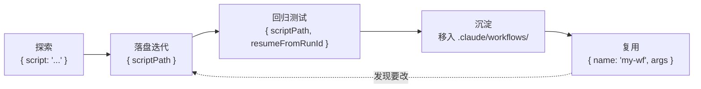
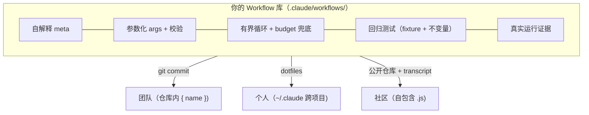

# 第 25 章 · 构建你自己的 Workflow 库

> 第 24 章教会你把好想法**提取**成一个验证过的 Workflow 脚本。但一个躺在会话目录里、用完即弃的 `.js` 文件，价值只发挥了一半。本章讲怎样把这些脚本**沉淀成一个库**——可命名调用、可参数化复用、可版本管理、可回归测试、可分享给团队。
>
> 这一切的技术地基，是第 01 章揭示的那条朴素事实：**每次调用，Workflow 脚本都会落盘成一个文件。** 既然是文件，它就能被命名、被版本控制、被 diff、被复用。本章把这条事实兑现成一套可直接照搬的工程实践。

---

## 25.1 从「一次性脚本」到「具名工作流」

回忆第 01 章 1.6 节那句话：

> 你可以把验证过的工作流脚本收进 `.claude/workflows/`，之后用 `{ name: 'my-workflow' }` 像调用具名命令一样复用它。

这就是「库」的起点。先把三种调用方式的差别讲清楚——它们对应 `WorkflowInput` 的三个互斥（按优先级）入口字段（信源：`assets/_grounding.md` B 节）：

| 入口字段 | 含义 | 适用阶段 |
|---|---|---|
| `script` | 自包含脚本字符串，必须以纯字面量 `export const meta` 开头 | **探索期**：第一次写、快速迭代 |
| `name` | 预定义/具名工作流（内置或 `.claude/workflows/`） | **沉淀后**：复用一个已验证的工作流 |
| `scriptPath` | 磁盘脚本路径，优先级**高于** `script`/`name` | **迭代/测试**：编辑磁盘文件后重跑、续传 |

<div class="callout info">

**`scriptPath` 优先级最高**（据 B 节）。这意味着：当你在迭代一个脚本时，把它存到磁盘、用 `{ scriptPath }` 反复重跑，是最顺手的工作流；而当它稳定了，搬进 `.claude/workflows/` 并用 `{ name }` 调用，就成了「库里的一个具名工具」。**`name` 是给消费者的，`scriptPath` 是给作者的。**

</div>

一段脚本从「一次性」长成「库成员」的生命周期是这样的：



本章接下来就沿这条生命周期，逐站给出工程实践。

---

## 25.2 目录结构：`.claude/workflows/` 的组织

具名工作流住在项目（或用户主目录）的 `.claude/workflows/` 下。库小的时候平铺即可；库大了，要有结构。下面是一套**建议**的脚手架（非运行时强制，是组织约定）：

```text
.claude/
└── workflows/
    ├── README.md                  # 库索引：每个工作流一行，name + 一句话 + 入参
    ├── review/                    # 按领域分组：评审类
    │   ├── two-stage-review.js
    │   ├── pr-multidim.js
    │   └── sharded-review.js
    ├── research/                  # 研究类
    │   └── deep-research.js
    ├── loop/                      # 循环类
    │   ├── acceptance-loop.js
    │   └── loop-until-dry.js
    ├── _lib/                      # 「准库」：尚未稳定、供 scriptPath 调试的草稿
    │   └── draft-*.js
    └── _fixtures/                 # 回归测试的固定输入（见 25.6）
        ├── pr-sample.json
        └── stories-sample.json
```

几条组织原则：

1. **按「配方类型」分组，而非按项目模块。** 一个工作流的复用价值在于它的**模式**（评审 / 研究 / 循环 / 扇出），不在于它今天恰好处理哪个模块。`review/` 下的 `two-stage-review.js` 明天可以审任何东西。
2. **`_` 前缀目录是「非正式区」。** `_lib/` 放还在用 `scriptPath` 调试、未稳定的草稿；`_fixtures/` 放测试输入。下划线前缀提示「这不是给 `{ name }` 直接调用的成品」。
3. **一个文件一个工作流，文件名 = `meta.name`。** 这样 `{ name: 'two-stage-review' }` 和文件 `two-stage-review.js` 一一对应，找文件即找工作流。
4. **`README.md` 是库的目录。** 它对库的作用，等同于本书 `manifest.json` 对全书的作用——一张索引。

<div class="callout tip">

**用户级 vs 项目级。** 放在项目 `.claude/workflows/` 的工作流随项目走（可提交到该项目的仓库，团队共享）；放在用户主目录 `~/.claude/workflows/` 的随你这个人走（跨所有项目可用）。**判据**：与具体项目耦合的（如「审查本仓库的 PR 模板」）放项目级；通用方法论（如「评委面板」「深度研究」）放用户级。

</div>

---

## 25.3 命名规范：让 `name` 自解释

`meta.name`、`meta.description`、`meta.whenToUse` 三个字段是库的「公共 API」——它们决定了消费者（人或调用方）能不能一眼看懂「这是干嘛的、什么时候用」。回忆第 01 章：`meta` 显示在权限弹窗与工作流列表里，所以这三个字段是**面向人的文档**。

### name：动词-名词，kebab-case

| 反例 | 问题 | 正例 |
|---|---|---|
| `wf1` / `test` / `my-workflow` | 无信息 | —— |
| `review` | 太泛，审什么？怎么审？ | `two-stage-review` |
| `doStuffWithPRsAndReviewThem` | 驼峰 + 啰嗦 | `pr-multidim-review` |
| `reviewTheCurrentBranchPullRequest` | 含「current/the」等会过期的词 | `pr-multidim-review` |

规范：**`<动作>-<对象>[-<限定>]`，全小写 kebab-case，不含会过期的指示词（current/this/the）。** 文件名与之一致。

### description：一行，说清「做什么 + 关键约束」

`description` 显示在权限弹窗，用户靠它决定「要不要授权这次扇出」。所以它要回答「这个工作流会做什么、大概多大动静」。对照本书真实脚本的 description（均来自实跑 transcript）：

```javascript
// 来自真实运行的 meta.description（可溯源）
{ name: 'judge-panel',
  description: 'A/B evaluation: two candidates scored by 3 independent judges, then tallied' }
// → 一眼看出：2 候选 + 3 评委 + 计票。规模可预期。

{ name: 'gcf-slugify',
  description: 'Generate-Critique-Fix loop producing a robust slugify (CJK + ASCII)' }
// → 一眼看出：三阶段（生成-批评-修复）、产出一个 slugify（覆盖 CJK + ASCII）
```

### whenToUse：可选，但对库极有价值

`whenToUse`（可选，显示在工作流列表）回答「**什么时候**该选我」。库大了之后，消费者面对一排工作流，靠 `whenToUse` 选型：

```javascript
export const meta = {
  name: 'two-stage-review',
  description: 'Spec-compliance gate then code-quality gate, each deterministic',
  whenToUse: '当你有一批已实现的任务（带 spec + diff），需要先确保「精确实现」再确保「质量」时。' +
             '单纯找 bug 用 bug-hunter；只要风格意见用 pr-multidim-review。',
}
```

<div class="callout warn">

**`meta` 必须纯字面量**（B 节硬约束）。所以 `description`/`whenToUse` 里**不能**用模板插值拼接（如 `` `Review ${args.target}` ``）——运行时在执行前静态读取 `meta`，那时 `args` 还不存在。需要让描述随入参变化？把变化的部分放进 `log()`（运行时输出），`meta` 保持静态。这是第 26 章会展开的一条反模式。

</div>

---

## 25.4 参数化：用 `args` 把脚本变成「可复用工具」

一个写死了目标的脚本不是库成员，是一次性脚本。**参数化是「一次性」与「可复用」的分水岭。** 工具是 `args`（B 节：「暴露给脚本的全局 `args`」；第 01 章：「调用方传入的参数对象」）。

### 从写死到参数化

对比同一个「多维评审」工作流的两个版本：

```javascript
// ✗ 写死版——只能审 index.html，换个目标就得改源码
phase('Review')
const reviews = await parallel([
  () => agent('从 a11y 维度评审 index.html ...', { schema: REVIEW_SCHEMA }),
  () => agent('从性能维度评审 index.html ...', { schema: REVIEW_SCHEMA }),
])
```

```javascript
// ✓ 参数化版——审什么、审哪些维度，都由调用方决定
export const meta = {
  name: 'multidim-review',
  description: 'Review a target from N independent dimensions, then synthesize',
}

// 入参契约（写进 README 与 whenToUse）：
//   args.target      string   被审对象（路径或内容）
//   args.dimensions  string[] 维度列表，默认 a11y/perf/correctness
const target = args.target
const dimensions = args.dimensions || ['accessibility', 'performance', 'correctness']

phase('Review')
const reviews = await parallel(
  dimensions.map((dim) => () =>
    agent(`从「${dim}」维度评审下列对象，列出问题与严重度。\n对象：${target}`,
      { label: `review:${dim}`, phase: 'Review', schema: REVIEW_SCHEMA })
  )
)
```

参数化版用 `args.dimensions.map(...)` 让**维度数量都可配**——3 维还是 5 维，调用方说了算，脚本不动。调用时：

```javascript
// 消费者这样用它
Workflow({
  name: 'multidim-review',
  args: { target: 'src/api/handler.ts', dimensions: ['security', 'performance'] },
})
```

### 参数化的纪律

<div class="callout warn">

**`args` 是绕开「禁用 `Date.now()`/`Math.random()`」的唯一正道。** 第 01 章与 B 节都强调：脚本里禁用 `Date.now()` / `Math.random()` / 无参 `new Date()`，因为它们破坏可重放性、让续传失效。**需要时间戳就用 `args.runDate` 传进来，需要随机种子就用 `args.seed`。** 这样脚本对「相同 args」依旧可重放，回归测试（25.6）才成立。

</div>

一套参数化的设计准则：

1. **给默认值。** `args.dimensions || [...]`——调用方不传也能跑，降低使用门槛。
2. **把入参契约写进文档。** 在脚本顶部用注释、在 `whenToUse` 里、在 `README.md` 里三处写明每个参数的类型与含义。`args` 没有 schema 强制（它是任意 object），文档就是契约。
3. **入参校验放在最前。** 必填参数缺失就尽早 `log` + 抛错，别让它跑到一半才因 `undefined` 崩溃：

```javascript
// 入参校验：必填项缺失则尽早失败，给出清晰信息
if (!args || typeof args.target !== 'string') {
  throw new Error('multidim-review 需要 args.target（string）；可选 args.dimensions（string[]）')
}
```

---

## 25.5 版本管理：脚本即文件，所以用 Git

「脚本即文件」最大的红利，是你的 Workflow 库**直接吃到整套 Git 工具链**——diff、blame、PR、tag、回滚，一个不少。这是原生 Workflow 相对「提示词散落在对话里」的代际优势。

### 把 `.claude/workflows/` 纳入版本控制

项目级的库直接提交进项目仓库；用户级的库，建议单独建一个 `dotfiles` 式仓库管理 `~/.claude/workflows/`。无论哪种，核心实践相同：

```bash
# 库的常规版本管理（标准 Git，无特殊之处）
git add .claude/workflows/review/two-stage-review.js
git commit -m "feat(wf): two-stage-review 加入 spec/quality 双闸"

# 改了一个工作流，看改了什么
git diff .claude/workflows/loop/acceptance-loop.js

# 想知道某行为什么这么写
git blame .claude/workflows/research/deep-research.js
```

<div class="callout tip">

**Workflow 脚本是「确定性 + 可重放」的，这让它的 diff 异常有意义。** 普通提示词改一个字，效果难以预测；而 Workflow 脚本改一个 `agent()`，你能通过续传（25.6）精确知道「只有这个 agent 及其下游重跑了」。**代码化的编排，第一次让「编排逻辑的变更」变成可 review 的 diff。** 把工作流的修改当代码 review 来对待——这正是它该被对待的方式。

</div>

### 用 `meta` 内嵌轻量版本信息（可选）

`meta` 是纯字面量，但允许任意**字面量**字段。如果你想在工作流内部留版本痕迹，可以加一个**字面量**版本号（注意：不能用 `Date.now()` 生成）：

```javascript
export const meta = {
  name: 'two-stage-review',
  description: 'Spec gate then quality gate',
  // 自定义字面量字段：纯静态，不破坏 meta 的字面量约束
  // （真正的版本权威仍是 git tag/log；这里只是运行时可见的痕迹）
}
```

更可靠的做法是**让 Git tag 做版本权威**，`meta` 不重复维护版本号——避免「代码版本」和「meta 写的版本」打架。

### 破坏性变更：改 name 还是改实现？

当一个工作流要做不兼容的入参变更时，有两种策略：

| 策略 | 做法 | 适用 |
|---|---|---|
| **原地演进** | 改实现，靠 Git tag 标版本，旧调用方升级 | 库只有你/小团队用，能同步升级 |
| **新名并存** | 出 `two-stage-review-v2`，旧的标 deprecated 留一段时间 | 库被多方依赖，不能强制同步升级 |

这和软件库的语义化版本治理同理。小库优先「原地演进 + Git tag」，别过早引入版本后缀的复杂度（这本身也是一种反模式，见第 26 章「为不存在的需求做设计」）。

---

## 25.6 测试：用 `resumeFromRunId` 做回归

库要可靠，就得**可测试**。Workflow 的可测试性建立在第 22 章那个实证之上——这是本书真实跑出来的数据：

> **断点续传缓存命中**（真实运行）：对 `hello-workflow`（Run ID `wf_dacbd480-d5d`），用**未改动的脚本** + `resumeFromRunId` 重新调用，两次用量对比：
>
> | 运行 | agent_count | tool_uses | total_tokens | duration_ms |
> |---|---|---|---|---|
> | 首次（真实执行） | 1 | 1 | 26,338 | 5,506 |
> | 续传（缓存命中） | 0 | 0 | **0** | **8** |
>
> 返回值完全相同。结论：未改动的 `agent()` 在续传时**零 token、零工具、8 毫秒**返回。（原始记录见 `assets/transcripts/advanced.md`，续传 Task ID `w7pxch4w6`。）

这条「相同脚本 + 相同 args → 100% 缓存命中、秒级、零成本」的性质，正是回归测试的引擎。

### 回归测试的三种形态

**形态一：续传一致性（最便宜的冒烟测试）。** 改完一个工作流后，对它**之前的某次 Run** 用 `resumeFromRunId` 续传。被你改动的 `agent()` 及其下游会重跑，未改动的秒级命中缓存。这让你**只为改动的部分付费**地验证「这次改动有没有破坏别的阶段」：

```javascript
// 回归冒烟：改了 acceptance-loop 的某个 agent 后，对旧 Run 续传
// 未改的阶段命中缓存（0 token/8ms），只有改动及下游真跑——精准、便宜
Workflow({
  scriptPath: '.claude/workflows/loop/acceptance-loop.js',
  resumeFromRunId: 'wf_<上次这条工作流的 runId>',
  args: { /* 与上次完全相同的 args，否则缓存不命中 */ },
})
```

<div class="callout warn">

**续传缓存命中的前提是「相同脚本 + 相同 args」**（B 节 + 第 22 章）。所以回归测试里 `args` 必须与原始运行**逐字节相同**——这正是 25.4 强调「禁用 `Date.now()`，用 `args` 传时间」的回报：若脚本里偷用了 `Date.now()`，每次 args 隐性不同，缓存永不命中，回归测试退化成「每次全量重跑」，又慢又贵。**可测试性是「纯函数式脚本」的奖赏。**

</div>

**形态二：固定输入 + 结构断言（fixture 驱动）。** 把代表性输入存进 `_fixtures/`，用它跑工作流，再断言返回值的**结构**。因为 `agent({ schema })` 的产物已在工具层通过 schema 校验，你的断言只需检查「业务级不变量」：

```javascript
// （示意，未实跑）—— fixture 驱动的结构断言（作为一个「测试工作流」运行）
export const meta = {
  name: 'test-two-stage-review',
  description: 'Regression: run two-stage-review on a fixed fixture and assert invariants',
}

// 用嵌套调用跑被测工作流（嵌套仅一层，见第 20 章）
const out = await workflow(
  { scriptPath: '.claude/workflows/review/two-stage-review.js' },
  { tasks: args.fixtureTasks }     // fixture 从 args 传入
)

// 断言业务不变量（schema 已保证字段存在与类型，这里查语义）
const assertions = []
for (const r of out.filter(Boolean)) {
  // 不变量 1：spec 没过时，绝不应进入 quality 阶段
  if (r.specResult && !r.specResult.pass && r.qualityResult !== null) {
    assertions.push(`违反：${r.stage} 的 spec 未过却跑了 quality`)
  }
  // 不变量 2：accepted 当且仅当两道闸都过
  const bothPass = r.specResult?.pass && r.qualityResult?.pass
  if (Boolean(r.accepted) !== Boolean(bothPass)) {
    assertions.push(`违反：accepted 与双闸结果不一致`)
  }
}
log(assertions.length ? `FAIL:\n${assertions.join('\n')}` : 'PASS: 所有不变量成立')
return { pass: assertions.length === 0, violations: assertions }
```

**形态三：黄金值对比（golden testing）。** 对**确定性强**的工作流（产物本身稳定，如纯计算/格式化类），把一次「人工确认正确」的返回值存为黄金值，回归时比对。注意：对涉及自然语言生成的工作流，产物会自然波动，不适合逐字节黄金值——这类用形态二的**结构/不变量**断言更稳。

### 测试组织建议

```text
.claude/workflows/
├── review/two-stage-review.js
├── _fixtures/
│   └── pr-sample.json            # 代表性输入
└── _tests/
    └── test-two-stage-review.js  # 测试工作流（嵌套调用被测工作流 + 断言）
```

把「测试工作流」也当成库成员（带 `test-` 前缀的 `name`）。它们用第 20 章的 `workflow()` 嵌套调用被测工作流——**记住嵌套仅一层**（B 节），所以测试工作流本身别再被第三层嵌套。

---

## 25.7 分享：脚本即文件，所以分享 = 发文件

「脚本即文件」的终极红利：**分享一个 Workflow，就是分享一个 `.js` 文件。** 不需要打包、不需要运行时安装器——这与第 23 章那些系统形成鲜明对比（ccg 要装 hooks 进 `settings.json` + Go 二进制；OMC 要铺 `.omc/` 目录结构；OmO 是 npm 包）。原生 Workflow 的分享单元，朴素到只是一个文本文件。

### 分享的三个层次

**层次一：仓库内共享（团队）。** 把 `.claude/workflows/` 提交进项目仓库。任何 clone 仓库的同事，立刻能 `{ name: 'two-stage-review' }` 调用——零安装。这是团队沉淀工作流的默认方式。

**层次二：跨项目共享（个人）。** 用户级 `~/.claude/workflows/` 用 dotfiles 仓库管理，新机器 clone 一次，所有项目通用。

**层次三：公开分享（社区）。** 把验证过的工作流发到一个公开仓库，附上：
- 脚本本身（自包含，无外部依赖——这是 Workflow 脚本天然具备的，因为它**无文件系统/Node API**，只用标准 JS 内置 + 注入的全局钩子，见 B 节硬约束）；
- 一段「真实运行记录」证明它能跑（学本书的 `assets/transcripts/` 做法：贴 Run ID + 用量 + 真实产出）；
- 入参契约。

<div class="callout tip">

**自包含让分享几乎零摩擦。** 因为 Workflow 脚本**没有** `import`、**不碰**文件系统、**不依赖** Node API（B 节硬约束：「无文件系统/Node API」「标准 JS 内置可用」），一个 `.js` 文件就是完整的、可移植的、可审计的。收到别人的工作流脚本，你能一眼读完它要派几个 agent、用什么 schema、有没有无界循环——**它的全部行为都在那一个文件里**。这是把它收进自己库之前，做第 24 章「解构」的理想素材。

</div>

### 一份可分享工作流的「成品清单」

照本书的标准，一个准备分享的工作流应当具备：

| 要件 | 说明 | 本书对应做法 |
|---|---|---|
| 自解释的 `meta` | name/description/whenToUse 三件套 | 25.3 |
| 入参契约 | 每个 `args` 字段的类型与默认值 | 25.4 |
| 入参校验 | 必填缺失则尽早清晰失败 | 25.4 |
| 有界保证 | 任何 `while` 都有上限 + budget 兜底 | 第 18 章 / 第 26 章 |
| 真实运行证据 | Run ID + 用量 + 产出节选 | `assets/transcripts/` |
| 回归测试 | fixture + 不变量断言工作流 | 25.6 |



---

## 25.8 一个最小可用的库脚手架

把本章所有实践收束成一份**可直接照搬**的起步脚手架。新建项目时，把这套结构铺进 `.claude/workflows/`：

```text
.claude/workflows/
├── README.md          # 见下方模板
├── _fixtures/         # 测试输入
├── _tests/            # test-* 测试工作流
├── review/            # 评审类成品
├── research/          # 研究类成品
└── loop/              # 循环类成品
```

`README.md` 模板（库索引，仿 `manifest.json` 的精神）：

```markdown
# Workflow 库索引

> 调用：`Workflow({ name: '<name>', args: {...} })`
> 迭代中的草稿在 `_lib/`，用 `{ scriptPath }` 调试。

## review/ 评审类
- **two-stage-review** — spec 合规闸 → 代码质量闸（各自有界重试）。
  args: `{ tasks: [{ id, spec, diff }] }`
- **multidim-review** — 从 N 个维度并发评审一个目标再综合。
  args: `{ target: string, dimensions?: string[] }`

## loop/ 循环类
- **acceptance-loop** — 反复推进直到独立验收全过（有界 + budget 兜底）。
  args: `{ stories: [{ id, requirement }], initialDraft?: string }`

## research/ 研究类
- **deep-research** — 扇出检索 → 抽取 → 综合。
  args: `{ question: string }`

---
约定：name = 文件名；任何 while 都有上限；args 用文档化契约；改动走 git diff review。
```

按这份脚手架起步，你的库从第一天就具备：清晰分组、自解释索引、参数化契约、测试位、草稿隔离区。它会随你提取的每个新模式（第 24 章）有机生长，而不是变成一堆叫 `wf1.js`、`test2.js` 的散件。

---

## 25.9 本章小结

- **库的地基是「脚本即文件」**：探索用 `{ script }` → 落盘迭代用 `{ scriptPath }`（优先级最高）→ 沉淀后用 `{ name }` 复用。`name` 面向消费者，`scriptPath` 面向作者。
- **目录结构**：`.claude/workflows/` 下按「配方类型」（review/loop/research）分组，`_` 前缀放草稿与 fixture，一个文件一个工作流且 `文件名 = meta.name`，`README.md` 当索引。项目级随仓库走、用户级跨项目。
- **命名规范**：`name` 用 `动作-对象` kebab-case 不含过期词；`description` 一行说清「做什么 + 规模」（显示在权限弹窗）；`whenToUse` 帮选型。`meta` 必须纯字面量，描述不能插值。
- **参数化**：用 `args` 把写死的脚本变成工具；给默认值、写文档契约、入参校验前置。`args` 是绕开「禁用 `Date.now()`」的唯一正道。
- **版本管理**：脚本即文件 → 直接用 Git（diff/blame/tag/PR）。代码化编排让「编排变更」第一次成为可 review 的 diff。破坏性变更优先「原地演进 + tag」，被多方依赖才用版本后缀。
- **测试**：`resumeFromRunId` 续传（真实实证：未改动 agent 0 token/8ms 命中）做精准回归，前提是 `args` 逐字节相同；fixture + 不变量断言（schema 已保证结构，断言只查业务不变量）；测试工作流用 `workflow()` 嵌套调用被测工作流（仅一层）。
- **分享 = 发一个自包含 `.js` 文件**（无 import/无文件系统/无 Node API）：仓库内共享（团队，零安装）、dotfiles（个人跨项目）、公开仓库 + transcript（社区）。

下一章是本书的「避坑大全」：把前面所有硬约束反过来，列举真实的反模式——以及每条「错误写法 → 后果 → 正确写法」。

> 继续阅读：[第 26 章 · 反模式与陷阱](#/zh/p5-26)
