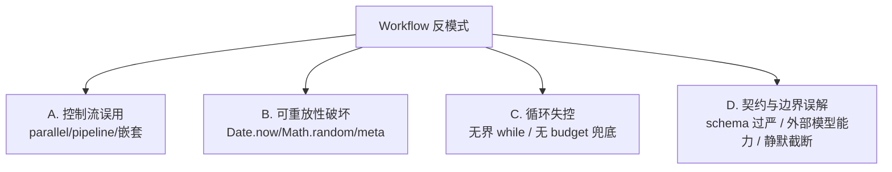
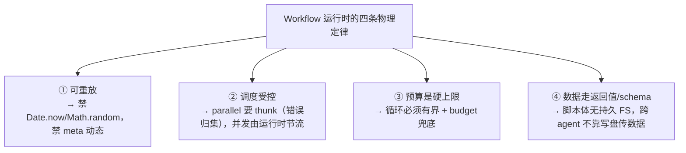

# 第 26 章 · 反模式与陷阱

> 前面二十五章讲「该怎么做」。最后这一章反过来，讲「**别怎么做**」——把全书的硬约束翻成一份避坑清单。每条反模式都是同一个三段式：**错误写法 → 后果 → 正确写法**，再标一句它违反了哪条规则（信源：`assets/_grounding.md`）。
>
> 这些坑不是我瞎想的。它们是 Workflow 运行时**真会惩罚**你的写法：有的当场抛错，有的不声不响烧光预算，有的让你的脚本失去可重放性、回归测试全面失效。读完这一章，你手上就多了一张「提交前自查表」。

---

## 26.1 为什么反模式值得单独成章

正面规则容易记，可人栽跟头往往是栽在**某个看着挺合理的直觉**上——比如「并行总比串行快」「schema 越严越安全」「循环让模型自己判断何时停最聪明」。这些直觉在别处成立，搁 Workflow 里就要踩坑。这一章值钱的地方，就是把这些**反直觉的陷阱**一个个点名。

全书的硬约束（`_grounding.md` B 节「硬约束」与各处「禁止」）能归成四类，本章就按这四类来讲：



下面一类一类拆。每条都配一个「自查问句」，方便你提交前过一遍。

---

## 26.2 A 类 · 控制流误用

### 反模式 A1：给 `parallel` 传 Promise，而不是 thunk

这是最常见、也最阴的一个错，因为它**不报错**，只是悄悄把并发给毁了。

**错误写法：**

```javascript
// ✗ 传入的是「已经在执行的 Promise」，不是「待执行的函数」
const results = await parallel([
  agent('任务 A ...', { schema: S }),   // 注意：没有 () =>
  agent('任务 B ...', { schema: S }),
  agent('任务 C ...', { schema: S }),
])
```

**后果：** `parallel` 的签名是 `parallel(thunks: Array<() => Promise<any>>)`（B 节）——它要的是一组**函数**（thunk）。可上面这写法里，`agent(...)` 在数组**字面量求值的那一刻就已经被调用了**——三个 `agent()` 在 `parallel` 拿到数组之前就已经跑起来了。这**不符合 thunk API 的约定**，最直接的代价就是**丢掉 `parallel()` 的异步失败归集语义**：async reject / agent 出错，本来该在那个位置变成 `null`，可你直接把正在执行的 Promise 塞进去，这层归集就接不住了，一个 agent reject 就可能把整个 `await` 直接拖崩。**它「能跑」，所以你当时发现不了——非得等某个 agent 出错才露馅。**（注意：这里的问题是 API 约定和错误归集，不是「绕过并发上限」——并发节流由运行时统一施加。）

**正确写法：**

```javascript
// ✓ 传入 thunk——把「调用」推迟给 parallel 去做
const results = await parallel([
  () => agent('任务 A ...', { schema: S }),
  () => agent('任务 B ...', { schema: S }),
  () => agent('任务 C ...', { schema: S }),
])

// 批量场景同理：map 出 thunk 数组
const results2 = await parallel(
  items.map((item) => () => agent(`处理 ${item} ...`, { schema: S }))
)
```

> **自查问句**：我传给 `parallel` 的每一项，是不是都以 `() =>` 开头？本书所有真实运行（judge-panel `wf_f5b69668-b18`、frontend-review `wf_4c5caabb-b73`）的 `parallel` 调用，无一例外，全是 thunk 数组。

<div class="callout warn">

`pipeline` 不吃这个亏——它的签名是 `pipeline(items, stage1, stage2, ...)`，`items` 是**数据**，stage 是**回调函数**，你本来也不会在那儿写 `agent()` 调用。可 `parallel` 长得就像「把一组任务塞进去」，太容易顺手写成 `agent()` 直接调用了。**记住：`parallel` 要 thunk，不要 Promise。**

</div>

### 反模式 A2：滥用 `parallel` 屏障，该用 `pipeline`

**错误写法：** 要处理 N 个 item，每个都得走「评审 → 综合」两阶段，结果你拿两个 `parallel` 串起来：

```javascript
// ✗ 用 parallel 屏障硬凑多阶段
phase('Review')
const reviews = await parallel(items.map((it) => () => agent(`评审 ${it}`, { schema: R })))
// ↑ 屏障：必须等「所有」item 都评审完，才能进下一行

phase('Synthesize')
const synths = await parallel(reviews.map((r) => () => agent(`综合 ${JSON.stringify(r)}`, { schema: S })))
```

**后果：** `parallel` 是个**屏障**——「等全部完成」（B 节）。所以第一行得等**最慢的那个评审**跑完，所有 item 才能一起迈进综合阶段。万一某个 item 的评审特别慢，其余 item 的综合阶段全被它拖着干等。墙钟 = `max(评审) + max(综合)`，而不是「每条链各走各的、各自最快跑完」。

**正确写法：** 改用 `pipeline`——「每个 item 独立流过全部 stage，阶段间无屏障」（B 节）：

```javascript
// ✓ pipeline：每个 item 独立穿过两阶段，无屏障
const out = await pipeline(
  items,
  (it) => agent(`评审 ${it}`, { label: 'review', phase: 'Review', schema: R }),
  (review, it) => agent(`综合 ${JSON.stringify(review)}`, { label: 'synth', phase: 'Synthesize', schema: S })
)
```

`pipeline` 的墙钟「≈最慢的单条链，而非各阶段最慢之和」（B 节）。一个 item 评审完就能**立刻**进自己的综合阶段，用不着等别人。本书的 pipeline 真实运行（pipeline-demo，Run ID `wf_bf086b98-6ec`，3 项×2 阶段，`agent_count=6`、`total_tokens=158982`、26.7s）正好把这个特性坐实了——6 个 agent，墙钟却远小于「先 3 个评审屏障、再 3 个综合屏障」那种跑法。

> **自查问句**：我这几个阶段之间，真的需要「全部 item 在阶段 1 完成后才能开始阶段 2」吗？如果每个 item 都能自己往下走，那就该用 `pipeline`。**多阶段默认用 `pipeline`**（B 节原话）；只有「确实需要所有结果一起」时才用 `parallel`。

### 反模式 A3：用 `parallel` 但忘了 `.filter(Boolean)`

**错误写法：**

```javascript
// ✗ 直接用 parallel 的结果，没过滤 null
const drafts = await parallel(tasks.map((t) => () => agent(`...${t}`, { schema: S })))
const merged = drafts.map((d) => d.content).join('\n')   // 若某个是 null → 抛 TypeError
```

**后果：** `parallel` 里 async reject / agent 出错，都会在那个位置变成 `null`（B 节）；`agent()` 还有另一条产 `null` 的路——「用户中途跳过该 agent → 返回 `null`」（B 节）。所以 `drafts` 里可能混着 `null`，`d.content` 当场就 `TypeError: Cannot read properties of null`。

**正确写法：**

```javascript
// ✓ 用前先过滤 null（B 节明确建议：用 .filter(Boolean)）
const drafts = (await parallel(tasks.map((t) => () => agent(`...${t}`, { schema: S })))).filter(Boolean)
const merged = drafts.map((d) => d.content).join('\n')
log(`${drafts.length}/${tasks.length} 个草稿成功（其余抛错或被跳过）`)
```

> **自查问句**：我用 `parallel`/`pipeline` 的结果之前，过滤 `null` 了吗？judge-panel 真实脚本里就摆着 `const valid = judges.filter(Boolean)` 这一行——这是标准动作，不是可选。

<div class="callout info">

`pipeline` 也一样：「某 stage 抛错 → 该 item 变 `null` 并跳过其余 stage」（B 节）。所以 `pipeline` 的返回数组也得 `.filter(Boolean)` 再用。把「`parallel`/`pipeline` 的结果先 `.filter(Boolean)`」练成肌肉记忆。

</div>

### 反模式 A4：嵌套超过一层

**错误写法：** 工作流 A 调工作流 B，B 里头又去调工作流 C：

```javascript
// 在工作流 B 的脚本体内：
const c = await workflow({ scriptPath: '.../C.js' })   // ✗ B 已经是被 A 嵌套调用的子流程
```

**后果：** 「嵌套**仅一层**：子工作流里再调 `workflow()` 会抛错」（B 节）。要是 B 本身就是被 A 用 `workflow()` 调起来的，那 B 里再调 `workflow()` 就**当场抛错**，整条 A→B 链跟着一起失败。

**正确写法：** 把第二层的逻辑**摊平**进 B，或者让 A 来编排 B 和 C（同级），而不是让 B 去调 C：

```javascript
// ✓ 方案一：A 同级编排 B 和 C（不嵌套）
// 在 A 里：
const b = await workflow({ scriptPath: '.../B.js' })
const c = await workflow({ scriptPath: '.../C.js', args: { fromB: b } })

// ✓ 方案二：把 C 的逻辑直接写进 B（用 agent/pipeline，不用 workflow()）
// 在 B 里：
const cResult = await agent('原本 C 要做的事 ...', { schema: CS })
```

> **自查问句**：我这个工作流，会不会被别的工作流用 `workflow()` 调起来？如果会，它内部就**不能**再调 `workflow()`。测试工作流（第 25 章）尤其得当心——它已经嵌套调了被测工作流，自身不能再被第三层嵌套。

---

## 26.3 B 类 · 可重放性破坏

这一类的下场都一样：**毁掉「相同脚本 + 相同 args → 100% 缓存命中」这条铁律**，连带着把断点续传（第 22 章）和回归测试（第 25 章）一起搞垮。

### 反模式 B1：脚本里用 `Date.now()` / `Math.random()` / 无参 `new Date()`

**错误写法：**

```javascript
// ✗ 三个被明令禁止的不可重放调用
const runId = `run-${Date.now()}`                    // 禁
const sample = items[Math.floor(Math.random() * items.length)]  // 禁
const stamp = new Date().toISOString()               // 禁（无参 new Date()）
```

**后果：** 「脚本禁用 `Date.now()` / `Math.random()` / 无参 `new Date()`」（B 节硬约束），它们会「破坏可重放性 → 续传失效」（B 节注）。轻则抛错，重则——就算不抛错——每跑一次结果都不一样，于是续传永远命不中缓存（第 22 章那条「未改动 agent 0 token/8ms」的红利你彻底吃不到），回归测试也退化成「每次全量重跑」。

**正确写法：** 凡是要用的「外部不确定量」，全从 `args` 注入；要随机性，就拿**确定性的下标**顶上：

```javascript
// ✓ 时间戳从 args 传入（B 节：「需要时间戳用 args 传入或事后盖戳」）
const runId = `run-${args.runId}`
const stamp = args.runDate            // 调用方负责传入

// ✓ 需要「随机/多样性」时，用 agent 的下标变化提示词（B 节原话）
//   而不是 Math.random
const variants = await parallel(
  [0, 1, 2].map((i) => () =>
    agent(`从第 ${i + 1} 个不同角度回答（角度互不重复）：${args.question}`,
      { label: `variant:${i}`, schema: S }))
)
```

> **自查问句**：我的脚本里有 `Date.now`、`Math.random`、`new Date()`（无参）吗？有就改成 `args` 注入或下标变化。**这是回归测试能成立的前提**——第 25 章反复念叨过。

<div class="callout warn">

标准 JS 内置（`JSON`/`Math` 的纯函数/`Array`…）**可用**（B 节：「标准 JS 内置可用」）——被禁的只是**会引入不确定性**的那几个：`Math.random()`、`Date.now()`、无参 `new Date()`。`Math.floor`、`Math.max`、`new Date(args.iso)`（带参）都没问题。别因噎废食，把整个 `Math` 都绕着走。

</div>

### 反模式 B2：`meta` 不是纯字面量

**错误写法：**

```javascript
// ✗ meta 里有变量 / 函数调用 / 模板插值 / 展开
const NAME = 'my-wf'
export const meta = {
  name: NAME,                                  // ✗ 变量
  description: `Review ${args.target}`,        // ✗ 模板插值 + 引用 args
  phases: buildPhases(),                       // ✗ 函数调用
  ...baseMeta,                                 // ✗ 展开
}
```

**后果：** 「`meta` 必须纯字面量（运行时执行前静态读取）」（B 节硬约束）；「`meta` 必须是纯字面量——不能有变量、函数调用、展开运算符或模板插值」（第 01 章）。运行时在**真正跑脚本之前**就得静态读一遍 `meta`（拿去显示权限弹窗），可那会儿 `args`、变量、函数都还没影呢。写成上面那样，运行时在静态解析阶段**压根没法求值**——脚本直接被拒（`WorkflowOutput` 带 `error`，语法检查失败）。尤其 `description: \`...${args.target}\`` 是高频翻车点：`args` 在 `meta` 求值的时候根本不存在。

**正确写法：**

```javascript
// ✓ meta 全部写死为字面量；动态信息放进 log()
export const meta = {
  name: 'my-wf',
  description: 'Review a target from multiple dimensions',   // 静态
  phases: [{ title: 'Review' }, { title: 'Synthesize' }],   // 字面量数组
}

// 需要让用户知道「这次审的是什么」？用 log（运行时输出，不进 meta）
log(`本次评审目标：${args.target}`)
```

> **自查问句**：我的 `meta` 里有没有 `${...}`、变量名、`(...)` 调用、`...` 展开？只要沾上一个，它就不是纯字面量。**描述要随入参变化 → 放 `log()`，不放 `meta`。**（第 25 章 25.3 也强调过这条。）

---

## 26.4 C 类 · 循环失控

### 反模式 C1：无界 `while`，只靠模型判 `done` 退出

**错误写法：**

```javascript
// ✗ 退出完全交给模型——它可能永远说「还没完」
let done = false
while (!done) {                          // 没有任何硬上限
  const r = await agent('继续推进；完成则 done=true', { schema: { /* done */ } })
  done = r.done
}
```

**后果：** 这正是第 18 章列为头号反模式的写法（「无界 `while`（只靠模型 done 退出）→ 死循环，烧光预算」，18.6 速查表）。模型那个「done」是**概率性判断**，它可能「想表现得彻底」，迟迟不肯给 `done=true`，于是循环**永不退出**，每一轮都在实打实烧 token、烧墙钟。B 节是有「单工作流生命周期 agent 总数上限 **1000**」这个全局兜底，可那是**安全网，不是业务退出机制**（第 18 章原话）——撞到 1000 才停，意味着你早就把上千个 agent 的 token 烧出去了。

**正确写法：** 多设几道防线——轮次硬上限 + budget 兜底（再加个可选的收益递减）：

```javascript
// ✓ 第 18 章的标准刹车：硬上限 + budget 兜底
const MAX_ROUNDS = 6
let done = false
let round = 0
while (!done && round < MAX_ROUNDS) {                    // 第一道：轮次硬上限
  round++
  // 第二道：budget 兜底（budget 是硬上限，spent() 达 total 后调 agent() 会抛错）
  if (budget.total !== null && budget.remaining() < 60_000) {
    log(`预算不足以再跑一轮（剩余 ${budget.remaining()}），提前收口`)
    break
  }
  const r = await agent('继续推进；完成则 done=true', { schema: { /* done */ } })
  done = r.done
}
return { done, round, hitCeiling: !done && round >= MAX_ROUNDS }   // 诚实标注是否撞上限
```

> **自查问句**：我的每一个 `while`，是不是都有一个不依赖模型的退出条件（计数器/budget）？「永远不要写一个只靠模型判决退出的无界循环」（第 18 章原话）。

### 反模式 C2：循环里不检查 `budget`，撞上硬上限抛错

**错误写法：**

```javascript
// ✗ 有轮次上限，但每轮无脑调 agent，不看预算
while (!done && round < 10) {
  round++
  const built = await agent('产出一版（很费 token）...', { schema: S })   // 可能在这里抛错
  const checked = await agent('验收 ...', { schema: A })
  done = checked.accepted
}
```

**后果：** `budget` 是**硬上限**——「`spent()` 达 `total` 后再调 `agent()` 会抛错」（B 节）。如果用户这回合设了预算（`+500k` 式指令），而你的循环又不主动看 `budget.remaining()`，那么某一轮的 `agent()` 一旦碰上预算耗尽，就会**直接抛错**，整个工作流**带着已经做完的那部分结果一起失败**——你连「优雅收口」的机会都捞不着。

**正确写法：** 在每轮**开头**就主动看一眼剩余预算，留够「这一轮大概要花的量」再决定要不要接着跑：

```javascript
// ✓ 每轮开头主动刹车，给「优雅收口」留余地
while (!done && round < 10) {
  // 估算本轮成本（build+accept 约 2 个 agent，按真实 ~2.6 万/agent 估 ≈ 6 万）
  const ROUND_COST_EST = 60_000
  if (budget.total !== null && budget.remaining() < ROUND_COST_EST) {
    log(`剩余预算 ${budget.remaining()} 不足本轮预估 ${ROUND_COST_EST}，带当前结果收口`)
    break
  }
  round++
  const built = await agent('产出一版 ...', { schema: S })
  const checked = await agent('验收 ...', { schema: A })
  done = checked.accepted
}
```

<div class="callout info">

成本估算可以拿本书的真实数据来锚：单个 agent 约 **2.5–3 万 token**（hello `wf_dacbd480-d5d` 实测 26,338；经验法则「token ≈ agent 数 × 每 agent 上下文」，B 节/C 节）。一轮「生成+验收」两个 agent 约 5–6 万。第 18 章给过同样的成本直觉：「跑 4 轮约 20 万 token」。拿这些锚点去设 `ROUND_COST_EST` 和兜底阈值就行。

</div>

> **自查问句**：用户有没有可能给这个工作流设预算？如果有可能，我的循环在每轮开头看 `budget.remaining()` 了吗？注意 `budget.total` 为 `null` 时表示没设目标（`remaining()` 是 `Infinity`），所以判断要写成 `budget.total !== null && budget.remaining() < 阈值`。

---

## 26.5 D 类 · 契约与边界误解

### 反模式 D1：schema 过严，导致反复重试甚至卡死

**错误写法：**

```javascript
// ✗ 把不该枚举死的字段枚举死、把可选当必填、加无法满足的约束
const schema = {
  type: 'object',
  properties: {
    severity: { type: 'string', enum: ['P0'] },         // ✗ 只允许 P0？那 P1 问题怎么报
    cveId: { type: 'string', pattern: '^CVE-\\d{4}-\\d+$' },  // ✗ 不是每个问题都有 CVE
    score: { type: 'integer', minimum: 90 },            // ✗ 强制 ≥90，低分根本无法表达
  },
  required: ['severity', 'cveId', 'score'],             // ✗ 全必填
}
```

**后果：** 带 schema 时「不匹配则模型重试」（B 节）。如果 schema 苛刻到**模型在语义上根本满足不了**（要它报一个其实没有 CVE 的问题、硬塞一个本该是低分的高分），模型就会**反复重试**——每重试一次都在实打实烧 token，最坏情况一路耗到预算上限抛错（C2）。schema 是用来**约束结构**的，不是用来**强迫语义**的。

**正确写法：** schema 只固化「结构与类型」这类客观契约，把「语义判断」交给模型在字段**值**里去表达：

```javascript
// ✓ 结构严、取值宽：枚举给全、可选别设 required、不加业务上无法保证的约束
const schema = {
  type: 'object',
  properties: {
    severity: { type: 'string', enum: ['P0', 'P1', 'P2', 'P3'] },   // 枚举给全
    cveId: { type: 'string' },                                       // 不强制格式，没有就空串
    score: { type: 'integer', minimum: 0, maximum: 100 },            // 全量程
    note: { type: 'string' },
  },
  required: ['severity', 'score', 'note'],                           // 只把「一定有」的设必填
}
```

> **自查问句**：我的 schema 里，每个 `enum` 是不是把所有合理取值都覆盖到了？每个 `required` 字段是不是「在任何合理产物里都一定存在」？有没有 `pattern`/`minimum` 之类**模型在某些合理情况下根本满足不了**的约束？回忆一下第 18 章：门控字段（`done`/`pass`/`accepted`）一定要 `required` 且 `boolean`——那是该严的地方；业务取值则该放宽。

<div class="callout warn">

**别把 schema 当成「逼模型多想想」的手段。** 有人故意把 schema 搞得很复杂，以为这样能逼模型产出更好的结果。实际上呢，只是逼它反复重试、白白烧 token。想引导质量，靠的是**提示词**（说清楚你要什么、给一份 rubric——你看 judge-panel，用 schema 把 accuracy/clarity/completeness 固化成**数字字段**，可取值范围照样是宽的）；schema 管的是**可机读**，不管**逼你思考**。

</div>

### 反模式 D2：把脚本体/子进程写盘当成持久副作用

这条特别容易被误读成「subagent 不能写文件」——**那是错的**。先把三件最容易搅在一起的事分清楚：

| # | 说法 | 真伪 | 依据 |
|---|---|---|---|
| ① | Workflow **脚本体**里，以及 `ctx_execute` / Bash 子进程的写入，**不持久化**到宿主文件系统 | **真** | B 节硬约束原话 |
| ② | Workflow 派出的 **subagent** 能用原生 `Write`/`Edit` 工具产生**真实**文件副作用 | **真**（所以「subagent 不能写文件」是错的） | 第 19 章 worktree：「多 agent 各自 Write/Edit 并行重构」正是靠这个 |
| ③ | **外部模型**（codex/antigravity 经 CCG）通常被约束为**零写入**、只产出意见 | 真，但这是**另一个**护栏概念 | 第 23 章 CCG 多模型协作 |

这条反模式针对的就是 **①**：**别想当然以为「在脚本体里跑段代码写个文件」就会落盘**，更别把跨 agent 的数据流架在这种「脚本体副作用」上头。

**错误写法：**

```javascript
// ✗ 误以为脚本体/子进程的写盘会持久化，再让别处去读它
//    （脚本体没有可用的文件系统；ctx_execute/Bash 子进程写入不落地——①）
await someBashStepThatWrites('./state.json')           // 不落盘
const next = await agent('读取 ./state.json 继续 ...', { schema: S })  // 它读不到
```

**后果：** 脚本体指望的那条「写文件 → 另一步读文件」的链，断就断在「写」这一环（①）——数据压根没真正落盘，下游拿到的是空值或旧值，而且是**静默**失败（不报错，就是读不到）。注意：这**不是**说 subagent 干不了写文件的活（②它能，worktree 场景就让它并发 Write/Edit）；问题出在**把脚本体当成有持久 FS**，以及**拿「写盘副作用」去顶替显式的数据传递**。

**正确写法：** 跨 agent 的数据流走**返回值 / structured output**，别假设脚本体里有个可写的 FS：

```javascript
// ✓ 数据通过返回值在阶段间显式传递（第 24 章 ccg 案例的「显式传递」原则）
const state = await agent('分析并返回结构化状态', {
  schema: { type: 'object', properties: { facts: { type: 'array', items: { type: 'string' } } }, required: ['facts'] },
})
const next = await agent(`基于下面的状态继续：${JSON.stringify(state)}`, { schema: S })
return next
```

如果你**确实要把产物落到磁盘**：要么（A）让工作流把内容**返回**给主循环，由主循环（在 Workflow 之外）拿原生 `Write` 工具落盘；要么（B）任务本来就是「让多个 agent 并发改文件」时，给这些 **subagent** 配上 `isolation: 'worktree'`（第 19 章）——那才是 subagent 真正写文件、还做了物理隔离的正道。

> **自查问句**：我有没有在**脚本体**里靠「写个文件、再让另一步去读」来传数据？跨 agent 的数据该走**返回值 + structured output**；真要落盘，就交给主循环的原生 `Write`，或者用 worktree 场景里 subagent 自己的 `Edit`/`Write`。

### 反模式 D3：静默截断/丢弃，不 `log`

**错误写法：**

```javascript
// ✗ 悄悄丢掉一半结果，不留任何痕迹
const all = (await parallel(items.map((it) => () => agent(`...${it}`, { schema: S })))).filter(Boolean)
const top = all.slice(0, 5)              // 只要前 5，其余默默丢弃
return top
```

**后果：** 调用方拿到 `top`，**完全不知道**：①原本有多少个？②有多少个因为抛错/被跳过变成了 `null`、被 `filter` 掉了？③被 `slice` 扔掉的里头，有没有更重要的？等结果不对劲了，你**无从排查**——因为关键信息早在脚本内部被悄悄吞掉了。Workflow 跑在后台、异步返回，你能看到的只有最终返回值和 `log` 输出；不 `log` 的截断 = 一个黑箱。

**正确写法：** 任何「丢弃/截断/过滤」都拿 `log` 留个痕，再把数量信息放进返回值：

```javascript
// ✓ 截断必留痕：log 输出 + 返回值带计数
const raw = await parallel(items.map((it) => () => agent(`...${it}`, { schema: S })))
const valid = raw.filter(Boolean)
const dropped = raw.length - valid.length
if (dropped > 0) log(`${dropped}/${raw.length} 个结果抛错或被跳过，已过滤`)

const top = valid.slice(0, 5)
log(`返回 top ${top.length}，另有 ${valid.length - top.length} 个有效结果未纳入`)
return { top, totalValid: valid.length, totalDropped: dropped }   // 计数随结果一起交回
```

> **自查问句**：脚本里每一处 `filter` / `slice` / `find` / 提前 `return`，是不是都 `log` 了「丢了多少、为啥丢」？`log` 是「向用户输出进度（进度树上方叙述行）」（B 节）——它是后台工作流唯一的可观测窗口，别浪费。

<div class="callout info">

这条跟 D2 是一个精神：**数据流要显式、要可观测**。第 24 章从 ccg 偷师来的「显式传递、结构化传递」，翻到反模式这一面，反过来就是「静默吞掉」。一个健康的 Workflow，它的返回值应该让调用方能答得上来「处理了多少、成功多少、丢了多少、为什么」。

</div>

---

## 26.6 提交前自查表

把前面所有「自查问句」收拢成一张表。**每次把脚本交给 Workflow 工具之前，过一遍：**

| # | 类别 | 自查问句 | 违反则 |
|---|---|---|---|
| A1 | 控制流 | `parallel` 的每一项都以 `() =>` 开头吗？ | 不符 thunk API，丢失异步失败归集（async reject→null） |
| A2 | 控制流 | 多阶段是否误用 `parallel` 屏障？能独立流动就用 `pipeline` | 墙钟变成各阶段最慢之和 |
| A3 | 控制流 | 用 `parallel`/`pipeline` 结果前 `.filter(Boolean)` 了吗？ | `null` 引发 TypeError |
| A4 | 控制流 | 这个工作流会被嵌套调用吗？若会，它内部不能再调 `workflow()` | 抛错（嵌套仅一层） |
| B1 | 可重放 | 有 `Date.now`/`Math.random`/无参 `new Date()` 吗？ | 续传/回归失效 |
| B2 | 可重放 | `meta` 里有 `${}`/变量/调用/展开吗？ | 语法检查失败被拒 |
| C1 | 循环 | 每个 `while` 有不依赖模型的退出条件吗？ | 死循环烧光预算 |
| C2 | 循环 | 循环每轮开头看 `budget.remaining()` 了吗？ | 撞硬上限抛错 |
| D1 | 契约 | schema 的 `enum`/`required`/`pattern` 是否模型必定能满足？ | 反复重试烧 token |
| D2 | 边界 | 有没有指望 agent「自己写文件」？ | 副作用不落地，数据丢失 |
| D3 | 可观测 | 每处截断/过滤都 `log` 留痕了吗？ | 黑箱，无法排查 |

<div class="callout tip">

这张表也是第 25 章「可分享工作流成品清单」的反向校验。一个准备进库、准备分享的工作流，应当**这 11 条全部通过**。建议把它贴在你那个库的 `README.md` 顶上，当团队的「Workflow 提交规约」用。

</div>

---

## 26.7 反模式的根源：把 Workflow 当成「普通脚本」

回头看这 11 条，大半都出在同一个误解上：**把 Workflow 脚本当成一段普通的 Node.js 来写。** 可它不是——它跑在一个特殊的运行时里，这个运行时有四条与众不同的「物理定律」：



| 定律 | 普通脚本里 | Workflow 里 | 对应反模式 |
|---|---|---|---|
| ① 可重放 | 随便用时间/随机 | 禁；用 `args` 注入 | B1, B2 |
| ② 调度受控 | 自己 `Promise.all` | `parallel` 接管调度，要 thunk | A1, A2, A3 |
| ③ 预算硬上限 | 跑到 OOM 才停 | `budget` 达标抛错，要主动刹车 | C1, C2 |
| ④ 数据走返回值/schema | 脚本里随便读写文件传数据 | 脚本体无持久 FS；跨 agent 走返回值 + schema（subagent 仍可用 Write/Edit 改文件，见第 19 章） | D1, D2, D3 |
| ⑤ 嵌套受限 | 函数随便嵌套 | `workflow()` 仅一层 | A4 |

把这四条（加上嵌套限制，一共五条）「物理定律」想明白，反模式就不再是要死记硬背的清单，而成了**定律的自然推论**。你写每一行时下意识地问一句「这违反哪条定律吗」，提交前就能拦下绝大多数坑。

这也呼应了全书的主线：原生 Workflow 用**代码 + Schema** 给了你一副确定性骨架（第 23 章），但「确定性」是有**前提**的——脚本必须可重放、循环必须有界、调度必须交给运行时、产物必须走契约。守住这些前提，你才真正握住了第 01 章承诺的那个「可复用、可测试、可分享」的编排引擎。

---

## 26.8 本章小结

- 反模式按运行时的「物理定律」分四类：**A 控制流误用、B 可重放性破坏、C 循环失控、D 契约与边界误解**（外加嵌套仅一层）。
- **A 类**：`parallel` 要 thunk（`() =>`）不要 Promise（A1）；多阶段默认 `pipeline` 而非 `parallel` 屏障（A2）；结果先 `.filter(Boolean)`（A3）；`workflow()` 嵌套仅一层（A4）。
- **B 类**：禁 `Date.now`/`Math.random`/无参 `new Date()`，时间用 `args` 注入、多样性用下标做（B1）；`meta` 必须纯字面量，动态信息放 `log()`（B2）。否则续传和回归测试一起全面失效。
- **C 类**：`while` 必须有不依赖模型的退出条件（轮次上限），否则死循环烧光预算——全局 1000 上限只是安全网，不是业务退出（C1）；循环每轮开头主动看一眼 `budget.remaining()`，否则撞上硬上限就抛错（C2）。
- **D 类**：schema 约束结构、不强迫语义，`enum`/`required` 要模型必定能满足，否则反复重试（D1）；跨 agent 数据走返回值 + structured output，别拿脚本体/子进程的写盘当持久副作用去传数据——但 subagent 本身能用 Write/Edit 改文件（worktree 场景，第 19 章），真要落盘就交给主循环的原生 Write（D2）；任何截断/过滤都 `log` 留痕，再把计数放进返回值（D3）。
- **提交前过一遍这 11 条自查表**；它也是「可分享工作流成品清单」的反向校验，建议贴进库 `README.md` 当提交规约。
- 大半反模式都源于「把 Workflow 当普通脚本写」——记住运行时的五条物理定律（可重放、调度受控、预算硬上限、数据走返回值/schema、嵌套受限），反模式就成了定律的自然推论。

到这儿，第五部「生态与借鉴」就完结了：第 23 章看清四大系统的真实机制，第 24 章把它们的精华提取成你自己的 Workflow，第 25 章把这些 Workflow 沉淀成可分享的库，第 26 章守住让这一切成立的底线。

> 继续阅读：[第 27 章 · 工作流创作流程](#/zh/p6-27)
>
> 延伸阅读：[附录 A · API 完整参考](#/zh/app-a) · [附录 B · 陷阱与排错](#/zh/app-b) · [附录 C · 最佳实践清单](#/zh/app-c)
