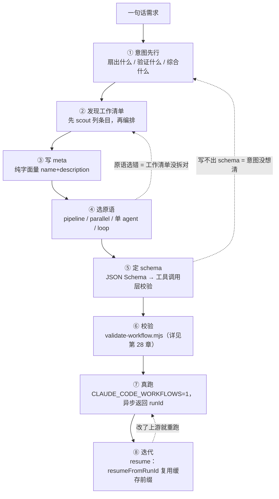
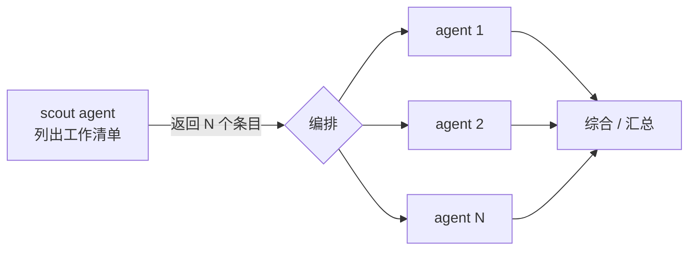
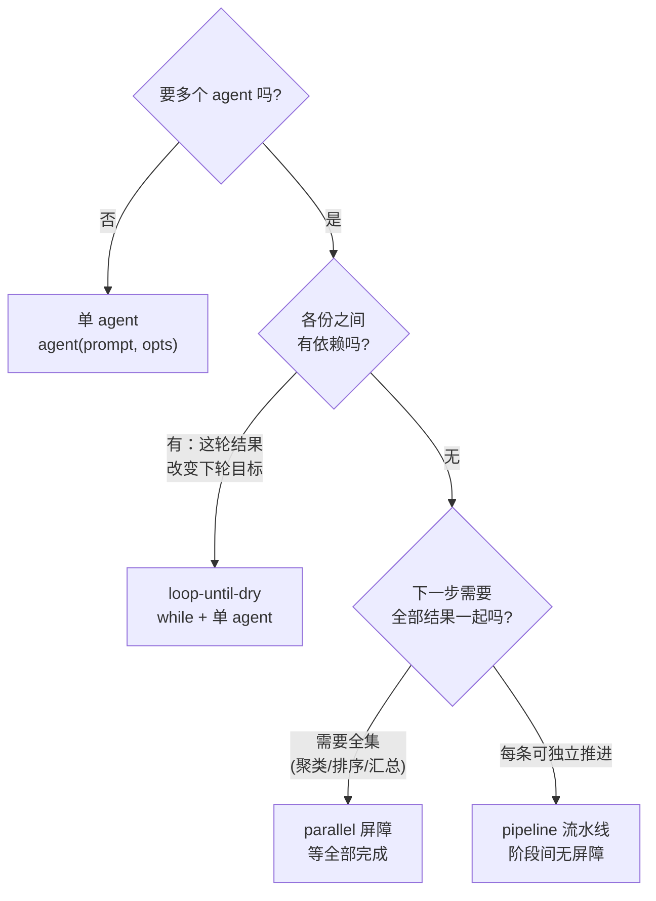
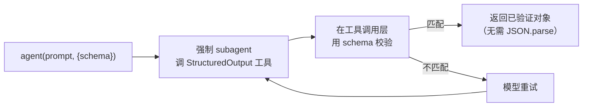
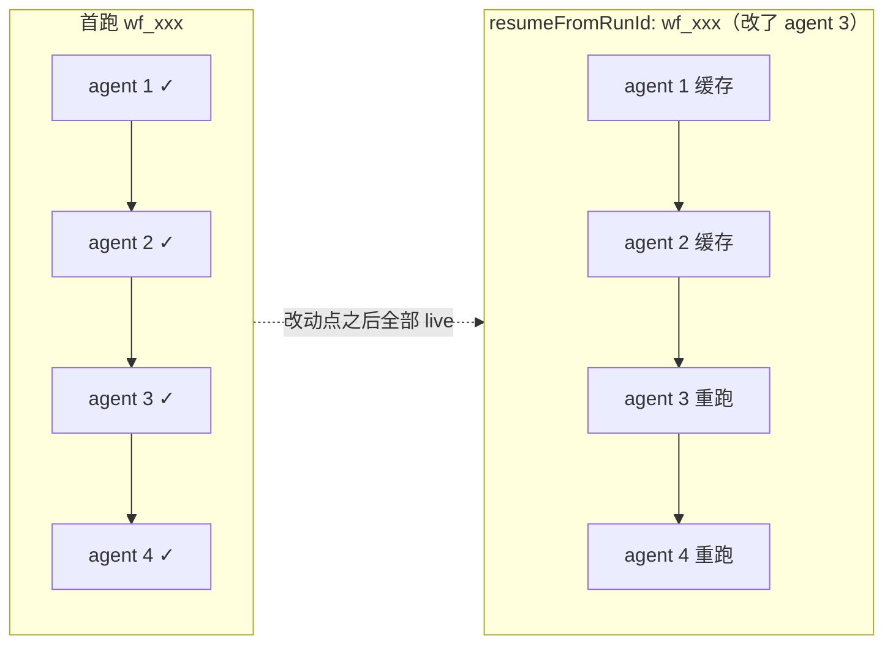
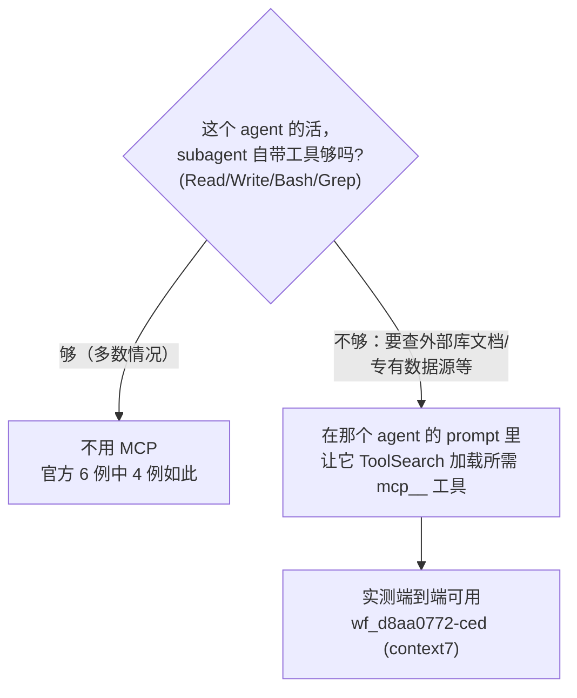

# 第 27 章 · 工作流创作流程

> 一句话：**写一个 Workflow 不是从打开编辑器、敲 `pipeline(` 开始的。它从一句话需求开始——「我到底要扇出什么、验证什么、综合什么」。把这个意图想清楚，原语（pipeline / parallel / 单 agent / loop）几乎是自己冒出来的；想不清楚，再漂亮的脚本也只是把混乱并行化了。**
>
> 这一章给你一条可复跑的创作流水线：意图 → 工作清单 → meta → 选原语 → schema → 校验 → 真跑 → 迭代。每一步都用本书三个**真跑过**的示例脚本（review-spa、dead-code-scan、feedback-themes）当决策案例，引它们真实的 Run ID 与用量。读完你会有一套「从需求到可复跑工作流」的肌肉记忆，外加一份可以直接改的脚手架骨架。

---

前面的章节把 Workflow 的每个零件单独讲透了：第 5 章讲 `meta`/`phase`，第 6 章讲 `agent()`，第 7 章讲 schema，第 8 章讲 `parallel` 屏障对 `pipeline` 流水线，第 17 章讲对抗验证，第 18 章讲 loop-until-dry。但「认识每个零件」和「会把零件装成一台机器」是两回事。这一章不再讲新零件，而是讲**装配顺序**——一个有经验的作者面对「帮我审一下这个 PR」「把这堆反馈归个类」这种一句话需求时，脑子里实际跑的是哪条流程。

我们把它画成一条线性流水线，但请记住：**真正的创作是迭代的**，下面每一步都可能把你打回上一步（schema 写不出来，往往说明意图没想清楚）。



<div class="callout info">

这一章是「创作侧」的总览；它的下游是第 28 章（校验与调试）和第 29 章（示例画廊——同样三个脚本的**端到端运行结果**）。本章重在「怎么写出来」，第 29 章重在「跑出来长什么样」。两章引用同一组 Run ID，可交叉对照。

</div>

---

## 27.1 意图先行：你到底要扇出什么、验证什么、综合什么

新手最常见的错误，是一上来就想「我要用 pipeline 还是 parallel」。这是从工具反推问题，顺序反了。**先回答一个更朴素的问题：这个任务的并行性，到底为了什么？**

Workflow 的全部价值，可以收敛成三个动词：

| 动词 | 你在做什么 | 它换来什么 | 典型原语 |
|---|---|---|---|
| **扇出（fan-out）** | 把一个大任务切成 N 份，N 个 subagent 同时做 | **规模 / 速度**——墙钟压到「最慢的一份」 | `parallel` / `pipeline` |
| **验证（verify）** | 让另一个 agent 去核对/反驳第一个 agent 的产出 | **可信**——单 agent 会幻觉、会夸大 | 扇出后接一个验证 stage |
| **综合（synthesize）** | 把 N 份独立结果合成一个结论 | **全面**——跨全集才能看出主题/排序 | 屏障后接一个综合 agent |

写脚本前，先用一句话把意图说清楚——**为全面、为可信、还是为规模**？这句话直接决定了后面所有取舍。看本书三个真跑示例各自的「意图句」：

<div class="callout tip">

- **review-spa**：「对一份代码做**多维度**审查，且**不轻信** reviewer 的每条发现。」→ 扇出（按维度）+ 验证（对抗）。为**规模**也为**可信**。
- **feedback-themes**：「把一批反馈**综合**成排序主题。」→ 扇出（逐条摘要）+ 综合（聚类全集）。为**全面**。
- **dead-code-scan**：「**反复**扫描直到确认没有遗漏。」→ 递进式扫描，一轮可能揭示下一轮的目标。为**全面**（穷尽），但用串行循环而非扇出。

</div>

注意 dead-code-scan 的意图里没有「同时做 N 份」——它是**串行**的循环。这说明「意图先行」能帮你避免一个常见误用：**不是所有任务都该扇出**。当「这一轮的结果会改变下一轮该找什么」时，扇出反而是错的，因为各份之间有依赖。把意图想清楚，你自然就不会硬把一个递进任务塞进 `parallel`。

<div class="callout warn">

**警惕「为并行而并行」**。Workflow 的并发是有成本的：每个 `agent()` 大约吃掉 2.5–3 万 token 的上下文（经验法则，见第 29 章实测）。`feedback-themes` 真跑一次就花了 **607,307 token**（Run `wf_b3febb70-ad9`），因为它扇出了 20 个 agent。如果你的任务单 agent 就能干好，扇出只会让你多花 20 倍的钱去并行化一件本不需要并行的事。先问「我为什么需要多个 agent」，答不上来就用单 agent。

</div>

---

## 27.2 发现工作清单：先 scout 列条目，再编排 pipeline

意图清楚之后，下一个问题是：**我要扇出的「N 份」到底是哪 N 份？** 很多任务一开始并不知道 N 是多少——你要审的文件清单、你要研究的子问题、你要摘要的反馈条数，往往得先「侦察」一遍才知道。

这就引出一个关键的两段式结构：**先 scout（发现），再编排（处理）**。不要在写脚本时硬编码一个你拍脑袋猜的清单；让第一个 agent 去把清单**列出来**，再把这个清单喂给后面的 `pipeline`/`parallel`。

`feedback-themes` 就是教科书式的「scout 先行」：它的第一个 `agent()` 不做任何摘要，只负责**把 CSV 读成一个条目数组**——

```javascript
  phase('Load')
  const { items } = await agent(
    `Read ${SOURCE} (a CSV with columns id,text). Return every row as an item with its id and text.`,
    { label: 'load', phase: 'Load', schema: ITEMS },
  )
  log(`${items.length} feedback item(s) loaded`)

  // 现在才知道 N = items.length，下一步据此扇出
  const summaries = await parallel(items.map(it => () =>
    agent(/* 每条一个摘要 agent */),
  ))
```

真跑时这个 scout 读出了 18 行，于是 `parallel` 扇出了 18 个摘要 agent（加上 1 个 load、1 个 cluster，`agent_count` 实测正好 **20**，Run `wf_b3febb70-ad9`）。脚本里没有任何地方写死「18」——清单是运行时从数据里发现的。这正是 scout-then-orchestrate 的威力：**同一个脚本，喂 18 行得 20 个 agent，喂 50 行就自动得 52 个 agent**，无需改一行代码。



<div class="callout tip">

**scout 的产出一定要带 schema**。因为它的返回值要被 `.map()` 成下一批 `agent()`，你需要它是**结构化数组**而不是一段散文。`feedback-themes` 的 scout 用了 `schema: ITEMS`（`{items: [{id, text}]}`），于是 `items.map(...)` 才能安全展开。没有 schema，你拿到的是一段需要再解析的文本——这就把确定性又交还给了模型。

</div>

并非每个工作流都需要显式 scout。`review-spa` 的「清单」是固定的三个维度（bugs/security/a11y），直接写成字面量 `DIMENSIONS` 数组即可——清单本身不依赖运行时数据。判断标准很简单：**清单是你写脚本时就知道的（写成字面量），还是要从输入里读出来的（用 scout agent）？**

---

## 27.3 写 meta：纯字面量的「身份证」

清单和编排心里有数了，先把 `meta` 写出来。这不只是仪式——`meta` 是工作流的身份证，也是**运行前唯一被静态读取**的部分。

`meta` 有两条铁律（都已实测）：

1. **必须是纯字面量**，且是脚本的**第一条语句**。不能有变量引用、函数调用、展开运算符、模板插值。运行时在执行脚本体**之前**就静态读取它，所以它必须能被「读」而不被「跑」。
2. **`name` 和 `description` 必填**。`description` 是**一行**，会显示在权限确认对话框里（官方）；`whenToUse` 会显示在工作流列表里（官方）。

```javascript
  export const meta = {
    name: 'review-spa',
    description: "Review the book's SPA (index.html) across dimensions, then adversarially verify each finding",
    whenToUse: 'A real-run demo of fan-out review + adversarial verification',
    phases: [
      { title: 'Review', detail: 'one reviewer per dimension' },
      { title: 'Verify', detail: 'try to refute each finding', model: 'haiku' },
    ],
  }
```

这是 `review-spa` 的真实 `meta`。注意 `phases` 数组——它声明了这个工作流有几个阶段，**应当与脚本里实际调用的 `phase()` / `opts.phase` 对齐**。`review-spa` 声明了 `Review` 和 `Verify` 两个阶段，脚本里两个 `agent()` 也分别标了 `phase: 'Review'` 和 `phase: 'Verify'`——一一对应，进度树才不会错乱。

<div class="callout warn">

**`meta` 的非字面量会在提交时被拒，脚本根本不运行**。实测里 `export const meta = {…, constructor: 'x'}`（保留键）在提交期就被拒，原文：`Script must begin with export const meta = { name, description, phases } (pure literal). meta must be a pure literal: reserved key name not allowed in meta: constructor`。同理，任何 `name: 'x-' + suffix`、`description: \`...${v}\`` 都会被拒。把动态拼接挪进脚本体（`agent()` 的 prompt 里），`meta` 永远写死。

</div>

关于 `phases[].model`：官方工具描述把它说成「某阶段用特定模型 override 时加上」，措辞含糊；本书因 `CLAUDE_CODE_SUBAGENT_MODEL` 覆盖**未能独立隔离**它运行时到底读不读。**安全做法**：把 `phases[].model` 当成对话框上的「标签」，真正要某阶段跑 Haiku，就在那个阶段的每个 `agent()` 上写 `model:'haiku'`，别指望 `phases[].model` 单独生效。

---

## 27.4 选原语：四选一的真实决策

到这一步，意图、清单、meta 都有了。现在才是选原语——而且因为前三步做扎实了，这一步基本是「对号入座」。Workflow 给你四个编排形态，它们的区别只有一个核心问题：**下一步何时能开始？**



| 原语 | 屏障语义 | 何时进入下一步 | 墙钟特征 | 选它的信号 |
|---|---|---|---|---|
| **单 agent** | — | 顺序 | 单任务时延 | 一个 subagent 就能干好 |
| **`pipeline`** | **无屏障** | 每条链各走各的，谁先好谁先走 | ≈ 最慢的**单条链** | 多条独立链，希望「先好先走」（**多阶段默认**） |
| **`parallel`** | **有屏障** | **等全部完成**才返回 | ≈ 最慢的**单个 agent** | 下一步需要全集 |
| **loop** | 串行 | 满足终止条件才停 | N 轮串行之和 | 一轮揭示下一轮目标 |

下面用三个真跑示例，把这张表从抽象变成具体决策。

### review-spa 为何选 pipeline

意图是「3 个维度各自审，某维度审完**立即**验证它的发现，不等其它维度」。这恰好是 `pipeline` 的定义场景：**每个 item（维度）独立流过两个 stage（审查 → 验证），阶段间无屏障**。

```javascript
  const reviewed = await pipeline(
    DIMENSIONS,
    // Stage 1 — 审查一个维度。
    d => agent(d.prompt, { label: `review:${d.key}`, phase: 'Review', schema: FINDINGS }),
    // Stage 2 — 对该维度的每条发现，并行验证。
    (review, d) => parallel(
      (review?.findings ?? []).map(f => () =>
        agent(/* 对抗验证，model:'haiku', schema: VERDICT */)
          .then(v => ({ ...f, dimension: d.key, verdict: v })),
      ),
    ),
  )
```

为什么**不**用 `parallel`？如果用 `parallel`，三个维度的审查会卡在同一道屏障上——必须等最慢的那个维度审完，三组验证才能一起开始。但验证 bugs 的发现，根本不需要等 a11y 审完。`pipeline` 让 bugs 一审完就立即进入它的验证 stage，墙钟由此变成「最慢的**单条**审查→验证链」，而非「最慢审查 + 最慢验证」之和。

真跑印证了这套编排的代价与产出：Run `wf_97b81e86-a0b`，**22 个 agent**（3 审查 + 19 验证）、**991,554 token**、**395,166ms**（≈6.6 分钟），最终 **18 条经对抗验证存活**的发现（bugs 6 / security 4 / a11y 8）。注意验证阶段虽然标了 `model:'haiku'`，但本会话 `CLAUDE_CODE_SUBAGENT_MODEL` 覆盖了它，19 个验证 agent 实跑 Opus——这是 token 高达近百万的主因。

<div class="callout info">

**pipeline 内部的 `agent()` 一定要显式标 `opts.phase`**。因为 pipeline 的多条链是并发的，如果靠全局 `phase()` 切换阶段，多条链会**竞争**同一个全局 phase 指针，进度树就乱了。`review-spa` 给每个 `agent()` 都写了 `phase: 'Review'` 或 `phase: 'Verify'`，把归组权显式钉死，互不干扰。

</div>

### feedback-themes 为何选 parallel 屏障

意图是「逐条摘要，再把**全集**聚成排序主题」。聚类这一步有个硬性依赖：**你没法只看一条摘要就聚类**——必须等**所有**摘要到齐，才能看出哪些归一类、哪类最大。这正是「屏障」的定义：等全部完成，再统一进入下一步。

```javascript
  // 故意用屏障：下一步跨全集聚类，必须全部摘要到齐才能跑。
  const summaries = await parallel(items.map(it => () =>
    agent(/* 单条摘要 */, { label: `summarize:${it.id}`, phase: 'Summarize', model: 'haiku' })
      .then(summary => ({ id: it.id, summary })),
  ))

  const labelled = summaries.filter(Boolean)

  phase('Cluster')
  const { themes } = await agent(
    `Here are ${labelled.length} summarized feedback items. Cluster them into themes...`,
    { label: 'cluster', phase: 'Cluster', schema: THEMES },
  )
```

为什么**不**用 `pipeline`？因为 pipeline 是「每条 item 独立流到底」——但聚类不是「每条 item 各自的下一步」，而是「**所有** item 汇成的一个下一步」。pipeline 没有「等所有人到齐」这一刻，而聚类恰恰需要这一刻。所以这里必须是 `parallel` 屏障。

真跑：Run `wf_b3febb70-ad9`，**20 个 agent**（1 load + 18 summarize + 1 cluster）、**607,307 token**、**122,391ms**（≈2.0 分钟），18 项 → **8 个主题**（按 count 降序）。注意 `.filter(Boolean)`——`parallel` 返回的数组里，任何被用户跳过或异步出错的位置会是 `null`，聚类前必须过滤掉。

<div class="callout warn">

**屏障的代价是「木桶效应」**：`parallel` 的墙钟取决于**最慢的那一个** thunk。如果 20 个摘要里有一个特别慢，整道屏障就被它拖住。这是为全面性付的税——但因为聚类**真的**需要全集，这税付得值。反之，如果你发现自己用 `parallel` 却**不需要**全集（下一步其实能各管各的），那就该换 `pipeline`。

</div>

### dead-code-scan 为何选 loop

意图是「**反复**扫描直到确认干净」。关键在于：**这一轮确认了某个符号是死代码，可能让下一轮看清更多**（去掉一个未引用函数后，原本「被它引用」的符号也变成未引用了）。各轮之间**有依赖**——这正是「不该扇出、该串行循环」的信号。

```javascript
  const DRY_STREAK = 2 // 连续这么多空轮就停
  const MAX_ROUNDS = 5 // 硬上限，保证循环一定终止

  let emptyRounds = 0
  let round = 0

  while (emptyRounds < DRY_STREAK && round < MAX_ROUNDS) {
    round++
    phase('Find')
    const { items } = await agent(
      `Round ${round}. Read ${TARGET}... Ignore anything already reported: ` +
      `${found.map(r => r.symbol).join(', ') || 'nothing yet'}.`,
      { label: `find:round-${round}`, phase: 'Find', schema: DEAD },
    )
    if (items.length === 0) { emptyRounds++; continue }
    emptyRounds = 0
    found.push(...items)
  }
```

为什么**不**用 `parallel`/`pipeline`？因为扇出的前提是「N 份互相独立、可同时做」。但 dead-code-scan 的第 2 轮 prompt 里明确带上了「忽略已报告的：`${found...}`」——**第 2 轮的输入依赖第 1 轮的输出**。一旦有这种轮次依赖，扇出就错了：你没法在第 1 轮还没结果时就启动第 2 轮。所以只能串行循环。

真跑：Run `wf_2283ab37-710`，**2 个 agent**（2 轮 × 1 finder）、**116,344 token**、**246,496ms**（≈4.1 分钟），返回 `{ rounds: 2, candidateCount: 0 }`——两轮全干净、0 候选，**连续 2 个空轮触发 `DRY_STREAK` 正常终止**（没跑满 5 轮上限）。这印证了一个重要性质：**loop-until-dry 即使零发现也能正确收敛**。

<div class="callout warn">

**任何循环都必须有硬上限**。`dead-code-scan` 同时有两个终止条件：`DRY_STREAK`（连续 2 空轮）是「正常收敛」，`MAX_ROUNDS=5` 是「防失控兜底」。哪怕模型每轮都报新发现导致 `DRY_STREAK` 永不满足，`MAX_ROUNDS` 也保证循环必停。另外别忘了生命周期还有官方硬上限：**单次工作流 `agent()` 总数不超过 1000**（runaway-loop backstop），但你不该指望撞到它——自己的 `MAX_ROUNDS` 才是第一道闸。

</div>

---

## 27.5 定 schema：让确定性落在工具调用层

选好原语，下一步是给每个会被「程序化消费」的 `agent()` 配 schema。判断标准：**这个 agent 的返回值，是要给人看的散文，还是要给代码 `.map()`/`.filter()`/取字段的数据？** 是后者，就必须上 schema。

机制（官方 + 实测）很关键，值得逐字理解：



- 有 `schema` → **强制** subagent 调 `StructuredOutput` 工具，**在工具调用层校验**，返回**已验证对象**；不匹配则模型重试。
- 因为校验发生在工具调用层，你拿到的 `agent()` 返回值**就是已验证对象**——直接 `result.findings`、`result.items`，**绝不要 `JSON.parse`**（它已经是对象，不是字符串）。

看三个示例的 schema 设计，全都遵循「程序要读什么，就 `required` 什么」：

```javascript
  // review-spa：每个 reviewer 必须返回这个形状
  const FINDINGS = {
    type: 'object',
    required: ['findings'],
    properties: {
      findings: {
        type: 'array',
        items: {
          type: 'object',
          required: ['title', 'evidence', 'severity'],
          properties: {
            title: { type: 'string' },
            evidence: { type: 'string' },
            severity: { type: 'string', enum: ['low', 'medium', 'high'] },
          },
        },
      },
    },
  }
```

注意 `severity` 用了 `enum`——这把「严重度只能是这三个值之一」从「提示词里的祈求」升级成「工具调用层的硬约束」。下游 `.filter(f => f.verdict?.isReal)` 之所以敢直接读字段，正是因为 schema 保证了字段一定在、类型一定对。

<div class="callout tip">

**schema 写不出来，往往是意图没想清的信号**。如果你发现自己说不清「这个 agent 到底该返回哪些字段」，那多半是 §27.1 的意图没收敛——你还不知道下游要拿这份结果干什么。这时候别硬写 schema，回到第一步把「扇出/验证/综合」想透。schema 是意图的形式化；意图模糊，schema 必然模糊。

</div>

并非每个 `agent()` 都要 schema。`feedback-themes` 的摘要 agent **故意不带 schema**——它的返回值（一句话摘要）直接被拼进下一个 prompt 的文本里，给模型读，不被代码取字段。**散文进散文，结构进结构**：要喂给 `.map()` 的用 schema，要喂给下一个 prompt 的可以是纯文本。

---

## 27.6 校验：提交前先过一遍 lint

脚本写完、真跑之前，先用第三方校验器 `scripts/validate-workflow.mjs` 过一遍静态检查。它把「meta 是否纯字面量」「有没有用 `Date.now()`/`Math.random()`」「有没有误用宿主 API」这些会导致**提交期被拒或运行时崩**的问题，提前在本地抓出来。

```bash
  node scripts/validate-workflow.mjs assets/examples/review-spa.js
  # 合法脚本：ok ... passes
```

这一步本章一句话带过——**完整的校验规则清单、每条错误的原文、以及真跑失败后怎么用 `/workflows` 和 transcript 调试，都在第 28 章**。这里你只需记住：**真跑是要花 token 的（动辄几十万），先过一遍零成本的本地 lint，能挡掉大部分低级错误**，别拿真跑当 lint 用。

---

## 27.7 真跑：异步、门控、拿 runId

校验通过，正式真跑。三件事要心里有数：

1. **门控**：必须在 `CLAUDE_CODE_WORKFLOWS=1` 的会话里，Workflow 工具才可用。
2. **调用方式**：脚本落盘后用 `Workflow({ scriptPath: '...' })` 触发（`scriptPath` 优先级高于内联 `script` 和具名 `name`）。也可以在消息里带 `ultrawork` 关键词触发。
3. **返回是异步的**：Workflow 工具**立即返回** `taskId` 和 `runId`（形如 `wf_...`），**不阻塞**。真正完成时由 `<task-notification>` 回传 `usage` 和 `result`。

```bash
  # 在 CLAUDE_CODE_WORKFLOWS=1 的会话里
  Workflow({ scriptPath: 'assets/examples/feedback-themes.js' })
  # → 立即返回 { status: 'async_launched', taskId: '...', runId: 'wf_b3febb70-ad9' }
  # → 完成时 <task-notification> 回传 { itemCount: 18, themeCount: 8, themes: [...] }
```

那个 `runId` 很重要——**记下它，下一步迭代要用它续传**。真跑期间可以用斜杠命令 `/workflows` 看实时进度树。本书三个示例的 runId 全部记录在 `assets/transcripts/examples-r5.md`，每条都可溯源。

<div class="callout info">

**编排本身零模型开销**。没有任何 `agent()` 调用的纯编排脚本，实测 **0 token / 4ms**（Run `wf_59bf3654-183`）。token 全花在 `agent()` 叶子上。所以「脚本逻辑」再复杂也不烧钱——烧钱的是你扇出了多少个 subagent。这也是「先想清楚要不要扇出」如此重要的原因。

</div>

---

## 27.8 迭代：用 resume 复用没改动的部分

第一次真跑很少一次到位——某个 prompt 写歪了、某个 schema 漏了字段。这时**最浪费**的做法是从头重跑：`review-spa` 重跑一次又是 99 万 token、6.6 分钟。Workflow 给了你一个省钱利器：**断点续传（resume）**。

机制（官方 + 实测）：传 `resumeFromRunId: '<上次的 runId>'`，运行时会**复用最长的、未改动的 `agent()` 调用前缀**——这些秒级返回缓存结果、**0 新 token**；**第一个被你编辑或新增的 `agent()` 调用，及其之后的全部**，live 重跑。

```bash
  # 改了脚本后半段，前半段没动 → 复用前缀缓存
  Workflow({
    scriptPath: 'assets/examples/feedback-themes.js',
    resumeFromRunId: 'wf_b3febb70-ad9',
  })
```

实测的威力：同脚本 + 同 args 重跑，5 个 agent **全部缓存命中**——结果与首跑完全一致、**0 token / 3ms**（首跑 133,691 token / 32,959ms，Run `wf_9c94951d-58c` 首跑 + 续传）。也就是说，如果你只改了脚本**末尾**的聚类 prompt，前面 19 个摘要 agent 全部走缓存，你只为重跑那 1 个聚类付费。



<div class="callout warn">

**续传有两个硬性前提**（官方）：①**仅同会话**——跨会话的 runId 无法续传；②**续传前先停掉上一次运行**（用 `TaskStop`），否则两次运行会打架。还有一点：缓存命中的判定是「`agent()` 调用是否改动」，所以哪怕你只改了一个 prompt 里的一个字，那个 agent 及其之后都会重跑——把不确定、要反复调的 agent 尽量往脚本**后面**放，能让你每次迭代少烧前面的缓存。

</div>

至此，一条完整的创作流水线就跑通了：意图 → 清单 → meta → 原语 → schema → 校验 → 真跑 → 迭代。但还有一个高频问题没回答——**这一切，我需要 MCP 吗？**

---

## 27.9 诚实的「我需要 MCP 吗？」

这是创作工作流时最容易被「带节奏」的一个问题。社区里常把「Workflow + MCP」当成卖点来讲，仿佛不接 MCP 就没发挥出 Workflow 的威力。**这是夸大。** 让我们用实测数据把它讲清楚。

**第一个事实：多数工作流根本不需要 MCP。** 官方 6 个示例里，**4 个零 MCP**——它们要的全是文件读写、shell、代码分析，这些 subagent 原生就有（Read/Write/Bash/Grep）。本书三个真跑示例（review-spa / dead-code-scan / feedback-themes）**也全部零 MCP**：审 SPA、扫死代码、聚类反馈，靠 subagent 自带的文件工具就够了。所以默认假设应该是「**我不需要 MCP**」，而不是反过来。

**第二个事实：默认 subagent 启动时持有 0 个 `mcp__` 工具。** 实测探针（Run `wf_1d4c6a71-56a`）显示，默认的 `workflow-subagent` 类型启动时**一个 `mcp__` 工具都没有**——本机是「延迟工具环境」。但它有 `ToolSearch`，可以**按需加载** MCP 工具再调用。

**第三个事实：需要时，MCP 确实端到端可用。** 实测里（Run `wf_d8aa0772-ced`），一个 subagent 经 `ToolSearch` 成功**加载并调用**了 `mcp__context7__resolve-library-id`，端到端跑通——还顺带发现它的 schema 要求 `query` 和 `libraryName` 都必填。所以 MCP 不是「画饼」，它真的能用。



把三个事实合起来，结论很克制：

<div class="callout tip">

**MCP 是「需要时可用」，不是「卖点」。** 判断很简单——如果你的 agent 干的活，靠 subagent 自带的 Read/Write/Bash/Grep 就能完成（审代码、读写文件、跑命令、grep），那就**不要**碰 MCP；如果它确实需要某个外部能力（查某个库的最新文档、访问某个专有数据源），那就在那个 agent 的 prompt 里让它先 `ToolSearch` 加载对应 `mcp__` 工具再用。本机实测证明这条路通（`wf_d8aa0772-ced`），但绝大多数工作流走不到这一步。

</div>

<div class="callout info">

**为什么默认不预装 MCP 工具反而是好事**？因为每个工具的 schema 都要占 subagent 的上下文预算。默认 0 个 `mcp__` 工具 + `ToolSearch` 按需加载，意味着 subagent 不会被几十个用不上的工具定义撑爆上下文——要用哪个，临时搜出来加载哪个。这是「延迟工具环境」的设计意图，与 Workflow「token 是硬通货」的整体哲学一致。

</div>

---

## 27.10 可运行脚手架骨架

把这一章的流程沉淀成一个可以直接改的骨架。它演示了「scout 先行 → 选原语 → schema → 综合」的标准结构，你只需替换 prompt、schema 和编排原语。

<div class="callout warn">

下面是一个**示意脚手架（未实跑）**——它是把 §27.2–§27.5 的结构抽象成的模板，用来起手新工作流。真正跑过、可溯源的脚本是 `assets/examples/` 下那三个（见 §27.4 的 Run ID）。拿这个骨架起手后，务必先过 §27.6 的校验、再 §27.7 真跑。

</div>

```javascript
  // 示意脚手架（未实跑）：scout → 编排 → 综合
  export const meta = {
    name: 'my-workflow',
    description: 'One line shown in the permission dialog — say what it produces',
    whenToUse: 'Shown in the workflow list — when should a reader pick this?',
    phases: [
      { title: 'Scout' },
      { title: 'Process' },
      { title: 'Synthesize' },
    ],
  }

  // ① schema：程序要读什么，就 required 什么
  const WORKLIST = {
    type: 'object',
    required: ['items'],
    properties: {
      items: {
        type: 'array',
        items: {
          type: 'object',
          required: ['id'],
          properties: { id: { type: 'string' }, note: { type: 'string' } },
        },
      },
    },
  }
  const RESULT = {
    type: 'object',
    required: ['ok'],
    properties: { ok: { type: 'boolean' }, detail: { type: 'string' } },
  }

  // ② scout 先行：让第一个 agent 把工作清单「列出来」（带 schema，才能 .map）
  phase('Scout')
  const { items } = await agent(
    'Discover the work items for this task and return them as a structured list.',
    { label: 'scout', phase: 'Scout', schema: WORKLIST },
  )
  log(`${items.length} item(s) discovered`)

  // ③ 选原语：每条可独立推进 → pipeline；需要全集 → 换成 parallel 屏障
  const processed = await pipeline(
    items,
    // Stage 1：处理每条
    it => agent(`Process item ${it.id}.`, { label: `process:${it.id}`, phase: 'Process', schema: RESULT }),
    // Stage 2（可选）：对每条结果再验证 / 加工
    (res, it) => agent(`Verify result for ${it.id}: ${JSON.stringify(res)}`,
      { label: `verify:${it.id}`, phase: 'Process', schema: RESULT }),
  )

  // ④ 综合：若需要跨全集（聚类/排序/汇总），这里换成一个 parallel 屏障后接综合 agent
  const ok = processed.flat().filter(Boolean).filter(r => r.ok)
  log(`${ok.length} item(s) passed`)

  // 编排本身零 token（Run wf_59bf3654-183）；成本全在上面的 agent() 叶子
  return { total: items.length, passed: ok.length, results: ok }
```

骨架里每个决策点都对应本章一节：`meta` 是 §27.3，scout 是 §27.2，`pipeline` 的选择是 §27.4，schema 是 §27.5。把它存到 `.claude/workflows/` 下，下次起手新工作流，复制、改 prompt 即可。

---

## 27.11 本章小结

把「从一句话需求到可复跑工作流」收敛成一条可复用的流水线：

- **① 意图先行**（§27.1）：先回答「扇出什么 / 验证什么 / 综合什么」——为规模、为可信、还是为全面。这句话决定一切。三个示例的意图句各不相同：review-spa（规模+可信）、feedback-themes（全面）、dead-code-scan（穷尽但串行）。
- **② 发现工作清单**（§27.2）：先 scout 列条目，再编排。`feedback-themes` 的 scout 读出 18 行 → 自动扇出 20 个 agent（Run `wf_b3febb70-ad9`），脚本不写死 N。
- **③ 写 meta**（§27.3）：纯字面量、首语句、`name`+`description` 必填。非字面量（如保留键 `constructor`）提交期即被拒。
- **④ 选原语**（§27.4）：**review-spa 为何 pipeline**（各维度先好先走，`wf_97b81e86-a0b`，22 agent / 991,554 token）、**feedback-themes 为何 parallel 屏障**（聚类需全集，`wf_b3febb70-ad9`，20 agent / 607,307 token）、**dead-code-scan 为何 loop**（轮次有依赖，`wf_2283ab37-710`，2 agent / 116,344 token，DRY_STREAK 终止）。
- **⑤ 定 schema**（§27.5）：JSON Schema → 工具调用层校验 → 返回已验证对象（不要 `JSON.parse`）→ 不匹配重试。schema 写不出 = 意图没想清。
- **⑥ 校验**（§27.6）：`validate-workflow.mjs` 零成本本地 lint，详见第 28 章。
- **⑦ 真跑**（§27.7）：`CLAUDE_CODE_WORKFLOWS=1`，`Workflow({ scriptPath })` 异步返回 `runId`；编排本身 0 token（`wf_59bf3654-183`）。
- **⑧ 迭代**（§27.8）：`resumeFromRunId` 复用最长未改动的 `agent()` 前缀，秒级返回缓存、0 新 token（`wf_9c94951d-58c`）；仅同会话、续传前先停上次运行。
- **⑨ 我需要 MCP 吗**（§27.9）：**多数不需要**（官方 6 例中 4 例零 MCP，本书三个示例也全部零 MCP）；默认 subagent 持 0 个 `mcp__` 工具但有 `ToolSearch` 可按需加载；context7 端到端实测跑通（`wf_d8aa0772-ced`）。结论是「需要时可用」，不是卖点。

创作流程的下游是「校验与调试」——脚本写出来了，怎么在它崩之前、崩之后都能稳稳定位问题？

> 继续阅读：[第 28 章 · 校验与调试](#/zh/p6-28)
