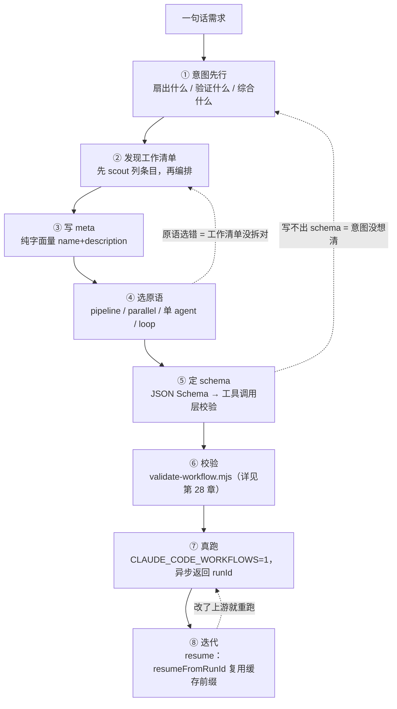
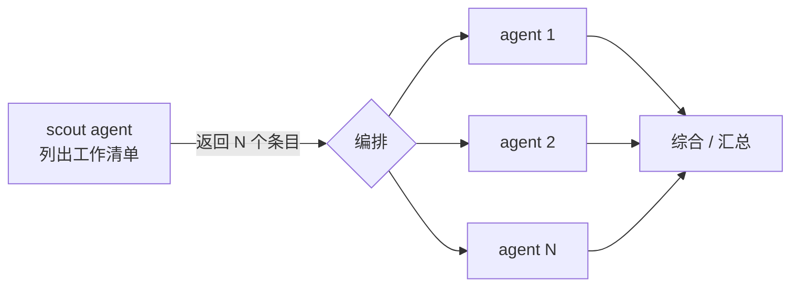
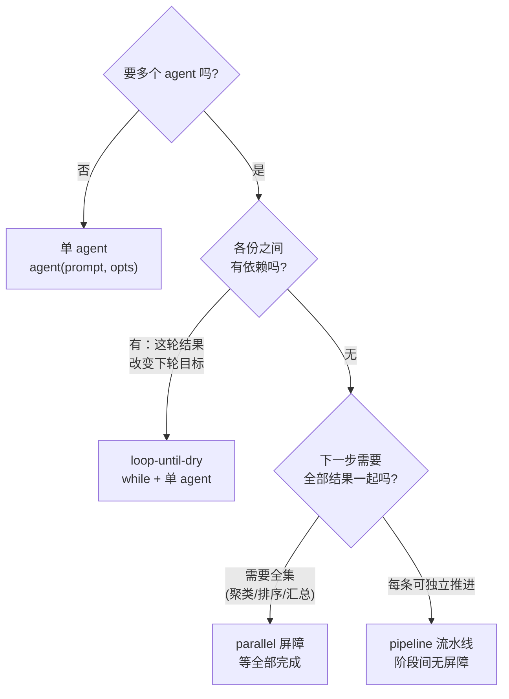
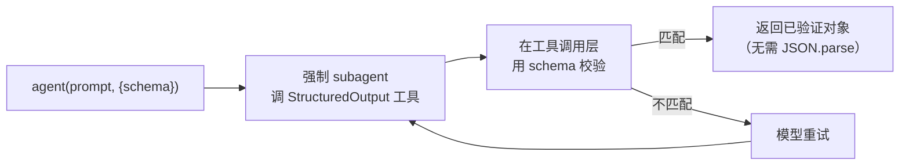
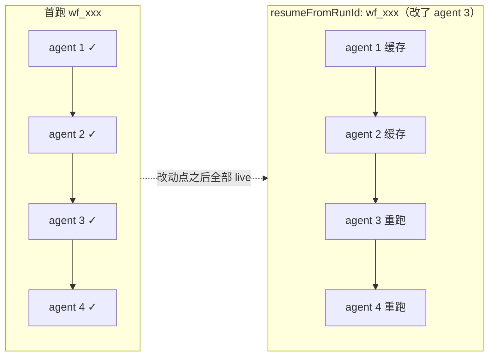
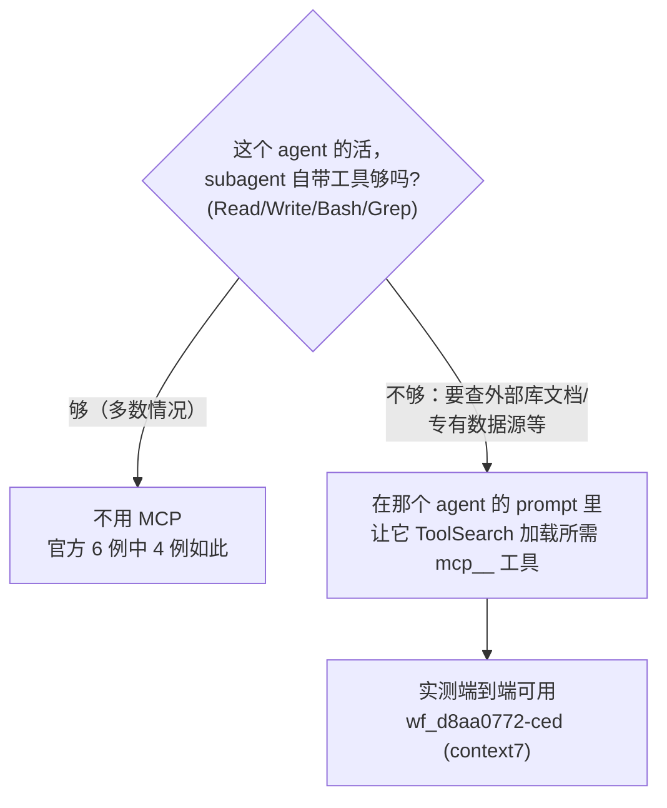

# 第 27 章 · 工作流创作流程

> 一句话：**写一个 Workflow 不是从打开编辑器、敲 `pipeline(` 开始的。它从一句话需求开始——「我到底要扇出什么、验证什么、综合什么」。把这个意图想清楚，原语（pipeline / parallel / 单 agent / loop）几乎是自己冒出来的；想不清楚，再漂亮的脚本也只是把混乱并行化了。**
>
> 这一章给你一条可复跑的创作流水线：意图 → 工作清单 → meta → 选原语 → schema → 校验 → 真跑 → 迭代。每一步都用本书三个**真跑过**的示例脚本（review-spa、dead-code-scan、feedback-themes）当决策案例，引它们真实的 Run ID 与用量。读完你会有一套「从需求到可复跑工作流」的肌肉记忆，外加一份可以直接改的脚手架骨架。

---

前面几章把 Workflow 的零件一个个拆开讲过了：第 5 章讲 `meta`/`phase`，第 6 章讲 `agent()`，第 7 章讲 schema，第 8 章讲 `parallel` 屏障对 `pipeline` 流水线，第 17 章讲对抗验证，第 18 章讲 loop-until-dry。但「认得每个零件」和「会把零件拼成一台机器」是两码事。这一章不讲新零件，只讲**怎么拼**——一个老手碰到「帮我审一下这个 PR」「把这堆反馈归个类」这种一句话需求时，脑子里到底走的是哪条流程。

我们把它画成一条直线流水线，但你记住：**真正的创作是来回迭代的**，下面每一步都可能把你打回上一步（schema 写不出来，多半就是意图还没想清楚）。



<div class="callout info">

这一章是「创作侧」的总览；往下接的是第 28 章（校验与调试）和第 29 章（示例画廊——还是这三个脚本，但看的是**端到端跑出来的结果**）。本章管「怎么写出来」，第 29 章管「跑出来长什么样」。两章引用同一组 Run ID，可以对着看。

</div>

---

## 27.1 意图先行：你到底要扇出什么、验证什么、综合什么

新手最爱犯的错，是一上来就纠结「我该用 pipeline 还是 parallel」。这是拿着工具去套问题，顺序反了。**先回答一个更朴素的问题：这个任务的并行，到底是为了啥？**

Workflow 的全部价值，其实就归到三个动词上：

| 动词 | 你在做什么 | 它换来什么 | 典型原语 |
|---|---|---|---|
| **扇出（fan-out）** | 把一个大任务切成 N 份，N 个 subagent 同时做 | **规模 / 速度**——墙钟压到「最慢的一份」 | `parallel` / `pipeline` |
| **验证（verify）** | 让另一个 agent 去核对/反驳第一个 agent 的产出 | **可信**——单 agent 会幻觉、会夸大 | 扇出后接一个验证 stage |
| **综合（synthesize）** | 把 N 份独立结果合成一个结论 | **全面**——跨全集才能看出主题/排序 | 屏障后接一个综合 agent |

动手写脚本前，先用一句话把意图讲明白——**是图全面、图可信，还是图规模**？这一句话直接定下后面所有的取舍。看本书三个真跑示例各自的「意图句」：

<div class="callout tip">

- **review-spa**：「对一份代码做**多维度**审查，且**不轻信** reviewer 的每条发现。」→ 扇出（按维度）+ 验证（对抗）。为**规模**也为**可信**。
- **feedback-themes**：「把一批反馈**综合**成排序主题。」→ 扇出（逐条摘要）+ 综合（聚类全集）。为**全面**。
- **dead-code-scan**：「**反复**扫描直到确认没有遗漏。」→ 递进式扫描，一轮可能揭示下一轮的目标。为**全面**（穷尽），但用串行循环而非扇出。

</div>

注意 dead-code-scan 的意图里没有「同时做 N 份」——它是**串行**的循环。这正好说明「意图先行」能帮你躲掉一个常见的坑：**不是所有任务都该扇出**。一旦出现「这一轮的结果会改变下一轮该找什么」，扇出就反而错了，因为各份之间彼此有依赖。把意图想透，你自然不会硬把一个递进任务塞进 `parallel`。

<div class="callout warn">

**当心「为并行而并行」**。Workflow 的并发不是白来的：每个 `agent()` 大约吃掉 2.5–3 万 token 的上下文（经验法则，见第 29 章实测）。`feedback-themes` 真跑一次就烧了 **607,307 token**（Run `wf_b3febb70-ad9`），就因为它扇出了 20 个 agent。要是你的任务单 agent 就能干好，扇出无非是让你多掏 20 倍的钱，去并行一件根本不用并行的事。先问自己「我为什么要多个 agent」，答不上来就老老实实用单 agent。

</div>

---

## 27.2 发现工作清单：先 scout 列条目，再编排 pipeline

意图清楚了，下一个问题就来了：**我要扇出的「N 份」，到底是哪 N 份？** 很多任务一开始压根不知道 N 是几——你要审的文件清单、你要研究的子问题、你要摘要的反馈条数，常常得先「踩点」一遍才数得出来。

这就引出一个很关键的两段式结构：**先 scout（侦察），再编排（处理）**。别在写脚本时硬塞一个你拍脑袋猜的清单；让第一个 agent 去把清单**列出来**，再把这份清单喂给后面的 `pipeline`/`parallel`。

`feedback-themes` 就是教科书式的「scout 先行」：它的第一个 `agent()` 一句摘要都不做，只干一件事——**把 CSV 读成一个条目数组**——

```javascript
  phase('Load')
  const { items } = await agent(
    `Read ${SOURCE} (a CSV with columns id,text). Return every row as an item with its id and text.`,
    { label: 'load', phase: 'Load', schema: ITEMS },
  )
  log(`${items.length} feedback item(s) loaded`)

  // 现在才知道 N = items.length，下一步据此扇出
  const summaries = await parallel(items.map(it => () =>
    agent(/* 每条一个摘要 agent */),
  ))
```

真跑时这个 scout 读出了 18 行，于是 `parallel` 扇出 18 个摘要 agent（加上 1 个 load、1 个 cluster，`agent_count` 实测正好 **20**，Run `wf_b3febb70-ad9`）。脚本里哪儿都没写死「18」——清单是运行时从数据里现读出来的。这正是 scout-then-orchestrate 的厉害之处：**同一个脚本，喂 18 行就出 20 个 agent，喂 50 行就自动出 52 个 agent**，一行代码都不用改。



<div class="callout tip">

**scout 的产出一定要带 schema**。因为它的返回值要被 `.map()` 展成下一批 `agent()`，你得让它是**结构化数组**，而不是一段散文。`feedback-themes` 的 scout 挂了 `schema: ITEMS`（`{items: [{id, text}]}`），`items.map(...)` 才能安全地铺开。没有 schema，你拿到的就是一段还得自己再解析的文本——等于把确定性又重新塞回给了模型。

</div>

也不是每个工作流都需要显式 scout。`review-spa` 的「清单」就是固定的三个维度（bugs/security/a11y），直接写成字面量 `DIMENSIONS` 数组就行——清单本身不靠运行时数据。判断的标准很简单：**清单是你写脚本时就已经知道的（写成字面量），还是得从输入里读出来的（用 scout agent）？**

---

## 27.3 写 meta：纯字面量的「身份证」

清单和编排心里都有数了，先把 `meta` 写出来。这可不只是走个过场——`meta` 是工作流的身份证，也是**运行前唯一被静态读取**的部分。

`meta` 有两条铁律（都已实测）：

1. **必须是纯字面量**，而且得是脚本的**第一条语句**。不能有变量引用、函数调用、展开运算符、模板插值。运行时在跑脚本体**之前**就把它静态读掉了，所以它必须能被「读」、而不被「跑」。
2. **`name` 和 `description` 必填**。`description` 就**一行**，会显示在权限确认对话框里（官方）；`whenToUse` 会显示在工作流列表里（官方）。

```javascript
  export const meta = {
    name: 'review-spa',
    description: "Review the book's SPA (index.html) across dimensions, then adversarially verify each finding",
    whenToUse: 'A real-run demo of fan-out review + adversarial verification',
    phases: [
      { title: 'Review', detail: 'one reviewer per dimension' },
      { title: 'Verify', detail: 'try to refute each finding', model: 'haiku' },
    ],
  }
```

这是 `review-spa` 真实的 `meta`。注意那个 `phases` 数组——它声明了这个工作流有几个阶段，**应当与脚本里实际调用的 `phase()` / `opts.phase` 对齐**。`review-spa` 声明了 `Review` 和 `Verify` 两个阶段，脚本里两个 `agent()` 也分别标了 `phase: 'Review'` 和 `phase: 'Verify'`——一一对上，进度树才不会乱套。

<div class="callout warn">

**`meta` 只要不是纯字面量，提交时就会被拒，脚本根本跑不起来**。实测里 `export const meta = {…, constructor: 'x'}`（保留键）在提交期就被拒了，原话：`Script must begin with export const meta = { name, description, phases } (pure literal). meta must be a pure literal: reserved key name not allowed in meta: constructor`。同理，任何 `name: 'x-' + suffix`、`description: \`...${v}\`` 都会被拒。要动态拼东西，挪到脚本体里去（写进 `agent()` 的 prompt），`meta` 永远写死。

</div>

再说说 `phases[].model`：官方工具描述把它说成「某阶段要用特定模型 override 时就加上」，措辞含糊；而本书因为 `CLAUDE_CODE_SUBAGENT_MODEL` 一直在覆盖，**未能独立隔离**出它运行时到底读不读。**稳妥的做法**：把 `phases[].model` 当成对话框上的一个「标签」，真要让某阶段跑 Haiku，就在那个阶段的每个 `agent()` 上写 `model:'haiku'`，别指望 `phases[].model` 自己生效。

---

## 27.4 选原语：四选一的真实决策

到这一步，意图、清单、meta 都齐了。现在才轮到选原语——而且正因为前三步做扎实了，这一步基本就是「对号入座」。Workflow 给你四种编排形态，它们的区别就归到一个核心问题上：**下一步什么时候能开始？**



| 原语 | 屏障语义 | 何时进入下一步 | 墙钟特征 | 选它的信号 |
|---|---|---|---|---|
| **单 agent** | — | 顺序 | 单任务时延 | 一个 subagent 就能干好 |
| **`pipeline`** | **无屏障** | 每条链各走各的，谁先好谁先走 | ≈ 最慢的**单条链** | 多条独立链，希望「先好先走」（**多阶段默认**） |
| **`parallel`** | **有屏障** | **等全部完成**才返回 | ≈ 最慢的**单个 agent** | 下一步需要全集 |
| **loop** | 串行 | 满足终止条件才停 | N 轮串行之和 | 一轮揭示下一轮目标 |

下面拿三个真跑示例，把这张表从抽象落成具体的决策。

### review-spa 为何选 pipeline

意图是「3 个维度各审各的，某个维度一审完就**立即**验证它的发现，不等其它维度」。这恰好就是 `pipeline` 的典型场景：**每个 item（维度）独立流过两个 stage（审查 → 验证），阶段之间没有屏障**。

```javascript
  const reviewed = await pipeline(
    DIMENSIONS,
    // Stage 1 — 审查一个维度。
    d => agent(d.prompt, { label: `review:${d.key}`, phase: 'Review', schema: FINDINGS }),
    // Stage 2 — 对该维度的每条发现，并行验证。
    (review, d) => parallel(
      (review?.findings ?? []).map(f => () =>
        agent(/* 对抗验证，model:'haiku', schema: VERDICT */)
          .then(v => ({ ...f, dimension: d.key, verdict: v })),
      ),
    ),
  )
```

为什么**不**用 `parallel`？要是用了 `parallel`，三个维度的审查会全卡在同一道屏障上——必须等最慢的那个维度审完，三组验证才能一块儿开始。可验证 bugs 的发现，根本用不着等 a11y 审完。`pipeline` 让 bugs 一审完就马上进它的验证 stage，墙钟于是变成「最慢的**那一条**审查→验证链」，而不是「最慢审查 + 最慢验证」加起来。

真跑把这套编排的代价和产出都摆出来了：Run `wf_97b81e86-a0b`，**22 个 agent**（3 审查 + 19 验证）、**991,554 token**、**395,166ms**（≈6.6 分钟），最后 **18 条扛过对抗验证活下来**的发现（bugs 6 / security 4 / a11y 8）。注意验证阶段虽然标了 `model:'haiku'`，但本会话 `CLAUDE_CODE_SUBAGENT_MODEL` 把它覆盖了，19 个验证 agent 实跑的是 Opus——这才是 token 冲到近百万的主因。

<div class="callout info">

**pipeline 内部的 `agent()` 一定要显式标 `opts.phase`**。因为 pipeline 的多条链是并发跑的，要是还靠全局 `phase()` 来切阶段，多条链就会**抢**同一个全局 phase 指针，进度树立马乱掉。`review-spa` 给每个 `agent()` 都写死了 `phase: 'Review'` 或 `phase: 'Verify'`，把归组钉死，谁也不碍着谁。

</div>

### feedback-themes 为何选 parallel 屏障

意图是「逐条摘要，再把**全集**聚成排序主题」。聚类这一步有个绕不开的硬依赖：**你没法只盯着一条摘要就聚类**——必须等**所有**摘要都到齐，才看得出哪些该归一类、哪一类最大。这正是「屏障」的定义：等全部完成，再一起进入下一步。

```javascript
  // 故意用屏障：下一步跨全集聚类，必须全部摘要到齐才能跑。
  const summaries = await parallel(items.map(it => () =>
    agent(/* 单条摘要 */, { label: `summarize:${it.id}`, phase: 'Summarize', model: 'haiku' })
      .then(summary => ({ id: it.id, summary })),
  ))

  const labelled = summaries.filter(Boolean)

  phase('Cluster')
  const { themes } = await agent(
    `Here are ${labelled.length} summarized feedback items. Cluster them into themes...`,
    { label: 'cluster', phase: 'Cluster', schema: THEMES },
  )
```

为什么**不**用 `pipeline`？因为 pipeline 是「每条 item 各自独立流到底」——可聚类不是「每条 item 各走各的下一步」，而是「**所有** item 汇成的一个下一步」。pipeline 里没有「等所有人到齐」这一刻，而聚类恰恰就缺不了这一刻。所以这里必须是 `parallel` 屏障。

真跑：Run `wf_b3febb70-ad9`，**20 个 agent**（1 load + 18 summarize + 1 cluster）、**607,307 token**、**122,391ms**（≈2.0 分钟），18 项 → **8 个主题**（按 count 降序）。注意那个 `.filter(Boolean)`——`parallel` 返回的数组里，凡是被用户跳过、或异步出错的位置都会是 `null`，聚类前必须先滤掉。

<div class="callout warn">

**屏障的代价是「木桶效应」**：`parallel` 的墙钟由**最慢的那一个** thunk 说了算。20 个摘要里只要有一个特别慢，整道屏障就被它拖在那儿。这是为全面性交的税——但因为聚类**真的**离不开全集，这税交得值。反过来，要是你发现自己用了 `parallel`，却**不需要**全集（下一步其实各管各的就行），那就该换成 `pipeline`。

</div>

### dead-code-scan 为何选 loop

意图是「**反复**扫描直到确认干净」。关键在这儿：**这一轮认定了某个符号是死代码，可能让下一轮看清更多**（拿掉一个没人引用的函数后，原本「被它引用」的符号也跟着变成没人引用了）。各轮之间**有依赖**——这正是「不该扇出、该串行循环」的信号。

```javascript
  const DRY_STREAK = 2 // 连续这么多空轮就停
  const MAX_ROUNDS = 5 // 硬上限，保证循环一定终止

  let emptyRounds = 0
  let round = 0

  while (emptyRounds < DRY_STREAK && round < MAX_ROUNDS) {
    round++
    phase('Find')
    const { items } = await agent(
      `Round ${round}. Read ${TARGET}... Ignore anything already reported: ` +
      `${found.map(r => r.symbol).join(', ') || 'nothing yet'}.`,
      { label: `find:round-${round}`, phase: 'Find', schema: DEAD },
    )
    if (items.length === 0) { emptyRounds++; continue }
    emptyRounds = 0
    found.push(...items)
  }
```

为什么**不**用 `parallel`/`pipeline`？因为扇出的前提是「N 份彼此独立、能同时做」。但 dead-code-scan 的第 2 轮 prompt 里明明白白带着「忽略已报告的：`${found...}`」——**第 2 轮的输入要靠第 1 轮的输出**。只要有这种轮次依赖，扇出就错了：第 1 轮还没出结果，你根本没法启动第 2 轮。所以只能串行循环。

真跑：Run `wf_2283ab37-710`，**2 个 agent**（2 轮 × 1 finder）、**116,344 token**、**246,496ms**（≈4.1 分钟），返回 `{ rounds: 2, candidateCount: 0 }`——两轮全干净、0 候选，**连续 2 个空轮触发 `DRY_STREAK` 正常收尾**（没跑满 5 轮上限）。这印证了一个要紧的性质：**loop-until-dry 哪怕零发现也能正确收敛**。

<div class="callout warn">

**任何循环都必须有硬上限**。`dead-code-scan` 同时挂了两个终止条件：`DRY_STREAK`（连续 2 空轮）管「正常收敛」，`MAX_ROUNDS=5` 管「防失控兜底」。哪怕模型每轮都报出新发现、让 `DRY_STREAK` 永远凑不齐，`MAX_ROUNDS` 也保证循环必停。另外别忘了生命周期还压着一道官方硬上限：**单次工作流 `agent()` 总数不超过 1000**（runaway-loop backstop），但你不该指望撞到它——你自己的 `MAX_ROUNDS` 才是第一道闸。

</div>

---

## 27.5 定 schema：让确定性落在工具调用层

原语选好了，下一步是给每个会被「程序拿去消费」的 `agent()` 配 schema。判断标准：**这个 agent 的返回值，是给人看的散文，还是给代码 `.map()`/`.filter()`/取字段用的数据？** 是后者，就必须上 schema。

它的机制（官方 + 实测）很关键，值得逐字弄懂：



- 有 `schema` → **强制** subagent 去调 `StructuredOutput` 工具，**在工具调用层校验**，返回**已验证对象**；对不上就让模型重试。
- 因为校验是在工具调用层发生的，你拿到的 `agent()` 返回值**就是已验证对象**——直接 `result.findings`、`result.items` 就行，**绝不要 `JSON.parse`**（它已经是对象，不是字符串了）。

看看三个示例的 schema 设计，全都照着「程序要读什么，就 `required` 什么」来：

```javascript
  // review-spa：每个 reviewer 必须返回这个形状
  const FINDINGS = {
    type: 'object',
    required: ['findings'],
    properties: {
      findings: {
        type: 'array',
        items: {
          type: 'object',
          required: ['title', 'evidence', 'severity'],
          properties: {
            title: { type: 'string' },
            evidence: { type: 'string' },
            severity: { type: 'string', enum: ['low', 'medium', 'high'] },
          },
        },
      },
    },
  }
```

注意 `severity` 用了 `enum`——这一下把「严重度只能是这三个值之一」从「提示词里的一句祈求」升格成「工具调用层的硬约束」。下游 `.filter(f => f.verdict?.isReal)` 之所以敢直接读字段，靠的正是 schema 保证了字段一定在、类型一定对。

<div class="callout tip">

**schema 写不出来，往往就是意图没想清的信号**。如果你发现自己说不清「这个 agent 到底该返回哪几个字段」，那多半是 §27.1 的意图还没收敛——你压根还不知道下游要拿这份结果干嘛。这时候别硬憋 schema，回第一步把「扇出/验证/综合」想透。schema 就是意图的形式化；意图一模糊，schema 必然跟着模糊。

</div>

也不是每个 `agent()` 都要 schema。`feedback-themes` 的摘要 agent 就**故意不带 schema**——它的返回值（一句话摘要）直接拼进下一个 prompt 的文本里给模型读，不靠代码取字段。**散文进散文，结构进结构**：要喂给 `.map()` 的用 schema，要喂给下一个 prompt 的，纯文本就够。

---

## 27.6 校验：提交前先过一遍 lint

脚本写完、真跑之前，先拿第三方校验器 `validate-workflow.mjs` 过一遍静态检查。它能把「meta 是不是纯字面量」「有没有用 `Date.now()`/`Math.random()`」「有没有误用宿主 API」这些会导致**提交期被拒、或运行时崩掉**的毛病，提前在本地揪出来。

```bash
  node validate-workflow.mjs assets/examples/review-spa.js
  # 合法脚本：ok ... passes
```

这一步本章就一句话带过——**完整的校验规则清单、每条错误的原文、以及真跑挂了之后怎么用 `/workflows` 和 transcript 调试，全在第 28 章**。这里你只要记住一点：**真跑是要烧 token 的（动辄几十万），先过一遍零成本的本地 lint，能挡掉大半低级错误**，别拿真跑当 lint 使。

---

## 27.7 真跑：异步、门控、拿 runId

校验过了，正式真跑。三件事要心里有数：

1. **门控**：必须在 `CLAUDE_CODE_WORKFLOWS=1` 的会话里，Workflow 工具才能用。
2. **怎么调**：脚本落盘后用 `Workflow({ scriptPath: '...' })` 触发（`scriptPath` 的优先级高于内联 `script` 和具名 `name`）。也可以在消息里带个 `ultrawork` 关键词来触发。
3. **返回是异步的**：Workflow 工具**立即返回** `taskId` 和 `runId`（形如 `wf_...`），**不阻塞**。真正跑完时，由 `<task-notification>` 回传 `usage` 和 `result`。

```bash
  # 在 CLAUDE_CODE_WORKFLOWS=1 的会话里
  Workflow({ scriptPath: 'assets/examples/feedback-themes.js' })
  # → 立即返回 { status: 'async_launched', taskId: '...', runId: 'wf_b3febb70-ad9' }
  # → 完成时 <task-notification> 回传 { itemCount: 18, themeCount: 8, themes: [...] }
```

那个 `runId` 很重要——**记下它，下一步迭代要靠它续传**。真跑期间可以用斜杠命令 `/workflows` 看实时进度树。本书三个示例的 runId 全都记在 `assets/transcripts/examples-r5.md`，每条都能溯源。

<div class="callout info">

**编排本身零模型开销**。一个不带任何 `agent()` 调用的纯编排脚本，实测 **0 token / 4ms**（Run `wf_59bf3654-183`）。token 全花在 `agent()` 这些叶子上。所以「脚本逻辑」再绕也不烧钱——真正烧钱的是你扇出了多少个 subagent。这也正是「先想清楚到底要不要扇出」为什么这么重要。

</div>

---

## 27.8 迭代：用 resume 复用没改动的部分

第一次真跑很少一把就到位——某个 prompt 写歪了、某个 schema 漏了字段。这时候**最浪费**的做法就是从头重跑：`review-spa` 重跑一次又是 99 万 token、6.6 分钟。Workflow 给了你一件省钱利器：**断点续传（resume）**。

机制（官方 + 实测）是这样：传 `resumeFromRunId: '<上次的 runId>'`，运行时会**复用最长的、未改动的那段 `agent()` 调用前缀**——这些秒级就把缓存结果吐回来、**0 新 token**；而**第一个被你改过或新增的 `agent()` 调用，连同它之后的全部**，都 live 重跑。

```bash
  # 改了脚本后半段，前半段没动 → 复用前缀缓存
  Workflow({
    scriptPath: 'assets/examples/feedback-themes.js',
    resumeFromRunId: 'wf_b3febb70-ad9',
  })
```

实测的威力：同脚本 + 同 args 重跑，5 个 agent **全部命中缓存**——结果跟首跑一模一样、**0 token / 3ms**（首跑 133,691 token / 32,959ms，Run `wf_9c94951d-58c` 首跑 + 续传）。换句话说，要是你只改了脚本**末尾**那个聚类 prompt，前面 19 个摘要 agent 全走缓存，你只为重跑那 1 个聚类掏钱。



<div class="callout warn">

**续传有两个硬性前提**（官方）：①**仅同会话**——跨会话的 runId 无法续传；②**续传前先停掉上一次运行**（用 `TaskStop`），不然两次运行会打架。还有一点：缓存命中的判定看的是「`agent()` 调用有没有改动」，所以哪怕你只在某个 prompt 里改了一个字，那个 agent 连同它之后的都会重跑——把那些拿不准、要反复调的 agent 尽量往脚本**后面**摆，每次迭代就能少烧掉前面的缓存。

</div>

到这儿，一条完整的创作流水线就跑通了：意图 → 清单 → meta → 原语 → schema → 校验 → 真跑 → 迭代。但还有个高频问题没回答——**这一通操作，我需要 MCP 吗？**

---

## 27.9 诚实的「我需要 MCP 吗？」

创作工作流时，这是最容易被「带节奏」的一个问题。社区里常把「Workflow + MCP」当卖点来吹，好像不接 MCP 就没把 Workflow 的威力使出来。**这话夸大了。** 我们用实测数据把它说清楚。

**第一个事实：多数工作流根本不需要 MCP。** 官方 6 个示例里，**4 个零 MCP**——它们要的无非是文件读写、shell、代码分析，这些 subagent 原生就有（Read/Write/Bash/Grep）。本书三个真跑示例（review-spa / dead-code-scan / feedback-themes）**也全部零 MCP**：审 SPA、扫死代码、聚类反馈，靠 subagent 自带的文件工具就够了。所以默认的假设就该是「**我不需要 MCP**」，而不是反着来。

**第二个事实：默认 subagent 启动时手里 0 个 `mcp__` 工具。** 实测探针（Run `wf_1d4c6a71-56a`）显示，默认的 `workflow-subagent` 类型一启动**连一个 `mcp__` 工具都没有**——本机是「延迟工具环境」。但它带着 `ToolSearch`，可以**按需加载** MCP 工具再去调用。

**第三个事实：真要用时，MCP 确实端到端能跑通。** 实测里（Run `wf_d8aa0772-ced`），一个 subagent 经 `ToolSearch` 成功**加载并调用**了 `mcp__context7__resolve-library-id`，端到端跑通——还顺手发现它的 schema 要求 `query` 和 `libraryName` 都必填。所以 MCP 不是「画饼」，它是真能用的。



三个事实拼一块儿，结论很克制：

<div class="callout tip">

**MCP 是「要用的时候能用」，不是「卖点」。** 判断很简单——你的 agent 干的活，要是靠 subagent 自带的 Read/Write/Bash/Grep 就能搞定（审代码、读写文件、跑命令、grep），那就**不要**碰 MCP；要是它确实需要某个外部能力（查某个库的最新文档、访问某个专有数据源），那就在那个 agent 的 prompt 里让它先 `ToolSearch` 加载对应的 `mcp__` 工具再用。本机实测证明这条路是通的（`wf_d8aa0772-ced`），但绝大多数工作流压根走不到这一步。

</div>

<div class="callout info">

**为什么默认不预装 MCP 工具，反而是件好事**？因为每个工具的 schema 都要占 subagent 的上下文预算。默认 0 个 `mcp__` 工具 + `ToolSearch` 按需加载，意味着 subagent 不会被几十个根本用不上的工具定义把上下文撑爆——要哪个，临时搜出来加载哪个。这就是「延迟工具环境」的设计本意，跟 Workflow「token 是硬通货」的整体路子一脉相承。

</div>

---

## 27.10 可运行脚手架骨架

把这一章的流程沉淀成一个能直接拿去改的骨架。它把「scout 先行 → 选原语 → schema → 综合」的标准结构演示了一遍，你只要换掉 prompt、schema 和编排原语就行。

<div class="callout warn">

下面是一个**示意脚手架（未实跑）**——它是把 §27.2–§27.5 的结构抽象出来的模板，用来起手新工作流。真正跑过、可溯源的脚本是 `assets/examples/` 下的那三个（见 §27.4 的 Run ID）。拿这个骨架起手之后，务必先过 §27.6 的校验、再 §27.7 真跑。

</div>

```javascript
  // 示意脚手架（未实跑）：scout → 编排 → 综合
  export const meta = {
    name: 'my-workflow',
    description: 'One line shown in the permission dialog — say what it produces',
    whenToUse: 'Shown in the workflow list — when should a reader pick this?',
    phases: [
      { title: 'Scout' },
      { title: 'Process' },
      { title: 'Synthesize' },
    ],
  }

  // ① schema：程序要读什么，就 required 什么
  const WORKLIST = {
    type: 'object',
    required: ['items'],
    properties: {
      items: {
        type: 'array',
        items: {
          type: 'object',
          required: ['id'],
          properties: { id: { type: 'string' }, note: { type: 'string' } },
        },
      },
    },
  }
  const RESULT = {
    type: 'object',
    required: ['ok'],
    properties: { ok: { type: 'boolean' }, detail: { type: 'string' } },
  }

  // ② scout 先行：让第一个 agent 把工作清单「列出来」（带 schema，才能 .map）
  phase('Scout')
  const { items } = await agent(
    'Discover the work items for this task and return them as a structured list.',
    { label: 'scout', phase: 'Scout', schema: WORKLIST },
  )
  log(`${items.length} item(s) discovered`)

  // ③ 选原语：每条可独立推进 → pipeline；需要全集 → 换成 parallel 屏障
  const processed = await pipeline(
    items,
    // Stage 1：处理每条
    it => agent(`Process item ${it.id}.`, { label: `process:${it.id}`, phase: 'Process', schema: RESULT }),
    // Stage 2（可选）：对每条结果再验证 / 加工
    (res, it) => agent(`Verify result for ${it.id}: ${JSON.stringify(res)}`,
      { label: `verify:${it.id}`, phase: 'Process', schema: RESULT }),
  )

  // ④ 综合：若需要跨全集（聚类/排序/汇总），这里换成一个 parallel 屏障后接综合 agent
  const ok = processed.flat().filter(Boolean).filter(r => r.ok)
  log(`${ok.length} item(s) passed`)

  // 编排本身零 token（Run wf_59bf3654-183）；成本全在上面的 agent() 叶子
  return { total: items.length, passed: ok.length, results: ok }
```

骨架里每个决策点都对得上本章的一节：`meta` 是 §27.3，scout 是 §27.2，`pipeline` 怎么选是 §27.4，schema 是 §27.5。把它存到 `.claude/workflows/` 下，下次起手新工作流，复制一份、改改 prompt 就行。

---

## 27.11 本章小结

把「从一句话需求到可复跑工作流」收成一条能反复用的流水线：

- **① 意图先行**（§27.1）：先回答「扇出什么 / 验证什么 / 综合什么」——是图规模、图可信，还是图全面。这一句话定一切。三个示例的意图句各不相同：review-spa（规模+可信）、feedback-themes（全面）、dead-code-scan（穷尽但串行）。
- **② 发现工作清单**（§27.2）：先 scout 列条目，再编排。`feedback-themes` 的 scout 读出 18 行 → 自动扇出 20 个 agent（Run `wf_b3febb70-ad9`），脚本不写死 N。
- **③ 写 meta**（§27.3）：纯字面量、首语句、`name`+`description` 必填。不是字面量（比如保留键 `constructor`）提交期就被拒。
- **④ 选原语**（§27.4）：**review-spa 为何用 pipeline**（各维度先好先走，`wf_97b81e86-a0b`，22 agent / 991,554 token）、**feedback-themes 为何用 parallel 屏障**（聚类要全集，`wf_b3febb70-ad9`，20 agent / 607,307 token）、**dead-code-scan 为何用 loop**（轮次有依赖，`wf_2283ab37-710`，2 agent / 116,344 token，DRY_STREAK 终止）。
- **⑤ 定 schema**（§27.5）：JSON Schema → 工具调用层校验 → 返回已验证对象（不要 `JSON.parse`）→ 不匹配就重试。schema 写不出 = 意图没想清。
- **⑥ 校验**（§27.6）：`validate-workflow.mjs` 零成本本地 lint，详见第 28 章。
- **⑦ 真跑**（§27.7）：`CLAUDE_CODE_WORKFLOWS=1`，`Workflow({ scriptPath })` 异步返回 `runId`；编排本身 0 token（`wf_59bf3654-183`）。
- **⑧ 迭代**（§27.8）：`resumeFromRunId` 复用最长未改动的 `agent()` 前缀，秒级返回缓存、0 新 token（`wf_9c94951d-58c`）；仅同会话、续传前先停掉上次运行。
- **⑨ 我需要 MCP 吗**（§27.9）：**多数不需要**（官方 6 例里 4 例零 MCP，本书三个示例也全部零 MCP）；默认 subagent 持 0 个 `mcp__` 工具，但有 `ToolSearch` 能按需加载；context7 端到端实测跑通（`wf_d8aa0772-ced`）。结论是「要用时能用」，不是卖点。

创作流程往下接的是「校验与调试」——脚本写出来了，怎么在它崩之前、崩之后都能稳稳地定位问题？

> 继续阅读：[第 28 章 · 校验与调试](#/zh/p6-28)
