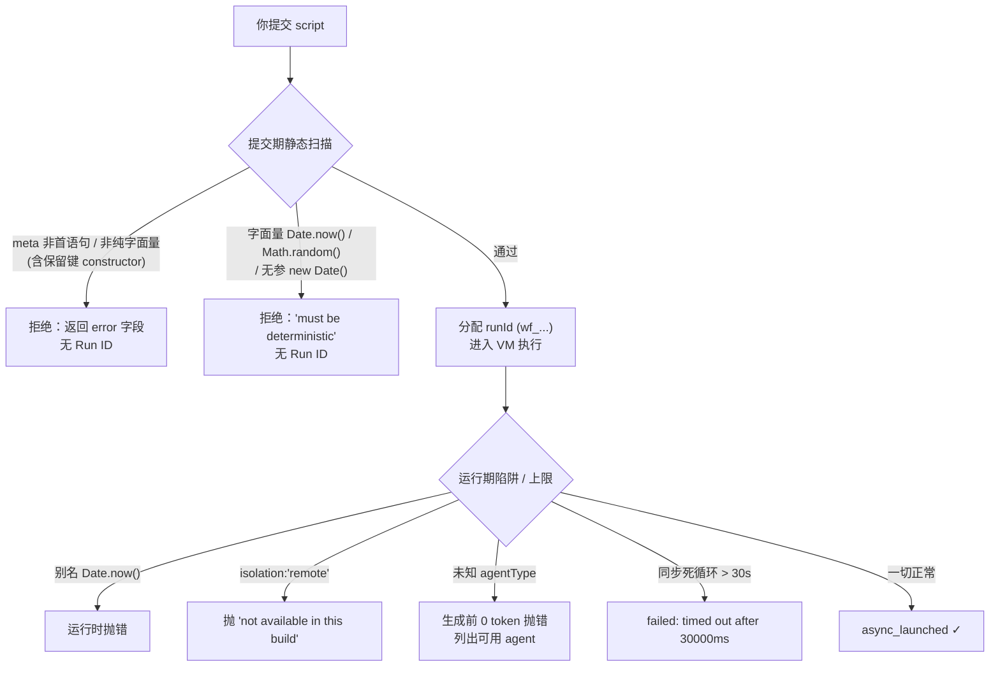
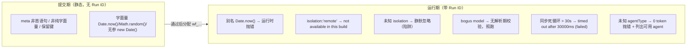
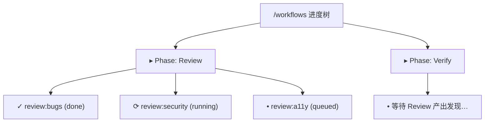
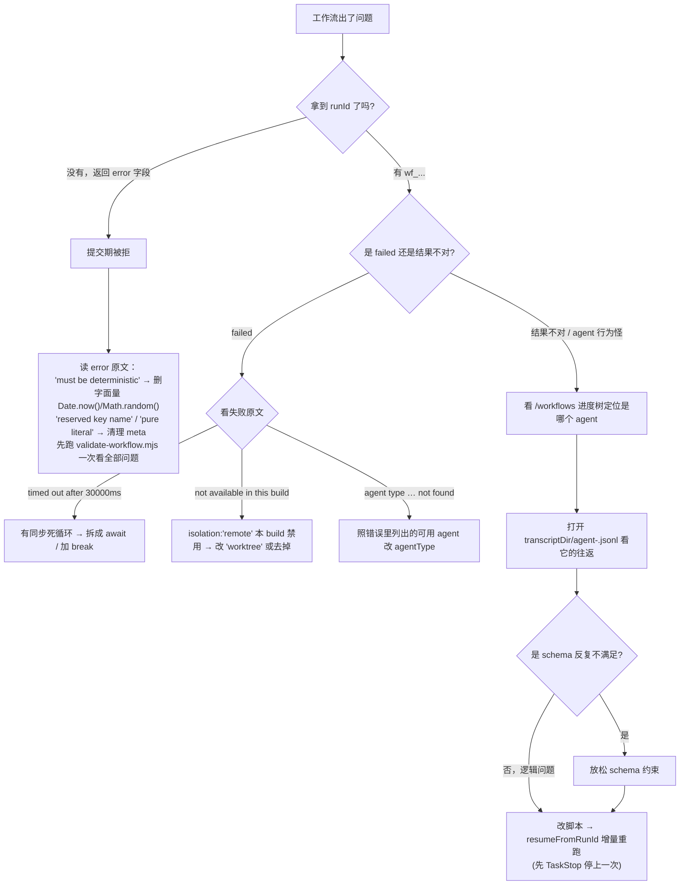

# 第 28 章 · 校验与调试

> 一句话：**Workflow 把「确定性」当成铁律——所以它在两个时刻设了关卡：一是你按下提交那一刻的静态扫描（合不合规，脚本根本不让跑），二是运行期的运行时陷阱与上限（跑起来后还会因别名违规、隔离不可用、同步死循环、未知 agentType 而抛错）。这一章把这两道关卡讲透：提交期拒什么、运行期抛什么，每条都配真实错误原文与 Run ID；再讲三件调试利器——`/workflows` 进度树、`agent-<id>.jsonl` journal、`resumeFromRunId` 增量重跑——让你出错后能快速定位、改完不必从头烧 token。**
>
> 前面 27 章教你怎么把工作流写对。这一章假设你已经写了，并且——它出错了。出错是常态：`meta` 多塞了一个键、随手写了 `Date.now()`、`isolation` 拼错、循环忘了守卫预算。好消息是，Workflow 的错误信息异常坦白：它会**逐字告诉你**哪里错、为什么错、甚至怎么改。本章带你读懂这些信号。

---

本章的所有论断分三层来源，请边读边对照：

- **官方工具定义**：Claude Code 内置 Workflow 工具的描述与 input-schema（如脚本体积上限、并发上限）。
- **本机真实实测**：`assets/transcripts/*-r4.md` 里带 Run ID 的运行记录，错误原文逐字摘录。
- **第三方工具 `validate-workflow.mjs`**：它来自第三方仓库 `claude-code-workflow-creator`（某 YouTube 创作者的配套仓库，**非 Claude/Anthropic 官方**），但**它的行为我们已在本机实跑确认**——所以本章引用它时统一标注「**第三方工具、行为已实测**」，既不当官方，也如实记录它真实输出了什么。

<div class="callout info">

**两道关卡，一句话先立住**：**提交期**是「静态扫描」——不运行你的代码，只读源码与 `meta` 字面量，违规直接拒、连 `taskId` 都不给；**运行期**是「真跑」——脚本已经在 VM 里执行，违规通过抛错（`throw`）暴露，这时你已经拿到了 `runId`（`wf_...`）。下面两节分别拆解。

</div>



---

## 28.1 提交前用校验器把关：`validate-workflow.mjs`

在把脚本交给 Workflow 工具之前，你可以先用一个**静态 lint** 过一遍。这个 lint 就是第三方仓库自带的 `validate-workflow.mjs`。

<div class="callout warn">

**先讲清来历**：`validate-workflow.mjs` 来自第三方仓库 `claude-code-workflow-creator`，**不是 Claude/Anthropic 官方工具**。但本书**已在本机实跑确认了它的真实行为**（Node v22.22.0，2026-05-25），所以下面引用的都是它**实测**输出的原文，而非照抄它的文档。它检查的「规则」本身——`meta` 须首语句、确定性禁用、宿主 API、thunk 形状——溯源到**官方工具定义 + 本书实测**；这个 lint 只是把这些规则做成了一个可以本地跑的脚本。

</div>

### 为什么要有这一步

提交期的静态拒绝固然能拦下违规脚本，但它有两个不便：一是**反馈在网络往返之后**（你得真的调一次工具）；二是它**一次只报第一类致命错**（提交被拒就停了，你看不到「还有哪些地方也有问题」）。本地 lint 补上这个缺口：它**一次列出全部问题**（错误 + 警告），并且**不消耗任何 token、不发起任何调用**。把它接进保存钩子或 CI，就能在「按提交」之前先自查。

### 它检查什么

依据本机实测（`assets/transcripts/validator-r4.md`）与官方规则，它覆盖这些检查项：

| 检查项 | 由什么触发 | 严重级 |
|---|---|---|
| 脚本体积上限 | 源码超过 **524288 字节（512KB）** | ERROR |
| `meta` 必须是**首语句** | `export const meta` 之前有任何代码（如一个 `const`） | ERROR |
| `meta` 必须**纯字面量** | `meta` 里有变量引用 / 函数调用 / 展开运算符 / 模板插值 / 保留键（如 `constructor`）；或缺 `name`/`description` | ERROR |
| 禁用非确定性调用 | 字面量 `Date.now()` / `Math.random()` / 无参 `new Date()` | ERROR |
| 宿主 API 警告 | 编排层里出现 `require` / `import` / `process` | warning |
| `parallel([...])` 裸 promise 警告 | `parallel([agent(...), agent(...)])` 直接传 promise，而非 thunk | warning |

注意区分 **ERROR** 与 **warning**：**ERROR 让退出码为 1**（应阻断提交）；**只有 warning 时退出码仍为 0**（脚本能跑，但有改进空间）。

### 实测示例一：合法脚本 → 通过，退出 0

把一个真实可跑的工作流（之前的模型解析测试脚本）喂进去：

```bash
  $ node scripts/validate-workflow.mjs <…>/model-resolution-test-wf_9c94951d-58c.js
  ok — model-resolution-test-wf_9c94951d-58c.js passes (1853 bytes)
  (exit=0)
```

它打印 `ok … passes`，附上字节数，退出码 0。这就是「干净」的样子。

### 实测示例二：违规脚本 → 逐条报错，退出 1

我们故意写一个一次踩中多条规则的脚本：

```javascript
  // A deliberately broken workflow, to capture the validator's real output.
  const setupBeforeMeta = 5 // code before meta → ERROR: meta must be first

  export const meta = {
    name: 'bad-example',
    description: 'demonstrates validator errors',
  }

  const stamp = Date.now() // banned non-deterministic call → ERROR
  const fs = require('node:fs') // host API in orchestrator → warning

  const results = await parallel([agent('do x'), agent('do y')]) // bare promises → warning
  return { stamp, results }
```

校验器输出（逐字摘自实测）：

```text
  warn  `require()` at line 10 — no Node/host APIs in the orchestrator; do file/shell work inside an agent() instead
  warn  parallel([...]) at line 12 looks like it holds bare agent(...) calls — wrap each as a thunk: () => agent(...)
  ERROR `export const meta` must be the FIRST statement (line 4) — code precedes it
  ERROR banned non-deterministic call `Date.now()` at line 9 — it throws inside a workflow (breaks resume)

  2 error(s) in bad-example.js — fix before running.
  (exit=1)
```

一次就把 4 个问题全列出来：2 个 ERROR（`meta` 不是首语句、字面量 `Date.now()`）+ 2 个 warning（编排层 `require`、`parallel` 传裸 promise）。最后一行明确告诉你 `2 error(s) … fix before running`，退出码 1。

<div class="callout tip">

**把它接进工作流**：这个 lint 的价值在于「**提交之前**」就把会被静态拒绝的脚本拦下，而且一次看全。一个朴素用法是在保存 `.claude/workflows/*.js` 时跑它，或在 CI 里对 PR 里改动的工作流脚本跑它。注意它是**静态预检**，比 Workflow 工具自己的提交期拒绝**面更宽**（它还报 warning），但本质同源——`meta`-first、确定性禁用、宿主 API、thunk 形状这些规则，最终都以**官方工具定义 + 本书实测**为准。

</div>

---

## 28.2 提交期 vs 运行期：两类拒绝的边界

校验器是「你自己先查」。真正的关卡是 Workflow 工具本身，它在两个时刻把关——而搞清楚「错误发生在哪一刻」，是定位问题的第一步：**有没有拿到 `runId`，就是分界线**。

| 维度 | 提交期（静态拒绝） | 运行期（运行时抛错 / 上限） |
|---|---|---|
| 发生时刻 | 脚本被解析/执行**之前**，只做静态扫描 | 脚本已在 VM 里**执行中** |
| 有没有 `runId` | **没有**（连工作流都没启动） | **有**（`wf_...`，可用于续传/排错） |
| 返回形态 | `WorkflowOutput` 带 `error` 字段 | 运行 `failed`，或脚本内 `try/catch` 接住的异常 |
| 典型触发 | `meta` 非首语句/非纯字面量、字面量 `Date.now()` | 别名 `Date.now()`、`isolation:'remote'`、同步死循环、未知 agentType |
| 能否 `try/catch` 兜住 | **不能**（脚本没跑，何来 try） | **能**（异常在你的代码里抛出） |

下面逐类看真实错误原文。

### 提交期拒绝（无 Run ID）

**(1) 字面量 `Date.now()` / `Math.random()` / 无参 `new Date()` —— 静态扫描拒绝**

脚本里只要出现这些**字面量形式**的非确定性调用，就在**提交时**被静态扫描拒绝，脚本根本不解析、不运行。逐字错误原文：

```text
  Workflow scripts must be deterministic: Date.now()/Math.random()/new Date() are
  unavailable (breaks resume). Stamp results after the workflow returns, or pass
  timestamps via args.
```

<div class="callout warn">

**`try/catch` 接不住它**：很多人第一反应是「那我把 `Date.now()` 包进 `try/catch` 不就行了」——不行。这是**提交时的静态源码扫描**，发生在脚本被解析/执行**之前**，你的 `try/catch` 还没机会运行，脚本就被拒了。要时间戳就用 `args` 传入，或等工作流返回后再盖戳。（信源：`sandbox-r4.md` §A，提交拒绝实测，无 Run ID。）

</div>

**(2) `meta` 保留键 —— 静态拒绝**

`meta` 必须是「纯字面量」，且不得含保留键。我们提交 `export const meta = { name, description, constructor: 'evil' }`，被**提交时拒绝**，逐字原文：

```text
  Script must begin with `export const meta = { name, description, phases }` (pure literal).
  meta must be a pure literal: reserved key name not allowed in meta: constructor
```

这证实了「保留键（`__proto__` / `constructor` / `prototype`）被拒」（本书用 `constructor` 实测）。同样**无 Run ID**——工作流没启动。（信源：`repo-claims-r4.md` §X1。）

### 运行期抛错（带 Run ID）

下面这些**通过了**提交期静态扫描（拿到了 `runId`），但在运行时因各种原因抛错或失败。

**(1) 别名形式的非确定性调用 —— 运行时陷阱抛错**

如果你用别名绕过静态扫描（`const D = Date; D.now()`），提交**会通过**——但调用在**运行时**被 VM 的陷阱抓住、抛错，可被脚本自己的 `try/catch` 接住。实测返回（`wf_59bf3654-183`，0 agent / 0 token / 4ms）里，两个别名调用各自抛出**不同**的错误信息：

```json
  {
    "aliasedDateNowError": "Date.now() / new Date() are unavailable in workflow scripts (breaks resume). Stamp results after the workflow returns, or pass timestamps via args.",
    "aliasedMathRandomError": "Math.random() is unavailable in workflow scripts (breaks resume). For N independent samples, include the index in the agent label or prompt."
  }
```

注意 `Math.random()` 的运行时错误甚至**直接给出替代方案**——「为 N 个独立采样，把下标编进 agent 标签或提示词」。而 `new Date(具体值)` 正常（`new Date(0)` → `1970-01-01T00:00:00.000Z`）。这就是「**双层防护**」：字面量被提交期拦，别名被运行期拦。（信源：`sandbox-r4.md` §B。）

**(2) `isolation:'remote'` 抛错；未知 isolation 静默忽略**

`opts.isolation` 在运行期只特判两个值。实测（`wf_dace2fc6-966`，3 agent / 52,014 token / 5,253ms）：

```json
  {
    "isoRemote": { "threw": true, "err": "agent({isolation:'remote'}) is not available in this build" },
    "isoBogus":  { "threw": false, "result": "OK" },
    "badModel":  { "threw": false, "result": "OK" }
  }
```

- `isolation:'remote'` → **抛错**，逐字 `agent({isolation:'remote'}) is not available in this build`（证实 `'remote'` 存在但本 build 禁用）。
- `isolation:'totally-bogus'` → **不抛错**，agent 正常返回 `OK`。

这纠正了一个常见误解：运行时只对 `'worktree'`（执行隔离）和 `'remote'`（拒绝）做特判，**其它未知值被静默忽略**，并非「只接受 `'worktree'`、其余报错」。所以 `isolation` 拼错（如 `'worktreee'`）不会报错，但你的 agent 也**没有被隔离**——这是个静默陷阱。（信源：`repo-claims-r4.md` §X2。）

**(3) `opts.model` 无解析期校验**

同一次运行（`wf_dace2fc6-966`）里，`model: 'totally-not-a-real-model-xyz'` 这个**明显拼错**的模型字符串，**没有**在提交/解析期被拒，agent 照常运行并返回 `OK`。这与 `agentType` 形成鲜明对比（见下）。

<div class="callout info">

**为什么本会话观测不到「API 期才失败」**：本会话设置了 `CLAUDE_CODE_SUBAGENT_MODEL=claude-opus-4-7[1m]`，它会**覆盖每个 per-call `model`**——所以那个 bogus 字符串从未真正发给 API，「拼错会在 API 调用时失败」这一步因覆盖**未被观测到**（属第三方声称、未核实）。本书只断言已实测的部分：`model` **无解析期校验**。（信源：`repo-claims-r4.md` §X4 + `sandbox-r4.md` §C。）

</div>

**(4) VM 同步超时 = 30000ms —— 抓死循环**

一个纯同步的长循环 `for (i=0; i<1e12; i++) {}`（没有任何 `await`）被中止，工作流 **failed**。逐字失败原文与 Run ID：

```text
  Error: Script execution timed out after 30000ms
```

- **Run ID**：`wf_e3b2b123-5f4` · **status: failed** · 0 agent · 实测耗时 **30222ms**。

这证实了 **30000ms 同步执行上限**。关键理解：它只约束**同步**工作（用来抓死循环），**不是墙钟上限**——带 `await agent(...)` 的异步工作流跑几分钟稀松平常（如 `wf_6090decc-8a5` 深度研究跑了 298,530ms 也没事）。（信源：`repo-claims-r4.md` §X3。）

**(5) 未知 `agentType` —— 生成前 0 token 抛错，并列出可用 agent**

与「无校验的 `model`」相反，`agentType` **有校验**。未知值在**生成模型之前**（0 token / 4ms）就抛错，并把全部可用 agent 列出来。逐字错误原文与 Run ID（`wf_a222f20f-0f5`）：

```text
  agent({agentType}): agent type '…' not found. Available agents: claude,
  claude-code-guide, codex:codex-rescue, Explore, general-purpose,
  get-current-datetime, init-architect, Plan, planner, statusline-setup,
  team-architect, team-qa, team-reviewer, ui-ux-designer
```

这是个**好心**的错误——它不仅告诉你「这个 agentType 不存在」，还把当前会话可用的 14 个 agent 名字全列出来，让你照着改。（信源：`assets/transcripts/` + grounding A2。）

下面把这两类拒绝的「检查 → 时机 → 是否带 Run ID」浓缩成一张图：



---

## 28.3 三件调试利器

脚本跑起来后出了问题，怎么定位？Workflow 给了三件互补的工具：**实时看进度、回放每个 agent 的明细、改完增量重跑**。

### 利器一：`/workflows` 实时进度树

Workflow 工具**始终异步**：调用后立即返回 `taskId`/`runId`，完成时才发 `<task-notification>`。在它运行的这段时间里，你不是只能干等——斜杠命令 `/workflows` 给你一棵**实时进度树**，按 `phase()` 分组，逐个 agent 显示状态。这是你观察「工作流此刻跑到哪、哪个 agent 卡住了、哪个阶段还没开始」的第一现场。



<div class="callout tip">

**配合 `log()` 用**：脚本里的 `log(message)` 会把一行叙述输出到进度树**上方**——把它当成「给人看的旁白」，在关键节点写一句（如 `log('维度 1 审出 7 条，开始扇出验证')`），进度树读起来就从「一堆 agent 名」变成「有上下文的过程叙事」。注意 `log()` 不影响返回值，纯展示。

</div>

### 利器二：`agent-<id>.jsonl` journal

`WorkflowOutput` 里有一个 `transcriptDir` 字段，指向本次运行的记录目录。在它下面，**每一次 `agent()` 调用**都会落一份 journal 文件 `agent-<id>.jsonl`——逐行 JSON，记录该 subagent 的完整往返（它收到的提示、它的工具调用、它的最终输出）。当某个 agent 返回了出乎意料的结果，或带 schema 的 agent 反复重试，你打开对应的 `agent-<id>.jsonl`，就能看到「它到底想了什么、调了什么工具、为什么没满足 schema」。

每个 agent 还附一份 sidecar `agent-<id>.meta.json`，记录该 agent 的元信息——本书实测中它记录的是 `{"agentType":"workflow-subagent"}`（默认 agent 类型）。

<div class="callout info">

**journal 是 resume 的物理基础**：续传之所以能「秒级返回缓存」，正是因为每次 `agent()` 的结果都被 journal 记了下来。下面讲的 `resumeFromRunId` 读的就是这些 journal。所以 journal 不只是「事后排错」，也是「增量重跑」的数据来源。

</div>

### 利器三：`resumeFromRunId` 增量重跑

调试工作流最贵的部分，是**每次改一行就从头烧一遍 token**。`resumeFromRunId` 解决这个：把上一次的 `runId` 传进 `WorkflowInput.resumeFromRunId`，**最长未改动的 `agent()` 前缀**会秒级返回缓存结果，只有**第一个被编辑/新增的调用及其之后**才 live 重跑。

实测对比最能说明问题（`wf_9c94951d-58c`）：

| 运行 | agent 数 | total tokens | duration |
|---|---|---|---|
| 首跑 | 5 | 133,691 | 32,959ms |
| 续传（同脚本 + 同 args） | 5（全缓存） | **0** | **3ms** |

同脚本、同 args 续传 → 5 个结果完全一致、**0 新 token / 3ms**。改一处再续传，则该处之前的 agent 仍走缓存，之后的才重算。

<div class="callout warn">

**续传的三条铁律**：①**仅同会话**——跨会话不命中；②**续传前先停掉上一次运行**（用 `TaskStop`），否则两次运行会打架；③缓存粒度是「**最长未改动前缀**」——你在脚本中间插一个 agent，它之后的所有 agent 都会重跑（哪怕内容没变），因为前缀被打断了。所以调试时尽量**从后往前**改、或把最可能反复调的 agent 放在脚本靠后位置。

</div>

### 关于「schema 不匹配时模型重试」

带 `schema` 的 `agent()` 会强制 subagent 调 `StructuredOutput` 工具、在工具调用层校验，**不匹配则模型重试**——这是官方工具定义明确的行为，本书每次带 schema 的运行也都成功返回了已验证对象。

<div class="callout warn">

**重试次数：不要断言具体数字**。第三方仓库声称「用 AJV 编译 schema、subagent 始终不调用时最多再催两次后失败」——但**确切的重试次数属第三方声称、未核实**，本书**不**断言任何具体数字。你只需知道：①机制存在（不匹配会重试）；②如果某个带 schema 的 agent 迟迟不返回或耗时异常，很可能是 **schema 约束过严**导致模型反复满足不了——这时打开它的 `agent-<id>.jsonl` 看它每次的尝试，往往能定位是哪个字段卡住，适当放松约束即可。

</div>

### 一张「出错了怎么办」决策树

把本章的三类信号（提交期、运行期、调试）串成一棵决策树：



---

## 小结

校验与调试的核心，是分清「错误发生在哪一刻」，再用对应的工具去定位：

- **两道关卡**：**提交期**静态扫描（无 Run ID）拒掉 `meta` 非纯字面量/非首语句、字面量 `Date.now()`/`Math.random()`/无参 `new Date()`；**运行期**（带 `runId`）抛出别名非确定性调用、`isolation:'remote'`（`not available in this build`）、同步死循环（`timed out after 30000ms`）、未知 `agentType`（0 token 抛错并列出可用 agent）等错误。分界线就是**有没有 `runId`**。
- **第三方 lint `validate-workflow.mjs`（行为已实测）**：提交前本地一次列全所有问题（ERROR 阻断、warning 放行），不烧 token。
- **三件调试利器**：`/workflows` 实时进度树看「跑到哪」；`transcriptDir` 下的 `agent-<id>.jsonl` journal 看「某个 agent 到底怎么了」；`resumeFromRunId` 增量重跑（最长未改前缀缓存，**0 token / 3ms** 实测）让你改完不必从头烧 token——但记得**仅同会话、续传前先 `TaskStop`**。
- **一条克制原则**：schema 不匹配会触发模型重试，但**确切重试次数属第三方未核实，不要断言数字**；遇到带 schema 的 agent 迟迟不返回，优先怀疑 schema 过严，打开它的 journal 定位卡住的字段。

把这两道关卡的错误原文记熟，再把三件利器用顺，你就能把「工作流出错」从「推倒重来」变成「读信号、点改、增量重跑」。

继续阅读：[第 29 章 · 示例画廊](#/zh/p6-29)
