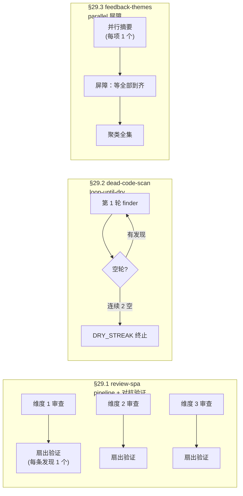
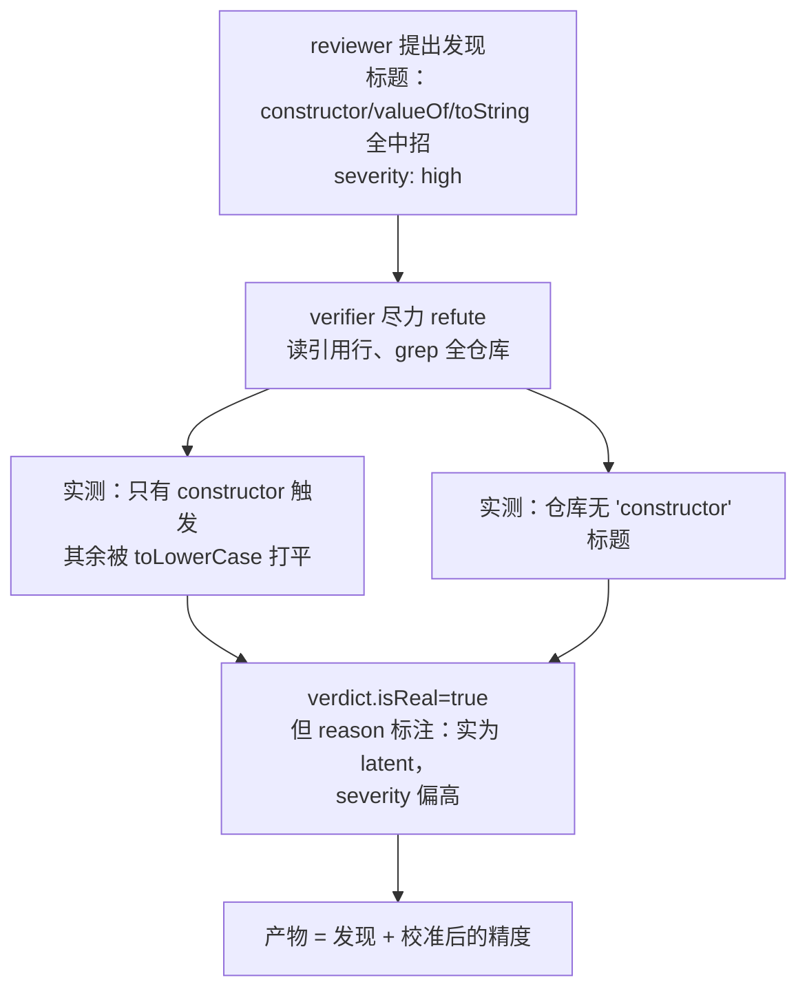
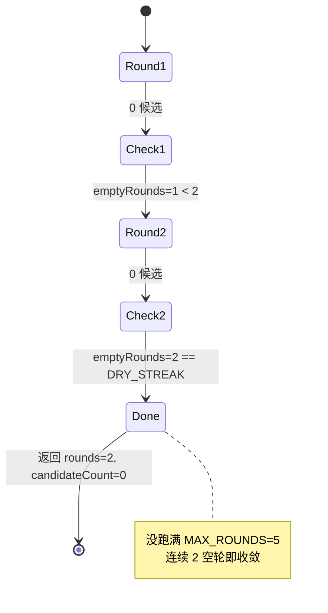
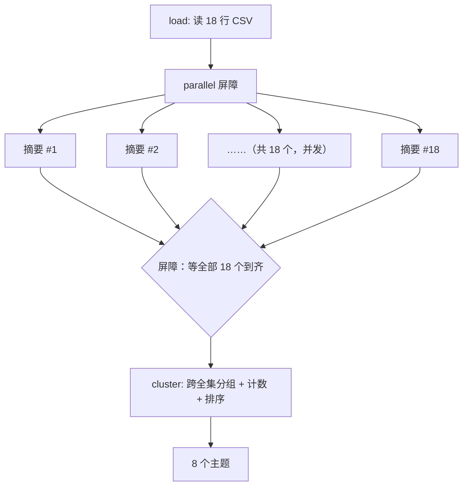

# 第 29 章 · 示例画廊

> 一句话：**前面 28 章把 Workflow 的零件一个个讲清了——pipeline、parallel、对抗验证、loop-until-dry、屏障、schema、续传。这一章把它们装进三个「真跑过」的应用级工作流，把端到端的结果整个端给你看：Run ID、agent 数、token、墙钟，一个不少，全部能往回查。**
>
> 这是一座「画廊」，不是再把机制讲一遍。三幅作品——多维代码审查、死代码扫描、反馈聚类——各对应一种核心编排形态，每一幅都带着它真实跑起来时的数字和产物。你在这一章看到的不是「应该会怎样」，而是「实际就是这样」。

---

三个示例脚本都放在 `assets/examples/` 下，都在同一个会话里**真跑过**（`CLAUDE_CODE_WORKFLOWS=1`，Claude Code v2.1.150，主循环 Opus 4.7 (1M)），跑的记录在 `assets/transcripts/examples-r5.md`。三者各占一种编排形态：



这三种形态到底差在哪，先用一张表把它们摆清楚：

| 形态 | 代表脚本 | 何时各 agent 完成 | 何时进入下一步 | 适用场景 |
|---|---|---|---|---|
| **pipeline + 验证** | review-spa | 各维度独立完成 | 本维度一审完**立即**验证，不等最慢维度 | 多条独立链，希望「谁先好谁先走」 |
| **loop-until-dry** | dead-code-scan | 逐轮串行 | 连续 N 空轮才停 | 一轮可能揭示新目标的递进式清扫 |
| **parallel 屏障** | feedback-themes | 全部并发完成 | **必须等全部到齐**才能聚类 | 下一步需要全集（聚类、汇总、排序） |

下面一幅一幅展开。每一节都按同一个结构走：**模式 → 脚本（编排取舍）→ 真实运行（Run ID + 用量表）→ 结果 → 教学点**。

---

## 29.1 review-spa：pipeline 多维审查 + 对抗验证

### 模式

对一份代码做**多个维度**的审查（bugs / security / a11y），每个维度自成一条链；哪个维度审完了，**立刻**对它的每条发现做对抗验证，不等别的维度。这其实是两个模式拼起来：一个是「pipeline 让每条链各走各的」，一个是「对抗验证只信扛过验证的发现」——分别在第 8 章（pipeline）和第 17 章（对抗验证）讲过，这里看它们合在一起实战是什么效果。

要审的真实目标就是本书自己的 `index.html`（一份约 600 行的 vanilla-JS SPA）——dogfood，拿自己的前端开刀。

### 脚本：编排取舍

脚本在 `assets/examples/review-spa.js`。骨架就是一个 `pipeline()`，3 个维度各拉一条两阶段的链：

```javascript
  const reviewed = await pipeline(
    DIMENSIONS,
    // Stage 1 — 审查一个维度。
    d => agent(d.prompt, { label: `review:${d.key}`, phase: 'Review', schema: FINDINGS }),
    // Stage 2 — 对该维度的每条发现，并行验证。
    (review, d) => parallel(
      (review?.findings ?? []).map(f => () =>
        agent(
          `Adversarially verify this finding about ${TARGET}. Read the cited lines and try hard to refute it; ` +
          `if you cannot, it is real.\nTitle: ${f.title}\nEvidence: ${f.evidence}\nSeverity: ${f.severity}`,
          { label: `verify:${d.key}`, phase: 'Verify', model: 'haiku', schema: VERDICT },
        ).then(v => ({ ...f, dimension: d.key, verdict: v })),
      ),
    ),
  )
```

这里有三个地方值得停下来想想，看脚本是怎么取舍的：

**取舍一：为什么用 `pipeline`，而不是「先全审完、再统一验证」？** 因为 pipeline 给的承诺是「每个 item 自己独立流过全部 stage，阶段之间没有屏障」（见第 8 章）。bugs 维度一审完，它的 6 条发现**立刻**就进验证，用不着等 a11y 那条更慢的链审完。要是改成「先 `parallel` 审三维 → 再 `parallel` 验所有发现」，就平白多了一道屏障：最快的维度被最慢的那条拖着干等。pipeline 让审查和验证**交错着往前跑**，墙钟就更短。

**取舍二：审查用 schema=`FINDINGS`，验证用 schema=`VERDICT`。** 两个阶段各有一份强类型契约。审查这一步逼着 reviewer 返回 `{findings:[{title, evidence, severity}]}`；验证这一步逼着 verifier 返回 `{isReal:boolean, reason}`。schema 在工具调用层就校验好、返回的是已经验过的对象（见第 6、7 章），所以 `review?.findings` 和 `f.verdict?.isReal` 直接当结构化数据用就行，不用 `JSON.parse`。

**取舍三：验证 agent 被要求「尽力 refute」。** prompt 写的是「try hard to refute it; if you cannot, it is real」——这就是对抗验证的命根子：先默认怀疑，refute 不掉的才算真。脚本最后那句 `.filter(f => f.verdict?.isReal)` 只把扛下来的留住。

<div class="callout info">

**关于 `model: 'haiku'`**：脚本给验证 agent 标了 `model: 'haiku'`（验证是个相对简单的核对活儿，本想图便宜用小模型）。但**本会话设了 `CLAUDE_CODE_SUBAGENT_MODEL=claude-opus-4-7[1m]`，它覆盖一切 per-call model**（见 `_grounding.md` §A2、Run `wf_9c94951d-58c`）——所以这些标着「haiku」的 verifier 实际全跑的 Opus。这也是这次运行 token 偏高的原因之一。§29.3 会专门拿这个成本陷阱说事。

</div>

### 真实运行

- **Run ID**：`wf_97b81e86-a0b`（Task `wq64i8tjl`）
- **目标**：`index.html`（~600 行 vanilla-JS SPA）

| 指标 | 值 |
|---|---|
| agent_count | **22**（3 reviewer + 19 verifier） |
| total_tokens | **991,554** |
| tool_uses | **148**（reviewer/verifier 反复 Read 同一文件） |
| duration_ms | **395,166**（≈6.6 分钟） |
| 返回 | `{ confirmedCount: 18, confirmed: [...] }` |

agent_count=22 是能一笔笔拆开的：3 个 reviewer（每个维度 1 个），再加上对三个维度全部发现扇出去的 19 个 verifier，加起来正好 22。

### 结果

18 条发现扛过了对抗验证（`verdict.isReal=true`），按维度分一下：**bugs 6 条 / security 4 条 / a11y 8 条**。下面每类挑几条要点说说（完整 18 条见 `assets/transcripts/examples-r5.md`）：

**bugs（6）**——挑最严重的一条说：`slugify` 去重用了个裸 `{}` 当 `seen` map（L322/521），`seen={}` 会继承 `Object.prototype`，于是标题 "constructor" 拿到的 id 就成了 `constructor-NaN`（`++function` 求值为 `NaN`）。修法：`Object.create(null)`。剩下几条涵盖锚点解析、dedup 撞车、深链盖掉语言偏好、硬编码中文报错、scroll/resize 共用一个 `ticking` 标志。

**security（4）**——全是**潜在 / 供应链类**的，没有攻击者能伸手的输入面：mermaid SVG 在 sanitize 之后又经 `innerHTML` 注入（只靠 `securityLevel:'strict'` 兜底）、4 个 CDN 脚本没挂 SRI、`ghLink.href` 没做 scheme 校验、manifest 字段转义前后不一致。

**a11y（8）**——最实在的是这条：整个 `#content` 带了 `aria-live="polite"`（L289/488），结果每翻一次页都把整章朗读一遍。剩下几条涵盖缺 `aria-current`、移动端抽屉背景没设 `inert`、首页切换时焦点没跟着移、mermaid SVG 没有替代文本、代码块没法用键盘滚动等。

### 教学点：对抗验证纠正了 reviewer 的夸大

这一节最该记住的不是「找到 18 个 bug」，而是——**验证阶段不光判真假，还把 reviewer 夸大的地方纠了回来**。`verdict.reason` 里那些把精度说清楚的话，本身就是产物：

- **#1/#2 标题夸大被揪出来**：reviewer 的标题列了 `constructor / valueOf / toString / ...` 一串原型键，说全都会中招，但 verifier 实测**只有 `constructor` 真能触发**——其余键被 `.toLowerCase()` 打平成 `valueof`/`tostring` 就 miss 了；而且 grep 翻遍全仓库**压根没有 "constructor" 这个标题**。于是这条被**降级为 latent**（潜在、当前不触发），原来标的 high severity 被判定偏高。
- **#2 有一处假子主张被证伪**：reviewer 说 `#overview-1` 这类普通 dedup 锚点也跳不到——可 verifier 实测**正常 dedup（`-1`/`-2`）的主查找完全命中、跳得到**，坏的只有 `constructor-NaN` 这一个特例。这个假子主张被当场揪出来。
- **#3 措辞错被指正**：reviewer 把「第 3 个 `Setup`」写成了「第 2 个」（底层机制还是对的，只是描述对错了位）。



<div class="callout tip">

**发现扛下来 ≠ 全盘照收。** 一条发现 `isReal=true`，只说明「它不是凭空编的」；至于它的 severity 准不准、措辞精不精确、是「今天就触发」还是「只是潜在」，得看 `verdict.reason`。这次运行就照这个把 18 条分成了三档：「今天就触发、不是 latent」的高优先项（比如把 `#content` 的 `aria-live` 删掉）、「真实但影响不大」的普通项、「latent / 供应链 / 瞬态」的可选防御项。**对抗验证值钱的地方不只是滤掉假发现，更在于给每条真发现标上一个靠得住的优先级**——这正是第 17 章对抗验证在实战里的意义。

</div>

---

## 29.2 dead-code-scan：loop-until-dry 死代码扫描

### 模式

一轮一轮扫一个目标，找那些「定义了、但全文没人引用」的符号，**连着好几轮都空了才停**。这就是 loop-until-dry 形态（第 18 章）：拿 `while` 循环反复派 agent，直到「干」了（连续空轮）为止——因为确认一个符号是死的，可能顺带让另一个符号也露出来、明显可删，所以扫一轮就收手是不行的。

要扫的真实目标还是 `index.html`（SPA 内联的 vanilla JS）。

### 脚本：编排取舍

脚本在 `assets/examples/dead-code-scan.js`，核心就是一个带两个终止条件的 `while`：

```javascript
  const DRY_STREAK = 2 // 连续这么多空轮就停
  const MAX_ROUNDS = 5 // 硬上限，保证循环必然终止

  const found = []
  let emptyRounds = 0
  let round = 0

  while (emptyRounds < DRY_STREAK && round < MAX_ROUNDS) {
    round++
    phase('Find')
    const { items } = await agent(
      `Round ${round}. Read ${TARGET} and search the same file for references. List vanilla-JS symbols ` +
      `(functions, const/let bindings, event handlers) that are DEFINED but never REFERENCED anywhere in the file. ` +
      `Report only — do NOT edit any file. Ignore anything already reported: ` +
      `${found.map(r => r.symbol).join(', ') || 'nothing yet'}.`,
      { label: `find:round-${round}`, phase: 'Find', schema: DEAD },
    )

    if (items.length === 0) {
      emptyRounds++
      log(`Round ${round}: clean (${emptyRounds}/${DRY_STREAK} empty rounds)`)
      continue
    }

    emptyRounds = 0
    found.push(...items)
  }
```

两个设计取舍：

**取舍一：两个终止条件（`DRY_STREAK` + `MAX_ROUNDS`）。** `emptyRounds < DRY_STREAK` 是「干了就停」的正常出口；`round < MAX_ROUNDS` 是「不管怎样最多跑 5 轮」的硬上限。后者是张安全网——万一 agent 每轮都报点新东西（哪怕全是噪声），循环也不至于一直跑下去。这跟 `_grounding.md` 里「生命周期 `agent()` 总数上限 1000」那个 runaway-loop backstop 是一个思路：循环类工作流**必须**自带硬上限。

**取舍二：report-only，绝不改文件。** prompt 里明明白白写了 `Report only — do NOT edit any file`。这是扫描类「大扫除」该有的安全姿态——先报上来、人看一眼、再决定改不改，而不是放任 agent 自动删代码。死代码删错了可能埋下隐蔽 bug，所以默认就不动手（对照第 16、18 章）。

**取舍三：每轮把已经报过的符号回填进 prompt（`Ignore anything already reported: ...`）。** 这样后面几轮就不会把同一个符号又报一遍，「空轮」也判得干净。

### 真实运行

- **Run ID**：`wf_2283ab37-710`（Task `w4ii328zm`）
- **目标**：`index.html`

| 指标 | 值 |
|---|---|
| agent_count | **2**（2 轮 × 1 finder） |
| total_tokens | **116,344** |
| tool_uses | **14**（finder 多次 Read/grep 同一文件） |
| duration_ms | **246,496**（≈4.1 分钟） |
| 返回 | `{ rounds: 2, candidateCount: 0, candidates: [] }` |

### 结果

**两轮都是 0 候选。** 第 1 轮干净（`emptyRounds=1`），第 2 轮还是干净（`emptyRounds=2`），连续 2 个空轮够上了 `DRY_STREAK`，循环就正常退出了——**没有**跑满 5 轮上限。agent_count=2 正好印证「2 轮 × 1 finder」。

最终产物：`index.html` 里**没有定义了却从没被引用过的符号**，是一份干净的体检报告。

### 教学点：零发现也能正确终止



这一节反直觉的点在于：**一个「什么都没找到」的工作流，照样是一次成功的运行。** 很多人写循环类工作流，下意识就担心「找不到东西，会不会死循环 / 跑满上限」——这次运行把话说明白了：loop-until-dry 的终止条件是「连续 N 个空轮」，所以**就算第一轮就零发现，连续两个空轮一样让它干干净净地收敛**，不会去跑满 `MAX_ROUNDS`。

<div class="callout tip">

**两条能带走的工程纪律。** ①**循环必须有硬上限**：`DRY_STREAK` 管「正常该什么时候停」，`MAX_ROUNDS` 兜底「最坏跑几轮」，两个一个都不能少——光有前者，碰上持续噪声就失控；光有后者，又会把本来能收敛的扫描过早砍掉。②**扫描默认 report-only**：删代码、改文件这种破坏性操作，应当先吐一份「候选清单」交人审，而不是让 agent 自己动手。这次 0 候选恰好把非破坏性扫描最安全的样子摆了出来——它就只是看了看，什么都没动。

</div>

---

## 29.3 feedback-themes：parallel 屏障聚类

### 模式

把一批反馈**并行摘要**，再把**全集**聚类成排好序的主题。关键在这儿：聚类这一步**必须等所有摘要到齐**才能跑——你没法单拎一条反馈出来聚类。这正是 `parallel()` 当**屏障**（而不是 pipeline）的典型场景（第 8 章把两者对比过）。

输入是一份明确标注好的**合成样本** `assets/samples/feedback-sample.csv`（18 行，列 `id,text`）；但**运行本身是真的**——Run ID、token、聚类输出都能往回查。

### 脚本：编排取舍

脚本在 `assets/examples/feedback-themes.js`，分三段走：单 agent 加载 → `parallel` 屏障摘要 → 单 agent 聚类：

```javascript
  phase('Load')
  const { items } = await agent(
    `Read ${SOURCE} (a CSV with columns id,text). Return every row as an item with its id and text.`,
    { label: 'load', phase: 'Load', schema: ITEMS },
  )

  // 故意用屏障：下一步跨全集聚类，必须先拿到所有摘要。
  const summaries = await parallel(items.map(it => () =>
    agent(
      `Summarize this feedback in one sentence and name the single issue it is about.\nID ${it.id}: ${it.text}`,
      { label: `summarize:${it.id}`, phase: 'Summarize', model: 'haiku' },
    ).then(summary => ({ id: it.id, summary })),
  ))

  const labelled = summaries.filter(Boolean)

  phase('Cluster')
  const { themes } = await agent(
    `Here are ${labelled.length} summarized feedback items. Cluster them into themes, count the items ` +
    `under each, pick one representative quote per theme, and rank the themes by count (descending).\n\n` +
    labelled.map(l => `- [${l.id}] ${l.summary}`).join('\n'),
    { label: 'cluster', phase: 'Cluster', schema: THEMES },
  )
```

设计取舍：

**取舍一：为什么这里用 `parallel` 屏障，而 §29.1 用 `pipeline`？** 区别就在「下一步要不要全集」。§29.1 的验证只要**本维度**的发现，所以 pipeline 让各维度交错往前跑、谁也不等谁。这里的聚类得要**18 条摘要全到齐**才能分组、计数、排序——少一条，聚类结果就可能变样。所以必须用屏障：`parallel()` 等全部摘要都回来，才进聚类那一步。**「下一步要不要全集」就是选 pipeline 还是屏障的那条判定线。**

**取舍二：`.filter(Boolean)`。** `parallel()` 的语义是「某个 agent 出错 → 那个位置填 `null`，但调用本身不 reject」（见第 8 章）。所以拿到 `summaries` 之后，先 `.filter(Boolean)` 把失败的位置滤掉，再喂给聚类——这是用 `parallel` 的标准防御写法。

### 真实运行

- **Run ID**：`wf_b3febb70-ad9`（Task `wh31drag1`）
- **输入**：`assets/samples/feedback-sample.csv`（18 行）

| 指标 | 值 |
|---|---|
| agent_count | **20**（1 load + 18 summarize + 1 cluster） |
| total_tokens | **607,307** |
| tool_uses | **3** |
| duration_ms | **122,391**（≈2.0 分钟） |
| 返回 | `{ itemCount: 18, themeCount: 8, themes: [...] }` |

agent_count=20 正好对上「1 个加载 + 18 个摘要（每行一个）+ 1 个聚类」，跟 18 行输入对得上。

### 结果

18 项反馈聚成了 **8 个主题**（按 count 从多到少排，引用的是真实聚类输出）：

| 排序 | 主题 | count | 代表引用（节选） |
|---|---|---|---|
| 1 | Onboarding 体验摩擦（步骤不清、缺前置、价值兑现慢） | 4 | "the first-run experience requires reading three documentation pages before the app delivers any value." |
| 2 | 性能与加载速度（仪表盘 / 分析 / 图表渲染） | 3 | "the dashboard takes nearly 8 seconds to load, making the app feel sluggish" |
| 3 | 计费准确性与清晰度（定价定义、重复扣费、收件人配置） | 3 | "Customer was charged twice this month and waited four days for a support response" |
| 4 | 错误处理质量（提示无用、崩溃） | 2 | "error messages are too generic and unhelpful" |
| 5 | 功能请求（导出、高级用户导航） | 2 | "add an export-to-CSV button on the reports screen" |
| 6 | 无障碍与 UI 缺陷（对比度、Esc 关闭模态） | 2 | "Modal dialogs cannot be closed with the Escape key" |
| 7 | 文档缺口（失败/恢复场景） | 1 | "the lack of guidance on recovering from a failed migration." |
| 8 | 搜索国际化（非拉丁 / Unicode 支持） | 1 | "the search box fails to return any results for queries containing non-Latin characters (e.g., Japanese)" |

count 加起来 = 4+3+3+2+2+2+1+1 = 18，跟输入的项数自洽。

### 教学点一：屏障的正确场景



聚类是个「全集函数」——它吃的是**整批**摘要，少一条结果就可能不一样。这种「下一步必须把上游结果全吃下去」的依赖，正是屏障存在的理由。反过来，要是某一步只依赖**单条**上游结果（像 §29.1 的验证，只看本维度那一条发现），那就该用 pipeline 让它们交错跑、别干等。**判定口诀：下一步依赖全集 → 屏障（parallel）；下一步只依赖单条 → 流水（pipeline）。**

### 教学点二：成本实测——haiku 标签被 Opus 静默覆盖

这是本章最该提防的成本陷阱。脚本给 18 个摘要 agent 全标了 `model: 'haiku'`（摘要是简单活儿，本意是省钱）。但本会话设了环境变量 `CLAUDE_CODE_SUBAGENT_MODEL=claude-opus-4-7[1m]`——**它覆盖一切 per-call model**（见 `_grounding.md` §A2、Run `wf_9c94951d-58c`）。结果呢：18 个标着「haiku」的 agent **实际全跑的 Opus 1M**，单次运行就烧掉 **607,307 token**。

<div class="callout warn">

**`CLAUDE_CODE_SUBAGENT_MODEL` 是用户/CI 手上的旋钮，脚本管不着。** 这个环境变量一旦被设上，工作流脚本里写的 `model: 'haiku'`（或者任何 per-call model）就**被静默忽略**——agent 不报错，只是闷头跑成了环境变量指定的那个模型。这次的 607k token，就是 18 个「haiku」agent 实跑 Opus 的直接后果，印证了 `_grounding.md` §A2 的实测结论（Run `wf_9c94951d-58c`：5 个带不同 `model` 选项的 agent 全跑了 Opus）。

**这意味着**：在设了这个变量的会话里，`model: 'haiku'` **省不了钱**。想真省钱，得让用户或 CI 去调 `CLAUDE_CODE_SUBAGENT_MODEL`，脚本作者使不上劲。所以「我给摘要标了 haiku，应该很便宜」这个想当然的假设，在受控的 CI/会话环境里**可能完全不成立**——务必以实际 token 用量为准。

</div>

把三次运行的「标称模型」和「实跑模型」并排一摆，陷阱就一目了然：

| 脚本 | 脚本里标的 model | 实际跑的模型 | 原因 |
|---|---|---|---|
| review-spa | verifier 标 `haiku` | Opus 1M | 环境变量覆盖 |
| feedback-themes | 18 个 summarize 标 `haiku` | Opus 1M | 环境变量覆盖 |
| （对照）`wf_9c94951d-58c` | 5 个 agent 标 haiku/opus/inherit/省略 | 全 Opus 1M | 环境变量覆盖 |

---

## 29.4 如何读这些数字

三幅作品看完，回过头来把贯穿它们的「读数方法」归成四条能带走的直觉。这些不是什么新机制，而是从真实运行里抠出来的**估算心法**——下回你写工作流、看到完成通知里的 `usage`，就能当场判断「这个数字合不合理」。

**心法一：token ≈ agent 数 × 每 agent 上下文（约 3 万）。** 这是最好使的粗估公式。拿三次运行验证一下：

| 脚本 | agent 数 | total_tokens | 每 agent 均摊 |
|---|---|---|---|
| review-spa | 22 | 991,554 | ≈45,071 |
| dead-code-scan | 2 | 116,344 | ≈58,172 |
| feedback-themes | 20 | 607,307 | ≈30,365 |

`feedback-themes` 最贴「每 agent ~3 万」（摘要 agent 上下文短）；`review-spa` 和 `dead-code-scan` 偏高，是因为 reviewer/finder 反复 Read 同一个 600 行文件、上下文更重（看 `tool_uses`：review-spa 高达 148、dead-code-scan 14）。所以这公式给的是**下界量级**，重读文件、长 prompt、对抗验证都会把它往上顶。要点就一句：**token 主要是被 agent 数量推着走的**，想省 token，先想「能不能少派几个 agent」。

**心法二：墙钟看的是关键路径，并发把 N 个压到「最慢的那一个」。** 把 token 和墙钟的关系对比一下，就会发现它俩**不成正比**：

| 脚本 | agent 数 | total_tokens | duration_ms | 形态 |
|---|---|---|---|---|
| review-spa | 22 | 991,554 | 395,166 | pipeline + 扇出 |
| feedback-themes | 20 | 607,307 | **122,391** | parallel 屏障 |

`feedback-themes` 用了 20 个 agent、60 万 token，墙钟却只要 **2 分钟**——因为 18 个摘要 agent 是**并发**跑的，墙钟被压到「最慢那一条摘要 + 加载 + 聚类」这条关键路径上，而不是 18 个串起来一个个加。反观 `review-spa` 要 6.6 分钟，是因为 pipeline 里每条链都是「审查→验证」两阶段串着走，加上扇出去的验证 agent 又多。**并发省的是墙钟（不是 token）**：token 该花的还是花，但 N 个 agent 一块儿跑，你只等最慢的那一个。

**心法三：对抗验证 / 扇出才是 token 大头。** `review-spa` 的 22 个 agent 里，有 19 个是 verifier——对抗验证「每条发现派一个验证 agent」这种扇出，正是它逼近百万 token 的主因。这笔钱**花得值**：多花的 token 换来了「把 #1/#2 降级为 latent、揪出 #2 的假子主张」这种校准价值（见 §29.1 教学点）。但你心里得有数——**给每条发现都配一个验证 agent，token 会跟着发现数线性涨**。发现一多，可以考虑只对 high severity 的发现做对抗验证，给 token 划个边界（配合第 21 章的 `budget`）。

**心法四：脚本能复跑，数字能溯源。** 这三个脚本都能用 `Workflow({ scriptPath: 'assets/examples/<脚本>.js' })` 重新跑一遍（异步返回，跑完由 `<task-notification>` 回传 `usage`/`result`）。本章每一个 Run ID、agent 数、token、墙钟，都记在 `assets/transcripts/examples-r5.md` 里，可以一条条核。本书后来确实把这三个脚本**原样又跑了一次**（`wf_ca7aa11f-6fb` / `wf_ccda2a68-fab` / `wf_0771c834-a9f`，记录在 `assets/transcripts/examples-r6.md`）——结果正好印证心法四：**agent 数和编排形态稳稳复现**（dead-code 还是 2 agent / 2 轮干净、feedback 还是 20 agent），但**发现数/主题数会随目标演进和聚类粒度小幅波动**（review-spa 18→14 条，因为 `index.html` 已经按第一次的发现打磨过了；feedback 8→6 主题，是聚类粒度的差别）。想逐位复现就用续传（第 22 章）。

<div class="callout info">

**为什么你复跑出来的数字可能和本章对不上？** 三个原因：①**模型环境**——本章是 Opus 1M 主循环 + `CLAUDE_CODE_SUBAGENT_MODEL` 覆盖（见 §29.3），换一套模型环境，token 和墙钟都会变。②**目标内容会变**——`review-spa`/`dead-code-scan` 扫的是 `index.html`，这文件随本书迭代一直在变，发现数自然就不一样（比如前端打磨过后，a11y 的发现可能就少了）。③**模型非完全确定**——同一个脚本、同一个目标，reviewer 的措辞、发现的条数也可能小幅抖动。所以本章这些数字是**某一次真实运行的快照**，不是「常量」；它们的用处是帮你建立量级直觉，而不是让你去较真逐位复现。真要逐位复现，靠的是**续传**（同脚本 + 同 args = 100% 缓存命中，见第 22 章），那才是确定性的保证。

</div>

---

## 29.5 本章小结

- 三幅「真跑过」的应用级作品，各对应一种核心编排形态，全部数字都能溯源到 `assets/transcripts/examples-r5.md`：
  - **§29.1 review-spa**（`wf_97b81e86-a0b`，22 agent / 991,554 token / 395,166ms）：pipeline 多维审查 + 对抗验证，18 条确认（bugs 6 / sec 4 / a11y 8）。教学点——**对抗验证把 reviewer 的夸大纠了回来**（多条降级为 latent、一处假子主张被揪出）：发现扛下来 ≠ 全盘照收。
  - **§29.2 dead-code-scan**（`wf_2283ab37-710`，2 agent / 116,344 token / 246,496ms）：loop-until-dry，2 轮全干净、0 候选、`DRY_STREAK` 终止。教学点——**零发现也能正确终止**，report-only 不动手，循环必须有硬上限。
  - **§29.3 feedback-themes**（`wf_b3febb70-ad9`，20 agent / 607,307 token / 122,391ms）：parallel 屏障，18 项→8 主题。教学点——**屏障的正确场景**（聚类要全集）+ **成本陷阱**：`CLAUDE_CODE_SUBAGENT_MODEL` 盖掉脚本里的 `model:'haiku'`，18 个「haiku」agent 实跑 Opus → 单次 607k token。
- **§29.4 读数四心法**：①token ≈ agent 数 × 每 agent ~3 万（重读文件会往上顶）；②墙钟看关键路径，并发把 N 个压到最慢一个（省墙钟不省 token）；③对抗验证/扇出是 token 大头；④脚本能用 `Workflow({ scriptPath })` 复跑，数字溯源到 `examples-r5.md`。

这一章把全书的零件装成了一台跑得起来的整机。你已经看过它们真跑起来的样子——下一步，去附录里查每个 API 的完整签名和边界，把这些直觉沉下来，变成随手能查的参考。

> 继续阅读：[附录 A · API 完整参考](#/zh/app-a)

> 📌 中文 README 主版本已移至根目录 [README.md](../../README.md)。

---

[← 返回主 README](../../README.md)
